### Learn Razor Pages——Your guide to using ASP.NET Core Razor Pages

#### Home
##### A First Look
###### Welcome To Learn Razor Pages

This site is dedicated to helping developers who want to use the ASP.NET Razor Pages web development framework to build web applications.

这个站点专门帮助开发者学习使用ASP.NET Razor Pages Web开发框架去构建Web应用。

###### What is Razor Pages?

Introduced as part of ASP.NET Core, and now included in .net 5，ASP.NET Razor Pages is a server-side, page-focused framework that enables building dynamic, data-driven web sites with clean separation of concerns. Part of the ASP.NET Core web development framework from Microsoft, Razor Pages supports cross platform development and can be deployed to Windows, Unix and Mac operating systems.

The Razor Pages framework is lightweight and very flexible. It provides the developer with full control over rendered HTML. Razor Pages is the recommended framework for cross-platform server-side HTML generation.

Razor Pages makes use of the popular C# programming language for server-side programming, and the easy-to-learn Razor templating syntax for embedding C# in HTML mark-up to generate content for browsers dynamically.

Architecturally, Razor Pages is an implementation of the MVC pattern and encourages separation of concerns.

###### Who should use Razor Pages?

Razor Pages is suitable for all kinds of developers from beginners to enterprise level. It is based on a page-centric development model, offering a familiarity to web developers with experience of other page-centric frameworks such as php, Classic ASP, Java Server Pages，ASP.NET Web Pages and ASP.NET Web Forms. It is also relatively easy for the beginner to learn，and it includes all of the advanced features of ASP.NET Core(such as dependency injection) making it just as suitable for large, scalable, team-based projects.

###### How to get Razor Pages

Razor Pages is included within .NET Core from version 2.0 onwards, which is available as a free download as either an SDK (Software Development Kit) or Runtime. The SDK includes the runtime and command line tools for creating .NET Core applications. The SDK is installed for you when you install Visual studio 2017 update 3 or later. The runtime is used to run .NET Core applications. The Runtime-only installation is intended for use on machines where no development takes place.

###### Why should you use Razor Pages?

if you want a dynamic web site, that is one where the content is regularly being added to, you have a number of options available to you. You can use a Content Management System(CMS), of which there are many to choose from including WordPress, Umbraco, Joomla!, Drupal, Orchard CMS and so on. Or you can hire someone to build a suitable site for you. Or you can build your own if you have an interest in, and and aptitude for programming.

If you choose to build your own, you can choose from a wide range of programming languages and frameworks. If you are a beginner, you will probably want to start with a framework and language that is easy to learn, well supported and robust. If you are considering making a career as a programmer, you probably want to know that the skills you acquire while learning your new framework will enhance your value to potential employers. In both cases, learning C# as a language and ASP.NET Core as a framework will tick those boxes. If you are a seasoned developer, the Razor Pages framework is likely to add to your skillset with the minimum amount of effort.

###### What about the MVC Framework?

You can still choose to use ASP.NET Core MVC to build your ASP.NET Core web applications. If you are porting an existing .NET Framework MVC application(MVC5 or earlier) to .NET Core, it may well be quicker or easier to keep with the MVC framework. However, Razor Pages removes a lot of the unnecessary ceremony that comes with the ASP.NET implementation of MVC and is a simpler, and therefore more maintainable development experience.

The key difference between Razor Pages implementation of the MVC pattern and ASP.NET Core MVC is that Razor Pages uses the Page Controller pattern instead of the Front Controller pattern.

Razor Pages is the default for building server-side web applications in ASP.NET Core. Components within the underlying MVC framework still have their uses such as using controllers for building RESTful APIs.

#### ASP.NET CORE

##### What is ASP.NET Core?

ASP.NET Core is the first cross-platform version of Microsoft's framework for building web-based applications. It sits on top of .NET Core，which is an open source development platform, consisting of a set of framework libraries, a software development kit(sdk) and a runtime.

> 
> :warning:ASP.NET Core is now included within .NET and feature cross-platform desktop application development frameworks as well as cross-platform web development frameworks.

##### Why should you choose ASP.NET Core?

Web development is changing. There is demand for more modular frameworks, where you decide the features to include in your application. Applications should be cloud-ready-designed to run on any platform and to scale up quickly. They should also embrace client-side frameworks and make developing RESTful APIs easy. And the frameworks themselves need to be nimble. They need to iterate quickly to deliver new features in response to new innovations in the web development sphere. And developers want to be able to choose the tools they use to author sites.

Some frameworks already address these concerns, such as Express that runs on Node.js. The old version (.NET Framework) of ASP.NET doesn't. It is wedded to Internet Information Services, a Windows-only web server. New features took ages to come to market because of the way that the framework is tied to the full .NET framework. And it's very dependent on Visual Studio - a monster of and IDE that only runs on Windows.

>
> :warning: Note that the product known as Visual Studio for Mac is not actually a version of IDE that most .NET developers are familiar with. It is a version of Xamarin Studio that supports .NET Core development.

ASP.NET Core is designed to be modular. The HTTP pipeline is composed of separate components that can be plugged in as needed. The benefits that this approach delivers include:

- your application is more lightweight as it only incorporates the components it needs
- you can choose pipeline components from multiple sources
- you can even create your own version of the pipeline components and use those instead
- you can choose which platform to host your application on
- new features are added much more quickly than in previous version of ASP.NET

ASP.NET Core provides a web development framework based on the Model-View-Controller(MVC) pattern. On top of that sits the Razor Pages framework for  developers who are more familiar with or prefer a page-centric development approach to building web applications. In addition, ASP.NET Core includes Blazor, a Single Page Application framework that enables you to use C# as the client-side programming language. ASP.NET Core also includes a framework for developing REST-based web services(Web API) and a Web Sockets-based framework(SignalR) which enables real-time updating of page content initiated by the server.


#### Turoials

##### Razor Pages Bakery Tutorial Introduction

This step-by-step tutorial demonstrates how to create a Razor Pages application from scratch, and how to add common functionality to it including communicating with a database, working with cookies, forms and sending email.

The application you will build is inspired by the ASP.NET Web Pages Bakery template site. The ASP.NET Web Pages framework was a page-based web development from Microsoft, which has effectively been replaced by the Razor Pages framework. The template site itself represents an online ordering system that enables users to place orders for a variety of baked goods. From a technical perspective, the original site demonstrated

- the use of a file-based database for storing product information
- basic data access
- creating and processing forms
- sending email

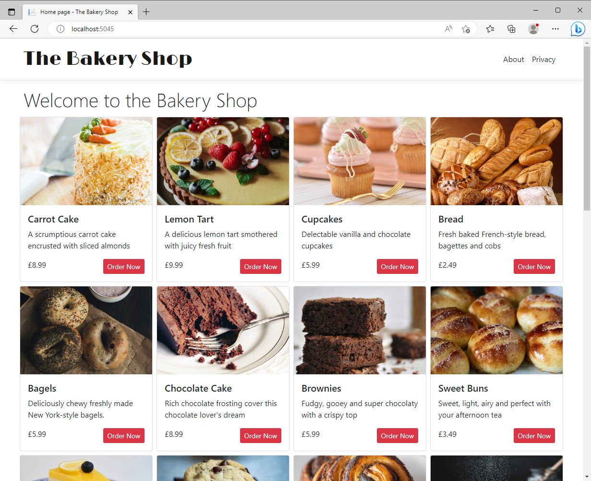

In this series,the Razor Pages version of the application includes a look at many more framework features,as well as sections on incorporating other technologies such as Sass and TypeScript.

The steps are as follows:

- Getting started
- Creating the application
- Adding a new page
- Working with navigation
- Creating the model
- Adding a migration
- Working with data
- Enabling Sass
- Starting with forms
- Working with TypeScript
- Using cookies
- Creating view components
- Adding email
- Using scaffolding
- Uploading Files

You will build the application with Visual studio code - an open source code editor produced by Microsoft with the help of contributions from the developer community.Data will be stored in a relational SQLite database.Both of these choices enjoy the benefits of being cross-platform and relatively easy to use,which helps to make this series accessible to developers of all abilities on any platform.

This app will be built using the ASP.NET Core web development framework which is included as part of .NET,and Entity Framework Core,an Object Relational Mapper developed by Microsoft.This version of the tutorial use .NET 7.0,which is a Standard Term Support(STS) release of .NET.As such,it is supported for 18 months after its release date.Long Term Release (LTS) versions of the framework are supported for 3 years after their release date.Most often,upgrading from one version of the framework to another is as simple as changing a few numbers in a project file.More of that later.

ASP.NET Core is the cross-platform web development framework provided by Microsoft.It has its roots in the ASP.NET framework which was launched at the beginning of the century,and as such,is a battle-tested,full-featured mature framework.Razor Pages,introduced in 2017,forms part of ASP.NET Core and is the recommended option from Microsoft for creating server-side web applications,i.e.those where the processing and rendering of HTML take place on the web server (as opposed to within the browser).

##### Get the Bits

To start,you need a software development kit (SDK) and a code editor.

##### Get the SDK

First,obtain .NET from hrere.You should download the SDK (Software Development Kit),which is needed for building .NET Core applications.The other option - the runtime - is what you would install on a server where you want your ASP.NET Core applications to run.The SDK includes the runtime.

Once installed,use the .NET Command Line Interface (CLI) to confirm which version of the SDK is currently in use by opening a terminal/command prompt and typing the following command:

`dotnet --version`

You can execute `dotnet --help` for a list of other commands available.

##### The code editor

Many .NET developers typically use Visual Studio from Microsoft,an Integrated Development Environment (IDE) that supports a wide range of development activities out of the box.As such,it demands a large footprint (over 6GB for a typical install) and can consume a lot of resources.While a version for the Mac OS exists,it is primarily a Windows-only product.A free version is available for non-commercial use (the Community Edition),which is full featured.Alternatively,JetBrains provide a cross-platform IDE called Rider.They offer a 30-day free trial,but not a free version.

Visual Studio Code is a free,lightweight,open source,cross platform code editor that supports diffent workflows via extensions.Consequently it's footprint is a lot smaller that a full-featured IDE.

Download and install it,then install c# extension,which is needed for C# development.You can locate this by clicking the Extensions icon on the left hand side  and typing "C#" in the search box that appears at the top of the pane.You should also install the C# Extensions extension,which provides templates for adding C# class and interface files.

Now that you have the requisite bits,it's time to create your first Razor Pages application,which you will do in the next section.

> **Bakery Tutorial**
> This is part of a tutorial series that shows how to build a data-drive web application using Visual Studio Code, ASP.NET Core Razor Pages,Entity Framework Core and SQLite and .NET 7.

##### Create a new Web Application

Once you have installed the .NET SDK,you can use the .NET CLI to generate a starting point for a Razor Pages web application.

1. Create a folder to house your application files.You can do this in any way that you like.You can manually create the folder,and then open it in VS Code,or you can open VS Code and use its integrated terminal to create a directory with the standard `mkdir` command.The terminal in VS Code is accessed by pressing `Ctrl+\`` (or ⌘+' on a Mac).In any event, the folder should be named Bakery.
2. Open the folder within VS Code.
3. Ensuring that the terminal's active location is in the Bakery folder,you will use the ASP.NET Core templating system to create the app.Templates are invoked in VS Code by executing `dotnet new` commands in the terminal,followed by the name of the template you want to use and any options.The name of the Razor Pages web application template is webapp.You see all of the other available templates by typing `dotnet new list`. So create the new Razor Pages application with the following command:

`dotnet new webapp`

Note that the command `dotnet new razor` will also result in a Razor Pages project being created.

> **IMPORTANT**
> The project takes its name from the folder in which it is created.Ideally,you want this to be "Bakery" with a capital "B".That wawy,if you want to copy and paste code from this series into the project that you create,you will minimise the possibility of errors creeping in via mixing the case of the project namespace.If you use the terminal to navigate to the Bakery folder once it has been created and use all lowercase (e.g. `cd c:\bakery`),the resulting project - and its default namespace - will have a lowercase "b".

Once you have created the application,the `dotnet restore` command is automatically executed.This results in dependencies and tools required by the project being restored.If this is your first .NET Core application,this command can take a little while to complete while the relevant packages are obtained from the Nuget package manager and stored locally on your machine.Once completed,you can open the Bakery folder from within VS Code to see the files and folders that were created.

4. At this point,you will probably be prompted to add missing assets required to build and debug the project:


Click **Yes**.

##### The File and Folders

Before moving on,we shall review the files and folders that the template generated:

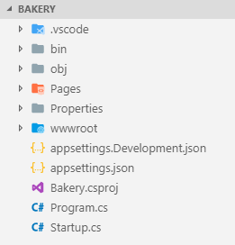

- The .vscode folder was generated when you clicked **Yes** in the previous step. It contains files that provide configuration for debugging the application.
- The bin folder contains the output of a Build operation - the compiled binaries for the application.There is nothing much there at the moment - just a folder named Debug containing another folder named net7.0. The application has not been compiled (built) yet.That will happen soon.
- The obj folder contains a variety of files. You will hardly ever need to access this folder,except to perhaps delete its contents entirely. It is used by the framework as a place to store temporary files and other objects used in the build process.
- The Properties folder contains a file called lanchSettings.json. This is a configuration file for launching the application in a browser.
- The root of the application consists of 5 files.There are two JSON files named appsettings.These contain application-specific configuration information.Currently,they contain basic logging and host filtering configuration.Later,you will use appSettings to store database and email configuration,The version with Development in its name will only be used when the application is running in development mode.
- The .csproj file is the standard **MS Build XML-based project file**. It contains project settings and references to files used by the project.MS Build uses this file to configure the actual build process of the application.
- All ASP.NET Core applications are actually .NET console applications. The default entry point into any console application is the Main method in the Program class found in the Program.cs file.The Main method in this case along with the class definition are absent as a result of a feature added to .NET 6 referred to as a **minimal hosting model**. The Program.cs file is responsible for configuring a web host and a **middleware pipeline** for the application and launching it so that it is ready to serve requests. It is also the place where you register services with the dependency injection system.
- The wwwroot folder houses static files - images,Javascript files,CSS files etc.
- Finally,the Pages folder. This is the default location for Razor Pages. The template site includes three:Error,Index and Privacy.You will add to this shortly.

##### Build And Run The Application

Now you are ready to launch the application.Execute the following command:

`dotnet run`

The site should build and be available to browse at a localhost URL on a specific port number.In the download version that accompanies this tutorial,the port number is 5054.

> **NOTE**
> The port number varies from project.When referring to URLs in this tutorial series, I will retain the port number for the sample application. If you are following along,you can alter the port number of your application within the launchSettings.json file if you prefer.Look for the profiles section and adjust the applicationUrl values for the http and,optionally,the https profiles accordingly.
>
> If you want to run your application against the https profile,and you are a first time user of .NET,youj will need to trust a self-signed certificate that is required for hassle-free browsing of your site over HTTPS on your local system.The certificate itself is installed as part of the SDK. To trust the certificate,execute the following command in the terminal:
>
> `dotnet dev-certs https --trust`
>
> To run the application using the https profile,use the -launch-profile (or -lp) option and pass in the name of the profile:
>
> `dotnet run --launch-profile https`


You should get the following confirmation in the terminal from the built-in logging provider:

```
info: Microsoft.Hosting.Lifetime[14]
      Now listening on: http://localhost:5045
info: Microsoft.Hosting.Lifetime[0]
      Application started. Press Ctrl+C to shut down.
Info: Microsoft.Hosting.Lifetime[0]
      Hosting environment: Development
```

Open a browser and navigate to http://localhost:5045. The site should appear like this:

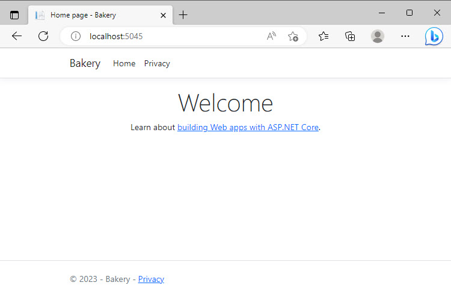

##### Summary

At this point,you have used the .NET Core SDK and Visual Studio Code to create a new Razor Pages application.You have reviewed the contents of the project folder,and you have lauched the application in a browser.In the next section,you will add a new page and begin customising the site content.

##### Adding a new page

So far,you have obtained the .NET SDK and chosen a code editor for building a Razor Pages application.You have created a web application from a starter template using the .NET CLI.The web application currently has three pages. It's going to need some more.You will use the templating system to generate an About page,this time with the command `dotnet new page`.

Once you have created the page,you will modify the site's layout file which controls the look and feel of all of the site's content.

1. If the application is still running from the previous section,you can either open another terminal `ctrl+shift+\`` or you can press 'Ctrl+C' to shut the web server down. Once you have done that, execute the following command:

`dotnet new page --name About --namespace Bakery.Pages --output Pages`

The Command generates two new files, one with a .cshtml extension and another with a .cshtml.cs extension. The first is a Razor file which will contain Razor syntax - a mixture of HTML markup and C# code representing the content of the page. The second is a C# code file containing a class named AboutModel that derives from PageModel. This file acts as a combined controller and view model and is where you place code for processing HTTP requests.

The name of the page itself is passed to the --name (-n) option. The namespace for the PageModel class is specified via the --namespace (or -p:n) option. If you don't provide one, the default value of MyApp.Namespace is used. Likewise, if you don't specify a location for the generated output (using the --output or -o option), the files will be generated in the folder where the command is executed.Razor pages need to be located in the Pages folder or its sub-folders,otherwise the routing system will not locate them.

2. When you get confirmation that the page was created successfully,open the newly create About.cshtml file (the PageModel file), and amend its content to include a public property - a string named TimeOfDay - together with some code in the OnGet method that sets its value to morning,afternoon or evening depending on the current time of the day:

```csharp
public class AboutModel : PageModel
{
    public string TimeOfDay{get;set;}
    
    public void OnGet()
    {
        TimeOfDay = "evening";
        if(DateTime.Now.Hour < 18)
        {
            TimeOfDay = "afternoon";
        }
        if(DateTime.Now.Hour < 12)
        {
            TimeOfDay = "morning";
        }
    }
}
```

The OnGet method is a handler method that is executed by the framework whenever the page is requested using the HTTP Get method.

3. Once you have made those changes,alter the About.cshtml file so that it's content is as follows:

```csharp
@page 
@model Bakery.Pages.AboutModel
@{
    ViewData["Title"] = "About us";
}

<section id="main">
    <h1>Good @Model.TimeOfDay, and welcome to The Bakery Shop!</h1>
    <p>The Bakery Shop was established in 2020,offering a wide selection of freshly baked goods and coffee that can be conveniently ordered online and delivered straight to your doorstep. The business was founded by Mike, a former farmer who discovered his talent for baking during his spare time.</p>

    <p>Despite his success in the agriculture industry, Mike had always enjoyed experimenting in the kitchen and had a particular passion for baking. He spent countless hours perfecting his recipes, and soon found that his baked goods were in high demand amongst his friends and family.
</p>
<p>Encouraged by their feedback, Mike decided to take a leap of faith and pursue his passion for baking full-time. He started The Bakery Shop, combining his expertise in growing top quality food with his culinary skills to create a business that offers top-quality baked goods, made with all-natural ingredients and sourced locally.
</p>
<p>Today, The Bakery Shop is known for its mouth-watering pastries, cookies, cakes, and coffee, as well as its state-of-the-art online ordering system that makes it easy for customers to place their orders and receive them within 24 hours. Despite his success, Mike remains humble and dedicated to producing the best possible products for his customers.
</p>
</section>
```

The @page directive at the top of the file indicates that this is a navigable page. We will explore some aspects of navigation in the next section.

The @model  declaration defines the model for the page and is set to the name of the PageModel class declared in the accompanying code-behind or PageModel file which was generated - About.cshtml.cs. Public properties on the PageModel class are exposed to the content page via its Model property.

Note the ViewData property,which is a dictionary that holds other data for the view or page. At the top of the page, an entry with the key "Title" is set to "About Us".

The h1 content begins with the literal text Good followed by expression @Model.TimeOfDay. The @ symbol is Razor syntax that denotes where we transition from literal HTML markup to C# code. In this case, the C# code is the TimeOfDay property of the AboutModel class, which is exposed to the Razor page via its Model property. The result of the expression will be rendered inline at this point at runtime.

4. Launch the application again,this time using dotnet watch and navigate to /about. You should see the page you just created:

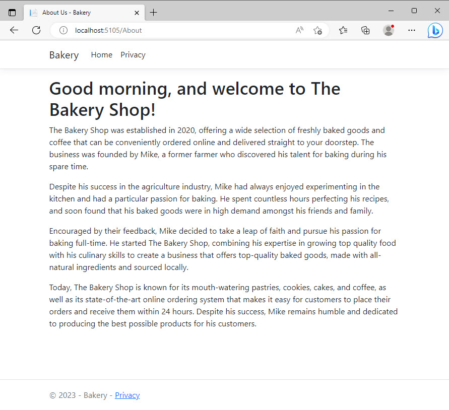

> **Hot Reload**
>
> The dotnet watch command launches the application in a browser and initialises the Hot Reload feature which is available from .NET 6 onwards. It applies code changes, including changes made to stylesheets and script files to the application without requiring you to continually stop and rebuild your application or refresh your browser.In a Razor Pages app, Hot Reload triggers a browser refresh automatically for supported code changes.

Notice that the navigation menu appears at the top of the page along with footer at the bottom, just like on the home page. Neither form part of the page you just created, so where did they come from?

##### Layout pages

The header, footer and other common site content such as CSS and scripts that applies to all pages is defined in the _Pages/Shared/_Layout.cshtml file. This is known as a Layout page and acts as a wrapper around the content of any page that references it. The layout is assigned to all pages in the Pages folder and its sub-folders via the _ViewStart.cshtml file in the Pages folder.

The content of the About page is rendered at the point in the layout page where you see the call to the RenderBody method:

`@RenderBody()`

This method call is what defines a layout page.

Check the title element at the top of the layout page and you can see where the ViewData["Title"] value is rendered. It is concatenated with the name of the site and is visible in your browser tab (if your browser has one):


##### Finishing Off

Finally in this section, you will tweak the layout page to change the branding. You will include a web font which will be used for the brand and you will add some CSS styles. You will also add some Bootstrap CSS classes so that the footer will naturally appear at the bottom of the viewport when there's not enough content, and it will be pushed down to the end of the content if it overflows the viewport. You will do this while the application is running under the `dotnet watch` command so that you can see the Hot Reload feature in action.

Add a Bootstrap CSS class to the <html> element itself to set its height to 100%:

```html
<html lang="en" class="h-100">
```

Now alter the <body> element to include the following CSS classes which uses flexbox to stack child elements vertically and to set its height to 100% and its margins to zero:

```html
<body class="h-100 d-flex flex-column m-0">
```

The final part of positioning the footer is to tell the main container not to shrink based on its content,using the flex-shrink-0 class.The main element will occupy any available space,pushing the footer to the bottom of the viewport when there isn't enough content in the main element:

```html
<div class="container flex-shrink-0">
    <main role="main" class="pb-3">
        @RenderBody()
    </main>
</div>
```

Then delete the .footer styles from the _Layout.cshtml.css file in the /Pages/Shared folder.

> **Note**
> The _Layout.cshtml.css file belongs to feature known as CSS isolation.Common in component-based web development frameworks such as React or Blazor,this feature enables you to isolate style declarations to specific page or file. You can read more about CSS Isolation In Razor Pages here.

On to the branding.

Add the following code to the end of the <head> element, which references a Google web font and makes it available to all pages that reference the layout page:

```html
<link rel="preconnect" href="https://fonts.gstatic.com" crossorigin>
<link href="https://fonts.googleapis.com/css2?family=Limelight&display=swap" rel="stylesheet">
</head>
```

Alter the places where the "Bakery" branding currently exists:

- the title element in the head of the layout
- the anchor tag with the navbar-brand CSS class in the nav
- the footer, just after the copyright year

so that the text says "The Bakery Shop" instead of "Bakery":

```html
<body class="h-100 d-flex flex-column m-0">
    <header>
        <nav class="navbar navbar-expand-sm navbar-toggleable-sm navbar-light bg-white border-bottom box-shadow mb-3">
            <div class="container">
                <a class="navbar-brand" asp-page="/Index">
                    The Bakery Shop
                </a>
                <button class="navbar-toggler" type="button" data-toggle="collapse" data-target=".navbar-collapse" aria-controls="navbarSupportedContent" aria-expanded="false" aria-label="Toggle navigation">
                    <span class="navbar-toggler-icon"></span>
                </button>
```

Save the changes and keep an eye on the browser. The page should reload and the text changes should be applied.Finally, Add the following style declarations to the site.css file, found in wwwroot/css:

```css
.navbar-nav {
    justify-content: flex-end;
}

.navbar-brand {
    font-family: limeLight, sans-serif;
    font-size: 2.5rem;
}
```
The browser should reload again to show the LimeLight font being applied to the branding:

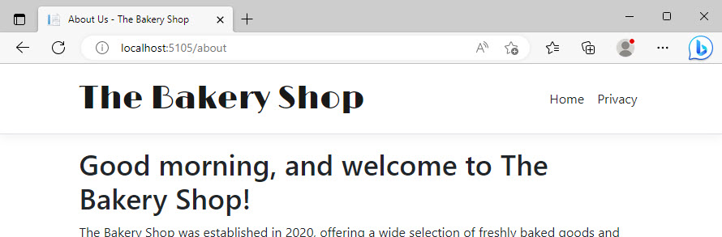

##### Summary

In this section, you have seen how to use the template instantiation commands to add a new Razor page to a web application.You saw that the Razor page comprises of two files - a content page and a code-behind file containing a class that derives from PageModel.You added some markup to the content page.Then you modified the layout page content that controls the look and feel of the site content and you used `dotnet watch` to see those changes being applied to the running application automatically.

In the next section,you modify the navigation menu to include a link to the new page, and learn a bit about tag helpers and routing in Razor pages.


##### Adding Navigation

So far,you have obtained the .NET SDK, a code editor and used them to build a Razor Pages web application from a template. Then you added a new page to the site. You were able to see the new page simply by navigating to it with your browser. You didn't need to perform any additional steps in order to expose the page to the outside world.

In this section, you will modify the navigation menu in the layout page to include a link to your new page and learn a little more about how navigation and URLs work in Razor Pages.

Main site navigation is located in a layout page, which, as you learned in the previous section, acts as a template for all pages that reference it. To change the navigation, open the _Layout.cshtml file located in the Pages/Shared folder.

Locate the lines of code that look like this:

```html
<li class="nav-item">
    <a class="nav-link text-dark" asp-area="" asp-page="/Index">Home</a>
</li>
<li class="nav-item">
    <a class="nav-link text-dark" asp-area="" asp-page="/Privacy">Privacy</a>
</li>
```

Add another `li` element between the existing ones using the following code:

```html
<li class="nav-item">
    <a class="nav-link text-dark" asp-page="/About">About</a>
</li>
```

If the application is still running from the previous section, you should see the About link appear in the top right corner of the site:

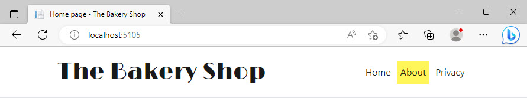

If not, run the application (`dotent watch`) and navigate to http://localhost:5105. Then click on the About link to ensure that navigation works. You should arrive at the page you just created in the previous section.

##### Tag Helpers

The links are generated by tag helpers. These components are designed to target specific tags in the HTML. The anchor tag helper targets the HTML a element. Instead of providing an href attribute to point to an internal page, you provide an asp-page attribute that takes the path of the page, relative to the root Pages folder. The framework constructs the correct URL for the resulting hyperlink based on the routes that the have been built for the specified page.

The original anchor tag helpers include an asp-area attribute which is assigned an empty string and are therefore non-operational. You are not working with areas in this example, so the attribute has not been included in the new anchor to reduce clutter.

##### Routing and URLs

Routing within a Razor Pages application provides a mechanism for matching URLs to a request processing handler - an individual Razor page. Using a very simple convention. routes in Razor Pages are based on the physical location of the Razor page files on disk, rooted in the Pages folder. This makes them extremely easy to reason about. Mentally, you just replace the "Pages" folder with the domain, chop off the file extension and you have a URL for a given page so /Pages/About.cshtml becomes domain.com/about.

The same principle applies if you add sub-folders to the Pages folder. Their names become additional segments in the URL. A page at /Pages/Admin/User/Create.cshtml is reachable at URL domain.com/admin/user/create.

By convention, a single route is created for each page except for pages that are named Index.cshtml. Two routes are constructed for Index pages - one is an empty string, and the other uses the page name: Index. However, when working with tag helpers, you must pass in the name of the file. So the first link in the project template takes "/Index" as the asp-page attribute's value.

At its heart, routing in Razor Pages is deceptively simple, but it is also very powerfull and open to configuration. As you work through this tutorial series, you will see how you can customise routes for pages, and how you can use them to pass data around the application. In the meantime, you can read more about routing here.

In the next section, you will start to work with data within the application. You will begin that journey by generating a representation of the application's domain as C# classes, also known as a Model.


##### Working with data in a Razor Pages application

The Bakery Shop will become a data-driven web application, leveraging a relational database for efficient data storage. While alternative methods exist for data management, this pattern is widely adopted by the majority of web applications. With this foundation in place, several crucial decisions need to be made. How will the web application interact with the database, and what approach should be taken for data manipulation within the application?

##### Adopting a Model-based approach

When working with data in a .NET application, you have a choice. You can either shuttle data throughout the application in recordset or dataset structures, or you can represent the things (or entities) that your application is concerned with as classes, and use instances of those as containers for individual rows of data from the database.

The latter approach is recommended, as it facilitates working with data in a strongly-typed manner. This approach offers dual benefits: compile-time checking to minmise runtime errors; and potentially better quality code. It is a lot easier to reason about and maintain code where a piece of data is represented as Person.FirstName instead of ds.Table[0].Rows[0]["FirstName"], which is the way that you would access an item of data in an ADO.NET DataSet object.

Collectively, the code representation of your application's entities is known as the Model. In the case of the Bakery application, the primary focus lies on the Products offered by The Bakery Shop, resulting in a singular class within the model: Product.


##### Creating the model

Add a new folder to the root of the application named Models. Then add a C# class file to the Models folder using the following command:

`dotnet new class -n Product -o Models`

The generated file should have the following content:

```csharp
namespace Bakery;

public class Product
{

}
```

Alter the namespace to Bakery.Models and add the following properties to the Product class:

```csharp
namespace Bakery.Models;

public class Product
{
    public int Id {get;set;}
    public string Name {get;set;}
    public string Description {get;set;}
    public decimal Price {get;set;}
    public string ImageName {get;set;}
}
```

Modern web applications commonly utilise Object-Relational Mappers (ORMs), which faciliate the mapping of database tables and columns to model classes and properties. ORMs enable seamless bidirectional data transfer between the application and the database. In addition to mapping, advanced ORMs provide additional functionalities such as automatic generation and execution of SQL commands,transaction management, and migrations.

The recommended ORM to use with ASP.NET Core applications is Entity Framework Core (EF Core). In the next step you will add it to the application.

##### Adding Entity Framework Core

EF Core depends on components called providers to enable it to work with specific databases. The EF Core team maintains official providers for SQL Server and SQLite as well as other database systems. In this exercise, you will use SQLite, which is a cross-platform file-based database.

When starting a new project, EF Core is not included in the project template by default. However, you can easily add it to your project by installing the corresponding NuGet package. To install EF Core with the SQLite provider into your application, execute the following command in the terminal to install the latest release version of the package:

`dotnet add package Microsoft.EntityFrameworkCore.Sqlite`

##### Adding and registering a Context

The core component of EF Core that you will utilise to interact with the database is a class derived from DbContext, commonly referred to as the "context". The context represents a session with the database and offers a comprehensive API that enables the following capabilities:

1. Database Connections: The context facilitates establishing and managing connections to the database.

2. Data operations: You can perform various data operations, including querying and persisting data, using the context.

3. Change Tracking: The context tracks changes made to the entities within its scope, allowing you to efficiently handle updates.

4. Model Building: With the context, you can define and configure the model, specifying the structure and relationships of the entities.

5. Data Mapping: The context handles the mapping between the model classes and the corresponding database tables and columns.

6. Object Caching: To enhance performance, the context incorporates and object cache that stores frequently accessed entities.

7. Transaction Management: The context supports managing transactions, ensuring data consistency and atomicity.

To add a context, create a folder named Data in the root of the project. Then add a C# class file to it named BakeryContext.cs. Amend the content as follows:


```csharp 
using Bakery.Models;
using Microsoft.EntityFrameworkCore;
namespace Bakery.Data;

public class BakeryContext : DbContext
{
    public DbSet<Product> Products {get;set;}

    protected override void OnConfiguring(DbContextOptionsBuilder optionsBuilder)
    {
        optionsBuilder.UseSqlite(@"Data source=Bakery.db");   
    }
}
```

The context has one property - a DbSet named Products. The DbSet class maps to a table in the database. By default, mapping is controlled through name-based conventions. The name of the DbSet is expected to match the name of the corresponding table, and its column names will match property names on the Product class. EF Core also provides a powerful API for configuring the mapping where conventions need to be overriden, or configuration needs to be specified explicitly.

The OnConfiguring method provides a place for you to configure your context. In this case, you have configured the context to use the SQLite provider, and you have specified the connection string to be used.

When working with a context, you can just instantiate an instance wherever you need it, e.g.

```csharp
using var context = new BakeryContext();
// do something with data

```

The DbContext implements IDisposable, so you are responsible for ensuring disposal of the context when you have finished with it. The usual pattern for managing this is to instantiate the context with a using statement as shown here (although technically this example shows a using declaration).

However, the recommended approach to working with a context in an ASP.NET Core application is to register it with the dependency injection (DI) system and make it available as a "service". The DI system takes responsibility for managing the lifetime of the context. Recall from the New Application section that service registration takes place in the Program.cs file.

> **The Dependency Inversion Principal**
>
> Dependency injection is the most common way to achieve the Dependency Inversion Principal (the "D" in SOLID), which states that high level modules (e.g. a consuming class) should not depend on low level modules (e.g. a DataContext). Both should depend on abstractions.
>
> What this means in practice is that you can swap the implementation of the dependency without touching code in the consuming class. You control the actual implementation at the point of service registration. This is most useful when testing when you can swap the implementation of the service for a mock or test double so that your tests are not couducted against a live database, potentially slowing them down.

To register the context, add a using directive at the top of Program.cs to bring the Bakery.Data namespace into scope. Then call the AddDbContext extension method to register the BakeryContext with the service container:

```csharp
using Bakery.Data;

var builder = WebApplication.CreateBuilder(args);

builder.Services.AddRazorPages();
builder.Services.AddDbContext<BakeryContext>();
```

Now the context can be made available anywhere within the application by injecting it via the class constructor. The AddDbContext method registers the context with a Scope lifetime, meaning that a new one will be made available for each request. The services container will take care of ensuring that it is disposed of correctly.

##### Summary

You now have a model (small,but still a model), and an EF Core context. All you need now is a database. In the next section, you will see how EF Core migrations can be used to create one.

##### Creating a Migration

In the previous section, you created a model - a representation of the entities that your application is concerned with. Then you installed and configured EF Core to manage communication between the model and a database which doesn't actually exist yet.

When developing applications, the model is likely to change often as new requirements come to light. Once created, the database needs to be kept in sync with the model. The Entity Framework Core migrations feature enables you to make changes to your model and then propagate those changes to your database schema. The migrations feature can also be used to create the database if it doesn't exist.

##### Configure the model

EF Core migrations are based on a set of conventions. The conventions govern how DbSet objects are mapped to tables in the database, how properties are mapped to columns, how .NET data types are mapped to suitable types exposed by the database provider and how keys and indexes are created and managed.

In this tutorial series, you will rely largely on conventions to manage mapping. Entities will map to database tables and properties will map to columns based in their names. Sometimes the conventions don't satisfy your needs, or EF Core is unable to determine your intentions. In these cases, you can use configuration to tell EF Core what you want.

Configuration can be applied in two ways; through decorating classes and properties with attributes, or by using the Fluent API. Attributes only provide a subset of configuration options. Therefore for any reasonably complex model, you are likely to rely on the fluent API for at least part of your configuration. Consequently it makes sense to use fluent API for all configuration, thereby keeping your configuration code consistent, in one place and therefore easier to maintain.

so where should you put your fluent API configuration code?

You have two options: you can place it directly in the OnModelCreating method of your DbContext class; or you can place configuration code on separate classes per entity. You will adopt the latter approach because it is the recommended way to manage configurations.

Add a new folder to the Data folder and name it Configurations. Then add a new C# class file named ProductConfiguration.cs to the Configurations folder. Replace the content with the following:

```csharp
using Bakery.Models;
using Microsoft.EntityFrameworkCore;
using Microsoft.EntityFrameworkCore.Metadata.Builders;

namespace Bakery.Data;

public class ProductConfiguration : IEntityTypeConfiguration<Product>
{
    public void Configure(EntityTypeBuilder<Product> builder)
    {
        builder.Property( p => p.ImageName ).HasColumnName("ImageFileName");
    }
}
```

The class implements the IEntityTypeConfiguration<TEntity> interface which has one method: Configure. Configurations are defined in this method. The default mapping convention is to map to columns that have the same as the property. In this example, you use the HasColumnName method to instruct the context to map the ImageName property to a column named "ImageFileName".

The configuration class is registered in the OnModelCreating method of BakeryContext as shown in the highlighted section:

```csharp
public class BakeryContext : DbContext
{
    public DbSet<Product> Products {get;set;}

    protected override void OnConfiguring(DbContextOptionsBuilder optionsBuilder)
    {
        optionsBuilder.UseSqlite(@"Data source=Bakery.db");
    }

    protected override void OnModelCreating(ModelBuilder modelBuilder)
    {
        modelBuilder.ApplyConfiguration(new ProductConfiguration());
    }
}
```

##### Create Seed Data

When you use a migration to create a database, it will start off empty empty - unless you "seed" it with data at the time that the migration is executed. In this section, you will use the HasData configuration method to achieve this.

Create a new C# class file in the Data folder and name it ModelBuilderExtension.cs. Replace the content with the following code:

```csharp
using Bakery.Models;
using Microsoft.EntityFrameworkCore;
namespace Bakery.Data;
public static class ModelBuilderExtensions
{
    public static ModelBuilder Seed(this ModelBuilder modelBuilder)
    {
        modelBuilder.Entity<Product>().HasData(
        new Product
        {
            Id = 1,
            Name = "Carrot Cake",
            Description = "A scrumptious carrot cake encrusted with sliced almonds",
            Price = 8.99m,
            ImageName = "carrot-cake.jpg"
        },
        new Product
        {
            Id = 2,
            Name = "Lemon Tart",
            Description = "A delicious lemon tart smothered with juicy fresh fruit",
            Price = 9.99m,
            ImageName = "lemon-tart.jpg"
        },
        new Product
        {
            Id = 3,
            Name = "Cupcakes",
            Description = "Delectable vanilla and chocolate cupcakes",
            Price = 5.99m,
            ImageName = "cup-cakes.jpg"
        },
        new Product
        {
            Id = 4,
            Name = "Bread",
            Description = "Fresh baked French-style bread, bagettes and cobs",
            Price = 2.49m,
            ImageName = "bread.jpg"
        },
        new Product
        {
            Id = 5,
            Name = "Bagels",
            Description = "Deliciously chewy freshly made New York-style bagels.",
            Price = 5.99m,
            ImageName = "bagels.jpg"
        },
        new Product
        {
            Id = 6,
            Name = "Chocolate Cake",
            Description = "Rich chocolate frosting cover this chocolate lover's dream",
            Price = 8.99m,
            ImageName = "chocolate-cake.jpg"
        },
        new Product
        {
            Id = 7,
            Name = "Brownies",
            Description = "Fudgy, gooey and super chocolaty with a crispy top",
            Price = 5.99m,
            ImageName = "brownie.jpg"
        },
        new Product
        {
            Id = 8,
            Name = "Sweet Buns",
            Description = "Sweet, light, airy and perfect with your afternoon tea",
            Price = 3.49m,
            ImageName = "buns.jpg"
        }, 
        new Product
        {
            Id = 9,
            Name = "Cheesecake",
            Description = "Creamy and vibrant lemon cheesecake made with organic lemons",
            Price = 2.49m,
            ImageName = "cheesecake.jpg"
        },
        new Product
        {
            Id = 10,
            Name = "Chocolate Cookies",
            Description = "Crisp on the outside, soft on the inside and full of chocolate chips",
            Price = 3.49m,
            ImageName = "chocolate-chip.jpg"
        },
        new Product
        {
            Id = 11,
            Name = "Cinnamon Rolls",
            Description = "Big, fluffy, soft and delicious with warming cinnamon",
            Price = 3.99m,
            ImageName = "cinnamon-roll.jpg"
        },
        new Product
        {
            Id = 12,
            Name = "Croissants",
            Description = "Flaky and buttery, perfect for savoury or sweet",
            Price = 3.49m,
            ImageName = "croissant.jpg"
        },
        new Product
        {
            Id = 13,
            Name = "Doughnuts",
            Description = "Traditional ring doughnuts with a variety of toppings",
            Price = 5.49m,
            ImageName = "doughnuts.jpg"
        },
        new Product
        {
            Id = 14,
            Name = "Fruit Loaf",
            Description = "Packed full with ony the juiciest, plumpest fruit",
            Price = 8.49m,
            ImageName = "fruit-loaf.jpg"
        },
        new Product
        {
            Id = 15,
            Name = "Fruit Tart",
            Description = "Light pastry with a selection of the freshest fruit",
            Price = 6.49m,
            ImageName = "fruit-tart.jpg"
        },
        new Product
        {
            Id = 16,
            Name = "Lemon Meringue",
            Description = "Zingy lemon on a light pastry covered with light clouds of meringue",
            Price = 10.99m,
            ImageName = "lemon-meringue.jpg"
        },
        new Product
        {
            Id = 17,
            Name = "Macaron",
            Description = "Tiny, delicate meringue pillows with a variety of fillings",
            Price = 9.99m,
            ImageName = "macaron.jpg"
        },
        new Product
        {
            Id = 18,
            Name = "Pain Au Chocolate",
            Description = "The lighest pastry shot through with top quality chocolate",
            Price = 4.49m,
            ImageName = "pain-au-chocolate.jpg"
        },
        new Product
        {
            Id = 19,
            Name = "Cornish Pasty",
            Description = "A meaty treat based on traditional Cornish recipes",
            Price = 5.99m,
            ImageName = "pasty.jpg"
        },
        new Product
        {
            Id = 20,
            Name = "Sliced Bread",
            Description = "Our top quality loaves sliced for your convenience",
            Price = 2.49m,
            ImageName = "sliced-bread.jpg"
        });
        return modelBuilder;
    }
}
```

The Seed method is an extension method on the ModelBuilder type, which is passed in to the OnModelCreating method that you worked with  earlier. The body of the method uses the HasData method to configure the specified entity with seed data. The values provided for each entity include the key values. SQLite happily accepts values in an autoincrement column if they are provided as part of an INSERT statement. SQL Server, on the other hand, will enable IDENTITY_INSERT on the target table, and then turn it off again once the seed data has been added. Whenever future migrations are applied, EF Core checks seed data against values that already exist in the database, preventing the seed data being applied again. Any new seed data is inserted. If any of the existing  seed data values are altered, EF Core executes an UPDATE statement accordingly.

> **Note**
>
> The image files are available in the download that accompanies this tutorial series. Create a folder named images is wwwroot, and within that folder, create another folder called products. Place the product images there. They should then be available at the following relative URL : /images/products/...

The seed method itself is called in the OnModelCreating method. It returns an instance of the ModelBuilder type, enabling it to be chained to other calls that also return the ModelBuilder type. The ApplyConfiguration method that you used to add the product configuration meets this criteria, so you can chain the Seed method to that:

```csharp
protected override void OnModelCreating(ModelBuilder modelBuilder)
{
    modelBuilder.ApplyConfiguration(new ProductConfiguration()).Seed();
}
```

##### Create the migration

Now that  the model configuration is complete and provision for seed data has been made, you can create the actual migration.But before you do, you need to install the tools that scaffold the migration code. Use the terminal to execute the following command from within the BakeryShop directory (the one containing the project file):

`dotnet add package Microsoft.EntityFrameworkCore.Design`

Followed by this one to create the migration:

`dotnet ef migrations add CreateDatabase --output-dir Data/Migrations`

This creates a migration called CreateDatabase. The files for the migration are generated in a newly created folder named Migrations in the Data folder (as specified by the value passed to the output-dir switch):

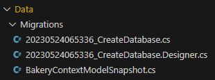

The first file contains C# code that gets translated into SQL statements to be executed, while the snapshot file contains a C# representation of the current model. This is used by subsequent migrations to calculate the changes required to update the schema of the database.

##### Execute the migration

Having configured and created the migration, it is time to execute it. At the terminal, type the following and press Enter to execute the command:

`dotnet ef database update`

Once you get confirmation that the migration has been applied, you should see a Bakery.db file that has been created in the root of the site:

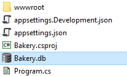

You can open this uing a suitable utility. My preferred tool for managing SQLite databases is DB Browser For SQLite. You can explore the generated tables. The __EFMigrationsHistory table contains details of each migration. The products table contains the data that you seeded it with:


##### Summary

You have learned how to configure a model prior to a migration, generate seed data and then create a migration and execute it. Now that you have a database with data, you can start working with it, and that is what you will do in the next section.


##### Working With Data

In this first look at working with data in a Razor Pages application, you will focus on using the BakeryContext to retrieve data for display on the home page and the ordering page, which has yet to be added to the application. You are working towards producting a home page that looks like this, where all of the products are displayed together with their description, image and price:


##### The PageModel

First, you will inject the BakeryContext into the IndexModel class and use it to populate a collection of Product entities. Open the Pages/Index.cshtml.cs file and replace the existing contents with the following:

```csharp
using Bakery.Data;
using Bakery.Models;
using Microsoft.AspNetCore.Mvc.RazorPages;
using Microsoft.EntityFrameworkCore;

namespace Bakery.Pages;

public class IndexModel : PageModel
{
    private readonly BakeryContext context;
    
    public IndexModel(BakeryContext context)=>this.context = context;
    public List<Product> Products {get;set;}
    public async Task OnGetAsync() => Products = await context.Products.ToListAsync();
}
```

This is the PageModel file, Recall that the PageModel acts as a combined page controller and view model, the latter representing the data required for a view. Most often, the view is a page, but it could be a partial or a view component, which you will meet in a later sections of this tutorial series.

As a controller, the role of the PageModel is to process information from a request, and then prepare the model for the view (the view model). There is a one-to-one mapping between PageModels and Content Pages (the view) so the PageModel itself is the view model.

Information from the request is processed within handler methods. This PageModel has one handler method - OnGetAsync, which is executed by convention whenever an HTTP GET request is made to the page. The PageModel has a private field named context  which is a BakeryContext type. It also has a constructor method that takes a BakeryContext object as a parameter. The parameter's value is provided by the dependency injection system. This pattern is known as construction injection.

The PageModel class has a public property Products - a list of products which is populated in the OnGetAsync method.

##### The Content Page

Now it's time to produce the UI. Replace the code in the Index content page (Pages/Index.cshtml) with the following:

```html
@page
@model IndexModel
@{
    ViewData["Title"] = "Home page";
}

<h1 class="fw-light">Welcome to the Bakery Shop</h1>
<div class="row">
    @foreach (var product in Model.Products)
    {
        <div class="col-3 p-1">
            <div class="card h-100">
                
                <div class="card-body">
                    <h5 class="card-title">@product.Name</h5>
                    <p class="card-text">@product.Description</p>
                    <div class="d-flex justify-content-between">
                    <span class="card-text">@(product.Price.ToString("c"))</span>
                    <a class="btn btn-danger btn-sm" asp-page="/Order" asp-route-id="@product.Id">Order Now</a>
                    </div>
                </div>
            </div>
        </div>
    }
</div>

```

The @model directive at the top of the page specifies the type for the page's model (IndexModel). You work with the PageModel through the content page's Model property.

The code loops through all of the products and displays their details including their image. Each product includes a hyperlink, styled like a button (using Bootstrap styling). Although it doesn't go anywhere yet, the hyperlink is generated by an anchor tag helper, which includes an asp-route attribute. This attribute is used passing data as route values to the target page. The route parameter is named id, and the product's key value is passed to the attribute. You will see how this works in more detail when you add the Order page, which is the next step.

In the meantime, test the application by executing dotnet watch at the terminal which should result in the application launching in a browser. The home page should look like the image at the beginning of this section.

##### Adding The Order Page

If you inspect the href values of the Order Now buttons, you will see that they are presently empty. This is what happens if the anchor tag helper is unable to find a route for the path passed in to  the asp-for attribute. You will resolve this by adding a new page which will initially attemtpt to fetch and display details of the product associated with the id value passed in the URL when the button is clicked.

Execute the following command in the terminal to add a new page called Order:

`dotnet new page --name Order --namespace Bakery.Pages --output Pages`

Open the newly created Order.cshtml.cs file and replace the content with the following:

```csharp
using Bakery.Data;
using Bakery.Models;
using Microsoft.AspNetCore.Mvc;
using Microsoft.AspNetCore.Mvc.RazorPages;
namespace Bakery.Pages;
public class OrderModel : PageModel
{
    private BakeryContext context;
    public OrderModel(BakeryContext context) => 
        this.context = context;
    [BindProperty(SupportsGet = true)]
    public int Id { get; set; }
    public Product Product { get; set;}
    public async Task OnGetAsync() =>  
        Product = await context.Products.FindAsync(Id);
}
```

Again, the BakeryContext is injected into the PageModel constructor. A public property, Product, is instantiated in the OnGetAsync method. The FindAsync method takes a value representing the primary key of the entity to be returned. In this case, the parameter passed to the FindAsync method is another public property - Id. But where does it get its value from?

The Id property is decorated with the BindProperty attribute.This attribute ensures that the property is included in the model binding process, which results in values passed as part of an HTTP request being mapped to PageModel properties and handler method parameters. By default, model binding only works for values passed in a POST request. The Order page is reached by clicking a link on the home page, which results in a GET request. You must add SupportsGet = true to opt in to model binding on GET request.

If you recall, the anchor tag helpers on the home page that link to the Order page include an asp-route-id attribute, representing a route value named id. By default, route values are passed as name/value pairs in the query string of the URL: /order&id=1. Razor Pages also supports passing route values as segments of the URL: /order/1. This is accomplished by defining a route parameter as part of a route template within the content page. That is what you will do as part of the next step. Amend the content of Order.cshtml as follows:

```html
@page "{id:int}"
@model Bakery.Pages.OrderModel
@{
  ViewData["Title"] = "Place your order";
}
<div class="progress mb-3" style="height:2.5rem;">
  <div class="progress-bar w-50" style="font-size:1.5rem;" role="progressbar">Select Item</div>
</div>
<div class="row">
  <div class=" col-3">
    <h3>@Model.Product.Name</h3>
    
    <p>@Model.Product.Description</p>
  </div>
</div>
```

The first line of code contains the @page directive, which is what makes this a Razor Page, and it also includes the following: "". This is a route template. This is where you define route parameters for the page. This template defines a parameter named id which will result in the anchor tag helpers on the home page generating URLs with the id value as a segment rather than as a query string value. You have also added a constraint. In this case, you have specified that the value of id must be an integer (:int). The order page cannot be reached unless a integral value for the id route value is provided. If the vaue is missing, or is not an integer, Razor Pages will return a 404 Not Found response.

Now if you run the application and click on one of the buttons on the home page, the order page is displayed with the name of the selected product:

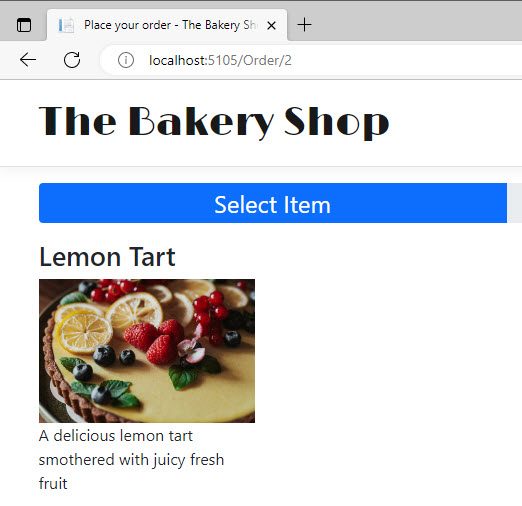

##### Summary

You have successfully used the BakeryContext to connect to the database and retrieve data which has been assigned to properties of the PageModel. They are exposed via the Model property in the content page. You used Razor syntax to loop through a collection of products to display them. You have also seen in this section how to pass data in URLs and leverage the BindProperty attribute to map route values to public properties in the PageModel. Finally, you have seen how to use that value to query for a specific item so that you can display details of it.

Soon you will start working with forms to collect user details for an order. The form will rely on some CSS and JavaScript. Before you build the form, you will add support for Sass - a technology that makes working with CSS easier.


##### Adding Support For Sass

In this section, you will add support for Sass. This in not essential for applications built with Razor Pages. However, Sass is a design-time tool that helps you to organse and maintain your css files. During this section, you will add some styles which are designed to work with from validation that you will put to use in the next section when you build a form. If you prefer not to use Sass, skip to the end of this section for the plain CSS version of the validation styles.

Sass (Syntactically Awesome Style Sheets) is a is a scripting language that is used to generate cascading style sheets (CSS files). Its syntax is very similar to CSS itself (valid CSS is actually valid Sass), but it supports the use of variables, nesting, mixins and selector inheritance, none of which are available in CSS itself. However, these features help you to organise and maintain your web application's styles and improve your productivity.

If you are new to Sass, I advise you to check the official guide for a great introduction to using Sass in your application. You will be working with Bootstrap Sass variables in this exercise.

In order to get the benefits of Sass, you need a Sass compiler - a tool that processes your Sass files and produces the CSS files that the browser understands and can use. You can compile Sass from the command line once you have installed, or you can use an extension to manage this process when working in VS Code. Live Sass Compiler is one of most popular Sass compilers for Visual Studio Code. Search for "live sass compiler" in the Extension marketplace and then install the extension:

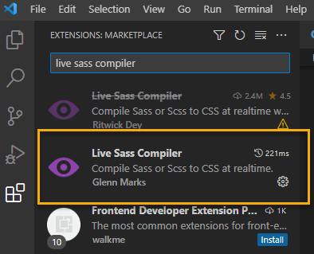

Once installed and enabled, go to File > Preferences > Settings and then search for "live sass compiler" again, or locate Live Sass Compiler under the extensions node in the Commonly Used pane. You should be presented with the settings editor for the extension.

Some settings can be set directly from the screen that appears, but most of them require editing in the settings.json file. Click on Edit in settings.json and add the following:

```json
"LiveSassCompile.settings.formats":[
    {
        "format" : "expanded",
        "extensionName" : ".css",
        "savePath" : "~/"
    },
    {
        "format" : "compressed",
        "extensionName" : ".min.css",
        "savePath" : "~/"
    }
],
"liveSassCompile.settings.excludeList" : [
    "/**/lib/bootstrap/dist/scss/**"
]
```

This configures two output formats: the first produces standard css files with white space and indentation. The second produces the minified version for use in production. Both have a savePath setting of ~/, which represents the location of the .scss file being compiled. Guidance on further settings and commands is available at the Github site for the extension project. The settings above also configure an exclusion for the compiler. Files in the wwwroot/lib/bootstrap/dist/scss folder will not be includes as part of processing. There are no files there at the moment. You will add some next.

##### Using Bootstrap Sass

Download the Bootstrap source files (https://github.com/twbs/bootstrap/archive/v5.2.3.zip) and then unzip the scss folder and its content to wwwroot/lib/bootstrap/dist/ so that the resulting folder structure looks like this:

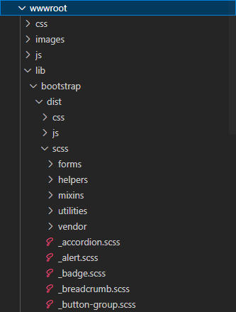

Next, rename the site.css file to site.scss. Then add the following two lines to the top of the file to import the Bootstrap Sass functions and variables:

```bootstrap
@import "../lib/bootstrap/dist/scss/functions";
@import "../lib/bootstrap/dist/scss/variables";
```

Add the following style declarations to the file.They use Bootstrap colour variables ($red-200 and $red-500):

```css
.input-validation-error,
.input-validation-error:focus{
    backgroud: $red-200;
    color:$red-500;
}
.input-validation-error:focus{
    border-color: $red-500;
    box-shadow: 0 0 0 0.2rem $red-200;
}
.field-validation-error,
.validation-summary-errors{
    color:$red-500;
}
```

To activate the compiler, click on Watch Sass in the status bar at the bottom of the code editor:


The status should change to "Watching", and you should see a number of new files created in the css folder:

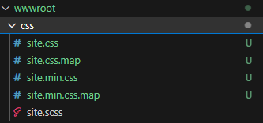

The generated css file contains hex colours in place of the variables in the scss file:

```css
.input-validation-error,
.input-validation-error:focus{
    background:#f1aeb5;
    color:#dc3545;
}

.input-validation-error:focus{
    border-color: #dc3545;
    box-shadow: 0 0 0 0.2rem #f1aeb5;
}

.field-validation-error,
.validation-summary-errors{
    color: #dc3545;
}

```

Now that you have some validation styles, you can put them to use when you build an order form in the next section.


##### Working With Forms

Any successful e-commerce site needs to be able to fulfil orders. It's difficult to do this if you don't have the contact details and shipping address of the customer. Websites collect this type of information from users by asking them to submit it in a form.

In this section, you will add a form to the Order page. You will also add validation to the form to ensure that the information you collect meets your business rules regarding presence, data type and range of the data submitted. Validation is an important part of form development. It occurs in two locations: in the browser before the form is submitted (client-side validation) and on the server after submission of the form (server-side validation). You should not rely on client-side validation because it is easy to circumvent. Consequently, you should consider client-side validation only as a courtesy to the user. You should consider server-side validation as essential. Therefore you will begin by adding server-side validation in this section. Then you will add client-side validation, not least because the validation framework in Razor Pages makes it trivial to do so.

##### Model Binding

You will leverage the ASP.NET Core framework's model binding capability as part of robust form development. Model binding is the process that takes values from HTTP requests and maps them to handler method parameters or PageModel properties. Model binding reduces the need for the developer to manually extract values from the request - from the URL or the request body for example - and then assign them, one by one, to variables or properties for later processing. This work can be repetitive, tedious and error prone.

To begin, you will add some public properties to the OrderModel class marked with the BindProperty attribute, which denotes the property as a binding target for values that the user will submit via the order form. The properties map to values that you want to capture in the form.

Add the highlighted lines below to Order.cshtml.cs:

```csharp
using System.ComponentModel.DataAnnotations;
using Bakery.Data;
using Bakery.Models;
using Microsoft.AspNetCore.Mvc;
using Microsoft.AspNetCore.Mvc.RazorPages;
namespace Bakery.Pages;
public class OrderModel : PageModel
{
    private BakeryContext context;
    public OrderModel(BakeryContext context) => this.context = context;
    [BindProperty(SupportsGet =true)]
    public int Id { get; set; }
    public Product Product { get; set;}
    [BindProperty, Range(1, int.MaxValue, ErrorMessage = "You must order at least one item")]
    public int Quantity { get; set; } = 1;
    [BindProperty, Required, EmailAddress, Display(Name ="Your Email Address")]
    public string OrderEmail {get;set;}
    [BindProperty, Required, Display(Name ="Shipping Address")]
    public string ShippingAddress { get; set; }
    [BindProperty]
    public decimal UnitPrice { get; set; }
    [TempData]
    public string Confirmation { get; set; }
    public async Task OnGetAsync() =>  Product = await context.Products.FindAsync(Id);
}
```

The additional using directive brings the DataAnnotations namespace into play. This namespace includes a number of attributes, many of which implement ValidationAttribute. You can apply any combination of these attributes to model binding targets (public PageModel properties) to ensure that user input meets your business rules. In this example, you are using the following validation attributes:

- EmailAddress - validates  whether a string matches the pattern of a "well formed" email address
- Required - specifies that a value is required
- Range - ensures that the value is within the specified range

> ;;;


##### Warning 

The definition of "well formed" as applied to the EamilAddress attribute leaves something to be desired. It only validates that the submitted string includes just one "@" character within it, and it is neither the first nor the last character. It does not validate for something that meets RFC 6854 for example, or something that can actually receive mail. You should check the source code of any validation attribute to ensure that its logic does indeed meet your business rule requirements.

You have also applied the Display attribute which enables you to customise the value displayed in the UI whenever the property is rendered (such as in a form label). By default, the literal property name is used.

The final attribute of interest - TempData - is not a data annotation attribute. Properties marked with this attribute have their values stored in the TempDataDictionary, which is a simple data structure that enables state to be retained for a short period (usually until the value is accessed). You will use it to store a confirmation message that will be accessed after the form has been submitted.

##### Adding The Form

Now you can add the form. You will use label tag helpers to generate form labels from the fproperty names ( or their Display attribute's Name property), and you will use input tag helpers to generate the form inputs. These enable you to bind the PageModel properties to individual controls. When you do so, the id and name attributes are automatically generated for the rendered HTML element and any value assigned to the property is applied to the form control.

> **Note**
>
> The name attribute is the most important attribute in a form control. Its value is used as the key for name/value pairs passed  to the server when the form is submitted, and is matched to public property names or handler method parameter names by the model binder

Add the following lines to Order.cshtml, just before the closing div element:

```html
<form class="col-9" method="post">
  <div class="form-group mb-3">
    <label asp-for="Quantity" class="form-label"></label>
    <input asp-for="Quantity" class="form-control" /> 
    <span asp-validation-for="Quantity"></span>
  </div>
  <div class="form-group mb-3">
    <label asp-for="OrderEmail" class="form-label"></label>
    <input asp-for="OrderEmail" class="form-control " />
    <span asp-validation-for="OrderEmail"></span>
  </div>
  <div class="form-group mb-3">
    <label asp-for="ShippingAddress" class="form-label"></label>
    <textarea asp-for="ShippingAddress" class="form-control"></textarea>
    <span asp-validation-for="ShippingAddress"></span>
  </div>
  <button type="submit" class="btn bn-sm btn-primary">Place order</button>
</form>
```

The form makes use of tag helpers to render the labels, inputs and the validation messages. The tag helpers that target input elements are particularly powerful. PageModel properties are assigned to the asp-for attributes on the input tag helpers. The input tag helpers then render the correct name attribute based on the property, so that model binding works seamlessly. Any values assigned to the properties are automatically rendered to the value attribute of the input. The input's type attribute is generated according to the data type of the property.

The form element itself is targeted by a form tag helper, which ensures that a request verification token is rendered as a hidden field within the form.

Next, you need a handler method for processing the form. Add the following to the Order.cshtml.cs file:

```csharp
public async Task<IActionResult> OnPostAsync()
{
    Product = await db.Products.FindAsync(Id);
    if(ModelState.IsValid)
    {
        Confirmation = @$"You have ordered {Quantity} x {Product.Name} at a total cost  of {Quantity*UnitPrice:c}";
        return RedirectToPage("/OrderSuccess"); 
    }

    return Page();
}
```

You begin by fetching details of the product from the database again because HTTP is stateless and data is not persisted across requests. Then this handler method verfifies that ModelState.IsValid, Which ensures that the model binding feature is satisfied that all submitted values pass validation checks, and that all required values are present.If there are no validation errors, the user is redirected to a page called OrderSuccess (which you will add shortly). You have assigned a value to the Confirmation property, which is marked with a TempData attribute.

If there are validation errors, entries are added to the ModelState object and IsValid returns false. The current page is redisplayed (return Page()) and the validation tag helpers display the error messages.

> This pattern is known as Post-Redirect-Get(PRG) and is designed to minimise the chance of duplicate submissions resulting from double posting.

Now add the OrderSuccess page to the application using the following command:

`dotnet new page --name OrderSuccess --output Pages --namespace Bakery.Pages`

Replace the content of the OrderSuccess.cshtml file with the following which renders the confirmation from the TempData dictionary:

```html
@page
@model Bakery.Pages.OrderSuccessModel
@{

}

<div class="progress mb-3" style="height:2.5rem;">
    <div class="progress-bar w-100" style="font-size:1.5rem;" role="progressbar">Confirmation
    </div>
</div>
<h1>Order Confirmation</h1>
<p>@TempData[nameof(OrderModel.Confirmation)]</p>
```

Now it's time to test that the form works and is processed correctly. Launch the application by typing dotnet watch, and then navigate to the home page. Click the Order Now button  on any product and ensure that the form has displayed correctly:

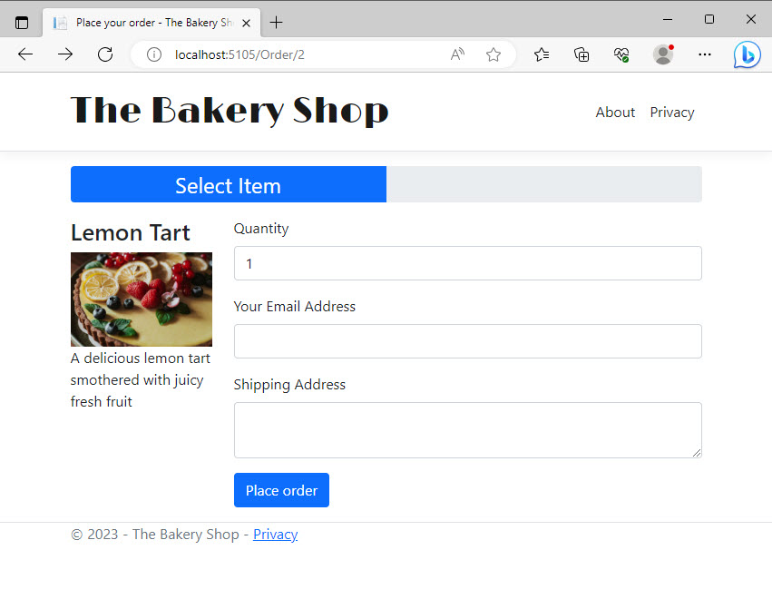

Now press the Place Order button without entering an email or shipping address, so that you can test the validation.Both fields should turn pink and error messages should appear below them:

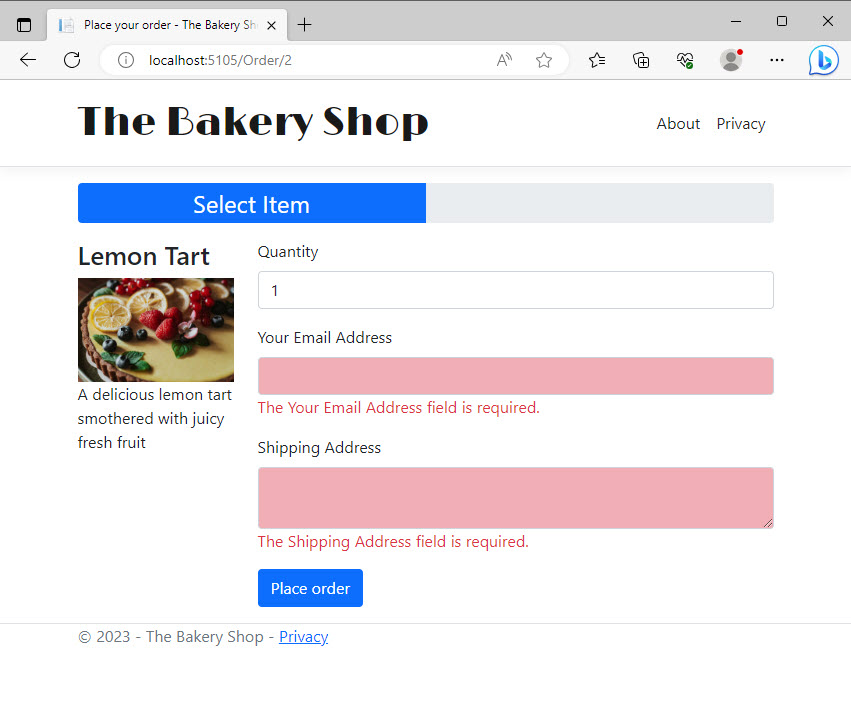

You can perform further tests such as removing the value in the Quantity box, or entering a random string into the email input. Each time, the error messages should appear once you have submitted the form.

##### Adding Client Side Validation

At the moment, all the validation is performed on the server. When you click the Order Now button, the form is submitted to the server using a POST request, and the entire page is re-rendered to provide feedback to the user.

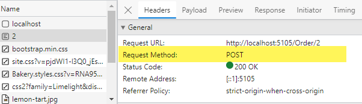

The round trip is not really noticeable to you while developing the site, because the client and the server are on the same machine. However, in a real world application, there could be some delay before the user receives any feedback. Validating on the client will provide the user with instant feedback.

> Warning 
>
> Validatinig on the client should be seen as a courtesy to the user only. It should never replace server-side validation. It is very easy for anyone with a small amount of HTML/JavaScript knownledge to circumvent client-side validation.

Client side validation is included by default in Razor Pages, but it needs to be enabled.You do that by including the jQuery Validation and jQuery Unobtrusive Validation libraries in your page. The code for including these scripts is already available in a partial file named _ValidationScriptsPartial.cshtml which is located in the Pages/Shared folder. To include it, add a partial tag helper to a scripts section in Order.cshtml as illustrated in the highlighted line of code below:

```javacript
@section scripts{
    <partial name="_ValidationScriptsPartial" />
}
```

> **Note**
> A Section represents a placeholder for a content page to provide additional content to a pre-defined location in a layout page. 

Now if you try submitting the form with missing values, the errors appear without the form actually being posted to the server. And if you provide values that satisfy the validation, you should get taken to the OrderSuccess page:

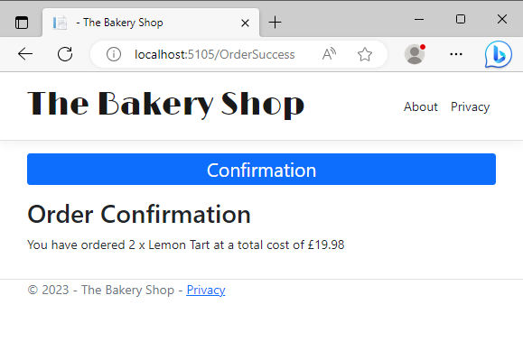

##### Summary

In this section, you  have created a form using tag helpers and added both server-side and client-side validation and tested that both work. In the next section, you will continue with client-side development then you learn how to configure TypeScript in the application to manage your JavaScript files, when you add some logic to calcuate the total cost of the order interactively.


##### Adding TypeScript Support

In this section, you will learn how to add support for TypeScript to your Razor Pages application. Similar to Sass a couple of sections age, TypeScript is not essential for working with client-side code, but it is a great productivity assistant. And, like Sass, TypeScript code is not used by your application directly. It is compiled to JavaScript. Your application will work with the resulting .js files that are generated by the TypeScript compiler.

So why use TypeScript instead of writing JavaScript directly?

TypeScript is a superset of JavaScript that adds static typing to the language. This means that TypeScript code can be checked for type errors at compile time, which can help to prevent runtime errors. TypeScript also provides other features that can make browser-based JavaScript development more reliable and efficient, such as:

- Interfaces: Interfaces can be used to define the shape of data structures, which can help to prevent errors when passing data between different parts of an application.
- Generics: Generics can be used to create reusable code that can work with different types of data.
- Modules: Modules can be used to organize code into logical units, which can make it easier to understand and maintain large codebases.

If you are new to TypeScript, I recommend you visit the official site for more guidance.

In this section, you will configure TypeScript in your application, and then use it to generate a small amount of JavaScript code that will calculate the total price of an order prior to the user submitting the form.

To begin, you need to install TypeScript itself if you haven't already done so at some point. This can be done via the Node Package Manager (npm) which is enabled by default in VS Code.

Open a terminal and execute the following command, which will install the latest version of TypeScript globally:

`npm install -g typescript`

Next, you need to configure the TypeScript compiler's behaviour within your application. Configuration is specified in a tsconfig.json file, which you create by executing the following command:

`tsc --init`

The resulting file contains a default configuration which is sufficient for your needs for this exercise. If you want to take advantage of modules that use import and export, you should change the target and module options to "ES2020" at least. To support the latest features regardless of version, you can change these options to "ESNext".

Now you will modify the Order page to include a hidden field for the unit price of the item being ordered, and some elements to act as containers for the result of the calculation. Add the highlighted lines just before the exising button:

```html
<form class="col-9" method="post">

    <div class="form-group mb-3">
        <label asp-for="Quantity" class="form-label"></label>
        <input asp-for="Quantity" class="form-control" />
        <span asp-validation-for="Quantity"></span>
    </div>
    <div class="form-group mb-3">
    <label asp-for="OrderEmail" class="form-label"></label>
    <input asp-for="OrderEmail" class="form-control " />
    <span asp-validation-for="OrderEmail"></span>
  </div>
  <div class="form-group mb-3">
    <label asp-for="ShippingAddress" class="form-label"></label>
    <textarea asp-for="ShippingAddress" class="form-control"></textarea>
    <span asp-validation-for="ShippingAddress"></span>
  </div>
  <input type="hidden" asp-for="UnitPrice" value="@Model.Product.Price"/>
  <div class="mb-3"> Total cost: <span id="orderTotal">@Model.Product.Price.ToString("c")</span></div>
  <button type="submit" class="btn bn-sm btn-primary">Place order</button>
</form>

```

Next, add a new file to the wwwroot/js folder named order.ts with the following content, which uses standard DOM APIs to reference the quantity and unit prices along with the span you just added for the order total. It listens for the change event of the Quantity input and calculates the total price for the order based on the quantity specified, outputting the result to the span:

```typescript
const unitPriceElement = document.querySelector('#UnitPrice') as HTMLInputElement;
const quantityElement = document.querySelector('#Quantity') as HTMLInputElement;
const orderTotalElement = document.querySelector('#orderTotal') as HTMLSpanElement;
if(quantityElement && unitPriceElement && orderTotalElement){
    quantityElement.addEventListener('change',_=>{
        const unitPrice = Number(unitPriceElement.value);
        const quantity = Number(quantityElement.value);
        const orderTotal = unitPrice * quantity;
        orderTotalElement.textContext = orderTotal.toLocaleString('en-GB',{
            style:'currency',
            currency: 'GBP'
        });
    });
}
```

You may want to change the locale and currency settings passed to the Number.toLocaleString function to support your culture.


> **Note**
>
> The DOM elements are cast to their specific type using the as keyword, so that the value property can be accessed. Without this casting, the types returned from the querySelector method would be Element, which only exposes those properties and methods that are common to all document elements.

Rather that manually compiling your TypeScript files every time you change one, you can initiate a TypeScript compiler process that continuously monitors files for changes. Whenever a file is modified, added, or deleted within the application, the TypeScript compiler recompiles the modified files and any dependent files. This process is initiated by executing the following command:

`tsc --watch`

Having executed this command, you should find that a new file has been added to the wwwroot/js folder - order.js. This is the output generated by the TypeScript compiler from the file you just authored. In this example, you should notice that the content of the generated Javascript file is almost identical to the TypeScript version, with the type assertions removed.

Reference the file in the scripts section of the Order page as follows, using the script taghelper with the append-version attribute set to true which will ensure that the latest version will always be downloaded to the client:

```html
@section script{
    <partial name="_ValidationScriptsPartial" />
    <script src="~/js/order.js" asp-append-version="true"></script>
}
```

Then change the quantity value and check that the order total is updated:

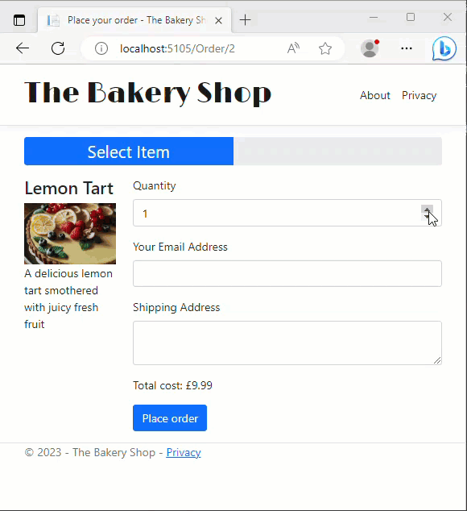

##### Summary

In this section, you learned how to configure TypeScript in the application to manage your JavaScript files, then you added some logic to calcuate the total cost of the interactively. At the moment, the user can only order item at a time. In the next section, you will add a cookie-enabled shopping basket facility that tracks multiple orders for the user.

##### Working with Cookies

HTTP, and therefore the World Wide Web is stateless. This means that the Hypertext Transfer Protocol (HTTP), which is the underlying protocol used for communication on the World Wide Web, does not retain any informatioon about previous interactions or requests between a client (such as a web browser) and a server.

When a client sends an HTTP request to a server, the server processes the request and sends back a response. However, the server does not store any information about the client's previous requests or maintain any knowledge of the client's state. Each request is treated as an independent and isolated transaction.

To maintain any for of state between requests, web application must implement their own state management techniques. You have already used one such technique when you worked with TempData in the forms section. However, TempData is designed to be short-lived. By default, it is disposed of once accessed. If you want to enable your users to order multiple different goods in one financial transaction, you need a more robust solution for "remembering" each item.

Cookies (which are the mechanism behind TempData) provide a solution. They are small text files that can be stored on the user's device. By default, they expire at the end of a browser session, but expiry can be extended to any time in the future.

In this section, you will use a cookie to store the user's "shopping basket", which consists of a collection of order items. So to start, add a new to the Models folder that will be used to represent an order item by executing the following command:

`dotnet new class -n OrderItem -o Models`

Open the new file and replace its content with the following:

```csharp
namespace Bakery.Models;

public class OrderItem
{
    public int ProductId {get;set;}
    public decimal UnitPrice {get;set;}
    public int Quantity {get;set;}
}
```

Each order item represents the key value of a product, the unit price and the quantity ordered. Next, add a class to represent the basket - a collection of order items and a property that calculates the total number of items in the basket:

`dotnet new class -n Basket -o Models`

Change the content of the Basket.cs file to:

```csharp
namespace Bakery.Models;

public class Basket
{
    public List<OrderItem> Items {get;set;} = new();
    public int NumberOfItems => Items.Sum(x=>x.Quantity);
}
```

In the next step, you will amend the Order page to populate a basket instance and store the basket in the cookie. Begin by commenting out or removing the OrderEmail and ShippingAddress properties in the OrderModel class, together with their associated form fields, labels and validation tag helpers in the order form itself. The resulting form should only include a control for the quantityh, and a hidden field for the unit price.

The workflow you will implement in the revised OnPostAsync method will check to see if a cookie containing the basket exists. If it does, its contents will be hydrated as a Basket instance, and the item being ordered will be added to it. Otherwise a new Basket instance will be created with details of the order. Either way, the resulting basket will be serialised to JSON and assigned to the cookie.

Start by adding a using directive to the Order.cshtml.cs to reference the System.Text.Json namespace, which contains APIs for working with JSON:

```csharp
using System.Text.Json;
```

Then change the OnPostAsync method to the following:

```csharp
public async Task<IActionResult> OnPostAsync()
{
    if(ModelState.IsValid)
    {
        Basket basket = new();
        if(Request.Cookies[nameof(Basket)] is not null)
        {
            basket = JsonSerializer.Deserialize<Basket>(Request.Cookies[nameof(Basket)]);
        }

        basket.Items.Add(new OrderItem{
            ProductId = Id,
            UnitPrice = UnitPrice,
            Quantity = Quantity
        });

        var json = JsonSerializer.Serialize(basket);
        Response.Cookies.Append(nameof(Basket),json);

        return RedirectToPage("/Index");
    }

    Product = await context.Products.FindAsync(Id);
    return Page();
}
```

Cookies consist of a key/value pair, the key being the name of the cookie and the value being the information associated with the key. Once set, they are included in every request and can be accessed via the Request.Cookies collection. Your cookie is named Basket, so you test to see if it exists. If it doesn't, it is null, so this test is important in preventing a NullReferenceException, which is a common issue when working with cookies. If it exists, you deserialise its content and assign it to the Basket that is instantiated at the beginning of the method. Then you add details of the item bwing ordered. Finally, you serialise the modified basket and assign the resulting JSON to the cookie and append it to the response, overwriting any previous version of the cookie. Then you send the user back to the home page so that they can continue ordering.

To test the cookie, open the browser developer tools (F12 in Chrome or Edge). Focus on the Application tab and expand the Cookies node under Storage. Then click on the URL for your app (http://localhost:5105 in the image below). Navigate to the home page. Click on the Order Now button for any product and place an order for any quantity. Notice that two cookies appear - the Antiforgery token cookie, and the Basket cookie. Order another product and then example the contents of the Basket cookie. You should see details of the ordered items:

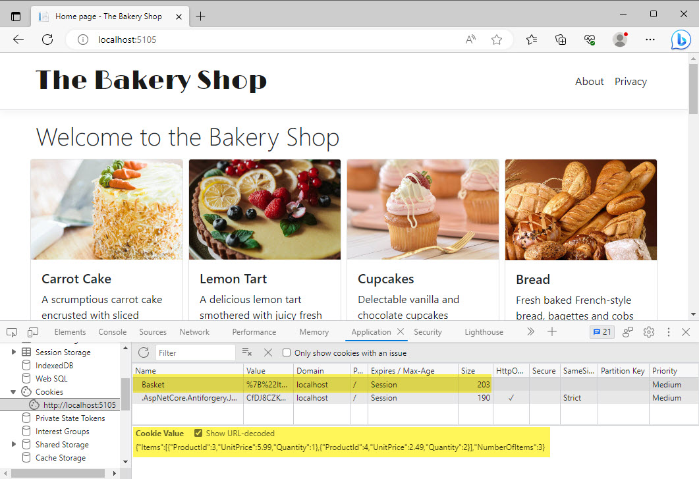

Notice the value in the Expires / Max-Age column in the image. It is currently set to Session, which refers to a browser session. As soon as the browser instance is terminated, the cookie will disappear. On most shopping sites, cookie-based baskets are persisted beyond the browser session. You may have noticed that sites "remember" what you added to a basket months after you last visited them.

Before moving on to the next section, you will modify your code to set an expiry time for the basket cookie via a CookieOptions object. The changes are highlighted below:

```csharp
if(ModelState.IsValid)
{
    Basket basket = new();
    if(Request.Cookies[nameof(Basket)] is not null)
    {
        Basket = JsonSerializer.Deserialize<Basket>(Request.Cookies[nameof(Basket)]);
    }

    basket.Items.Add(new OrderItem{
        ProductId = Id,
        UnitPrice = UnitPrice,
        Quantity = Quantity
    });

    var json = JsonSerializer.Serialize(basket);

    var cookieOptions = new CookieOptions
    {
        Expires = DateTime.Now.AddDays(30)
    };

    Response.Cookies.Append(nameof(Basket),json,cookieOptions);

    return RedirectToPage("/Index");
}
```

Now if you add another item to your order, you should see the value in the Expires/Max-Age is updated to reflect an expiry time 30 days from the present:


Close the browser and re-open it and the cookie persists.

##### Summary

In this section, you have implemented one of the most commonly-used state management techniques in web development - the cookie. You used it to store a JSON representation of your user's shopping basket, and you learned how to persist the cookie for an arbitrary period. In the next section, you will add a widget to the site representing the basket. You will implement this as a View Component - a feature that is similar to a partial view except that it encapsulates its own rendering logic.

##### View Components in Razor Pages

If you frequently engage in online shopping, you likely recognise the familiar sight of a basket icon displaying a number representing the quantity of items it holds.


These icons are typically found in a consistent area across all pages of a website - the Layout file in the context of a Razor Pages application. But how does this basket obtain its data?

The primary data source for a layout page is the current page itself. Once approach could involve generating the basket's data in every page of the site, or alternatively, using a base page that all pages derive from. Alternatively, it is technical possible to inject some kind of service into the layout page that provides the data, However, these methods are not advisable due to maintenance concerns and potential issues with tight coupling.

A flexible and maintianable solution for this requirement is the use of a view component. By employing a view component, you can encapsulate the logic and rendering for the shopping basket into a testable and reusable component. View components are resposible for their own data retrieval, so they promote separation of concerns.

View components consist of a class file and a .cshtml view file. The class file contains the logic generating the model. It can be thought of as a mini-controller, just as the Razor PageModel file is considered to be a page controller. The view file contains the template used to generate the HTML to be plugged in to the page that hosts the view component.

The class file must conform to the following rules:

- It must derive from the ViewComponent class
- It must have "ViewComponent" as a suffix to the class name or it must be decorated with the [ViewComponent] attribute (or derive from a class that's decorated with the [ViewComponent] attribute)
- It must implement a method named Invoke with a return type of IViewComponentResult (or InvokeAsync returning Task<IViewComponentResult> if you need to call asynchronous methods).

By default, the view file is named Default.cshtml (case-insensitive). The view file's placement within the application's file structure is important, because the framework searches pre-defined locations for it:

/Pages/Shared/Components/<component name>/Default.cshtml
/Pages/Shared/Components/<component name>/Default.cshtml

The framework will also search by walking up the directory tree from the location of the calling page until it reaches the root Pages folder. This is the same search pattern as for partials. You will use the first search location as the location for your basket view component.

Add a folder to the Pages/Shared folder name Components and within that, add a folder named Basket. Having created the folder structure, execute the following command to generate a Razor view file within the Basket folder:

`dotnet new view -n Default -o Pages/Shared/Components/Basket`

Next, add a C# class file named BasketViewComponent to the Basket folder using the following command:

`dotnet new class -n BasketViewComponent -o Pages/Shared/Components/Basket`

Change the content of the BasketViewComponent class as follows. The logic depends on System.Text.Json, and is very similar to the code you used for the cookie in the previous section. It deserialses the basket cookie and passes the resulting data to a View method that returns a ViewViewComponentResult which is an implementation of IViewComponentResult:

```csharp
using System.Text.Json;
using Microsoft.AspNetCore.Mvc;

namespace Bakery.Pages.Components.Basket;

public class BaskeryViewComponent : ViewComponent
{
    Models.Basket basket = new();
    if(Request.Cookies[nameof(Basket)] is not null)
    {
        basket = JsonSerializer.Deserialize<Models.Basket?>(Request.Cookies[nameof(Basket)]!);
    }
    return View(basket);
}
```

In this example, the data retrieval logic requires no external dependencies. More commonly, you might obtain data from a database. View components are just like PageModel classes in that they act as the controller for a view, although in this case, it's a partial view. So just like with a PageModel, you can inject dependencies into their constructor. The following example illustrates how you would do that and use the InvokeAsync method to retrieve data asyncronously:

```csharp
public class BasketViewComponent:ViewComponent
{
    private readonly BaskeryContext context;
    public BasketViewComponent(BaskeryContext context)
    {
        this.content = context;
    }

    public async Task<IViewComponentResult> InvokeAsync()
    {
        var data = await context.Products.ToListAsync();
        return View(data);
    }
}
```

Now to the example and the view itself (which is essentially a partial page).Open the Default.cshtml file you created and replace its content with this code, which makes use of the Bootstrap badge component and icons to generate a button with a shopping basket and an indication of the number of items it holds, like the image at the beginning of this section:

```razorpage
@model Baskery.Models.Basket
@if(Model.Items.Any())
{
    <button type="button" class="btn btn-sm btn-primary position-relative" title="@Model.NumberOfItems items in basket">
        <i class="bi bi-cart4"></i>
        <span class="position-absolute top-0 start-100 translate-middle badge rounded-pill bg-danger">@Model.NumberOfItems</span>
    </button>
}
```

The cart icon comes from Bootstrap icons, which you need to include in the page. Open the Layout.cshtml file and add the following to the head element:

```html
<link rel="stylesheet" href="https://cdn.jsdelivr.net/npm/bootstrap-icons@1.10.5/font/bootstrap-icons.css">
```

This references version 1.10.5 from a CDN, which is the current version at the time of writing.

Finally, you need to render the view component. You can do this in one of two ways. You can use the Component.InvokeAsync method, or you can use a tag helper. You will use the first of these options. You can find out more about using the tag helper approach here.

Open the Layout.cshtml file and place the highlighted line after the existing navigation:

```html
<div class="navbar-collapse collapse d-sm-inline-flex justify-content-between">
    <ul class="navbar-nav flex-grow-1">
        <li class="nav-item">
            <a class="nav-link text-dark" asp-page="/About">About</a>
        </li>
        <li class="nav-item">
            <a class="nav-link text-dark" asp-area="" asp-page="/Privacy">Privacy</a>
        </li>
    </ul>
    @await Component.InvokeAsync(nameof(Models.Basket))
</div>
```

Run the application and order a few products. You should see the view component appear after ordering the first one, and the number on the badge increment with each additional order.

##### Summary

Whenever you need to include a data-driven widget in a layout page, the first solution to reach for is a view component. In this section, you created a class that derives from ViewComponent and a view file named Default.cshtml located in one of the default search locations. The ViewComponent class is responisble for data retrieval logic and the view file is the presentation template.

The application is developing nicely and acquiring new features. In the next section, you will use Mailkit to add email capability so that you can send order confirmations to customers.

##### Adding Email Support

This section describes how to add email sending functionality to your Razor Pages web application. The .NET framework provides a number of APIs in the System.Net.Mail namespace for creating and sending email messages. However, the Smtpclient class, which is a core System.Net.Mail API, is obsolete on some platforms and is not recommended for use on others. Therefore, it is advisable to use a third-party library instead. The official documentation specifically mentions MailKit as an option. This section will use Mailkit to sned emails.

In the last section, you added a basket icon to the layout that displays the number of items currently being ordered. In this section, you will link the icon to a checkout page, which you will create next. The checkout page will display the contents of the basket, and include the form that you initially created in the forms section to collect the customer's email and shipping address.

First, open the /Pages/Shared/Components/Basket/Default.cshtml file and change the button to an anchor tag helper that has an asp-page attribute valule of "/Checkout":

```html
<a asp-page="/Checkout" class="btn btn-sm btn-primary position-relative" title="@Model.NumberOfItems items in basket">
    <i class="bi bi-cart4"></i>
    <span class="position-absolute top-0 start-100 translate-middle badge rounded-pill bg-danger">@Model.NumberOfItems
    </span>
</a>
```

This won't link anywhere just yet because the Checkout page doesn't exist. That's the next job. Execute the following command to create the Checkout page:

`dotnet new page -o Pages -n Checkout -p:n Bakery.Pages`

Clicking the basket icon will result in a GET request for the Checkout page, so you will generate the initial state of the page in the OnGetAsync handler. You will retrieve the Id values of the selected products from the basket cookie, and use that to filter the product information that you retrieve from the database for display on the page. Here is the CheckoutModel class featuring an injected BakeryContext, which is used to retrieve the data from the database and then assign it to a List<Product> property:

```csharp
using System.Text.Json;
using Bakery.Data;
using Bakery.Models;
using Microsoft.AspNetCore.Mvc.RazorPages;
using Microsoft.EntityFrameworkCore;
namespace Bakery.Pages;

public class CheckoutModel : PageModel
{
    private readonly BakeryContext context;

    public CheckoutModel(BakeryContext context)
    {
        this.context = context;
    }

    public Basket Basket {get;set;} = new();

    public List<Product> SelectedProducts {get;set;}=new();

    public async Task OnGetAsync()
    {
        if(Request.Cookies[nameof(Basket)] is not null)
        {
            Basket = JsonSerializer.Deserialize<Basket>(Request.Cookies[nameof(Basket)]);
            if(Basket.NumberOfItems > 0)
            {
                var selectedProducts = Basket.Items.Select(b=>b.ProductId).ToArray();
                selectedProducts = await context.Products.Where(p=>selectedProducts.Contains(p.Id)).ToListAsync();
            }
        }
    }
}
```

Next, amend the Checkout.cshtml file to display the contents of the basket (SelectedProducts) in a table:

```html
@page
@model Bakery.Pages.CheckoutModel
<h1 class="fw-light">Checkout</h1>

@if(Model.Basket.NumberOfItems > 0)
{
    <table class="table table-borderless">
        <thead>
            <th>Item</th>
            <th>Quantity</th>
            <th>Cost per unit</th>
            <th class="text-end">Total</th>
        </thead>
        <tbody>
            @foreach(var item in Model.Basket.Items)
            {
                <tr>
                    <td>@Model.SelectedProducts.First(x=>x.Id==item.ProductId).Name</td>
                    <td>@item.Quantity</td>
                    <td>@item.UnitPrice</td>
                    <td class="text-end">@(item.Quantity * item.UnitPrice)</td>
                </tr>
            }
        </tbody>
        <tfoot class="border-top">
            <tr>
                <td>Total</td>
                <td></td>
                <td></td>
                <td class="text-end">@Model.Basket.Items.Sum(x=>x.Quantity*x.UnitPrice)</td>
            </tr>
        </tfoot>
    </table>
}
else
{
    <p>Your basket is currently empty</p>
}
```

The contents of your basket may vary but when you click on the basket icon, the page should look similar to this:

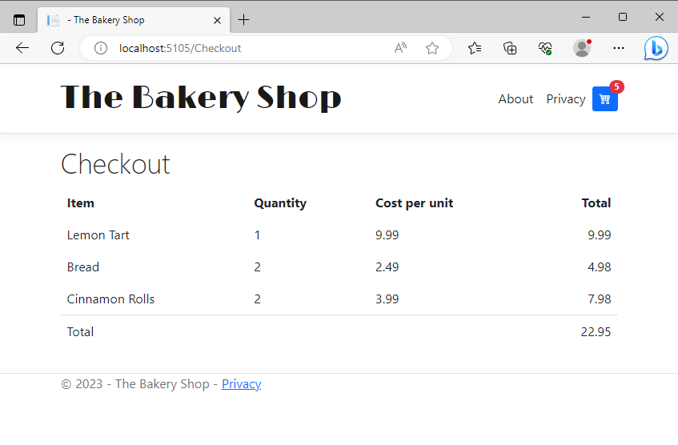

The form is next. You will need to add using directives for Microsoft.AspNetCore.Mvc and System.ComponentModel.DataAnnotations to the top of the CheckoutModel class, along with properties for the ShippingAddress, OrderEmail and Confirmation from the previous form:

```csharp
[BindProperty,Required,Display(Name="Your Email Address")]
public string OrderEmail {get;set;}
[BindProperty,Required,Display(Name="Shipping Address")]
public string ShippingAddress{get;set;}
[TempData]
public string Confirmation {get;set;}

```

Then you can add the form itself to the Checkout.cshtml page. Add the following just after the closing </table> tag:

```csharp
<form method="post">
    <div class="form-group mb-3">
        <label asp-for="OrderEmail" class="form-label"></label>
        <input asp-for="OrderEmail" class="form-control" />
        <span asp-validation-for="OrderEmail" class="text-danger"></span>
    </div>

     <div class="form-group mb-3">
        <label asp-for="ShippingAddress" class="form-label"></label>
        <textarea asp-for="ShippingAddress" class="form-control"></textarea>
        <span asp-validation-for="ShippingAddress" class="text-danger"></span>
    </div> 
    <div class="d-flex justify-content-center">
        <button class="btn btn-success"><i class="bi bi-rocket-takeoff"></i> Ship Order</button>
    </div>
</form>
```

Don't forget the unobtrusive validation scripts:

```razor
@section scripts{
    <partial name="_ValidationScriptsPartial" />
}
```

Now you get to the meat of this section - generating an email when the user submits a valid form.

The first step is to install Mailkit:

`dotnet add package Mailkit`

Next, you need to choose a strategy for testing the successful generation of emails.You could use an external email service such as provided by Google or Microsoft via their Outlook/Hotmail/Live services.The downside of this appoach is latency. It can take some time for emails to arrive. Ideally, you want to work with a local service where generated emails are available immediately.You could emulate the SpecifiedPickupDirectory delivery method from System.Net.Mail - an option that allows you to specify a local directory where emails are created as .eml files.This options is not built in to Mailkit,but the code for writing mails to a folder is available here.

Alternatively, you can install Smtp4Dev - a service that emulates an SMTP server for local development.Installation instructions can be found at the project's repository,but it is as simple as executing the following command to install the tool globally:

`dotnet tool install -g Rnwood.Smtp4dev`


Then to run the service,type smtp4dev at the command prompt.The interface is web-based,and is accessible by default at http://localhost:5000.You can configure a different port.Check the docs for options.

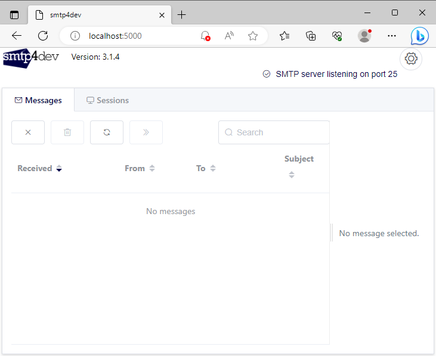

Add an OnPost`` handler to the CheckoutModel`` class with the following code that deserialises the basket cookie and uses its data to construct a message.It then uses the Mailkit APIs to create an instance of the MimeMessage class which represents an email, and then sends it using its own SmtpClient class.Finally,the code expires the cookie:

```csharp
public async Task<IActionResult> OnPostAsync()
{
    if(ModelState.IsValid && Request.Cookies[nameof(Basket)] is not null){
        var basket = JsonSerializer.Deserialize<Basket>(Request.Cookies[nameof(Basket)]);
        if(basket is not null)
        {
            var plural = basket.NumberOfItems == 1 ? string.Empty : "s";
            Confirmation = $@"<p>Your order for {basket.NumberOfItems} item{plural} has been received and is being processed:</p>
            <p>It will be sent to {ShippingAddress}. We will notify you when it has been despatched</p>";    
            var message = new MimeMessage();    
            message.From.Add(MailboxAddress.Parse("test@test.com"));    
            message.To.Add(MailboxAddress.Parse(OrderEmail));    
            message.Subject = "Your order confirmation";    
            message.Body = new TextPart("html")    
            {    
                Text = Confirmation
            };    
            using var client = new SmtpClient ();
            await client.ConnectAsync("localhost");
            await client.SendAsync(message);
            await client.DisconnectAsync(true);
            Response.Cookies.Append(nameof(Basket), string.Empty, new CookieOptions{Expires = DateTime.Now.AddDays(-1)});
            return RedirectToPage("/OrderSuccess");
        }
    }
    return Page();
}
```

If the form is valid,the user is redirected to the OrderSuccess page you created earlier.However,this time the content of the TempData item being passed to that page is now HTML.By default,Razor encodes all HTML,so you need to make a change to OrderSuccess.cshtml to prevent this.You will use the Html.Raw`` method to render the HTML as is. Change the line under the h1 `` heading as shown here:

```html
<h1>Order Confirmation</h1>
@Html.Raw(TempData[nameof(OrderModel.confirmation)])
```

Run the app and if there are no items in the basket,select one or two.Then click on the basket icon and go to the checkout page where you can complete and submit the order.You should see the confirmation message appear in the OrderSuccess page and in an email that appears in the Smtp4Dev UI:

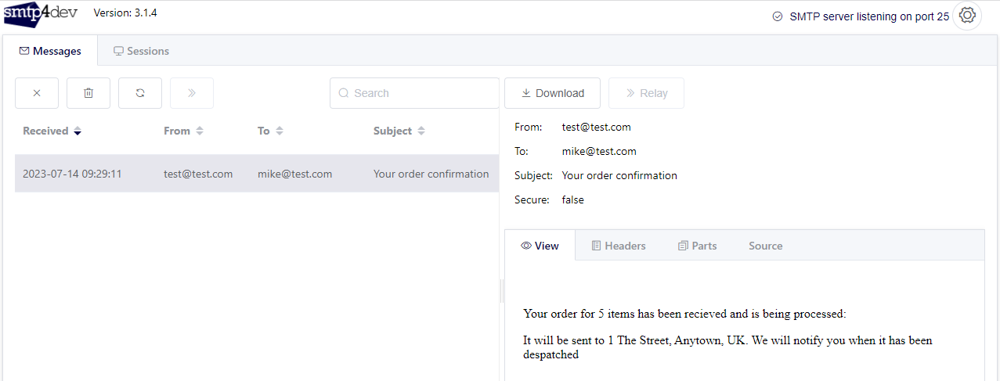

##### Summary

Now that you have reached this point,the port from the ASP.NET Web Pages Bakery template is complete.The Razor Pages version is available on Github, but things do not stop there.Further sections are planned which will cover more Razor Pages functionality.Once completed,the next section will look at scaffolding CRUD pages so that you can add more products to the database,and modify the existing ones.

##### Scaffolding CRUD Pages

At this stage,the range of products offered by the Bakery site is restricted to those that were added during the seeding operation.In this section,you are going to add page to manage creating,updating and deleting product information.

There are two ways to approach this task.One involves adding empty Razor pages to the application for each data operation,and subsequently implementing UI code to create suitable web forms.Additionally,you'll need to add code to the PageModel class for input processing and executing the corresponding data operation.The alternative approach is to use code generation tools to automatically generate the relevant files in a process known as Scaffolding.

Scaffolding is a technique that works with Entity Framework Core and uses reflection to examine the relevant entity and to generate the required pages with forms and processing code based on the properties of the entity.It is a super-quick procedure that saves a lot of time that would otherwise be spent producing repetitive boiler-plate code,and the output can be customised as required.

The utility needed for scaffolding is available as a command-line tool which you install on the development machine.To install it,execute the following command in the terminal:

`dotnet tool install --global dotnet-aspnet-codegenerator`

The --global switch ensure that you only need to install this tool once one the target device and it will be available for other project.

You will also need to install some Nuget packages:

`dotnet add package Microsoft.VisualStudio.Web.CodeGeneration.Design`
`dotnet add package Microsoft.EntityFrameworkCore.Tools`
`dotnet add package Microsoft.EntityFrameworkCore.Sqlserver`

Once the tool and packages have been installed,execute the following command in the terminal which tells the code generator to scaffold Razor pages for the Product model class (-m or --model),using the BakeryContext (-dc or --datacontext),using the default layout (-udl or --useDefaultLayout),to output the resulting files in the Pages\Products folder (-outDir or --relativeFolderPath),and to include the validation scripts partial (-scripts or --referenceScriptLibraries) in the edit and create pages:

`dotnet-aspnet-codegenerator razorpage -m Product -dc BakeryContext -udl -outDir Pages\Products -scripts`

You should see the following confirmation:

```
Added Razor Page : \Pages\Products\Create.cshtml
Added PageModel : \Pages\Products\Create.cshtml.cs
Added Razor Page : \Pages\Products\Edit.cshtml
Added PageModel : \Pages\Products\Edit.cshtml.cs
Added Razor Page : \Pages\Products\Details.cshtml
Added PageModel : \Pages\Products\Details.cshtml.cs
Added Razor Page : \Pages\Products\Delete.cshtml
Added PageModel : \Pages\Products\Delete.cshtml.cs
Added Razor Page : \Pages\Products\Index.cshtml
Added PageModel : \Pages\Products\Index.cshtml.cs
```

A new folder is added to the Pages folder name Products.In it,a full collection of CURD pages are generated - Create,Delete,Details,Edit and Index;

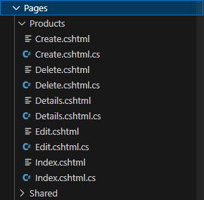

Execute the `dotnet watch` command and then browse to http://localhost:xxxx/products to see the existing products listed:

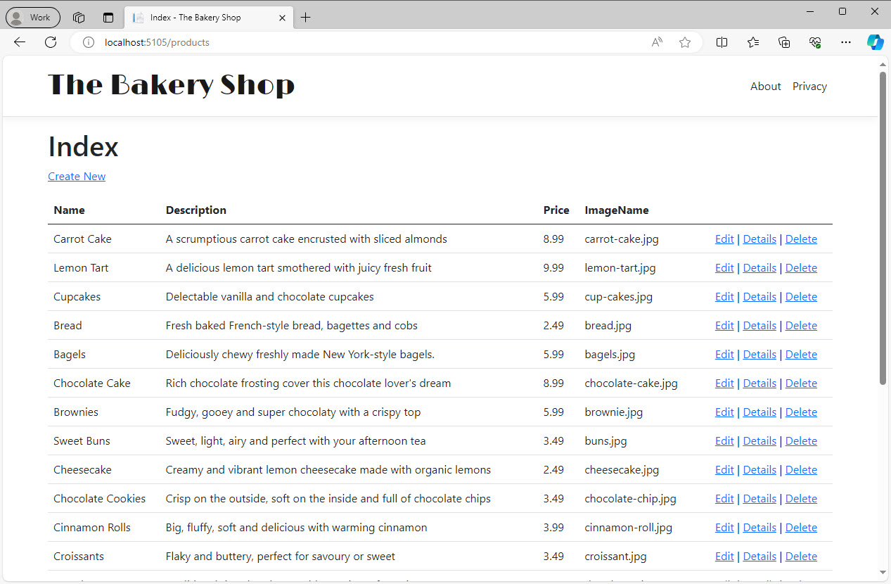

Use the navigation links in each page to explore the other pages.Check the generated PageModel classes and notice that each of them takes the DbContext as a parameter.All EF Core CRUD operations are covered in the generated code.The markup in the content pages uses Bootstrap styles and the pages adopt the existing _Layout.cshtml file.

##### Summary

In this section, you have discovered how easy it is to generate pages that provide the full set of CRUD operations for an entity.You installed the scaffolding tool globally so that it is available for use in other projects,and you installed some other required packages within the project.

While operational,the generated pages may not always suit your needs from a functional and/or design point of view.In the next section,you will modify the Create and Edit pages to enable uploading the product image file.

##### Uploading Files

In the previous section,you generated a collection of pages that support EF Core CRUD operations for the Product entity.As with the order form you created earlier,the generated forms work with strings.The scaffolded input for the product image expects a file name.As it currently stands,there is no means by which the user can store the image file on the web server.Ideally,you want to enable the user to provide an actual file and the application should take care of saving it.

In this section,you will modify the Create form to accept a file upload and then you will add code to save the file so that it can be displayed where necessary within the application.

> **Note**
>
> When storing files for a web application,the two most commonly used approaches involve storing the file within the web server's file system,or in a database in binary format.Both approaches are valid and each has its pros and cons.In this tutorials,you will store the file in the file system along with the existing image files.

Three conditions must exist for successful management of file uploads within a form in an ASP.NET Core application:

1. The form must use the POST method and have an enctype attribute set to multipart/form-data

2. You must use an input with its type attribute set to file

3. The uploaded file must bind to an IFormFile type

Start by opening the /Pages/Products/Create.cshtml.cs file.Add a new property named ProductImage of type IFormFile and apply the BindProperty attribute to it along with a Display attribute:

```csharp
[BindProperty,Display(Name="Product Image")]
public IFormFile ProductImage{get;set;}
```

Next,in the /Pages/Products/Create.cshtml file,change the form tag to include the enctype attribute referred to in the first condition above:

`<form method="post" enctype="multipart/form-data">`

Alter the Product.ImageName label and form control form group to reference the new IFormFile property as follows.Also,remove the validation tag helper because it is not needed:

```html
<div class="form-group">
    <label asp-for="ProductImage" class="control-label"></label>
    <input asp-for="ProductImage" class="form-control" accept=".jpg,.png" />
    
</div>
```

Now that the input tag helper is bound to an IFormFile property according to the third condition,the value for the type attribute will be set to file automatically,satisfying the second condition.Note also that the input tag helper includes an accept attribute,which should limit any file browser on the client to only expose files with the specified extensions.

When you save files to the filesystem,you need to be able to build full paths.However,locations may not be consistent across environments (development,hosting etc).To mitigate this,you use the IWebHostEnvironment service (registered by default),which provides information about the current environment.As with other services,you inject this into the PageModel and assign it to a field for later use:

```csharp
public class CreateModel : PageModel
{
    private readonly Bakery.Data.BakeryContext _context;
    private readonly IWebHostEnvironment environment;

    public CreateModel(Bakery.Data.BakeryContext context,IWebHostEnvironment environment)
    {
        _context = context;
        this.environment = environment;
    }
}
```

Finally,you will add code to process the upload which will assign the file name to the ImageName property of the product,and save the actual file to the images/products folder in wwwroot.This takes place in the OnPost handler within the CreateModel class,the revised version of which follows:

```csharp
public async Task<IActionResult> OnPostAsync()
{
    ModelState.Remove("Product.ImageName");
    if (!ModelState.IsValid || _context.Products == null || Product == null)
    {
        return Page();
    }
            
    Product.ImageName = ProductImage.FileName;
    var imageFile = Path.Combine(environment.WebRootPath, "images", "products", ProductImage.FileName);
    using var fileStream = new FileStream(imageFile, FileMode.Create);
    await ProductImage.CopyToAsync(fileStream);
    _context.Products.Add(Product);
    await _context.SaveChangesAsync();
            
    return RedirectToPage("./Index");
}
```

The default settings for the project has nullable reference types enabled within the Bakery.csproj file:

`<Nullable>enable</Nullable>`

This setting affects the behaviour of the model binder so that it sees all non-nullable strings as required by default.This includes the ImageName property of the Product class,which the scaffolded code has as a binding target.The change you made to the scaffolded form means that you will not be binding a value to this property.You are binding to the IFormFile property instead.Consquently,The ImageName property will always be null,resulting in a model validation error being registered.So the first thing you need to do is to remove any model state entries relating to this property before you check Modelstate.IsValid.

Assuming that validation is successful,you assign the upload's file name to the Product.ImageName property,then you use the IFormFile.CopyToAsync method to save the uploaded image to the wwwroot/images/products folder.The IWebHostEnvironment.WebRootPath property resolves the file path to the wwwroot folder,and you use that to build up the path to the new image file.

Create a new product and upload an image:

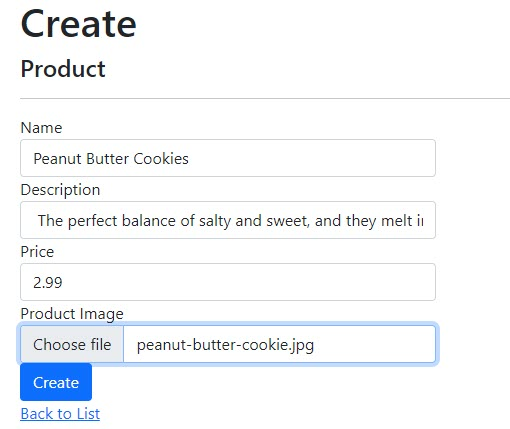

The new product should appear at the bottom on the list in the scaffolded Index page, and as a new entry on the home page:

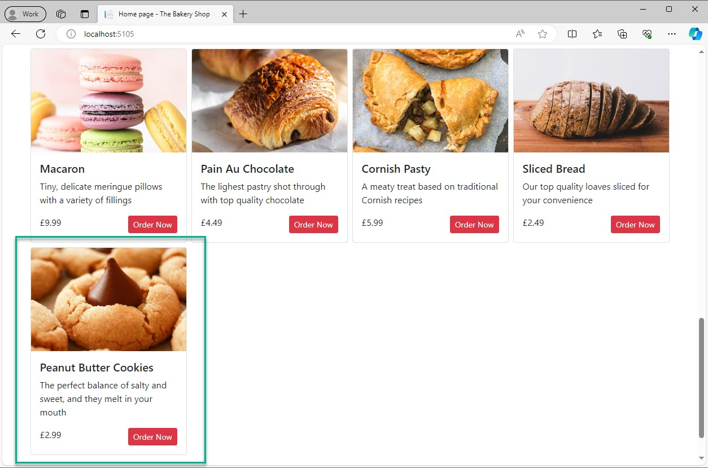

##### Summary

In this section,you learned about the three requirements for successful file uploading via a form in Razor Pages and how to implement them.You also learned how to use the `IWebHostEnvironment` service to resolve the file path to the wwwroot folder.


#### Razor Pages Files

##### Razor Pages

All Razor files end with .cshtml.Most Razor files are intended to be browsable and contain a mixture of client-side and server-side code,which,when processed,results in HTML being sent to the browser.These pages are usually referred to as "content pages".This section takes a deeper look at content pages,and their associated PageModel files.

##### Content Pages

For a file to act as a Razor content page,it must have three characteristics:

- It cannot have a leading underscore in its file name
- The file extension is .cshtml
- The first line in the file is @page

Placing the @page directive as the first line of code is critical.If this is not done,the file will not be seen as a Razor page,and will not be found if you try to browse to it.There can be empty space before the @page directive,but there cannot be any other characters,even an empty code block.The only other content permitted on the same line as the @page directive is a route template.

Content pages can have a layout file specified,but this is not mandatory.They can optionally include code blocks,HTML,javaScript and inline Razor code.

##### Razor Syntax

Content pages are largely comprised of HTML,but they also include Razor syntax which enables the inclusion of executable C# code within the content.The C# code is executed on the server,and typically results in dynamic content being included within the response sent to the browser.

##### Single File Approach

Although not recommended,it is possible to develop Razor Page applications that rely solely on content pages.The following example features an approach that is most like that which is familiar to developers with a scripting background,like PHP or classic ASP:

```cshtml
@page
@{
    var name = string.Empty;
    if(Request.HasFormContentType)
    {
        name = Request.Form["name"];
    }
}

<div>
    <form method="post">
        <div>Name: <input name="name" /></div>
        <div><input type="submit" /></div>
    </form>
</div>

<div>
    @if(!string.IsNullOrEmpty(name))
    {
        <p>Hello @name!</p>
    }
</div>
```

The Razor content page requires the @page directive at the top of the file.The HasFormContentType property is used to determine whether a form has been posted and the Request.Form collection is referenced within a Razor code block with the relevant value within it assigned to the name variable.

The Razor code block is denoted by an opening @{ and is terminated with a closing }.The content within the block is standard C# code.

Single control structures do not need a code block.You can simply prefix them with the @ sign.This is illustrated by the if block in the preceding example.

To render the value of a C# variable or expression,you prefix it with the @ sign as shown with the name variable within the if block.

##### Functions Blocks

The next example results in the same functionality as the previous example,but it uses a @functions block to declare a public property which is decorated with the BindProperty attribute,ensuring that the property takes part in model binding,removing the need to manually assign form values to variables.

```html
@page
@functions {
    [BindProperty]
    public string name{get;set;}
}

<div style="margin-top:30px;">
    <form method="post">
        <div>Name:<input name="name" /></div>
        <div><input type="submit" /></div>
    </form>
    @if(!string.IsNullOrEmpty(Name))
    {
        <p>Hello @Name!</p>
    }
</div>
```

This approach is an improvement on the previous in that is makes use of strong typing,and while the processing logic can be restricted to the @functions block,the page will become  more difficult to maintain and test.Nevertheless,it is possible to declare methods and even nested classes in the @functions block.

You can also use the @functions block to declare local methods that include HTML to act as display helpers for the current page.You might do this if a page has multipe blocks of code that included HTML and require similar formatting to be applied.This is only possible in ASP.NET Core 3.x

In the following examples,a method is declared that formats DateTime values:

```razor
@function{
    void DisplayDate(DateTime dt)
    {
        <span class="date">@dt.ToString("dddd,dd MMMM yyyy")</span>
    }
}
```

Wherever you want to render a date with this formatting in a page,you would do the following:

`@DisplayDate(myDate)`

This is useful if you ever need to modify the output,since you only need to make changes in one place.

It is possible to do something similar in Razor Page 2.x,but the method must be declared in a code block as follows:

```razor
@Func<DateTime,IHtmlContent> DisplayDate = @<span class="date">@item.ToString("dddd,dd MMMM yyyy")</span>;
```

The item variable is a special one that refers to the first parameter passed in to the method.Usage is the same,but you will need to add a using directive for Microsoft.AspNetCore.Html.

##### PageModel Files

The recommended way to develop Razor Pages applications is to minimise the amount of server-side code in the content page to the barest minimum.Any code relating to the processing of user input or data should be placed in PageModel files,which share a one-to-one mapping with their associated content page.They even share the same file name,albet with an additional .cs on the end to denote the fact that they are actually C# class files.

The following code shows the Example.cshtml file adapted to work with a PageModel:

```html
@page
@model ExampleModel
<div style="margin-top:30px;">
    <form method="post">
        <div>Name: <input asp-for="Name" /></div>
        <div><input type="submit" /></div>
    </form>
    @if(!string.IsNullOrEmpty(Model.Name))
    {
        <p>Hello @Model.Name!</p>
    }
</div>
```

And this is the code for the PageModel class:

```csharp
using Microsoft.AspNetCore.Mvc;
using Microsoft.AspNetCore.Mvc.RazorPages;

namespace RazorPages.Pages
{
    public class ExampleModel:PageModel
    {
        [BindProperty]
        public string Name{get;set;}
    }
}
```

The PageModel class has a single property defined as in the previous example,and it is decorated with the BindProperty attribute.The content page no longer has the @functions block,but it now includes and @model directive,specifying that the ExampleModel is the model for the page.This also enables Tag helpers in the page,further taking advantage of compile-time type checking.

The default projects generate content pages paired with PageModel files.This is the recommended approach.However,it is also useful to know how to work with content pages without a PageModel for cirumstances where they are not needed.

##### Different types of Razor files

All Razor files end with .cshtml.Most Razor files are intended to be browsable and contain a mixture of client-side and server-side code,which,when processed,results in HTML being sent to the browser.These pages are usually referred to as "content page".Other Razor files have a leading underscore (_) in their file name.These files are not intended to be browsable.The leading underscore is often used for naming partial pages,but three files named in this way have a particular function within a Razor Pages application.

##### _Layout.cshtml

The _Layout.cshtml file acts a template for all content pages that reference it.Consistent part of a site's design are declared in the _Layout.cshtml file.These can include the header,footer,site navigation and so on.Typically,the _Layout.cshtml file also includes the <head> section of the page,so they also reference the common CSS style sheet files and JavaScript files including analytics srvice's files.If you want to make changes to the overall design of the site,you often only need to make adjustments to the content of the _Layout.cshtml file.

##### _ViewStart.cshtml

The _ViewStart.cshtml file contains code that executes after the code in any content page in the same folder or any child folders.It provides a convenient location to specify the layout file for all content pages that are affected by it,and that is typically what you see in the _ViewStart.cshtml file that comes with any Razor Pages (or MVC) template.

##### _ViewImports.cshtml

The purpose of the _ViewImports.cshtml file is to provide a mechanism to make directives available to Razor pages globally so that you don't have to add them to pages individually.

The default Razor Pages template includes a _ViewImports.cshtml file in the Pages folder - the root folder for Razor pages.All Razor pages in the folder heirarchy will be affected by the directives set in the _ViewImports.cshtml file.

##### Partial Pages

Partial Pages or Views are Razor files containing snippets of HTML and server-side code to be included in any number of pages or layouts.Partial pages can be used to break up complex pages into smaller units,thereby reducing the complexity and allowing teams to work on different units concurrently.

##### Creating Partial Pages

Partial pages are cshtml files that do not take part in routing.Therefore you can use any of the Razor templates to generate a partial page,except the Razor Page template that results in a PageModel file being created.

##### Rendering Partial Pages

Partial pages are included in the calling page in a number of ways.From ASP.NET Core 2.1,the recommended mechanism for including partial pages is the Partial tag helper:

`<partial name="_MenuPartial" />`

The name attribute takes the name of the partial file without the file extension,or the path of the partial.The value that you provide the name attribute is case-insensitive.The partial tag helper renders the content of the partial asynchronously thereby improving application performance.

Prior to ASP.NET Core 2.1, you can use the page's Html property which has a Partial() method:

`@Html.Partial("_MenuPartial")`

The Html property also offers 3 other methods for rendering the content of partial pages: PartialAsync,RenderPartial and RenderPartialAsync.Both methods ending with Async are for rendering partials that contain asynchronous code,although the preferred way to render separate units of UI that are dependent on asynchronous processing is to use ViewComponents.Both of the methods with Render in their name return void whereas the other two methods return an IHtmlString (raw HTML). Therefore the Render methods must be called within a code block as a statement:

`@{ Html.RenderPartial("_MenuPartial"); }`

The Render methods result in their output being written directly to the response,so they may result in improved performance in certain  situations.However, in the majority of cases,these improvements are unlikely to be significant,so the Partial and PartialAsync methods are recommended on the basic that you should strive to minimise the number of code blocks in your Razor page.

Calls to any of the rendering methods do not result in Viewstart files being executed.

##### Naming And Locating Partial Pages

Whether you use the tag helper or the Html.Partial or Html.RenderPartial methods you do not have to pass in the path of the partial file.The framework searches by walking up the directory tree from the location of the calling page looking for the file name that you pass in as long as you do not include the file extension,until it reaches the root Pages folder.Once this has been exhausted,the formally registered locations are searched.The default registered search paths are Pages/Shared (from ASP.NET Core 2.1 onwards) and Views/Shared (the default location for partial views in an MVC application).

If the calling page is located in Pages/Orders the search for a partial name _Foo.cshtml will include the following locations:

- Pages/Orders/_Foo.cshtml
- Pages/_Foo.cshtml
- Page/Shared/_Foo.cshtml
- Views/Shared/_Foo.cshtml

If the page calling the partial is located in an area,the search will also start in the currently executing page's folder,and then walk up the directory tree within the area.Once the area folder structure has been exhausted,registered partial locations are searched relative to the area's folder location (i.e. Pages/Shared and Views/Shared within the area).Finally,the registered locations themselves are searched.

The following search locations assume that the calling page in located at Areas/Orders/Pages/Archive/Index.cshtml:

- Areas/Orders/Pages/Archive/_Foo.cshtml
- Areas/Orders/Pages/_Foo.cshtml
- Areas/Orders/Pages/Shared/_Foo.cshtml
- Areas/Orders/Views/Shared/_Foo.cshtml
- Pages/Shared/_Foo.cshtml
- Views/Shared/_Foo.cshtml

If you provide the file name with its file extension,the framework assumes that you are passing in a relative path rooted in the folder containing the current page being executed.

It is possible to add other locations to the default registered search paths (Pages/Shared and Views/Shared) using Razor view engine options in the ConfigureServices method in StartUp.The following code block adds the Pages/Partials folder to the search paths,meaning that you can place partial files there and have them found:

```csharp
public void ConfigureServices(IServiceCollection services)
{
    services.Configure<RazorViewEngineOptions>(options=>{
        options.PageViewLocationFormats.Add("/Pages/Partials/{0}"+RazorViewEngine.ViewExtension);
    });
}
```

The new location will be added to the end of the list of search locations.

Partial files do not have any kind of special naming requirements.The default site template includes partials named _ValidationScriptsPartial.cshtml and __CookieConsentPartial.cshtml.The leading underscore in the file names is a convention.However,the underscore is not required.

##### Models And Strongly Typed Partials

By default,the data passed to the partial is the view data for the current page.This includes its PageModel class,which is accessible via the partial's Model property,just like a regular Razor page.The default Model in a partial is a dynamic type,which can lead to runtime binding errors resulting from typos.

Just like standard Razor pages,partial pages support the @model directive specifying the type for the partial's data model,which enables you to strongly type the partial.It also enables you to specify a subset of the current page's data as the model for the partial.All of the rendering methods have overloaded versions that take a model to be consumed in the partial.

The following example features a standard Razor page named PartialDemo.cshtml along with its PageModel file content (shown first).The PageModel class includes a property named Animals of type List<string> that will be passed from the PartialDemo content page as a model to the partial:

```csharp
using System;
using System.Collections.Generic;
using System.Linq;
using System.Threading.Tasks;
using Microsoft.AspNetCore.Mvc;
using Microsoft.AspNetCore.Mvc.RazorPages;


namespace RazorPagesTest.Pages
{
    public class PartialDemoModel:PageModel
    {
        public List<string> Animals = new List<string>();
        public void OnGet()
        {
            Animals.AddRange(new[]{"Antelope","Badger","Cat","Dog"});
        }
    }
}
```

Here is the content page PartialDemo.cshtml,which includes a partial tag helper passing the Animals property to Partial1.cshtml as its model:

```html
@page
@model PartialDemoModel
@{

}
<partial name="_Partial1" model="Model.Animals" />
```

And finally the content of the partial,named _Partial1.cshtml with the @model declaration:

```html
@model List<string>

<h1>List of Animals</h1>
<ul>
    @foreach(var item in Model)
    {
        <li>@item</li>
    }
</ul>
```

The PageModel includes a property named Animals,which is a list of strings.This is populated in the OnGet handler and then passed to the partial page in the tag helper.

The partial has an @model directive,specifying that the model for the page is expected to be a list of string.The content is iterated and rendered as an unordered list:


Note that the partial page does not feature an @page directive.That would make the file a full Razor page and will lead to a NullReferenceException related to the model not being declared when the framework attempts to invoke it - because there is no associated PageModel file.

##### Partials In Layout Pages

Partials may seem like a suitable solution for snippets of UI in layout pages,but they may not always be the best solution.If the snippet of UI relies on data (e.g. a data-drive menu),you should use a View Component instead.This is because a partial's data comes from the current page (as explained above),whereas a view component is responsible for obtaining its own data.

##### Layout Pages

Most sites feature the same content on every page,or within a large number of pages.Headers,footers,and navigation systems are just some examples.Site-wide scripts and style sheets also fall into this category. Adding the same header to every page in your site breaks the DRY principle (Don't Repeat Yourself).If you need to change the appearance of the header,you need to edit every page.The same applies to other common content,if you want to upgrade your client-side framework,for example.Some IDEs include tools for making replacements in multiple files,but that's not really a robust solution.The proper solution to this problem is the Layout page.

The layout page acts as a template for all pages that reference it.The pages that reference the layout page are called content pages.Content pages are not full web pages.They contain only the content that varies from one page to the next.The code example below illustrates a very simple layout page:

```html
<!DOCTYPE html>
<html>
    <head>
        <meta charset="utf-8" />
        <title></title>
        <link href="/css/site.css" rel="stylesheet" type="text/css" />
    </head>
    <body>
        @RenderBody()
    </body>
</html>
```

What makes this a layout page is the call to the RenderBody method.That is where the result from processing the content page will be placed.Content pages reference their layout page via the layout property of the page,which can be assigned in a code block at the top of a content page to point to a relative location:

@{
    Layout = "_Layout";
}

The value passed to the Layout property is either the name of the file without the extension,or the relative file path,rooted in the project.

Layout pages are typically named _Layout.cshtml,the leading underscore preventing them from being browsed directly.Standard practice is to specify the layout page in a __ViewStart.cshtml file,which affects all content pages in the folder in which it is placed,and all subfolders.

By default,the layout file is placed in the Pages/Shared folder,but it can be placed anywhere in the application folder structure.Use of the __ViewStart file to centralise the location of the layout makes updating to the new location easy:

```html
@{
    Layout="/Themes/MyTheme/_Layout.cshtml";
}
```

You can also specify the location of the layout in the Razor Page itself.This will override the instruction set in the _ViewStart file.If you don't want page to use the layout specified in the _ViewStart file,you can pass null to the Layout property:

```html
@{
    Layout = null;
}
```

You might do this if your page is used to return XML,for example.

##### Locating a Layout

If you provide the name of the file to the Layout property instead of the file path,the Razor Pages framework searches a set of predefined locations for the layout:

```html
@{
    Layout="_Layout";
}
```

The framework searches by walking up the directory tree from the lcoation of the calling page looking for the file name that you pass in as long as you do not include the file extension,until it reaches the root Pages folder.Once this has been exhausted,the formally registered locations are searched.The default registered search paths are Pages/Shared (from ASP.NET Core 2.1 onwards) and Views/Shared (the default location for layout pages in an MVC application).

If the calling page is located in Pages/Orders the search for a layout named _Layout will include the following locations:

```
Pages/Orders/_Layout.cshtml
Pages/_Layout.cshtml
Pages/Shared/_Layout.cshtml
Views/Shared/_Layout.cshtml
```

If the page calling the layout is located in an area,the search will also start in the currently executing page's folder,and then walk up the directory tree within the area.Once the area folder structure has been exhausted,registered layout locations are searched relative to the area's folder location (i.e. Pages/Shared and Views/Shared within the area).Finally,the registered locations themselves are searched.

The following search locations assume that the calling page in located at Areas/Orders/Pages/Archive/Index.cshtml:

```
Areas/Orders/Pages/Archive/_Layout.cshtml
Areas/Orders/Pages/_Layout.cshtml
Areas/Orders/Pages/Shared/_Layout.cshtml
Areas/Orders/Views/Shared/_Layout.cshtml
Pages/Shared/_Layout.cshtml
Views/Shared/_Layout.cshtml
```

This is the same discovery process as is used for partial pages.

##### Adding Additional Search Locations

You can specify additional search locations if you want to store you layouts in another place.This is done by configuring the RazorViewEngineOptions in the ConfigureServices method in Startup to add additional entries to the PageViewLocationFormats collection:

```csharp
services.Configure<RazorViewEngineOptions>(options=>{
    options.PageViewLocationFormats.Add("/Pages/Shared/Layouts/{0}"+RazorViewEngine.ViewExtension);
});
```

The code above adds /Pages/Shared/Layouts/ to the list of locations that will be searched for layouts and partials.

##### Sections

The RenderBody method placement within the layout page determines where the content page will be rendered,but it is also possible to render other content supplied by the content page within a layout page.This is controlled by the placement of calls to the RenderSectionAsync method.The following example of a call to this method is taken from the layout page that forms part of the default template Razor Pages site:

```csharp
@await RenderSectionAsync("Scripts",required:false)
```

This call references a section named "Scripts" - intended for page-specific script file references or blocks of javascript code so that they can be located just before the closing </body> tag.The second argument,required determines whether the content page must provide content for the named section.In this example,required is set to false,resulting in the section being optional.If the section is not optional,every content page that references the layout page must use the @section directive to define the section and provide content:

```html
@section Scripts{
    //content here
}
```

In some cases,you might want to make a section optional,but you want to provide some default content in the event that the content page didn't provide anything for the section.You can use the IsSectionDefined method for this:

```
@if(IsSectionDefined("OptionalSection"))
{
    @RenderSection("OptionalSection")
}
else
{
    //default content
}
```

There may be circumstances when you don't want to render the content of a section that has been defined in the content page.You can use the IgnoreSection method to achieve this:

```
@if(!IsAdmin){
    @{
        IgnoreSection("admin");
    }
}else
{
    @await RenderSectionAsync("admin")
}
```

Note that the IgnoreSection method returns void,which is why it is called within a code block.

##### Nested Layouts

Layout pages can be nested,that is,it is perfectly legal to specify the layout for a layout page.The following example shows a master layout which contains the head and style references,and two sub-layout pages.One has a single column for content and the other has two columns,the second of which contains a section.Content pages can reference either of the two sub-layout pages and still benefit from the common mark up provided by the master layout file.

__MasterLayout.cshtml

```html
<!DOCTYPE html>
<html lang="en">
    <head>
        <meta charset="utf-8" />
        <title></title>
        <link href="/css/site.css" rel="stylesheet" type="text/css" />
    </head>
    <body>
        @RenderBody()
    </body>
</html>
```
SubLayout1.cshtml

```html

@{
    Layout = "/_MasterLayout";
}
<div class="main-content-one-col">
@RenderBody()
</div>
```

SubLayout2.cshtml

```html
@{
    Layout = "/_MasterLayout";
}
<div class="main-content-two-col">
@RenderBody()
</div>
<div>
@RenderSection("RightCol")
</div>
```

Any sections defined in the master layout should also be redefined in child layouts:

_MasterLayout.cshtml

```html
<!DOCTYPE html>
<html lang="en">
    <head>
        <meta charset="utf-8" />
        <title></title>
        <link href="/css/site.css" rel="stylesheet" type="text/css" />
    </head>
    <body>
        @RenderBody()
        @RenderSection("scripts", required:false)
    </body>
</html>

```

_ChildLayout.cshtml

```html
@{
    Layout = "/_MasterLayout";
}
<div class="main-content-two-col">
@RenderBody()
</div>
@section scripts {
  @RenderSection("scripts", required: false)
}
```

##### The ViewImports File

The purpose of the __ViewImports.cshtml file is to provide a mechanism to centralise directives that apply to Razor pages so that you don't have to add them to pages individually.

The default Razor Pages template includes a __ViewImports.cshtml file in the Pages folder - the root folder for Razor pages.All Razor pages in the folder hieracrchy will be affected by the directives set in the __ViewImports.cshtml file.

The __ViewImports.cshtml file supports the following directives:

- @addTagHelper
- @inherits
- @namespace
- @inject
- @model
- @removeTagHelper
- @tagHelperPrefix
- @using

The @addTagHelper,@removeTagHelper and @tagHelperPrefix directives relate to the management of Tag Helpers.The @namespace directive is used to specify the namespace of the pages affected by the ViewImports file,typically MyApplication.Pages.Dependency injection is supported through the use of the @inject directive.The @model directive is used to specify the Model,although you usually apply this on a page-by-page basic.The @using directive makes other selected namespaces availiable to all pages in the folder hierarchy to save you having to provide fully qualified names when working with their types.

The default __ViewImports.cshtml file typically contains three directives: a @using directive specifying the default namespace of your application,a @namespace directive and an @addTagHelper directive making the Microsoft.AspNetCore.Mvc.TagHelper library contents availiable to your pages:

```csharp
@using MyApplication
@namespace MyApplication.Pages
@addTagHelper *,Microsoft.AspNetCore.Mvc.TagHelpers
```

The @namespace directive specifies the root namespace that applies to pages.By convention,it is composed from a dot-separated path to the Razor Page location with the name of the application provided as the "root" and is the same as the one applied to generated PageModel classes.

You can only have one @namespace directive per ViewImports file.Adding multiple @namespace directives to the same file will result in build errors.

You can add further @using directives to bring additional namespaces into scope:

```csharp
@using MyApplication
@using MyApplication.Models
@using MyApplication.Services
@using MyApplication.Pages
@addTagHelper *,Microsoft.AspNetCore.Mvc.TagHelpers
```

There is no limit to the number of __ViewImports.cshtml files that a Razor Pages application can support.You can place additional _ViewImports.cshtml files in subfolders to either add to the top level _ViewImports.cshtml file's directives,or to override its settings.The @addTagHelper, @removeTagHelper, @inject and @using directives are additional,while the other directives override each other,the closer you get to the page.So,for example,the namespace specified in the root Pages folder will be overridden for pages in a subfolder if a different value is assigned to the @namespace directive in a _ViewImports.cshtml file in that sub-folder.

##### The ViewStart file

The Razor Pages _ViewStart.cshtml file contains code that is executed at the start of each Razor Page's execution.The ViewStart file affects all Razor Pages located in the same folder as the ViewStart file or any of its subfolders.ViewStart files are hierarchical.Those located in subfolders will be executed after those located higher up the file system hierarchy.

The most common use for the ViewStart file is to set the layout page for each Razor Page.Since the ViewStart file is a Razor Page,server-side code must be located in a Razor code block:

```html
@{
    Layout = "_Layout";
}
```

#### Razor Syntax

A Razor content page acts as template for generating HTML.The typical content page includes static HTML,tag helpers that emit HTML dynamically,and C# code.The C# code is embedded within the static content and tag helpers according to a set of rules,or syntax.

All code blocks must appear within @{ ... } brackets.As soon as you type @,you are assumed to have started writing c# code.Everything that follows is assumed to be code,unless you tell Razor otherwise:

```csharp
@{
    var numbers = Enumerable.Range(1,10); //Get numbers from 1 - 10
    foreach(var number in numbers){
        //...
    }
}
```

The value of variables are rendered into HTML by prefixing them with the @ sign:

`The time is @DateTime.Now`

If you want to render the variable number within the loop from the above example,you have to prefix it with an @sign:

```csharp
@{
    var numbers = Enumerable.Range(1,10); //Get numbers from 1 - 10
    foreach(var number in numbers){
        @number
    }
}
```

More usually,you will see statements declared in a code block separated from the Razor code for rendering them.Iteration and selection statement keywords (if,for,foreach,switch,while etc) do not need curly braces before them when they are being used to control rendering.A simple @ sign will do.The same is true for try...catch,if you want to use that particular construct inline:

```csharp
@{ var numbers = Enumerable.Range(1,10)}
@foreach(var number in numbers){
    @number
}
```

If you want to render the result of a single line expression,you use the @( ... ) syntax:

```csharp
@{var numbers = Enumerable.Range(1,10);}
@foreach(var number in numbers){
    @(number * 10)
}
```

If you want to include static content that includes a @ sign (e.g. an email address),you need to tell Razor that this instance of the @ sign doesn't indicate code.You do that by doubling or escaping the @ sign:

`For support,contact support@domain.com`

If you want to mix inline variables with items to be rendered literally (verbatim strings) within a code block,there are three ways to tell Razor where the code pauses and the literal text or markup begins.The first,if the additional item is text only,is to prefix the text with @: before the first instance of text in the line:

```csharp
@{ var numbers = Enumerable.Range(1,10);}
@foreach(var number in numbers){
    @(number * 10)@:&nbsp;
}
```

You only need to use the @: operator once per line:

```csharp
@{ var numbers = Enumberable.Range(1,10);}
@foreach(var number in numbers){
    @(number*10)@: * 10 = @(number*10)
}
```

Razor also looks for html tags.If it sees one,it jumps out of code and will only jump back into code when it sees a matching closing tag:

```csharp
@{ var numbers = Enumerable.Range(1, 10); }
    
@foreach(var number in numbers){
    <span>@(number * 10)&nbsp;</span>
}
```

Razor can recognise self-closing tags:

```csharp
@{ var numbers = Enumerable.Range(1, 10);  }
@foreach(var number in numbers){
    @(number * 10)<br />
}
```

If you do not want to render html tags,you can use the <text> tag to tell Razor where code ends and begins again.The <text> tag is not rendered to the browser:

```csharp
@{ var numbers = Enumberable.Range(1,10);}
@foreach(var number in numbers){
    <text>@(number*10)*10=@(number*10)&nbsp;</text>
}
```

Comments within a code block can be denoted by two forward slashes //, as can be seen in all the preceding examples.Alternatively,you can use /*...*/ or @*...*@.If you want to put a server side comment outside of a code block,precede the line @*

```csharp
@{
    /*Get numbers from 1 - 10*/
    //Get numbers  between 1 - 10
    @*Get numbers between 1 - 10*@
    var numbers = Enumerable.Range(1, 10); 
}

@foreach(var number in numbers){
    @number
}
```

You can add comments outside of code blocks using the @*...*@ syntax:

```csharp
@* Get numbers between 1 - 10 *@
@{var numbers = Enumerable.Range(1,10);}
@foreach(var number in numbers){
    @number
}
```

The comments are not rendered to the browser.

#### Page Models

##### The Razor Pages PageModel

The main purpose of the Razor Pages PageModel class is to provide clear separation between the UI layer (the .cshtml view file) and processing logic for the page.There are a number of reasons why this separation is beneficial:

- It reduces the complexity of the UI layer making it easier to maintain.
- It facilitates automated unit testing.
- It enables greater flexibility for teams in that one member can work on the view while another can work on the processing logic.
- It encourages smaller,reusable units of code for specific purposes,which aids maintenance and scalability (i.e. the ease with which the application's code base be added to in order to cater for additional future requirements).

PageModel classes are created when you choose the Razor Page (with page model) option when adding a new item:


The PageModel class is declared in a separate class file - a file with a .cs extension.PageModel classes are placed in the same namespace as the page,which by default follows the pattern <default namespace>.<root folder name> and are named after the page file,with "PageModel" as a suffix.A PageModel class for About.cshtml will be named AboutPageModel and will be generated in a file named About.cshtml.cs.

In terms of its features and functionality,the PageModel class is a combination of a Controller and a ViewModel.

##### Controllers

Controllers feature in a number of design and architectural patterns concernted with the presentation layer of an application.They are most commonly found in the Model-View-Controller (MVC) pattern,where the controller is defined as "a controller that handlers all requests for a website".In the ASP.NET MVC implementation,front controllers typically handle all the requests for a feature area in a website represented by the first part of the controller's name.A ProductController,for example,will handle all requests related to the Product entity or feature.A page controller is "an object that handles a request for a specific page or action on a website".A Razor PageModel class is an implementation of the Page Controller pattern.

The Page Controller pattern is characterised by the fact that there is a one-to-one mapping between pages and their controllers.The role of the controller in the Page Controller pattern is to accept input from the page request,to ensure that any requested operations on the model (data) are applied,and then to determine the correct view to use for the resulting page.

##### ViewModel

A View Model is an implementation of the Presentation Model design pattern.It is a self-contained class that represents the data and behaviour of a specific "view" or page.The view model pattern is used extensively in MVC application development,where it mainly represents data,but typically little behaviour.In Razor Pages,the PageModel is also the view model.

Razor Pages is sometimes described as implementing the MVVM (Model,View,ViewModel) pattern.It doesn't.The MVVM pattern is applied to applications where the presentation and model share the same layer.It is popular in WPF,mobile application development,and some Javascript libraries.A main feature of MVVM is that the view is updated automatically to reflect changes to the underlying model.This process is usually controlled by two way binding and an implementation of the Observer pattern.In a server-side web application,the model  resides on the server and the view is on the client.You need to implement additional complicated layers to achieve anything like the Observer pattern is such a distributed architecture.

##### Default Template

The following code shows the content that is generated for each file when you use the Razor Page (with page model) option to add a new page to a Razor Pages application:

(Index.cshtml)

```html
@page
@model IndexModel
@{

}
```

(Index.cshtml.cs)

```csharp
using System;
using System.Collections.Generic;
using System.Linq;
using System.Threading.Tasks;
using Microsoft.AspNetCore.Mvc;
using Microsoft.AspNetCore.Mvc.RazorPages;

namespace LearnRazorPages.Pages
{
    public class IndexModel : PageModel
    {
        public void OnGet()
        {

        }
    }
}
```

The PageModel class is made available to the view file via the @model directive.The generated PageModel class inherits from Microsoft.AspNetCore.Mvc.RazorPages.PageModel,which has a number of properties that enable you to work with various items associated with the HTTP request such as the HttpContext,Request,Response,ViewData,ModelState and TempData.It also includes a range of methods that enable you to specify the type of the resulting response,including another Razor Page,a file,some JSON,a string or a redirection to another resource.

##### Request Processing

Request processing in a PageModel is performed within handler methods which are analogous to Action methods on an ASP.NET MVC controller.By convention,handler method selection is based on matching HTTP verb that was used for the request with the name of the handler method using the pattern On<verb> with Async appended optionally to denote that the method is intended to run asynchronously.The OnGet or OnGetAsync method is selected for GET requests and the OnPost or OnPostAsync method is selected for POST requests.If you want to create a fully REST-ful application,all other HTTP verbs (PUT,DELETE etc) are also supported.

The matching algorithm only looks at the name of the method.Neither the return type nor any parameters are taken into consideration.The only other stipulation for a handler method is that it must be public.

Named handler methods allow you to specify a number of alternative methods for a specific verb.You might want to use these if your page contains multiple forms,each requiring a different process to be executed.

##### Properties and Methods

The properties and methods that you apply to PageModel class are available on the Model property in the Razor Page.The properties can be simple ones like string,int,DateTime etc,or they can be complex classes,or a combination.If your page is designed for adding new products to a database,you might have the following range of properties:

```csharp
public string Name{get;set;}
public SelectList Categories{get;set;}
public int CategoryId{get;set;}
```

You can also add properties or methods to the PageModel that take care of formatting values for display,to minimise the amount of code you add to the Razor Page.The following example shows how you can use a property to format the result of a calculation:

```csharp
public List<OrderItems> Orders {get;set;}
public string TotalRevenue => Orders.Sum(o=>o.NetPrice).ToString("f");
```

Then your Razor will only need @Model.TotalRevenue to display the total of all sales to two decimal places,negating the need for LINQ calculations in the HTML.

The properties that you add to the PageModel also enable you to develop a form in a strongly typed manner,which reduces the potential for runtime errors.They are available to the for attribute of the Label and Input taghelpers,for example.

##### Handler Methods in Razor Pages

Handler methods in Razor Pages are methods that are automatically executed as a result of a request,implicitly returning a PageResult for the current page.The Razor Pages framework uses a naming convention to select the appropriate handler method to execute.The default convention works by matching the HTTP method used for the request to the name of the method,which is prefixed with "On":OnGet(),OnPost(),OnPut etc.

Handler methods also have optional asynchronous equivalents:OnPostAsync(),OnGetAsync() etc.You do not need to add the Async suffix.The option is provided for developers who prefer to use the Async suffix on methods that contain asynchronous code.

As far as the Razor Pages framework is concerned,OnGet and OnGetAsync are the same handler.You cannot have both in the same page.If you do,framework will raise an exception:

> InvalidOperationException:Multiple handlers matched.The following handlers matched route data and had all constraints satisfied:
>
> void OnGetAsync(), void OnGet()

Parameters play no part in disambiguating between handlers based on the same HTTP method,despite the fact that the compiler will allow it.Therefore the same exception will be raised even if the OnGet method takes parameters and the OnGetAsync method doesn't.

Handler methods must be public and can return void,Task if asynchronous,or an IActionResult (or Task<IActionResult>).

The following example illustrates basic usage in a PageModel:

```csharp
public class IndexModel : PageModel
{
    public string Message {get;set;}

    public void OnGet()
    {
        Message = "Get used";
    }

    public void OnPost()
    {
        Message = "Post used";
    }
}
```

The content age includes a form that uses the POST method and a hyperlink,which initiates a GET request:

```html
<h3>@Message</h3>

<form method="post">
    <button class="btn btn-default">Click to post</button>
</form>
<p><a href="/" class="btn btn-default">Click to Get</a></p>
```

When the page is first navigated to, the "Get used" message is displayed because the HTTP GET verb was used for the request,firing the OnGet() handler.

When the "Click to post" button is pressed,the form is posted and the OnPost() handler fires,resulting in the "Post used" message being displayed.

Clicking the hyperlink results in the "Get used" message being displayed once more.


> :information_source: Note that HTTP is stateless.Any values initialised in the OnGet handler are not available in the OnPost handler.If you completely remove the assignment in the OnPost handler,Message will be null when the page displays.If you want to reuse a value in an OnPost handler,you must initialise it again.
>
> The most common example of this is when you redisplay a form that contains dropdowns after an invalid submission.You populate the items from a database in OnGet,but forget to repopulate in OnPost if ModelState is not valid.

##### Named Handler Methods

Razor Pages includes a feature called "named handler methods".This feature enables you to specify multiple methods that can be executed for a single verb.You might want to do this if your page features multiple forms,each one responsible for a different outcome,for example.

The following code shows a collection of named handler methods declared in a code block at the top of a Razor page (although they can also be placed in the PageModel class if you are using one):

```html
@page
@{
    @functions{
        public stirng Message {get;set;}="Initial Request";

        public void OnGet()
        {

        }

        public void OnPost()
        {

        }
        public void OnPostDelete()
        {
            Message = "Delete handler fired";
        }
        public void OnPostEdit(int id)
        {
            Message = "Edit handler fired";
        }
        public void OnPostView(int id)
        {
            Message = "View handler fired";
        }

    }
}
```

The name of the method is appended to "OnPost" or "OnGet",depending on whether the handler should be called as a result of a POST or GET request.The next step is to associate a specific form action with a named handler.This is achieved by setting the asp-page-handler attribute value for a form tag helper:

```html
<div class="row">
    <div class="col-lg-1">
        <form asp-page-handler="edit" method="post">
            <button class="btn btn-default">Edit</button>
        </form>
    </div>
    <div class="col-lg-1">
        <form asp-page-handler="delete" method="post">
            <button class="btn btn-default">Delete</button>
        </form>
    </div>
    <div class="col-lg-1">
        <form asp-page-handler="view" method="post">
            <button class="btn btn-default">View</button>
        </form>
    </div>
</div>
<h3 class="clearfix">@Model.Message</h3>
```

The code above renders as three buttons,each in their own form along with the default value for the Message property:


The name of the handler is added to the form's action as a query string parameter:


As you click each button,the code in the handler associated with the query string value is executed,changing the message each time.

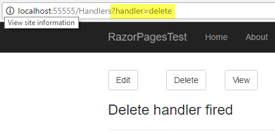

If you prefer not to have query stirng values representing the handler's name in the URL,you can use routing to add an optional route value for "handler" as part of the route template in the @page directive:

`@page "{handler?}"`

The name of the handler is then appended to the URL:

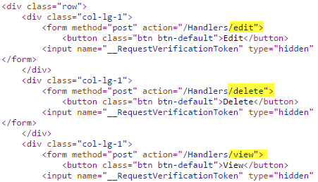

##### Parameters in Handler Methods

Handler methods can be designed to accept parameters:

```csharp
public void OnPostView(int id)
{
    Message = $"View handler fired for {id}";
}
```

In a POST handler,the parameter name must match a form field name for the incoming value to be automatically bound to the parameter:

```html
<div class="col-lg-1">
    <form asp-page-handler="view" method="post">
        <button class="btn btn-default">View</button>
        <input type="hidden" name="id" value="3" />
    </form>
</div>
```


Alternatively,you can use the form tag helper's asp-route attribute to pass parameter values as part of the URL,either as a query string value or as route data for GET requests:

```html
<form asp-page-handler="delete" asp-route-id="10" method="post">
    <button class="btn btn-default">Delete</button>
</form>
```

You append the name of the parameter to the asp-route attribute (in this case "id") and then provide a value.This will result in the parameter being passed as a query string value:


Or you can extend the route template for the page to account for an optional parameter:

`@page "{handler?}/{id?}"`

This results in the parameter value being added as a separate segment in the URL:


##### Handing Multiple Actions For The Same Form

Some forms need to be designed to cater for more than one possible action.Where this is the case,you can either write some conditional code to determine which action should be taken,or you can write separate named handler methods and then use the form action tag helper to specify the handler method to execute on submission of the form:

```html
<form method="post">
    <button asp-page-handler="Register">Register Now</button>
    <button asp-page-handler="RequestInfo">Request Info</button>
</form>
```

The value passed to the page-handler attribute is the name of the handler method without the OnPost prefix or Async suffix:

```csharp
public async Task<IActionResult> OnPostRegisterAsync()
{
    //...
    return RedirectToPage();
}

public async Task<IActionResult> OnPostRequestInfo()
{
    //...
    return RedirectToPage();
}

```

##### The NonHandler Attribute

There may be occasions where you don't want a public method on a page to be considered as a handler method,despite its name matching the conventions for handler method discovery.You can use the NonHandler attribute to specify that the decorated method is not a page handler method:

```csharp
[NonHandler]
public void OnGetFoo()
{
    //...
}
```

##### Working With ViewData in Razor Pages

ViewData is a container for data to be passed from the PageModel to the content page.ViewData is a dictionary of objects with a string-based key.You add items to ViewData as follows:

```csharp
public class IndexModel : PageModel
{
    public void OnGet()
    {
        ViewData["MyNumber"] = 42;
        ViewData["MyString"] = "Hello World";
        ViewData["MyComplexObject"] = new Book { 
                                    Title = "Sum Of All Fears",  
                                    Author = new Author { Name = "Tom Clancy" },
                                    Price = 5.99m
                                    };
    }
}
```

The ViewData dictionary is automatically made available to the content page.Therefore,in order to reference values stored in it,you just refer to their item by key:

```html
@page
@model IndexModel
@{

}

<h2>@ViewData["MyString"]</h2>
<p>The answer to everything is @ViewData["MyNumber"]</p>
```

When working with non-string values,you need to cast them to their correct type in the content page:

```html
@page
@model IndexModel
@{
    var book = (Book)ViewData["MyComplexObject"];
}
<h2>@book.Title</h2>
<p>@book.Author.Name</p>
<p>@book.Price</p>
```

You don't need to cast if you only want to render the value,and the ToString() method renders the value that you want.

##### ViewData Attribute

The ViewData attribute was introduced in ASP.NET Core 2.1.PageModel properties decorated with this attribute are automatically added as keys to the ViewData dictionary along with any value that has been assigned to them.In the following example,the Message property has been automatically added to ViewData:

```csharp
public class IndexModel:PageModel
{
    [ViewData]
    public string Message{get;set;}
    public void OnGet()
    {
        Message = "Hello world";
    }
}

```

Now the Message property can be accessed in the view via the Model property or the ViewData dictionary:

```html
@page
@model IndexModel
@{

}

<h2>@Model.Message</h2>
<h2>@ViewData["Message"]</h2>
```

You should prefer to access properties of the Model in a content page because you benefit from strong typing: IntelliSense and compile-time checking.So why should you use the ViewData attribute on model properties?The real benefit of this feature comes when working with layout pages.ViewData is shared with the layout page (and any partial pages called by the content page or the layout),so the attribute makes it easy to pass typed data from the PageModel to the layout page or partials without having to explicitly assign it to the ViewData dictionary.

Building on the previous example,the following snippet is a partial named __HelloWorldPartial:

`<p>@ViewData["Message"] from the Hello World partial</p>`

This is called from within the layout page using the partial tag helper:

`<partial name="_HelloWorldPartial" />`

The PageModel Message property was set in the OnGet handler and assigned to ViewData via the attribute,which ensures that it is passed from content page to layout to partial where it is rendered:


##### ViewBag In Razor Pages

ViewBag is a wrapper around the ViewData dictionary and provides an alternative way to access ViewData contents within ASP.NET Core MVC controllers using dynamic properties instead of string-based indexes.A design decision was made NOT to include a ViewBag property in the Razor Pages PageModel class,but you can use ViewBag to reference ViewData entries from within a Razor content page or layout page:

```html
@page
@model IndexModel
@{
    ViewBag.Title = "My Home Page";
}
```

You can access this within the layout page either via ViewBag or ViewData:

`<title>@ViewBag.Title</title>`
`<title>@ViewData["Title"]</title>`

Either approach will render "My Home Page" within the title element.As to which approach you use,the ViewBag syntax is slightly more terse and does not require you to cast non-string values,but you should bear in mind the reason that ViewBag was not included in the PageModel class in the first place:

> Damian Edwards from the ASP.NET Core team
>
> ViewBag uses dynamic which in our testing introductes a measurable performance impact on the processing of pages or views that use it.

##### Action Results in Razor Pages

Action results in Razor Pages are commonly used as the return type of handler methods and are responsible for generating response and appropriate status codes.Action results implement either the abstract Microsoft.AspNetCore.Mvc.ActionResult class,or the Microsoft.AspNetCore.Mvc.IActionResult interface.ASP.NET Core includes more that three dozen ActionResult classes covering a wide range of needs,including but not limited to executing and returning the content of a Razor page (PageResult),returning the content of a file (FileResult),redirecting to another resource (e.g.RedirectResult) or simply returning a specific HTTP status code (e.g. NotFoundResult,OkResult).It is also possible to author your own ActionResult classes if you need something bespoke.

> **Note**
>
> Handler methods that return void or Task implicitly return a PageResult for the current page.If you don't intend to execute the current page as part of a handler method,you should explicitly return a suitable action result,for example OkResult;

The following code illustrates the use of the RedirectToPageResult class in a simple OnGet handler method,which results in the user being redirected to the specified page:

```csharp
public IActionResult OnGet()
{
    return new RedirectToPageResult("Index");
}
```

The OnGet handler method has a return type of IActionResult,which means that the return type can be any class that implements the IActionResult interface somewhere in its inheritance hierarchy.Ultimately,this means any action result in the entire framework.Generally,it is a good idea to be as specific as possible with handler method return types,so this example should be refactored as follows:

```csharp
public RedirectToPageResult OnGet()
{
    return new RedirectToPageResult("Index");
}

```

If your handler method returns more than one type of action result depending on conditions,you will need to broaden the return type of method to ActionResult or IActionResult as this example demonstrates,which returns a PageResult if the ModelState is not valid,or a RedirectToPageResult (a different type) if ModelState is valid:

```csharp
public IActionResult OnPost()
{
    if(!ModelState.IsValid)
    {
        return new PageResult();
    }

    //otherwise do some processing

    return new RedirectToPageResult("Index");
}
```

Many action results have associated helper methods defined on the Razor Pages PageModel class that negate the need to "new up" instances of ActionResult classes and thereby help simplify code.The Page() method returns a PageResult,and the RedirectToPage method returns a RedirectToPageResult,so the previous example can be simplified using those methods:

```csharp
public IActionResult OnPost()
{
    if(!ModelState.IsValid)
    {
        return Page();
    }
    //otherwise do some processing
    return RedirectToPage("Index");
}
```

The following table lists ActionResult classes that are intended to be used in Razor Pages development,along with any HTTP status codes they return,and associated helper methods,if they exist.

|ActionResult|Helper|HTTP Status Code|Description|
|----|----|----|----|
|BadRequestResult|BadRequest|400|Indicates that the server refuses or is unable to process the request because of a perceived client error.Used in request verification.|
|ChallengeResult|Challenge|401|Used in authentication.You will return a ChallengeResult if the user has not authenticated successfully.It returns a 401 (Unauthorized) HTTP status code.|
|ContentResult|Content|200|Takes a string and returns it with a text/plain content-type header by default.Overloads enable you to specify the content-type to return other formats such as text/html or application/json,for example.|
|EmptyResult||200|This action Result type can be used to denote that a server-side operation completed successfully where there is no return value.|
|FileContentResult|File|200|Returns a file from a byte array,stream or virtual path.|
|FileStreamResult||200|Returns a file from a stream|
|ForbidResult|Forbid|403|Used in authentication.The Forbid method returns a 403 (Forbidden) HTTP status code.|
|LocalRedirectResult|LocalRedirect<br>LocalRedirectPermanent<br>LocalRedirectPreserveMethod<br>LocalRedirectPreserveMethodPermanent|302<br>301<br>307<br>308|Redirects the user to the location within the current site specified by the relative url^1^|
|NotFoundResult|NotFound|404|Returns an HTTP 404 (Not Found) status code indicating that the requested resource could not be found.|
|PageResult|Page|200|Will process and return the result of the current page.|
|PartialResult|Partial^3^|200|Returns a Partial Page|
|PhysicalFileResult|PhysicalFile|200|Returns a file from the specified physical path.|
|RedirectResult|Redirect<br>RedirectPermanent<br>RedirectPreserveMethod<br>RedirectPermanentPreserveMethod|301<br>302<br>307<br>308|Redirects the user to the URL specified,with an HTTP status code dependent on the options specified.The default is a temporary redirect (302)^1^|
|RedirectToPageResult|RedirectToPagePermanent<br>RedirectToPage<br>RedirectToPagePreserveMethod<br>RedirectToPagePreserveMethodPermanent|301<br>302<br>307<br>308|Redirects the user to the specified page.^1^,^2^|
|SignInResult|||Part of Identity.Represents the result of a sign-in operation.|
|SignOutResult|||Part of Identity.Represents the result of a sign-out operation.|
|StatusCodeResult^4^|||Enables you to generate a response with your chosen HTTP Status code|
|UnauthorizedResult||401||
|ViewComponentResult||200|Returns the result of executing a ViewComponent|


**Notes**

1. The Redirect action results include options to specify that the redirect should be permanent and/or the HTTP method should be preserved across redirects.Temporary redirects are denoted by HTTP status codes 302 and 307.Permanent redirects are denoted by status codes 301 and 308.Permanent redirect instructions are usually honoured by search engines and other indexing technologies,which will replace the existing entry in their index with the new location specified in the location header that action result generates.

If you do not opt to preserve the HTTP method that the original request used,the redirected request may (and often will) use GET regardless of the method used for the original request.If you want to ensure that the original HTTP method is preserved for the subsequent request (and potentially any form values),you should use one of the options that includes PreserveMethod in their name,or specify true for the appropriate parameter in the more generic RedirectResult method.

2. The value passed in to the RedirectToPageResult methods is relative to the current page,unless it is prefixed with a forward slash (/) in which case it is relative to the Pages folder.

3. The Partial helper method is available from ASP.NET Core 2.2 onwards.

4. You might want to be able to return an HTTP status code that isn't covered by the built-in action results.For example,you might need to return a 204 No Content code from a page handler.This can be achieved with the following line:

`return new StatusCode(204);`


#### Tag Helpers

##### Tag Helpers in Razor Pages

Tag helpers are reusable components for automating the generation of HTML in Razor Pages.Tag helpers target specific HTML tags.The ASP.NET Core framework includes a number of predefined tag helpers targeting many commonly used HTML elements as well as some custom tags:

- Anchor tag helper
- Cache tag helper
- Environment tag helper
- Form Action tag helper
- Form tag helper
- Image tag helper
- Input tag helper
- Label tag helper
- Link tag helper
- Option tag helper
- Partial tag helper
- Script tag helper
- Select tag helper
- Textarea tag helper
- Validation tag helper
- Validation Summary tag helper

The Tag helpers used in Razor Pages were introduced as part of ASP.NET MVC Core and are found in the Microsoft.AspNetCore.Mvc.TagHelpers package which is included as part of the Microsoft.AspNetCore.All meta-package.It is also possible to create your own custom tag helpers to automate the generation of HTML in a limitless range of scenarios.

The following image illustrates an Anchor tag helper,which targets the HTML anchor <a> tag:

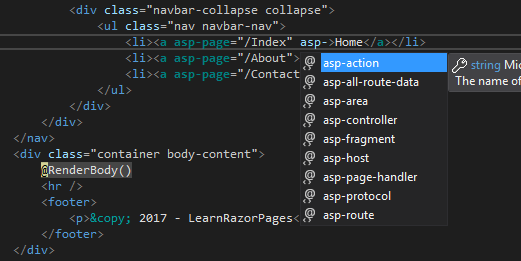

Each tag helper augments the target element with additional attributes,prefixed with asp-.In the image above,you can see that the asp-page attribute in the tag has a value applied,and additionalo attributes are shown by Intellisense (in IDEs that provide this feature).Some of the attributes are specific to Razor Pages and some are specific to MVC.Others are relevant to both development platforms.

##### Enabling Tag Helpers

Tag helpers are an opt-in feature.They are not available to the page by default.They are enabled by adding an @addTagHelper directive to the page,or more usually to a _ViewImports.cshtml file:

`@addTagHelper *,Microsoft.AspNetCore.Mvc.TagHelpers`

The @addTagHelper directive is followed by a wildcard character (*) to specify that all tag helpers found in the specified assembly should be used,and then the name of the assembly containing the tag helpers is provided.The name of the assembly is the name of your Razor Pages project in most cases,unless you are defining your tag helpers in a separate project.If you want to enable tag helpers defined in this site,which has a .csproj file named LearnRazorPages.csproj,you would do so like this:

`@addTagHelper *,LearnRazorPages`

> :information_source:Note:The value provided to the @addTagHelper directive is not enclosed in quotes.This requirement was removed when ASP.NET Core was at Release Candidate 2.However,if you prefer,you can still surround values in quotes:
>
> `@addTagHelper "*,Microsoft.AspNetCore.Mvc.TagHelpers"`

##### Selective tag processing

Once a tag helper has been enabled,it will process every instance of the tag that it targets.That may not be desirable,especially so where tags don't feature special attributes that need to be processed.It is possible to opt in or out of tag processing selectively.You can use the @addTagHelper and @removeTagHelper directives to opt in or opt out of processing all tags of a certain type.Rather than pass the wildcard character to the @addTagHelper directive,you can pass the name(s) of the tag helpers that you want to enable:

`@addTagHelper "Microsoft.AspNetCore.Mvc.TagHelpers.AnchorTagHelper,Microsoft.AspNetCore.Mvc.TagHelpers"`

The only tag helper that is enabled in the previous snippet is the AnchorTagHelper.This approach is suitable if you only want to enable a small selection of tag helpers.If you want to enable most of the tag helpers in a library,you can use the @removeTagHelper directive to filter out tag helpers having enabled all of them.Here's how you would disable the AnchorTagHelper using this method:

`@addTagHelper "*,Microsoft.AspNetCore.Mvc.TagHelpers"`
`@removeTagHelper "Microsoft.AspNetCore.Mvc.TagHelpers.AnchorTagHelper,Microsoft.AspNetCore.Mvc.TagHelpers"`

You can opt individual tags out of processing by placing the ! prefix just prior to the tag name.The following example illustrates how that is applied to an anchor tg to prevent it being processed unnecessarily:

`<!a href="https://www.learnrazorpages.com"></!a>`

The prefix is placed in both the start and end tag.Any tag without the ! prefix will be processed by an associated tag helper.The alternative option is to opt specific tags in to processing at parse time.You achieve this by registering a custom prefix via the @tagHelperPrefix directive and then applying your chosen prefix to tags you want to take part in processing.You can register your prefix in the _ViewImports.cshtml file,where you enabled tag helper processing:

`@tagHelperPrefix x`

You can use pretty much any string you like as a prefix.Then you apply it to both the start and end tag,just like the ! prefix:

`<xa asp-page="/Index">Home</xa>`

Only those tags that feature the prefix will be processed.The image below illustrates how Visual Studio shows enabled tag helpers with a different font:


For the sake of clarity,most developers are likely to use punctuation to separate the prefix from the tag name,for example:

`@tagHelperPrefix x:`
`<x:a asp-page="/Index">Home</x:a>`

This should reduce any visual confusion especially for designers when they look at the HTML content.

##### The Anchor tag helper

The anchor tag helper targets the HTML anchor (<a>) tag which is used to generate relative links from the values passed to various custom attributes.It can also used to generate absolute URLs to external resources.

> :warning:The anchor tag helper's role is to generate an href attribute from the parameter values passed to its custom attributes.Therefore,if you try to add an href attribute to the anchor tag helper as well as values to the custom attributes,an exception will be raised:
>
>> InvalidOperationException:cannot override the 'href' attribute for <a>.An <a> with a specified 'href' must not have attributes starting with 'asp-route-' or an 'asp-action','asp-controller','asp-area','asp-route','asp-protocol','asp-host','asp-fragment','asp-page' or 'asp-page-handler' attribute.
>
> If a route cannot be matched from the values passed to the taghelper attributes,the output for the href attribute will silently fall back to an empty string.

|Attribute|Description|
|----|-----|
|action|The name of the action method on an MVC controller|
|all-route-data^1^|Multiple route parameter values|
|area|The name of the Area|
|controller|The name of the MVC controller|
|fragment^2^|The fragment in the URL|
|host|The domain|
|page^3^|The Razor page to link to|
|page-handler^4^|The Razor page handler method to invoke|
|protocol|The protocol (http,https,ftp etc)|
|route^5^|the name of the route|
|route-^6^|A single route parameter value|


##### Notes

1. If the target URL includes multiple route parameters,their values can be packaged as a Dictionary<string,string> and passed to the all-route-data parameter:

```csharp
@{
    var d = new Dictionary<string,string>
            {
                {"key1","value1"},
                {"key2","value2"}
            };
}

<a asp-all-route-data="d">Click</a>
```

If the route has parameters defined,the anchor tag helper will output the values as URL segments:' <a href="/Page/value1/value2">Click</a>'. If it doesn't,the route parameters will be appended to the URL as query string values:`<a href="/Page?key1=value&amp;key2=value2">Click</a>`.

2. The fragment is the value after a hash or pround sign (#) in a URL used to identify a named portion of a document.The "Notes" heading above has an identity value of "notes" and can be referenced in a URL using the anchor tag helper like this:

`<a asp-fragment="notes">Click</a>`

producing this HTML: `<a href="/Page#notes">Click</a>`

3. The path to the target Razor page must be provided without the file extension.The leading / specifies an absolute path.If you omit it,the framework looks for a page relative to the current one:

`<a asp-page="/page">Click</a>`

If no valid page name is specified,the tag helper will render the href attribute with an empty string.If you want to generate a link to the default page in a folder,you must still include the default page's file name:

`<a asp-page="/folder/index">Folder</a>`

This renders as `<a href="/folder">Folder</a>`

The tag helper will generate an href attribute whose value will be taken from the route template of the specified page.

4. The page handler method name will appear as a query string value unless it has been included as a route parameter for the target page.

5. Razor pages doesn't support named routes.This parameter will only be used for MVC routes.

6. The route- attribute enables you to specify the value for a single route data parameter.The parameter name is added after the hyphen.Here,the route parameter name is "key1":

`<a asp-route-key1="value">Click</a>`

This renders as 

`<a href="/Page/Value1>">Click</a>`

if the key1 parameter is defined as part of the page's route template,or `<a href="/Page/key1=value1">Click</a>` if not.

Route values specified using the singular route- attribute and multiple all-route-data attribute are additive.

```
### Ambient Route Values 
Route Data values for the current request are considered _ambient_ values in ASP.NET Core 2.1 and earlier*. This means that they do not necessarily need to be specified when generating links from the current page to another that requires the same Route Data value. For example, you may provide a page that shows the details of an order that has an `id` as a route data parameter: `"{id:int}"`. 
```

Within the Details age,you want to provide a link to an Edit page,which also accepts a route data parameter named id.There is no need to specify the asp-route-id attribute to the anchor tag helper because the ambient value from the current request context will be used by default.Therefore the following is sufficient to generate a link to /edit/3:

```
`<a asp-page="edit">Edit</a>`
In this case, you only need to specify a value for `asp-route-*` if you want to override the ambient value. 
If you override an ambient value by explicitly providing a value, all subsequent ambient values will be ignored. The template `"{pageno=1}/{sortby=Id}"` specifies two parameters, each with a default value. If you override the `pageno` value e.g. `<a asp-page="list" asp-route-pageno="2">2</a>`, the `sortby` value is omitted from the generated URL (along with any subsequent parameters) so that the generated URL is `list/2`. However, if you override the `sortby` value, the `pageno` value is retained (along with any other previous parameters).
***Note:** This behaviour changed in ASP.NET Core 2.2. Ambient route values are no longer reused when the destination page is different to the source page.
```

##### Routing Options

The anchor tag helper will generate URLs with the page name capitalised when you pass a value to the page attribute e.g.

`<a asp-page="page">Click</a>`

becomes:

`<a href="/Page">Click</a>`

You can configure RouteOptions if you  prefer the generated URL to be all lower case:

```csharp
public void ConfigureServices(IServiceCollection services)
{
    services.AddRazorPages();
    services.Configure<RouteOptions>(options=>{
        options.LowercaseUrls = true;
    });
}
```

Another option, AppendTrailingSlash will result in a trailing slash being appended to the page name in every case:

```csharp
public void ConfigureServices(IServiceCollection services)
{
    services.AddRazorPages();
    services.Configure<RouteOptions>(options=>{
        options.AppendTrailingSlash = true;
    });
}
```

With both options enabled,the resulting HTML looks like this:

`<a href="/page/">Click</a>`

##### The Cache Tag Helper

The cache tag helper enables you to cache regions of a Razor page in memory on the server.Typical uses for this helper are for View Components or partial views that require relatively expensive database or web service calls,but where the content doesn't change very often.This type of caching its primarily used to improve a website's performance.

Unlike most other tag helpers,the Cache tag helper doesn't target a standard HTML element.It targets the <cache> tag,which is not rendered to the browser and doesn't appear in the HTML source either.

> :warning:The cache tag helper uses an im-memory-based store for content.This is volatite and can be cleared unexpectedly for any number of reasons,including app pool recycling,server restarts,low memory pressure and so on.The cache tag helper is not intended to be used for reliable long term storage.

|Attribute|Description|
|----|----|
|enabled^1^|Used to specify if this tag is enabled or not|
|expires-after^2^|Specifies the period of time after which the cached item should expire|
|expires-on^3^|Specifies the time at which the cached entry should expire|
|expires-sliding^4^|The period of time after the last access that the item should expire|
|priority^5^|Specifies the CacheItemPriority value of the cached item|
|vary-by^6^|Used to specify the parameters that determine whether different versions of the same content should be cached|

##### Notes

1. The cache tag helper is enabled by default.You might want to conditionally disable it under certain circumstances.The enabled attribute facilitates this.The cached item in this example is disabled on Sundays:

`<cache enabled="DateTime.Now.DayOfWeek != DayOfWeek.Sunday">@DateTime.Now</cache>`

2. If you don't provide values for any of the expires-* attributes,your item will be cached without an expiration date,meaning that it will only expire when the memory store is cleared.The expires-after attribute takes a TimeSpan value that represents the period of time that the item should be stored in the cache.This example shows the item being stored for 1 hour:

`<cache expires-after="TimeSpan.FromHours(1)">@DateTime.Now</cache>`

3. The expires-on attribute takes a DateTimeOffset value that specifies the absolute expiry time of an item. This item is set to expire at 8:15 am on June 14th 2017 UTC:

`<cache expires-on="new DateTimeOffset(new DateTime(2017, 6, 14, 8, 15, 0))">@DateTime.Now</cache>`

4. An item can be set to expire after a specified period of inactivity. This is known as "sliding expiration". The expires-sliding attribute takes a TimeSpan value. In this example, the item is set to expire 20 minutes after the last time the page was requested:

`<cache expires-sliding="TimeSpan.FromMinutes(20)">@DateTime.Now</cache>`

As each request is made for the cached item,the expiration time is reset to 20 minutes after the request.

5. Items in the cache can have a priority applied to them, determining how they are dealt with when memory pressure results in items being cleared from the cache before their pre-ordained expiry time. The priority attribute takes a CacheItemPriority enum value that specifies the relative priority of items in the cache. The available values are

    - High
    - Low
    - Normal
    - NeverRemove

Items with High priority will be the last to be removed.Items set as NeverRemove will remain in the cache.You should exercise caution when applying NeverRemove as there is a danger of overflowing the cache with more data that it can handle.This is how to set an item with High priority:

`<cache priority="CacheItemPriority.High">@DateTime.Now</cache>`

6. You can cache multiple versions of the same content based on different criteria. The vary-by attribute provides a mechanism for you to specify the criteria to be used to determine whether to store another version of existing cached content.

The attribute has a number of preset options:
    
    - vary-by-cookie
    - vary-by-header
    - vary-by-query
    - vary-by-route
    - vary-by-user
  
##### Cookie

The values of cookies can be taken into consideration when caching different versions of content.The vary-by-cookie option takes a comma-separated string representing the names of the cookies:

`<cache vary-by-cookie="AppCookie1, AppCookie2">@DateTime.Now</cache>`

##### Header

You can store multiple versions of content based on differing request header values.Multiple headers can be applied as a comma-separated string.This example stores different versions of the cached content based on the user's preferred language:

`<cache vary-by-header="Accept-Language">@DateTime.Now</cache>`

##### Query

The vary-by-query option enables the use of query string parameters as the criteria for caching different versions.Query string parameter names are supplied in a comma-separated list:

`<cache vary-by-query="id">@DateTime.Now</cache>`

##### Route

You can have route data parameters taken into account by using the vary-by-route option.This attribute also accepts a comma-separated string of route parameter names as a value:

`<cache vary-by-route="key1, key2">@DateTime.Now</cache>`

##### User

The final built-in option enables you to specify that each user gets their own version of cached content.The vary-by-user attribute requires a bool,which should be set to true:

`<cache vary-by-user="true">@DateTime.Now</cache>`

##### String

Finally,you can provide an arbitrary string value as a parameter if you want to use a value that isn't exposed by one of the preset options:

`<cache vary-by="@Model.Id">@DateTime.Now</cache>`

You can use any combination of the vary-by attributes that you need.

##### The Environment Tag Helper

The environment tag helper supports rendering different content dependent on the current value of the ASPNETCORE_ENVIRONMENT environment variable for the application.


|Attribute|Description|
|-----|----|
|names|The name(s) of the environment(s) for which the content should be rendered|
|include|The name(s) of the environment(s) for which the content should be rendered|
|exclude|The name(s) of the environment(s) for which the content should not be rendered|

##### Notes

The most common use case for the environment tag helper is to include the full version of CSS or JavaScript files when the application is in a development stage,and the bundled and minified versions when the application is in other environments.

```xml
<environment names="development">
    <link rel="stylesheet" href="~/css/style1.css" />
    <link rel="stylesheet" href="~/css/style2.css" />
</environment>
<environment names="Staging,Test,Production">
    <link rel="stylesheet" href="~/css/style.min.css" />
</environment>
```

If an environment name is part of an exclude list,the content will not be rendered under any circumstances for that environment.Inclusion in the exclude list overrides inclusion in the include list or the names list.


##### The Formaction Tag Helper

The formaction tag helper adds a "formaction" attribute to the target element with a value generated from the parameters passed to the various custom attributes.

The formaction tag helper targets two elements:

- Button
- Input with a type attribute set to image or submit

The formaction tag helper is an example where the name of the tag helper doesn't follow the convention that matches tag helper class names with the name of the target element.

> :information_source:The formaction attribute specifies where a form is to be posted.It overrides the form's action attribute.It is new to HTML 5 and is not supported in IE 9 or earlier.

|Attribute|Description|
|----|-----|
|action|The name of the action method on an MVC controller|
|all-route-data^1^|Multiple route parameter values|
|area|The name of the MVC area|
|controller|The name of the MVC controller|
|fragment^2^|The fragment in the URL|
|host|The domain|
|page^3^|The Razor page to link to|
|page-handler^4^|The Razor page handler method to invoke|
|protocol|The protocol (http,https,ftp etc)|
|route^5^|The name of the route|
|route-^6^|A single route parameter value|

##### Notes

1. If the target URL includes multiple route parameters,their values can be packaged as a Dictionary<string,string> and passed to the all-route-data parameter:

```csharp
@{
    var d = new Dictionary<string,string>
            {
                {"key1","value1"},
                {"key2","value2"}
            };
}

<button asp-all-route-data="d">Submit</button>
```

If the route has parameters defined,the formaction tag helper will output the values as URL segments:`<button formaction="/Page/value1/value2">Submit</button>`.If it doesn't,the route parameters will be appended to the URL as query string values: `<button formaction="/Page?key1=value1&amp;key2=value2">Submit</button>`.

2. The fragment is the value after a hash or pound sign (#) in a URL used to identify a named portion  of a document.The "Notes" heading above has an identity value of "notes" and can be referenced in a URL using the formaction tag helper like this:

`<button asp-fragment="notes">Submit</button>`

producing this HTML: `<button formaction="/Page#notes">Submit</button>`.It should be noted that fragments have no influence on the submission of a form.

3. The name of the Razor page to link to must be provided without the file extension:

`<button asp-page="page">Submit</button>`

If no page name is specified,the tag helper will generate a link to the current page.

4. The page handler method name will appear as a query string value unless it has been included as a route parameter for the target page.

5. Razor pages doesn't support named routes.This parameter will only be used for MVC routes.

6. The route- parameter enables you to specify the value for a single route value.The route parameter name is added after the hyphen.Here,the route parameter name is "key1":

`<button asp-route-key1="value1">Submit</button>`

This renders as 

`<button formaction="/Page/value1">Submit</button>`

if the key parameter is defined as part of the page's route template,or `<button formaction="/Page?key1=value1">Submit</button>` if not.


#### View Components
#### Routing and URLs

##### Razor Pages Routing

Routing is the system that matches URLs to Razor pages. Like most page-centric frameworks, the primary routing system in ASP.NET Razor Pages is based on matching URLs to file paths, starting from the root Razor Pages folder, which is named Pages by default.

路由是匹配URLs到Razor Pages的系统。如大部分集中式页面框架一样，ASP.NET Razor Pages中的路由系统是基于URLs到文件路径匹配，起点为root页文件夹，默认命名为Pages。

##### How URLs are matched

When a Razor Pages application starts up, a collection of Attribute Routes(familiar to anyone who has used them in ASP.NET MVC 5 or MVC Core) is constructed, using the file and folder paths rooted in the Pages folder as the basis for each route's template.

当一个Razor Pages应用启动时，一个属性路由集合已经被建构，

The standard Razor Pages site template includes three pages in the root folder:

```
Error.cshtml
Index.cshtml
Privacy.cshtml
```
A collection of four routes are defined with the following route templates:

```
""
"Error"
"Index"
"Privacy"
```

By default, the route templates are generated by taking the virtual path of each content page and then removing the root folder name from the start and the file extension from the end.

缺省情况下，路由模板通过每个content页的虚拟目录移除开始部分的文件夹名称和文件的后缀名来生成。


Index.cshtml is considered the default document in any folder, so it has two routes defined - one for the file name without the extendsion, and one with an empty string representing the file. Therefore, you can access Index.cshtml by browsing to both http://yourdomain.com/ and http://yourdomain.com/index.

If you create a folder named Test and add a file named Index.cshtml to it, a further two routes will be defined with the following templates:

如果你创建一个文件夹，命名为Test，之后添加一个名为Index.cshtml的文件在该文件夹内，下面模板的路由将被定义：

```
"Test"
"Test/Index"
```

Both of these routes will be mapped to the same virtual path: /<root>/Test/Index.cshtml.

However, if you now add a file called Test.cshtml to the root pages folder and attempt to browse to it, an exception will be raised:

>
> AmbiguousActionException:Multiple actions matched. The following actions matched route data and had all constraints satisfied:
>
> Page: /Test/Index
> Page：/Test

As the exception message says, it is an error to have a single URL mapped to multiple actions or routes. The framework has no way of knowing which page to call. You can disambiguate between routes by adding route parameters and/or constraints to the template.

##### Areas

Areas were introduced to Razor Pages in ASP.NET Core 2.1. Routes to resources in areas have the name of the area as the first segment of the URL. In the following example, the area is named Administration.

```
Areas
    Administration
        Pages
            Index.cshtml
            Reports.cshtml
    Production
        Pages
            Index.cshtml
Pages
    Error.cshtml
    Index.cshtml
    Privacy.cshtml
```

The additional routes created for the content in the areas is as follows:

```
"Administration"
"Administration/Index"
"Administration/Reports"
"Production"
"Production/Index"
```

The names of the Areas folder and the Pages folder do not feature as part of the route template.

##### Changing the default Razor Pages root folder

you can use configuration to change the root folder for Razor pages. The following example changes the root folder from the default Pages to Content:

```csharp
builder.Services.AddRazorPages().AddRazorPagesOptions(options=>{
    options.RootDirectory = "/Content";
}   
);
```

or you can use the WithRazorPagesRoot extendsion method:

```csharp
builder.Services.AddRazorPages().WithRazorPagesRoot("/Content")`;
```

Note that you cannot change the root folder for pages located in areas.

##### Route Data

Let's say you have created a blog. You may have a page called Post.cshtml in your root pages folder in which you display the content of specific posts. You provide a series of links on your home page to individual posts, and each one includes a value in the URL to identify the specific post to retrieve from the database. You could supply this value as a query string value (www.myblog.com/post?title-my-latest-post), or you could add it as Route Data - a segment in the URL that plays no part in matching files on disk e.g. /my-latest-post in www.myblog.com/post/my-latest-post. The last segment, or parameter is an arbitrary piece of data passed in the URL. The Route Data approach is preferred for a number of reasons, among which it is more readable - especially if you have a number of parameter values - and it is more search engine - friendly.

##### Route Templates

Route Data parameters are defined in a Route Tempalte as part of the @page directive in the .cshtml file. To cator for the title value in the exmaple above, the declaration at the top of the Post.cshtml file will look like this:

```
@page "{title}"
```

The template created for this route is "Post/{title}". The {title} part of template is a placeholder that represents any value added to the URL after post/. The template definition must appear in double quotes, and the parameter must be enclosed in curly brackets or braces.

In this example, the value is required, so you cannot just browse to /post. You must provide a value in the URL to match the "title" segment, otherwise you will get a status code of 404 - Not Found. However, you can make the parameter optional by adding a ? after it:

```
@page "{title?}"
```

Or you can provide a default value for the parameter:

```
@page "{title=first post}"
```

There is no limit to the number of parameters you can add to a route, although there is a limit to the data types that you can use as route parameters. Only simple types, such as string,datetime,boolean and numeric types are supported. It is common to see blog post urls include the year, month and day of publication as well the title. A route definition that accomplishes this might appear as follows:

```
@page "{year}/{month/{day}/{title}}"
```

> :warning: **Warning**
>
> The following words are reserved for ASP.NET Core routing and should not be used as names for route or handler parameters or query string keys as they are unlikely to be bound correctly:
>
> - action
> - area
> - controller
> - handler
> - page

##### Accessing route parameter values

Route parameter values are stored in a RouteValueDictionary accessible via the RouteData.Values property. You reference values by their string-based key:

```
@RouteData.Values["title"]
```

The potential problem with this approach is that it relies on referencing values by strings, which are prone to typographical errors, resulting in runtime errors. The recommended alternative is to bind the values to properties on a PageModel. To do this, you can add a public property of a suitable data type to the page model class and a parameter to the OnGet() method with the same name and data type as the route parameter:

```csharp
public class PostModel:PageModel
{
    public string? Title{get;set;}
    public void OnGet(string title)
    {
        Title = title;
    }
}
```

You assign the parameter value to the public property, which makes it available on the Model property in the content page:

```razor
@page "{title?}"
@model PostModel
@{
}
<h2>@Model.Title</h2>
```

The key reason for recommending this approach is that you benefit from strong typing and therefore IntelliSense support in IDE's that support it:


Alternatively, you can use the [BindProperty] attribute on the PageModel property with SupportsGet set to true:

```csharp
public class PostModel:PageModel
{
    [BindProperty(SupportsGet=true)]
    public string Title {get;set;} 

    public void OnGet()
    {
        //the Title property is automatically  bound
    }
}
```

##### Adding Constraints

Constraints are an additional means of disambiguating between routes. So far, the only constraint placed on a route parameter value is its presence. You can also constraint route parameters values by data type and range. The following exmaple shows how to constrain a parameter value to an integer data type:

```razor
@page "{id:int}"
```

The `id` value is both required, and must be an integer. The next example illustrates an optional parameter, which must be a double if a value is provided:

```razor
@page "{latitude:double?}"
```

The next example shows use of the min constraint, that ensures that the value supplied is an int and that it meets a minimum value of 10000. The minimum value is supplied in parenttheses:

```razor
@page "{id:min(10000)}"

```
The final exmaple shows how to specify multiple constraints using colons:

```razor
@page "{username:alpha:minlength(5):maxlength(8)}"
```
This template specifies that the username values is required (i.e. is not optional), must be composed of a mixture of upper case and lowercase letters (no numbers or others symbols), has a minimum length of 5 characters and a maximum length of 8 characters.

The range of constraints available are extensive, but you can also create your own custom route constraints.

##### Override Routes

From ASP.NET Core 2.1 onward, you can use the template to specify an alternative route for a page that has no relationship with the file name. The override route template should start with / or ~/. For example, you may have a page located deep in the folder structure somewhere e.g. Pages/Projects/Building/SOP/Schools/Intro.cshtml that you want to surface at an much easier to remember URL: schools/sop. You do this by specifying the URL pattern in the template:

```razor
@page "/schools/sop"
```

This replaces the file-path-based URL.

You can use a similar approach to add segments to a route. This is achieved by omitting the / or ~/ from the start of the template. The following template will require the user to add /schools to the default route that is generated for the page:

```razor
@page "schools"
```

##### Register Additional Routes

The final plece in the Razor Pages routing jigsaw is based on the "Friendly URLs" feature found in ASP.NET Web Forms(another page-centric development model) which enables you to bypass the tight relationship between URL and the file path and name of the page that's being requested and create additional routes to those pages.

Additional route mappings to pages can be configured by adding options to the `RazorPageOptions.PageConventions` collection in the `ConfigureServices` method in Startup via the `AddPageRoutes` method. In this example, a physical file named Post exists in /Pages/Archive/. You want to enable users to reach it without prepending Archive to the URL, and you want to specify some route parameters. You do that as follows:

```csharp
builder.Services.AddRazorPages()
        .AddRazorPagesOptions(options=>{
            options.Conventions.AddPageRoute("/Archive/Post", "Post/{year}/{month}/{day}/{title}");
        });
```

The `AddPageRoute` method takes two parameters. The first is the relative path to the Razor page file without the extension and the second is the route template that maps to it.

Unlike Absolute Routes, friendly routes are additive, that is they do not replace existing routes. They act in a similar way to method overloads in programming. It will still be possible to reach the resource above by navigating to `/archive/post`. Consequently it is possible to add a "catchcall" friendly route without affecting routes generated from physical files. The following exmaple illustrates a route that catches any URL that doesn't map to a physical file and gets the Index.cshtml file to process the request:

```csharp
builder.Services.AddRazorPages()
    .AddRazorPagesOptions(options=>
    {
        options.Conventions.AddPageRoute("/index","{*url}");
    });
```

You might  do this, for exmaple, if your Index.cshtml file is responsible for locating and processing Markdown files based on the URL, as is the case with this site.

There is also a method for overloading routes to pages in areas: `AddAreaPageRoute`. This takes the name of the area, the name of the page, and the route template e.g.

```csharp
builder.Services.AddRazorPages()
    .AddRazorPagesOptions(
        options=>
        {
            options.Conventions.AddAreaPageRoute("Administration", "/index", "admin");
        }
    );
```

##### other Routing Options

The routing system provides some additional configuration options via properties of the `RouteOptions` object which can be accessed in the ConfigureServices method. The properties are as follows:

|Property|Type|Description|
|---|---|---|
|AppendTrailingSlash|bool|Appends a trailing slash to URLs generated by the anchor tag helper or UrlHelper. Default is false|
|ConsraintMap|IDictionary<string,Type>|Enables the registration of custom constraints via the Add method|
|LowercaseUrls|bool|URLs are generated all in lower case. The default is false|
|LowercaseQueryStrings|bool|Query strings are generated all in lower case. The default is false. Will only take effect if lowercaseUrls is also true|

Examples:

```csharp
builder.Services.Configure<RouteOptions>(
    options=>{
        options.LowercaseUrls = true;
        options.LowercaseQueryStrings = true;
        options.AppendTrailingSlash = true;
        options.ConstraintMap.Add("Custom",typeof(CustomConstraint));
    }
)；
```

##### Generating Urls

Razor Pages provides two main mechanisms for generating URLs to pages within the application, depending on where they are needed.

##### Anchor Tag Helper

The anchor tag helper is designed to be used to render anchor elements within content pages:

`<a asp-page="/Supplier" asp-route-id="2">Click</a>`

You can read more about the anchor tag helper here.

##### The LinkGenerator

The `LinkGenerator` service is available in Razor Pages 3 onwards. Registered by default with the dependency injection system, you can use the `LinkGenerator` within classes (such as PageModels) to generate URLs based on the route information provided.

There are two Razor Pages specific methods for generating URLs: `GetPathByPage` and `GetUriByPage`. The `GetPathByPage` method generates a relative URL, and the `GetUriByPage` method generates an absolute URL:

```csharp
public class LinkGeneratorDemoModel : PageModel
{
    private LinkGenerator linnkGenerator;
    public LinkGeneratorDemoModel(LinkGenerator linkGenerator)=>this.linkGenerator = linkGenerator;
    public string PathByPage{get;set;}
    public string UriByPage{get;set;}

    public void OnGet()
    {
        PathByPage = linkGenerator.GetPathByPage("/Supplier", null, new {id=2});
        UriByPage = linkGenerator.GetUriByPage(this.HttpContext, "/Supplier", null, new{id=2});
    }
}
```

##### Output

Path By Page: /supplier/2
Uri By Page : https://localhost:5001/supplier/2

**Note**: this output assumes that the option to use lower case URLS is set to true.

The `LinkGenerator` service also provides a number of methods for working with URLs related to MVC controllers.

##### Customising Route Conventions in Razor Pages

When a Razor Pages application starts up, the framework exmaples the files located in the Pages folder and generates a set of route templates based on the file path of each file, treating Index.cshtml as the default file for a folder. If  a template has been added to the `@page` directive, that is also traken into consideration and the generated template is modified accordingly.

In this way, it is possible to specify that route data values can or should be part of the URL that matches the file, or to specify that the file is located using a URL that has no relationship at all with its file path. You also have recourse to the `AddPageRoute` method in Razor Pages Options, but all of these approaches to custominsation only affect the routing to one file at a time.

##### PageRouteModel

The route tempalte information for each page is in a PageModel class. One `PageRouteModel` class is created for each navigable Razor Page at application startup. The routing information includes the file name and relative path of the Razor Page, and a collection of `SelectorModel` objects, each on containing details of the attribute route that can be used to reach a page. This information is held in an `AttributeRouteModel` object, which is where the route template is stored.

when the default routing conventions are used, one `SelectorModel` is generated for most pages. The default page (Index.cshtml) has two `SelectorModel` built - one for the "index" template and on for the empty string (""). When you use the AddPageRoute method, an  additional `SelectorModel` is added to the `PageRouteModel` containing details of the template specified in the method call.

The following diagram depicks a simplified view of the `PageRouteModel` instance that is typically built for Index.cshmtl:


##### IPageRouteModelConvention

The `IPageRouteModelConvention` interface is designed to allow customisation of the PageRouteModel to override the default conventions. The interface has one member that needs to be implemented - the `Apply()` method. It is in this method that you can access metadata about the current routing set up and modify or add to it as required.

To summaries, there are three steps to customising Razor Pages routing:

1. Create a class that implments IPageRouteModelConvention
2. Implement its Apply method
3. Register the class with Razor Page Options

Here are two examples that show how to do this. This first  example illustrates how to replace the generated route templates with new ones, so that pages are found using a different algorithm, rather than a simple match of file path to URL. The second shows how to add more route templates on top of the generated one so that users can find a page using URLs in their own language.

##### Creating A New Convention

As your Line Of Business(LOB) application grows, you are likely to have many feature - related folders in the application, each containing files named after the action that are responsible for: an Index.cshtml, and an Edit.cshtml, a Details.cshtml and so on. After a while, having multiple Index.cshtml files open in your IDE becomes confusing:


So you decide instead to create files named after the feature and the action: the Index.cshtml file in the Orders folder becomes OrdersIndex.cshtml, Edit.cshtml become OrdersEdit.cshtml and so on. However, you still want the OrdersIndex.cshtml page to act as a default page, and you want users to be able to navigate to /orders/edit, /orders/detail and so on.

the following class shows the first two steps required to implement a new routing convention:

```csharp
public class CustomPageRouteModelConvention:IPageRouteModelConvention
{
    public void Apply(PageRouteModel model)
    {
        foreach(var selector in model.Selectors.ToList())
        {
            var template = selector.AttributeRouteModel.Template;
            if(template.Contains("/"))
            {
                var segments = template.Split(new[]{'/'},StringSplitOptions.None);
                if(segments.Count() == 2)
                {
                    selector.AttributeRouteModel.Template = $"{segments[0]}/{segments[1].Replace(segments[0],string.Empty).Replace("Index",string.Empty)}".TrimEnd('/');
                }
                else
                {
                    throw new ApplicationException("Nested folders are not permitted");
                }
            }
        }
    }
}
```
The class implements the `IPageRouteConventionModel` interface and provides an implementation of the `Apply` method. This is executed for every page found by the Razor Pages framework. The method iterates the collection of `SelectModel` objects that belong to the current `PageRouteModel`, and acquires a reference to the template. If the template includes a forward slash, it belongs to a page in a sub  folder, that is, not the Pages root folder. If  that is the case, the folder name is removed from the template, so for Orders/OrdersEdit.cshtml, the template changes from "orders/ordersedit" to "orders/edit". "Index" is replace with an empty string.

In addition, if there are more than two segments in the template, an Exception is raised. We don't want any sub folders being added to the features folders.

The final step involves registering the new convention with `RazorPagesOptions`:

```csharp
public void ConfigureServices(IServiceCollection services)
{
    ...
    services.AddRazorPage().AddRazorPagesOptions(options=>{
        options.Conventions.Add(new CustomPageRouteModelConvention());
    });
}
```

##### Catering For Multiple Languages

If you are providing a web site for a global audience, you might want to provide them with couresy of friendly URLs in their language. Or you might want to do this for SEO purposes. Italians would be able to reach the contact page at domain.com/contatto. Germans could reach it at domain.com/kontact etc. You could add calls to the `MapPageRoute` method in `Startup` (see Friendly Routes). But this approach won't scale very well if you have hundreds of pages and cater for an increasing number of languages. The method calls will grow exponentially.

What you can do instead is to use the `IPageRouteConventionModel` interface to add additional patterns based  on a the contents of a database or similar. To illustrate this, here is the definition of a simple service that emulates obtaining the translations of the page names:

```csharp
public interface ILocalizationService
{
    List<LocalRoute> LocalRoutes();
}

public class LocalizationService:ILocalizationService
{
    public List<LocalRoute> LocalRoutes()
    {
        var routes = new List<localRoute>{
            new LocalRoute{
                Page = "/Pages/Contact.cshtml",
                Versions = new List<string>{"kontakt","contacto","contatto","kontakta"}
            }
        };
        return routes;
    }
}

public class LocalRoute
{
    public string Page { get; set;}
    public List<string> Versions {get;set;}   
}
```

And here is how that service is consumed within a `PageRouteModelConvention` class:

```csharp
public class LocalizedPageRouteModelConvention: IPageRouteModelConvention
{
    private ILocalizationService _localizationService;

    public LocalizedPageRouteModelConvention(ILocalizationService localizationService)
    {
        _localizationService = localizationService;
    }

    public void Apply(PageRouteModel model)
    {
        var route = _localizationService.LocalRoutes().FirstOrDefault(p => p.Page == model.RelativePath);
        if (route != null)
        {
            foreach (var option in route.Versions)
            {
                model.Selectors.Add(new SelectorModel()
                {
                    AttributeRouteModel = new AttributeRouteModel
                    {
                        Template = option
                    }
                });
            }
        }
    }
}
```

This convention also needs to be registered in `Startup`, along with the service:

public void CoinfigureServices(IServiceCollection services)
{
    ...
    services.AddRazorPages().AddRazorPagesOptions(options=>{
      options.Conventions.Add(new LocalizedPageRouteModelConvention());  
    });
    services.AddTransient<ILocalizationService,LocalizationService>();
}

Now an individual page can be reached by any number of registered languages:


#### Application Startup

##### Configuring a Razor Pages application

> :warning: This section applies to configuring Razor Pages applications from .NET 6 onwards. If you are interested in app configuration in earlier versions of .NET, please refer to the section on Startup.

Configuring a Razor Pages application involves managing three aspects of the application:

- Services
- Routing
- Request Pipeline

The code within the Program.cs file is responsible for configuring, or bootstrapping an ASP.NET Core web application and starting it. In .NET 5 and earlier, this code was split across two separate files. Much of the application configuration was delegated to a separate class named Startup.cs. With the release of .NET 6, the developers behind ASP.NET have tried to reduce the amount of complexity that used to exist in basic application configuration. Rather than have code across two files, they have consolidated it into one file, taken advantage of some new C# features to further reduce the boilerplate, and then introduced what they refer to as a minimal hosting API to reduce to a minimum the code required to bootstrap and run a Razor Pages application.

The result is thirteen actual lines of code in a single file. It was nearer eighty in previous versions of Razor Pages, spread across the two files.

Program.cs provides the entry point to a .NET console application. By convention, it houses a static Main method that contains logic for executing the application. The Program.cs file in Razor Pages from .NET 6 onward is no different, except that there is no Main method visible. The project template utilizes some newer C# language features introduced in C# 10, one of which is top-level statements. This feature enables the omission of the class declaration and Main method in Program.cs. The compiler will generate the class and Main method and call any executable code you add to the file within the Main method.

The first line of code in Program.cs creates a WebApplicationBuilder:

```csharp
var builder = WebApplicationBuilder.CreateBuilder(args);
```

Remember that this code will be executed within the compiler-generated Main method, so the args passed into the CreateBuilder method are the standard args passed into the Main method of any C# console application by whatever process invokes tha application and are optional.

The WebApplicationBuilder is new in .NET 6 and forms part of the mininal hosting API together with another new type - the WebApplication. The WebApplicationBuilder has several properties, each on enabling configuration of various aspects of the application:

- Environment = provides information about the web hosting environment the application is running in.
- Services - represents the application's service container
- Configuration - enabling logging configuration via the ILoggingBuilder
- Host - supports configuration of application host specific services including third party DI containers
- WebHost - enables web server configuration

The application host is responsible for bootstrapping the application, starting it up and shutting it down. The term bootstrapping refers to the initial configuration of the application itself. This configuration includes:

- Setting the content root path, which is the absolute path to the directory that contains the application content files
- Loading configuration information from any values passed in to the args parameter, appsettings files and environment variables
- Configuring logging providers

All .NET applications are configured in this way, whether they are web applications, services or console applications. On top of that, a web server is configured for web applciations. The web server is configured through the WebHost property which represents and implementation of the IWebHostBuilder type. The default web server is a lightweight and extremely fast web server named Kestrel. The Kestrel server is incorporated within the application. The IWebHostBuilder also configures host filtering and integration with Internet Information Services (IIS)，the Windows web server.

The IWebHostBuilder object exposes several extension methods that enable further configuration of the application. For example, you can configure an alternative to the wwwroot folder as the web root path, if you really had a good reason to. Here, the content folder is configured as a replacement for wwwroot.

```csharp
builder.WebHost.UseWebRoot("content");
```

The Services property provides the entry point to the dependency injection container, which is a centrallized  place for application services. The default template includes the following line of code, which makes the essential services that the Razor Pages infrastructure relies upon available to the application:

```csharp
builder.Services.AddRazorPages();
```

Those services include the Razor view engine, model binding, request verification, tag helpers, memory cache and ViewData.

Sometimes these services will be parts of the framework that you choose to enable (like the Razor Pages example), and sometimes they represent services that you install as separate packages. Often, they will be services that you write yourself that hold the application logic, like getting and saving data.

The build method returns the configured application as an instance of the WebApplication type.

```csharp
var app = builder.Build();
```

The WebApplication type represents a merger of three other types:

- IApplicationBuilder - through which you configure the application's request, or middleware pipeline.
- IEndpointRouteBuilder - enables you to configure how incoming requests are mapped to specific pages
- IHost - provides the means to start and stop the application

The WebApplication enables you to register middleware components to build and configure the application's request pipeline. Here is the default request pipeline:

```csharp
if(!app.Environment.IsDevelopment())
{
    app.UseExceptionHandler("/Error");
    app.UseHsts();
}

app.UseHttpRedirection();
app.UseStaticFiles();
app.UseRouting();
app.UseAuthorization();
app.MapRazorPages();
app.Run();
```

Each middleware is added to the pipeline via an extension method on the IApplicationBuilder type which is implemented by WebApplication. An IWebHostEnvironment is accessible via the Environment property, which holds information about the current environment. This property is used to determine whether the application is currently running in Devlopment mode, and if so, the UseExceptionHandler method is called that adds middleware for catching errors and displaying details of them in the browser. Otherwise, the error page in the Pages folder is used to display a bland message that conceals any in sensitive information about the specifics of the error to the user, such as database connectyion strings containing user credentials, or information about file paths on the server. Middleware that adds an HTTP Strict Transport Security header is also registered(app.UseHsts()), but only if the application is not running in Development mode. This header tells the browser to only use HTTPS when accessing the website.

The UseHttpsRedirection method adds middleware that ensures that any HTTP requests are redirected to HTTPS. Following this, the static middleware is registered. By default, an ASP.NET Core application doesn't support serving static files such as images, stylesheets, and script files. you have to opt in to this feature, and you do so by adding the static files middleware. This middleware configures the wwwroot folder to allow static files to be requested directly and serves them to the client.

Routing middleware is responsible for selecting which endpoint should be executed, based on information included in the request. Then authorization middleware is registered, which is responsible for determining if the current user is authorized to access the resource that is being requested.

Finally, the MapRazorPages method adds middleware to the pipeline that initially configures Razor Pages as endpoints. This middleware is also responsible thereafter for executing the request.

#### Configuration

##### Configuration in Razor Pages

ASP.NET Core includes an API for managing configuration settings needed by the application which includes a number of providers for retrieving data in a variety of different formats.

Configuration is set up as part of the WebHost.CreateDefaultBuilder method called in Program.cs, the entry point to the application. Various key/value stores are added to configuration by default:

- appsettings.json (and another version named after the current environment e.g. appsettings.Development.json)
- User Secrets (if the environment is Development)
- Environment variables
- Command line arguments

You can add other stores such as XML files, .ini files and so on if required. Configuration is added to the Dependency Injection system and is accessible throughout the application via an IConfiguration object.

###### AppSettings.json

The vast majority of applications are likely to only ever use an appsettings.json file for their configuration needs. Each configuration setting is stored in its own section. The default appsettings.json file includes a section that configures logging for the application:

```json
{
    "Logging":{
        "IncludeScopes": false,
        "Loglevel": {
            "Default": "Warning"
        }
    }
}
```

The next exmaple configures logging and a connection string to a SQLite database:

```json
{
    "ConnectionStrings":{
        "DefaultConnection":"Data Source=app.db"
    },
    "Logging":{
        "IncludeScopes":false,
        "Loglevel":{
            "Default":"Warning"
        }
    }
}
```

###### Working with Custom Settings

Custom settings provide the easiest way to extend the application configuration. The use of JSON as a storage format enables you to store complex information easily.

You can provide any name you like to custom sections of the appsettings.json file. In the example below, some values are stored in a section which has been creatively named AppSettings:

```json
"AppSettings":{
    "First":"value 1",
    "Second":"value 2",
    "Car":{
        "NumberOfDoors":5,
        "RegistrationDate":"2017-01-01T00:00:00.000Z",
        "Color":"Black"
    }
}
```

###### Accessing Configuration Settings Programmatically

The IConfiguration object enables you to access configuration settings in a variety of ways once it has been injected into your PageModel's constructor. You need to add a using directive for Microsoft.Extensions.Configuration to the PageModel class file.The first example illustrates how to reference a value using a string-based approach. The section is specified and subsequent properties are referenced by separating them with colons(:)

```csharp
private readonly IConfiguration _configuration;

public IndexModel(IConfiguration configuration)
{
    _configuration = configuration;
}

public void OnGet()
{
    ViewData["config"] = _configuration["AppSettings:First"];
}
```

This approach, as with all APIs that rely on strings is error-prone. You are a typing mistake away from a NullReferenceException at runtime.

###### Connection Strings

The Configuration class includes a convenience method for retrieving connection strings: GetConnectionString. You pass it the name of the connection that you want to retrieve:

```csharp
var connString = Configuration.GetConnectionStrings("DefaultConnection");
```

###### Strongly Typed AppSettings

A more robust approach can be achieved by using the Configuration system's built-in capability to bind settings to a C# object. The following code is a C# representation of the object represented in the JSON above:

```csharp
public class AppSettings
{
    public string First {get;set;}
    public string Second { get;set;}
    public Car Car {get;set;}
}

public class Car
{
    public int NumberOfDoors {get;set;}
    public DateTime  RegistrationDate { get;set;}
    public string Color {get;set;}
}
```

And this is how you can use the IConfiguration.GetSection method to bind the content of appsettings.json to and instance of AppSettings:

```csharp
private readonly IConfiguration _configuration;
public IndexModel(IConfiguration configuration)
{
    _configuration = configuration;
}

public void OnGet()
{
    var Settings = _configuration.GetSection("AppSettings").Get<AppSettings>();
    ViewData["RegistrationDate"] = settings.Car.RegistrationDate;
}
```

###### Using The Options Pattern

The Options pattern works in a similar way to the previous approach in that it enables working with strongly typed configuration values and relies on the Configuration system's built-in capability to bind settings to C# objects. The Options pattern is intended to be used to group related configuration values together in individual classes.

The following example shows a simple appsettings.json file：

```csharp
{
    "Logging":{
        "LogLevel":{
            "Default":"Warning"
        }
    },
    "AllowedHosts":"*",
    "Title":"My Great Site",
    "Author":{
        "FirstName":"Mike",
        "LastName":"Brind"
    },
    "EmailFrom":"comments@mygreatesite.com",
    "EmaildisplayName":"Site Comments",
    "EmailSmtp":"localhost"
}
```

One set of related configuration settings are the Title and the Author. These are represented in the MetaOptions class (along with the definition of the Author class):

```csharp
public class MetaOptions
{
    public string Title{get;set;}
    public Author Author{get;set;}
}

public class Author
{
    public string FirstName{get;set;}
    public string LastName{get;set;}
}
```

The second group of related configuration values concern email settings for the site and are represented by the EmailOptions class:

```csharp
public class EmailOptions
{
    public string EmailFrom {get;set;}
    public string EmailDisplayName {get;set;}
    public string EmailSmtp{get;set;}
}
```
The following lines of code are all that is needed to bind values from appsettings.json to both of the configuration classes and to make them available as a service:

```csharp
public void ConfigureServices(IServiceCollection services)
{
    services.Configure<MetaOptions>(Configuration);
    services.Configure<EmailOptions>(Configuration);
}
```

Now the configuration can be injected into PageModel constructors using the IOptions<TOptions> interface.You will need to add a using directive for Microsoft.Extensions.Options at the top of the PageModel class file:

```csharp
using Microsoft.Extensions.Options;

public class IndexModel:PageModel
{
    private readonly MetaOptions _options;

    public IndexModel(IOptions<MetaOptions> options)
    {
        _options = options.Value;
    }

    public string Title {get;set;}
    public Author Author {get;set;}

    public void OnGet()
    {
        Title = _options.Title;
        Author = _options.Author;
    }
}
```

Note that the value property of IOptions<TOptions> is accessed in the constructor to get at the actual configuration values.

Alternatively, if for example you wanted to use the configuration values in a layout file, you can use the @inject directive:

```csharp
@inject Microsoft.Extensions.Options.IOptions<MetaOptions> metaOptions
@{
    var options = metaOptions.Value;
}

<!DOCTYPE html>
<html>
<head>
    <meta charset="utf-8" />
    <meta name="viewport" content="width=device-width,initial-scale=1.0" />
      <meta name="author" content="@options.Author.FirstName @options.Author.LastName"/>
    <title>@options.Title</title>
```

The resulting HTML renders as follows:

```html
<!DOCTYPE html>
<html>
    <head>
        <meta charset="utf-8" />
        <meta name="viewport" content="width=device-width, initial-scale=1.0" />
        <meta name="author" content="Mike Brind"/>
        <title>My Great Site</title>
```
###### Global Error Handing And Logging In Razor Pages

Exceptions in .NET represent an error condition in an executing program. Error conditions can come about as a result of a large number of causes, each represented by its own exeception type. Most execptions arise from logical errors in code, such as an attempt to work with an object that has not been instantiated(NullReferenceException), or to divide by zero(DivideByZeroException). Other types of exceptions result from technical issues, which may or may not be temporary. Other types of exceptions result from technical issues, which may or may not be temporary. Examples of such issues might include a database or mail server being unavailable, or insufficient file system permissions.

The recommendation is that you should try to minimise the impact of exceptions(otherwise known as handling them) by coding defensively rather than allowing them to crash your application.Options include wrapping code that might raise exceptions in try-catch blocks, and validating user input instead of assuming that it conforms to expectations.Despite your best efforts, however, chances are that even in a moderarately complex application, there will be something that you overlooked that will go wrong.

###### Default Exception Handling

The standard project template for a Razor Page site includes code that configures global exception handling middleware which is responsible for capturing any unhandled exception and dealing with it:

```csharp
public void Configure(IApplicationBuilder app, IHostingEnvironment env)
{
    if(env.IsDevelopment())
    {
        app.UseDeveloperExceptionPage();
    }
    else
    {
        app.UseExceptionHandler("/Error");
    }
}
```

This strategy offers three benefits:

1. It provides one  central place to configure exception handling.
2. It reduces the amount of try-catch blocks that you need to sprinkle throughout the application.
3. It enables you to handle exceptions in a different way, depending on the environment.

When you are running the site in development, the application is configured to use the Developer Exception Page, which is designed  to output as much detail about the exception as possible to make it easier to diagnose the root cause:


The middleware captures unhandled exceptions within the processing pipeline and ensures that the correct HTTP status code is returned along with the HTML output above.

This information is very usefull during the development phase of a web site, but it should not be displayed once the site has gone live. Apart from the fact that it is pretty unfriendly from a user's point of view, the details revealed here might prove helpful to someone whose intentions are not honourable.

So the default site is configured to use ExceptionHandlerMiddleware in all other environments. This is registered in Startup by the UseExceptionHandler method, which takes the relative path to a page that should be executed in the event that an unhandled exception occurs while the application is running:


This page (Error.cshtml) forms part of the standard template and is fully customisable.

###### Logging Error Details

Now that the applicaiton reacts appropriately when an exception occurs, you need to be able to review the details of any exception so that you can implement strategies to prevent it happening in future, or to handle it more gracefully where possible. So you need to be able to log as much information about the exception as possible.

Logging is included as part of the ASP.NET Core framework with a number of built-in logging providers. The simplest way to collect and store logs is in a file, but, none of the built-in providers enable this (at the moment). Therefore you will need to rely on a third party logging componment. There are several good, free and open source ones that work with .NET Core，With NLog probably being one of the best known.

###### Installing and Configuring NLog

NLog is available as a Nuget package and can be installed via the Package Manager Console in Visual Studio using the following commands:

```shell
install-package NLog
install-package NLog.Web.AspNetCore
```

Alternatively, if you are using Visual Studio Code, you can use the `dotnet` CLI to install the required packages:

```shell
dotnet add package NLog
dotnet add Package NLog.Web.AspNetCore
```
Once installed, you need to configure options for NLog. You can do this in two ways: you can provide configuration in an xml-based file, or you can use the configuration API to set the configuration programmatically.

###### Using A Config File

First, create a file named nlog.config in the root folder of your application. Then add the following to it:

```xml
<?xml version="1.0" encoding="utf-8" ?>
<nlog xmlns="http://www.nlog-project.org/schemas/NLog.xsd"
      xmlns:xsi="http://www.w3.org/2001/XMLSchema-instance"
      autoReload="true">
  <extensions>
    <add assembly="NLog.Web.AspNetCore"/>
  </extensions>
  <targets>
    <target xsi:type="File" name="myLogFile" fileName="c:\logs\mylog-${shortdate}.log"
            layout="${longdate}|${event-properties:item=EventId_Id}|${uppercase:${level}}|${logger}|${message} ${exception:format=tostring}" />
  </targets>
  <rules>
    <logger name="*" minlevel="Warn" writeTo="myLogFile" />
  </rules>
</nlog>
```

NLog works with targets and rules. A target is the destination for logging output. NLog supports a huge number of targets, but the one that we are using is File. The file name and the layout of the log are specified using templates composed from layout renderers.

Rule affect loggers. The simple one added above specifies that all loggers in the application should write to the target named myLogFile, but only if the log level is WARN or above. Log levels are (in ascending order of severity):

- TRACE
- DEBUG
- INFO
- WARN
- ERROR
- FATAL

Finally, the logging configuration is registered in the Main method, and logging is configured as part of the CreateWebHostBuilder method call:

```csharp
using System;
using System.Collections.Generic;
using System.IO;
using System.Linq;
using System.Threading.Tasks;
using Microsoft.AspNetCore;
using Microsoft.AspNetCore.Hosting;
using Microsoft.Extensions.Configuration;
using Microsoft.Extensions.Logging;
using NLog.Web;

namespace  ErrorHandling
{
    public class Program
    {
        public static void Main(string[] args)
        {
            var logger = NLog.Web.NLogBuilder.ConfigureNLog("nlog.config").GetCurrentClassLogger();
            CreateWebHostBuilder(args).Build().Run();
        }

        public static IWebHostBuilder CreateWebHostBuilder(string[] args)=>{
            WebHost.CreateDefaultBuilder(args)
            .UseStartup<Startup>()
            .ConfigureLogging(logging=>{
                logging.ClearProviders();
                logging.SetMinimumlevel(Microsoft.Extensions.Logging.LogLevel.Trace);
            })
            .UseNLog();   
        }
    }
}
```

If you prefer to use the configuration API, the equivalent configuration is created using the following code within  the Main method:

```csharp
public static void Main(string[] args)
{
    var config = new LoggingConfiguration();

    //targets

    var fileTarget = new FileTarget("fileTarget")
    {
        FileName = @"c:\logs\mylog-${shortdate}.log",
        Layout = "${longdate}|${event-properties:item=EventId_Id}|${uppercase:${level}}|${logger}|${message} ${exception:format=tostring}"
    };

    config.AddTarget(fileTarget);

    //rules
    config.AddRuleForOneLevel(NLog.LogLevel.Warn, fileTarget);
    config.AddRuleForOneLevel(NLog.LogLevel.Error, fileTarget);
    config.AddRuleForOneLevel(NLog.LogLevel.Fatal, fileTarget);
    LogManager.Configuration = config;
    CreateWebHostBuilder(args).Build().Run();
}
```

Now when you encounter an exception, details will be written to the specified log file. The file name template includes the ${shortdate} renderer, which ensures that a new log file will be created each day.


##### Configuring a custom error page

When a visitor tries to request a page on your site that doesn't exist, or an unhandled exception occurs while executing server-side code the web server returns an HTTP status code to the browser indicating that an error occurred. As a site developer, you have two choices when this happens: you can either let the browser show its default notification page;


or you can take control and choose to display your own message.

##### Status Code Pages Middleware

The ASP.NET team have included middleware for managing HTTP errors in the 400 and 500 ranges. It is called StatusCodePagesMiddleware, and is found in the Microsoft.AspNetCore.Diagnostics package.

There are a number of extension methods for registering StatusCodePagesMiddleware as part of the pipeline in the Configure method of the Startup class. The most basic usage is as follows;

```csharp
app.UseStatusCodePages();
```

When an error occurs within the specified range, this usage results in a plain text response with a default message;


Overloads of the UseStatusCodePages method are available to provide some more control over how your application responds to errors, including one that enables you to set the content type and body of the response;

```csharp
app.UseStatusCodePages("text/html","<h1>Error! Status code {0}</h1>");
```


However, there are a couple of other extension methods that simplify things a lot more. These are UseStatusCodePagesWithRedirects and UseStatusCodePagesWithReExecute. Both of these make use of a page that you create to generate the response, so you have full control over its content. The following example is a simple Razor page designed to let the visitor know that the page they requested does not exist:

```csharp
@page
@{
    ViewData["Title"] = "No such page";
}

<h1> 404 Not found</h1>
<p> No such page exists at this location.</p>
```

This code is in a file named 404.cshtml and is placed in a folder within the Pages folder named Errors.

The UseStatusCodePagesWithRedirects method takes a string representing the location of the custom error page, which can also include a placeholder {0} which will be filled by the status code:

```csharp
app.UseStatusCodePagesWithRedirects("/errors/{0}");
```
When an error occurs, the user is redirected to the specified location, in this case - once the placeholder is populated by the middleware- /errors/404.

The UseStatusCodePagesWithReExecute method re-executes the request pipeline using an alternate path (page), and also takes a string with a placeholder:

```csharp
app.UseStatusCodePagesWithReExecute("/errors/{0}");
```

##### To Redirect or Re-execute?

From a user's point of view, it makes little difference which method you use. Both will result in the page that you specify being displayed. The only visible difference will be the URL displayed in the browser. The WithRedirects method results in a different URL appearing in the browser address bar than the one that was requested.

This is the Network output in Chrome for a request to a nonexistent page;


The initial request to /nonexistent-page resulted in a 302 status code and a location header with the value /errors/404, causing the browser to issue a new request. This request was successful, signified by the 200 status code. Now the browser features the address of the error page instead of the one that was initially requested:


With the WithReExecute option, the original HTTP status code is preserved as is the URL in the browser address bar.


but the response comes from the alternative location that  you specify:


The WithReExecute option wins based on the fact that the visitor can check the browser address bar to see if there are any obvious mistakes in the URL that they provided or followed.

##### SEO Considerations

The WithReExecute option really wins if Search Engine Optimisation is immportant to you. The best way to let a search engine know that the incorrent URL it is trying to index does not exist is to respond with a 404 Not Found status code. If you provide a 302 Found followed by a index, potentially serving it up within a search result.

##### Configuring your Razor Pages site to run under HTTPS

Running a site under HTTPS used to be something that only big online merchants worried about. Google are leading a push to have all web sites operate in a secure manner and now include HTTPS encryption as a ranking signal.

Once you have configured your web server to serve your site over HTTPS successfully, you need to ensure that your visitors can only access the site securely. ASP.NET Core provides a couple of ways to achieve this.

##### The RequireHttpsAttribute

The RequireHttps attribute is an authorization filter whose role is to confirm that requests are received over HTTPS. If the request was not make over HTTPS, the client will be redirected to the HTTPS version of the request URI if the GET method was used. Non-HTTPS requests made using any other verb(e.g. POST) will receive a 403 Forbidden result.

The attribute can be applied to a PageModel class:

```csharp
[RequestHttps]
public class IndexＭodel:PageModel
{
    //.....
}
```

However, this approach is not recommended unless all traffic is redirected to single Razor Page(as happens to be the case with this site). It is too easy to forget to apply the attribute to new pages added to the site in the future. A slightly less risky approach would be to apply the attribute to a class that implements PageModel, and then have all other PageModel classes inherit from that:

```csharp
[RequireHttps]
public class BasePageModel: PageMOdel
{
    //...
}

public class IndexModel : PageModel
{
    //...
}
```

You can then write a unit test to ensure that all the PageModel classes in the application inherit from  BasePageModel. But it is still possible to add Razor Pages that don't have an associated PageModel.The recommended approach to using the RequireHttps attribute is to apply it as global filter in the ConfigureServices method:

```csharp
services.Configure<MvcOptions>(options=>{
    options.Filters.Add(new RequireHttpsAttribute());
});
```

This configuration results in the browser (or other user agent) being issued with a 302 (Found) status code, which indicates that the item has been moved temporarily to a different URL to the one originally used in the request. If the move from the HTTP version to the HTTPS version is permanent (which is most often the case), you should set the Permanent property of the RequireHttpsAttribute to true:

```csharp
services.Configure<MvcOptions>(options=>{
    options.Filters.Add(new RequireHttpsAttribute(Permanent=true));
});
```

Now the application will return a 301 Permanently Moved result, which should ensure that search engines update their indexes to point to the HTTPS version of the resource.

##### URL Rewriting

An alternative to the RequireHttpsAttribute is to use URL Rewriting. This is made available to the application as part the standard configuration. You activate Rewriting within the Configure method:

```csharp
public void Configure(IApplicationBuilder app, IHostingEnvironment env)
{
    if(env.IsDevelopment())
    {
        app.UseDeveloperExceptionPage();
    }
    else
    {
        app.UseExceptionHandler("/Error");
        var options = new RewriteOptions().AddRedirectToHttps();
        app.UseRewriter(options);
    }

    app.UseStaticFiles();
    app.UseMvc();
}
```

This example shows Rewriting being added to the pipeline conditionally - only when the environment is not Development. This allows you to develop the application using standard HTTP, and makes use of the Rewrite options more flexble than the RequireHttps filter.

Just as with the RequireHttps filter, the Rewrite approach also provides an option to issue 301 Moved Permanently status codes instead of 302:

```csharp
var options = new RewriteOptions().AddRedirectToHttpsPermanent();
app.UseRewriter(options);
```

You can chain this with other extension methods. The AddRedirectToWwwPermanent() method is another that is provided by the framework:

```csharp
var options = new RewriteOptions().AddRedirectToHttpsPermanent().AddRedirectToWwwPermanent();
app.UseRewriter(options);
```

Now the application will redirect non-www traffic to wwww, and ensure that it is served under HTTPS.


#### Middleware

##### Middleware in Razor Pages 

###### The Request Pipeline

When requests are make to a web application, they need to be processed in some way. A number of considerations need to be taken into account. Where should the request be directed or routed to? Should details of the request be logged? Should the application simply return the content of a file? Should it compress the response? What should happen if an exception is encountered while the request is being processed? Is the person making the request actually allowed to access the resource they have requested? How should cookies or other request-related data be handled?

Each of these processing actions are performed by separate components.The term used to describe these components is Middleware.Together, they form the request pipeline.

###### Middleware in ASP.NET Core

In previous versions of ASP.NET, the components that affect the request pipeline (HttpModules and HttpHandlers) were all bundled into one library, System.Web.dll, along with everything else you might or might not need to make your web application run.

In ASP.NET Core, you can choose which middleware to register in Program.cs or the Configure method of the Startup class for older versions of ASP.NET Core.The standard template includes the following code:

```csharp
var app = builder.Build();
if(!app.Environment.IsDevelopment())
{
    app.UseExceptionHandler("/Error");
    app.UseHsts();
}

app.UseHttpsRedirection();
app.UseStaticFiles();
app.UseRouting();
app.UseAuthorization();
app.MapRazorPages();
app.Run();
```

Various components are registered including error handling middleware, middleware for processing requests for static files (images, style sheets, script file, PDFs etc), authentication management middleware (if you enable authentication when creating your project), and the MVC framework. Each component is registered using an extension method on the IApplicationBuilder type.

The order in which the components are registered determines the order in which they are executed. Error handling middleware is registered first so that it is available to all code further along the pipeline where exceptions may be raised.

Middleware can either terminate the pipeline execution and return a response or it can pass control on to the next component. The Static File middleware terminates execution of the pipeline and sends the content of the requested static file in the response. Routing, Authentication and EndPoint Middleware are not invoked when static files are requested. Other components pass execution on to the next registered component.

###### Creating Middleware

Middleware is implemented as a RequestDelegate, a delegate that takes an HttpContext as a parameter and returns a Task:

```csharp
public delegate Task RequestDelegate(HttpContext context);
```

Here are two examples of middleware. The first is defined as an inline lambda and simply returns a response. It is passed as a parameter to the IApplicationBuilder.Run() method in Program.cs (the Startup's Configure method in earlier versions):

```csharp
app.Run(async (context)=>{
    await context.Response.WriteAsync("All done");
});
```

This example terminates the pipeline. No other middleware components are executed. The Run method is used specifically for registering middleware that behaves like this.

The next example terminates the response only when a particular query string value is present. Otherwise is passes control on to the next middleware in the pipeline, represented by the next parameter

```csharp
app.Use(async (context, next)=>
{
    if(context.Request.Query.ContainsKey("stop"))
    {
        await context.Response.WriteAsync("All done");
    }
    await next();
});
```

Middleware that passes control on to the next middleware is registered with the IApplicationBuilder Use method.

Middleware Classes

The recommended pattern for creating middleware is to create a separate class for it, and then to create an extension method on the IApplicationBuilder type to register it. There are two ways to author middleware classes. You can use the convention-based approach or you can implement IMiddleware.

######  Convention-based Middleware

The following code shows a middleware class built on conventions. The is the appraoch you are most likely to see because it was the only way to write middleware classes before ASP.NET Core 2.0, and most of the framework middleware is written like this.

ElapsedTimeMiddleware.cs

```csharp
public class ElapsedTimeMiddleware
{
    public ElapsedTimeMiddleware(RequestDelegate next)=>_next = next;
    public async Task Invoke(HttpContext context, ILogger<ElapsedTimeMiddleware> logger)
    {
        var sw = new Stopwatch();
        sw.Start();
        await _next(context);
        var isHtml = context.Response.ContentType?.ToLower().Contains("text/html");
        if(context.Response.StatusCode == 200 && isHtml.GetValueOrDefault())
        {
            logger.LogInforamtion($"{context.Request.Path} executed in {sw.ElapsedMilliseconds}ms");
        }
    }
}
```

This middleware measures the time taken to process a request and then logs that information.

The class takes a RequestDelegate as a parameter to its constructor. The RequestDelegate represents the next middleware in the pipeline.Convention-based middleware is expected to implement a method named Invoke or InvokeAsync that takes an HttpContext as the first parameter and returns a Task.This method should include the code for processing the request, optionally short-circuiting the pipeline and returning a response, or passing control on to the next middleware. In this example, the Invoke method takes an HttpContext as a parameter and an ILogger.

Within the middleware, a Stopwatch instance is started. Then the request delegate is invoked, resulting in the rest of the pipeline being executed. The code after this line is executed once all subsequent middleware has executed. If the current request returns HTML, the elapsed time is logged:


The logger is injected via the Invoke method instead of the constructor because convention-based middleware is instantiated once at startup and acts as a singleton. Consequently, any dependencies are also created as singletons. Dependencies injected via the Invoke method are only instantiated whenever the method is called and assume the lifetime that they are registered with.

The extension method used to register the middleware is as follows:

```csharp
public static class BuilderExtensions
{
    public static IApplicationBuilder UseElapsedTimeMiddleware(this IApplicationBuilder app)
    {
        return app.UseMiddleware<ElapsedTimeMiddleware>();
    }
}
```

This method is called in the Configure method in Startup:


```csharp
public void Configure(IApplicationBuilder app, IWebHostEnvironment env)
{
    if(env.IsDevelopment())
    {
        app.UseDeveloperExceptionPage();
    }
    else
    {
        app.UseExceptionHandler("/Error");
        app.UseHsts();
    }

    app.UseHttpsRedirection();
    app.UseStaticFiles();
    app.UseElapsedTimeMiddleware();
    app.UseRouting();
    app.UseAuthorization();
    app.UseEndpoints(endpoints=>{
        endpoints.MapRazorPages();
    });
}
```

The ElapsedTime middleware is registered after the StaticFiles middleware, ensuring that requests for static files do not start the stop watch.

###### IMiddleware

The IMiddleware interface was introduced in ASP.NET Core 2.0. IMiddleware is instantiated by a factory for each request that requires it, which means it is instantiated with a scoped lifetime. This means that it is safe to inject scoped and transient services into its constructor. The other benefit of IMiddleware classes is that they do not rely on conventions to work. They rely on implementing the interface, making them strongly typed. IMiddleware is registered in exactly the same way as a convention-based component. The main differences are the class design, and the fact that the class must also be registered with the service container so that the factory can locate it.

Here  is the same ElapsedTime middleware based on IMiddleware:

```csharp
public class ElapsedTimeMiddleware : IMiddleware
{
    private readonly ILogger _logger;

    public ElapsedTimeMiddleware(ILogger<ElapsedTimeMiddleware> logger)=>_logger = logger;

    public async Task InvokeAsync(HttpContext context, RequestDelegate next)
    {
        var sw = new Stopwatch();
        sw.Start();
        await _next(context);
        var isHtml = context.Response.ContentType?.ToLower().Contains("text/html");
        if(context.Response.StatusCode==200&&isHtml.GetValueOrDefault())
        {
            _logger.LogInformation($"{context.Request.Path} executed in {sw.ElapsedMilliseconds}ms");
        }
    }
}
```

The IMiddleware interface requires the implementation of one method:

```csharp
Task InvokAsync(HttpContext context, RequestDelegate next)
```

It is a very similar pattern to the convention-based middleware, except that dependencies are injected via the constructor. The extension method for registering this middleware is identical to the previous version, but you must also register this middleware with the DI system:

```csharp
public void ConfigureServices(IServiceCollection services)
{
    services.AddRazorPages();
    services.AddScoped<ElapsedTimeMiddleware>();
}
```


#### Dependency Injection

##### Dependency Injection in Razor Pages

Dependency Injection (ID) is a technique that promotes loose coupling of software through separation of concerns. In the context of a Razor Pages application, DI encourages you to develop discrete components for specific tasks, which are then injected into classes that need to use their functionality. This results in an application that is easier to maintain and test.

##### The Problem

Many people think that the real problem with DI is the terminology that surrounds it. This section seeks to address that by providing an illustration of the problem that DI is designed to solve.

The following sample of code features the page model class for a contact form:

```csharp
public class ContactModel : PageModel
{
    [BindProperty] public string From {get;set;}
    [BindProperty] public string Email{get;set;}
    [BindProperty] public string Subject {get;set;}
    [BindProperty] public string Comments{get;set;}

    public async Task<IActionResult> OnPost()
    {
        using(var smtp = new SmtpClient())
        {
            var credential = new NetworkCredential
            {
                UserName = "user@outlook.com", //replace with valid value
                Password = "password" //replace with valid value
            };

            smtp.Credentials = Credential;
            smtp.Host = "smtp-mail.outlook.com";
            smtp.Port = 587;
            smtp.EnableSsl = true;

            var message = new MailMessage
            {
                Body = $"From: {From} at {Email}<p>{Comments}</p>",
                Subject = Subject,
                IsBodyHtml = true
            };

            message.To.Add("contact@domain.com");
            await  smtp.SendMailAsync(message);
            return RedirectToPage("Thanks");
        }
    }
}
```

And, for completeness, here is the contact form:

```html
<form method="post">
    <label asp-for="From"></label>
    <input type="text" asp-for="From" /><br>
    <label asp-for="Email"></label>
    <input type="text" asp-for="Email" /><br>
    <label asp-for="Subject"></label>
    <input type="text" asp-for="Subject" />
    <br>
    <label asp-for="Comments"></label>
    <textarea asp-for="Comments"></textarea>
    <br>
    <input type="submit" />

</form>
```

When the form is posted, the email is constructed in the OnPost handler method and sent, and the user is redirected to a page named "Thanks".

This is an extremely simple example for the purposes of explanation. The code is brief and looks similar to countless other examples of sending email using ASP.NET. But there are issues with the code - if you want to change the way that the comments are handled, you have to change the ContactModel class, which increases the changes of introducing bugs into the ContactModel. Also, you cannot possibly unit test the code in the ContactMode's OnPost method without causing an email to be sent which means that the unit test is not a unit test. It's an integration test. Finally, if you have other pages on the site that use the same code (e.g. a support form), you have multiple places to update if you want to change from Outlook to Gmail, for example.

Developers are advised to implement the SOLID principals of software design to ensure that their applications are robust and easier to maintain and extend. Another important guiding principal for developers is Don't Repeat Yourself (DRY), which states that you should aim to reduce code repetition wherever possible.

The ContactModel contravenes the S in SOLID - the Single Responsibility Principal (SRP) which states that a class should only have one responsibility. Page model classes have a responsibility - to determine the response based on the request. Any other tasks that need to be performed as part of processing the request should be handled by different classes, designed solely for those responsibilities.

The ContactModel class also contravenes the D in SOLID - the Dependency Inversion Principal (DIP) which states that high level modules (the ContactModel class) should not rely (depend) on low level modules (in this case, System.Net.Mail).They should rely on abstractions (typically interfaces, but also abstract classes) instead.Dependency Injection is the most common way to achieve DIP.

##### Single Responsibility Principal and DRY

The first part of the solution to reducing the issues outlined above is to implement SRP, and at the same time, adhere to DRY. This is achieved by creating a separate class for handling the comments.

```csharp
using System.Net;
using System.Net.Mail;
using System.Threading.Tasks;
namespace RazorPages.Services
{
    public class CommentService
    {
        public async Task Send(string from, string subject, string email, string comments)
        {
            using (var smtp = new SmtpClient())
            {
                var credential = new NetworkCredential
                {
                    UserName = "user@outlook.com",  // replace with valid value
                    Password = "password"  // replace with valid value
                };
                smtp.Credentials = credential;
                smtp.Host = "smtp-mail.outlook.com";
                smtp.Port = 587;
                smtp.EnableSsl = true;
                var message = new MailMessage
                {
                    Body = $"From: {from} at {email}<p>{comments}</p>",
                    Subject = subject,
                    IsBodyHtml = true
                };
                message.To.Add("contact@domain.com");
                await smtp.SendMailAsync(message);
            }
        }
    }
}
```

Now the OnPost method can be refactored:

```csharp
public class ContactModel:PageModel
{
    [BindProperty]
    public string From {get;set;}
    [BindProperty]
    public string Email {get;set;}
    [BindProperty]
    public string Subject {get;set;}
    [BindProperty]
    public string Comments { get;set;}

    public async Task<IActionResult> OnPost()
    {
        var service = new CommentService();
        await service.Send(From,Subject,Email,Comments);
        return RedirectToPage("Thanks");
    }
}
```
The code for sending emails is located in one place - the CommentService class. Its Send method contains the code that previously occupied the majority of the ContactModel's OnPost method. The service class can be called anywhere in the application where its functionality is required. This satisfies DRY. The ContactModel is no longer responsible for creating and sending the email. It uses the CommentService to do that. Both classes satisfy SRP.

##### Dependency Inversion Principal

The ContactModel is still dependent on a specific comment handling component - the CommentService class. It is "tightly coupled" to this dependency. It instantiates and instance of CommentService in the OnPost method. There is currently no getting away from it. If you want to change the way that comments are handled, you still have to make changes to the body of the ContactModel to change the component that provides the service, and/or the method that is called.

DIP states that the CommentService should be represented as an abstraction - an interface or abstract class. The most common approach is to use interfaces to provide the abstraction. Here is an interface that represents sending a message:

```csharp
using System.Threading.Tasks;

namespace RazorPages.Services
{
    public interface ICommentService
    {
        Task Send(string from, string subject, string email, string comments);
    }
}
```

Next, the existing CommentService has to implement the interface:

```csharp
namespace RazorPages.Services
{
    public class CommentService:ICommentService
    {
        public async Task Send(string from, string subject, string email, string comments)
        {
            //...do something
        }
    }
}
```

Now the ContactModel can depend on an interface:

```csharp
using Microsoft.AspNetCore.Mvc;
using Microsfot.AspNetCore.Mvc.RazorPages;
using RazorPages.Services;
using System.Threading.Tasks;

namespace RazorPages.Pages
{
    public class ContactModel : PageModel
    {
        private readonly ICommentService _commentService;

        public ContactModel(ICommentService commentService)
        {
            _commentService = commentService;
        }

        [BindProperty]
        public string From {get;set;}
        [BindProperty]
        public string Email {get;set;}
        [BindProperty]
        public string Subject {get;set;}
        [BindProperty]
        public string Comments {get;set;}

        public async Task<IActionResult> OnPost()
        {
            await _commentService.Send(From, Subject, Email, Comments);
            return RedirectToPage("Thanks");
        }
    }
}
```

The change sees a private field called _commentService added to the ContactModel. The ContactModel also has a constructor added that takes a parameter of type ICommentService. This is assigned to the private field in the constructor, and then it is used in the OnPost method. 

Now you can provide any component to the ContactModel, so long as it implements the ICommentService interface i.e. it has a send method that takes four strings. It doesn't matter whether the Send method uses SMTP to send an email, stores the comments in a text file, Tweets them or posts them to Facebook. The ContactModel doesn't need to know, nor will it need to be modified if the Send action changes. Concerns are separated into different classes which are now loosely coupled. They are not dependent on each other.

At the moment,the code above will compile,but it will generate an InvalidOperationException at runtime whenever the ASP.NET framework attempts to create an instance of ContractModel. The reason for this is that currently, the framework is unable to resolve an implementation of ICommentService to pass to the constructor of the ContactModel when an instance is instantiated.

So how does the CommentService class used by the ContactModel class get resolved?

##### Inversion of Control Containers

At their most basic, Inversion of Control (IoC) Containers, also know as Dependency Injection Containers, are Components that

- maintain a registry of interfaces and concrete implementations
- resolve and provide the registered concrete implementation when they are requested
- manage the lifetime of the component.

ASP.NET Core's built in DI system supports constructor injection, so it resolves implementations of dependencies passed in as parameters to the constructor method of objects. Before it can do that, the implementations must be registered with the container. Typically, implementations (or "services") are registered in Program.cs from .NET 6 onwards, or the ConfigureServices method in the Startup class in earlier versions of .NET. The following code shows the CommentService being registered:

```csharp
builder.Services.AddRazorPages();
builder.Services.AddTransient<ICommentService,CommentService>();
```

##### Service Lifetime

In this example, the CommnetService is registered with the AddTransient method which, which is one of three options that determine the lifetime of the service:

|method|description|
|AddTransient|This method ensures that a new instance of the service is created each time it is needed, where "needed" means injected into the constructor of a dependent class (e.g. a PageModel).|
|AddScoped|Scoped services are ones that remain valid for the duration of a web request.You would favour scoped services where the cost of instantiation is high and the service is likely to be reused across operations during the same request, or if you want to maintain state across operations during the same request. A typical example of this is an Entity Framework context where you will want to reuse the connection, and may want to access tracked object across operations.You would also use this option for services that depend on other services that have a scoped lifetime|
|AddSingleton|The service will be instantiated as a Singleton, and will be reused across all requests for the lifetime of the application.|

##### Registering a Service with Constructor Parameters

Sometimes the service implementation that you register requires one or more constructor parameters to be passed to it. For example, you might decide to use a data access technology that requires an explicit connection string to be passed to it(e.g. Dapper). Rather that refer to the same connection string throughout the application, you  create a Factory class to create the connection that the application can use, and pass the connection string as a parameter in one place - in the Startup class.

Here is an example Factory class that returns a connection object, preceded by an interface that it implements:

```csharp
public interface IConnectionFactory
{
    IDbConecttion CreateConnection();
}

public class SqlConnectionFactory: IConnectionFactory
{
    private readonly string _connectionString;

    public SqlConnectionFactory(string connectionString)
    {
        _connectionString = connectionString;
    }

    public IDbConnection CreateConnection()
    {
        return new SqlConnection(_connectionString);
    }
}
```

The constructor of the Factory class requires a parameter representing the connection string to be passed to the connection. The following example illustrates how to use an overload of the AddSingleton method to register the IConnectionFactory as a service, resolving it to the SqlConnectionFactory, while satisfying the requirement to provide a connection string:

```csharp
var connString = Configuration.GetConnectionString("DefaultConnection");
if(connString == null)
{
    throw new ArgumentNullException("Connection string cannot be null");
}

builder.Services.AddSingleton<IConnectionFactory>(s=> new SqlConnectionFactory(connString));
```

Similar overloads exist for the AddTransient and AddScoped methods.

##### IServiceCollection Extension Methods

The AddMvc method is an extension method on IServiceCollection that wraps the registration of all the dependencies related to the MVC framework, such as model binding, action and page invokers and so on in one tidy method call. Similar wrapper methods exist for registering other commonly used services within a Razor Pages application such as AddDbContext to register an Entity Framework DbContext.

You can create your own extension methods easily enough. Here's an example for the CommentService:

```csharp
using Microsoft.Extensions.DependencyInjection;
using RazorPages.Services;

namespace RazorPages
{
    public static class ServiceExtensions
    {
        public static IServiceCollection RegisterCommentService(this IServiceCollection services)
        {
            return services.AddTransient<ICommentService,CommentService>();
        }
    }
}
```

This can be used in the ConfigureServices method as follow:

```csharp
builder.Services.AddRazorPages();
builder.Services.RegisterCommentService();
```

This approach helps to keep application configuration a lot less cluttered,especially as you can chain calls to the various AddTransient, AddScoped etc.method, which means your extension method could look like this:

```csharp
public static IServiceCollection RegisterMyServices(this IServiceCollection service)
{
    return services.AddTransient<ICommentService,CommentService>()
                    .AddTransient<ISecondService,SecondService>()
                    .AddTransient<IThirdService,ThirdService>()
                    .AddTransient<IFourthService,FourthService>();
}
```

And then only one line is required in the ConfigureServices method to register numberious service:

```csharp
builder.Services.AddRazorPages();
builder.Services.RegisterMyServices();
```

##### Injecting Into Content Pages Or Views

The examples so far all feature the use of constructor injection to make services available to a class that needs them, such as the PageModel class.However, there might be occasions when you want to use a service within a Razor page itself. For example, you might have chosen to use an @functions block to house your application logic. Or you might simply want to avail yourself of a utility within the UI, such as the IAntigorgery interface for generating a request verification token for an AJAX post. In these cases, services can be injected in to the page via the @inject directive:

```csharp
@page
@model LearnRazorPages.Pages.Index
@inject IAntiforgery antiforgery
@{
    var token = antiforgery.GetAndStoreTokens(HttpContext).RequestToken;
}
```

In the example above, the @inject directive is followed by the type that you want to make available to the page, and then the name for an instance of that type that you can use further down the page.

In this particular case,the IAntiforgery interface belongs to a namespace (Microsoft.AspNetCore.Antiforgery) that is not made available to Razor pages by default, so you either need to reference it by its fully qualified name:

```csharp
@inject Microsoft.AspNetCore.Antiforgery.IAntiforgery antiforgery
```

Or you can add a using directive the the _ViewImports file that affects the Razor page in question:

```csharp
@using Microsoft.AspNetCore.Antiforgery
```


#### Working With Forms

##### Using Forms in Razor Pages

Forms are used for transferring data from the browser to the web server for further processing,such as saving it to a database, constructing an email, or simply subjecting the data to some kind of algorithm and then displaying the result.

##### The HTML form element

The HTML <form> element is used to create a form on a web page. The form element has a number of attributes, the most commonly used of which are method and action. The method attribute determines the HTTP verb to use when the form is submitted. By default, the GET verb is used and the form values are appended to the receiving page's URL as query string values, If the action attribute is omitted, the form will be submitted to the current URL i.e. the page that the form is in.

Usually, you submit forms using the post verb which remvoes the form values from the URL and allows more data to be sent in the request as query strings are limited by most browsers. Therefore you should provide a method attribute with the value post:

```html
<form method="post">
</form>
```

##### Capturing user input

The primary role of the form is to capture input provided by the user for transfer to the web server. A collection of form controls, represented by the input, select and textarea elements are designed to accept user input for submission.

The input element's display and behaviour is controlled by its type parameter. If ommited, the type defaults to text and the control renders as a single line textbox:

<input />

There are a range of other input types whose behaviour and appearance differs based on the type value, and the browser:

|Type|Example|Description|
|---|---|---|
|checkbox|<input type="checkbox" />|Renders as a check box|
|color|<input type="color" />|Renders a color picker|
|date|<input type="date" />|Renders a date control|
|datetime|<input type="datetime" />|Obsolete, replaced by datetime-local. Was never implemented by browser vendors.|
|datetime-local|<input type="datetime-local" />|Creates a control that accepts the date and time and displays it in the browser's local format|
|email|<input type="email" />|A text box that accepts valid email addresses only.Validation is performed by the browser|
|file|<input type="file" />|Renders a file selector|
|hidden|<input type="hidden" />|Nothing is rendered.Used to pass form values that do not need to be displayed|
|image|<input type="image" />|Renders a submit button using the specified image|
|month^1^|<input type="month" />|Renders a control designed to accept a month and year|
|number|<input type="number" />|Some browsers render a spinner control and refuse to accept non-numeric values|
|password|<input type="password" />|Values entered by the user are obscured for security purposes|
|radio|<input type=radio />|Renders as a radio button|
|range|<input type="range" />|Browsers render a slider control|
|search|<input type="search" />|A text box designed to accept search terms.Some browsers may provide addtional features such as a content reset icon|
|submit|<input type="submit" />|Renders a standard submit button with the text "Submit"|
|tel|<input type="tel" />|A textbox designed to accept telephone numbers. Browsers do not validate for any specific format|
|time^1^|<input type="time" />|A control that accepts a time value in HH:mm format|
|url|<input type="url" />|A text input that validates for a URL|
|week^1^|<input type="week" />|An input that accepts a week number and a year|


> 1. These input types only enjoy partial support across the latest browsers. None of them are supported by IE 11.

The two other most commonly used elements for capturing user input are the textarea, rendering a multi-line textbox, and the select element, which is used to encapsulate multiple option elements, providing the user with a mechanism for choosing one or more of fixed list of options.

##### Accessing User Input

User input is only available to server-side code if the form control has a value applied to the name attribute. There are several ways to reference posted form values:

- Accessing the Request.Form collection via a string-based index, using the name attribute of the form control as the index value.
- Leveraging Model Binding to map form fields to handler method parameter.
- leveraging Model Binding to map form fields to public properties on a PageModel class.

Request.Form

> :warning: This approach is not recommended, although it offers a level of familiarity to developers who are migrating from other frameworks (such as php, classic ASP or ASP.NET Web Pages) where Request.Form is the only native way to access posted form values.

Items in the Request.Form collection are accessible via their string-based index. The value of the string maps to the name attribute given to the relevant form field. The form below has one input that accepts values named emailaddress:

```html
<form method="post">
    <input type="email"  name="emailaddress">
    <input type="submit">
</form>
```

You can access the value in the OnPost handler method as follows:

```csharp
public void OnPost()
{
    var emailAddress = Request.Form["emailaddress"];
}
```

The string index is case-insensitive, but it must match the name of the input. The value returned form the Request.Form collection is always a string.

##### Leveraging Model Binding

The recommended method for working with form values is to use model binding. Model binding is a process that maps form values to server-side code automatically, and converts the strings coming in from the Request.Form collection to the type represented by the server-side target.Targets can be handler method parameters or public properties on a PageModel.

The following example shows how to revise the OnPost handler method so that the emailAddress input value is bound to a handler method parameter:

```csharp
public void OnPost(string emailaddress)
{
    //do something with emailAddress
}
```

And here is how the handler code would be modified to work with a public property:

```csharp
[BindProperty]
public string EmailAddress {get;set;}

public void OnPost()
{
    //do something with EmailAddress
}
```

The property to be included in model binding must be decorated with the BindProperty attribute.

##### Tag Helpers

The form, input, select and textarea elements are all targets of Tag helpers, components that extend the HTML element to provide custom attributes which are used to control the HTML generation.

The most important attribute is the asp-for attribute that takes the name of a PageModel property. This results in the corrent name attribute being generated so that form values are bound corrently to the model when the form is posted back to the server.

In the previous example, the EmailAddress property is passed to the input tag helper as follows:

<intpu asp-for="EmailAddress">

The resulting HTML is as follows:

<input type="text" id="EmailAddress" name="EmailAddress" value="" />

##### Request Verification

The Razor Pages framework includes security as a feature. When you add a <form> element with a method attribute set to post, an additional hidden form field is generated for the purposes of validating that the form post originated from the same site. This process is known as Request Verification. Although not advisable, you can turn this feature off.You can read more about why this safety check is included and how to manage it here.

##### Uploading Files in Razor Pages

For the most part, you will use forms to capture data from the user as simple string, numeric, datetime or boolean values. Forms can also be used to upload files. Successful file uploading has three basic requirements:

1. The form must use the post method
2. The form must have an enctype attribute set to multipart/form-data
3. The uploaded file must map to an IFormFile data type

##### Upload and save to folder

The following code features a very simple page called UploadFile.cshtml with a form for uploading a file:

```csharp
@page
@model UploadFileModel
@{

}

<form method="post" enctype="multipart/form-data">
    <input type="file" asp-for="Upload" />
    <input type="submit" />
</form>
```

The form has the corect enctype and the action is post, satisfying the first two requirements. The third requirement is satisfied in the page model class for the page:

```csharp
using Microsoft.AspNetCore.Hosting;
using Microsoft.AspNetCore.Http;
using Microsoft.AspNetCore.Mvc;
using Microsoft.AspNetCore.Mvc.RazorPages;
using System.IO;
using System.Threading.Tasks;

namespace RazorPagesForms.Pages
{
    public class UploadFileModel : PageModel
    {
        private IHostEnvironment _environment;

        public UploadFileModel(IHostEnvironment environment)
        {
            _environment = environment;
        }

        [BindProperty]
        public IFormFile Upload{get;set;}

        public async Task OnPostAsync()
        {
            var file = Path.Combine(_environment.ContentRootPath,"Uploads", Upload.FileName);

            using (var fs = new FileStream(fiel, FileMode.Create))
            {
                await Upload.CopyToAsync(fs);
            }
        }
    }
}
```

An IFormFile is added as a public property to the to the page model. It is decorated with the BindProperty attribute, to ensure that it participates in model binding. The property is given the same name as the name attribute on the file input in the form - "Upload" which ensures that model binding will copy the contents of the upload to the public property.

IHostingEnvironment is injected into the constructor of the page model class via dependency injection. It provides access to information about the current hosting environment, including the root folder for the site via its ContentRootPath property, which is used to construct a file path location for the uploaded file to be saved to in the asynchronous OnPost handler method.

##### Checkboxes in a Razor Pages Form

Checkboxes are used in a Razor Pages form to enable users to select zero or more predefined options. Checkboxes are a type of input element, and some aspects of their behaviour is unique and needs to be understood when deciding whether, and how to use them.

##### Checkbox Basic 

checkboxes are rendered in HTML by setting the type attribute in an input element to checkbox:

```html
<input type="checkbox">
```

This appears in most browsers as a small box: <input type="checkbox">. When it is selected, the box acquires a tick:<input type="checkbox" checked>.This state is indicated in HTML by the presence of a checked attribute on the element:

```html
<input type="checkbox" checked>
```

You can also provide a value to the checked attribute. Any of the following are considered valid values according to the HTML 5 spec:

```html
<input type="checkbox" checked="">
<input type="checkbox" ehecked="checked">
<input type="checkbox" checked="CHECKED">
```

Most browers will interpret any as indicating true, so even the following will result in the checkbox being checked:

```html
<input type="checkbox" checked="false">

```

> :information_source: Note that if you pass a Razor expression to the checked attribute that evaluates to anything other than true, the checked attribute will not be rendered at all. So the following will result in the checked attribute being omitted from the generated HTML:
>
> \<input type="checkbox" checked="@(1==0)" \>

As with any form field, the checkbox needs a name attribute specified so that its a value can be submitted.

```html
<input type="checkbox" name="myCheckbox">
```

The value will only be submitted if the checkbox is checked. If nothing is specified for the value attribute, on will be submitted for a checkbox value:


##### Razor Checkboxes

Razor offers two ways to generate checkboxes.The recommended approach is to use the input tag helper. Any boolean property of the PageModel will render a checkbox if it passed to the asp-for attribute, so long as the property is not nullable:

```csharp
public class IndexModel : PageModel
{
    public bool IsChecked {get;set;}
    //...
}
```

```html
<input asp-for="IsChecked">
```

You can also use a string property, so long as the value of the string can be parsed as a boolean value (true of false).

The property name passed to the asp-for attribute is used for the values of both the id and name attributes. The rendered HTML will also include two fields for the IsChecked property:

```html
<input type="checkbox" data-val="true" data-val-required="The IsChecked field is required." id="IsChecked" name="IsChecked" value="true">
<input name="IsChecked" type="hidden" value="false">
```

The second field is a hidden field. It will be submitted regardless whether the checkbox is checked or not. If the checkbox is checked, the posted value will be true,false. The model binder will corrently extract true from the value. Otherwise it will be false. This behaviour is really a feature of MVC, where selection of which particular action to execute on a controller can come down to the parameters that the action method takes. The hidden field will ensure that the checkbox will correspond to a bool parameter of an action method, or a Razor Pages handler method.

If you don't want a hidden field to be rendered, the workaround is to NOT use the tag helper to render your checkbox.

The second mechanism for generating checkboxes is the CheckBox (and CheckBoxFor) Html helper method, which again are features of MVC.Nevertheless, it is worth understanding how these work since they are available from within a PageModel.

The Html.CheckBox helper takes a string that is used to render the name and id attributes of the input element:

```csharp
@Html.CheckBox("IsChecked")
```

There are overloads that enable you to set the checkbox as checked, and to provide additional arbitrary attributes:

```csharp
@Html.CheckBoxFor("IsChecked", new {@class="form-control"})
```

There Html.CheckBoxFor helper is similar to the tag helper in that it takes an expression to be evaluated against the current model:

```csharp
@Html.CheckBoxFor(model=>model.IsChecked)
```

Consequently, it supports working in a strongly typed manner where only properties of the current model will be made available by IntelliSense.

Both of the Html helper methods result in a hidden field being generated along with the checkbox.

##### Binding to Collections 

All of the examples above illustrae rendering a single checkbox to capture a single choice. Checkboxes can also be used to manage multiple selections. Checkboxes can be used with simple collections, such as those that permit the user to select one or more options from a prepared list, or they can be used in conjunction with a collection of complex objects.

##### Simple Collections

The following Razor code illustrates generating 10 checkboxes, all with the same value for the name attribute, but each with a different value attribute:

```html
<form method="post">
    @for (var i=1;i<=10;i++>)
    {
        <input name="AreChecked" type="checkbox" value="@i" />@i<br/>
    }
    <button>click</button>
</form>
```

This is how the  resulting HTML renders:


When you select multiple boxes and submit the form, the values are included in the request like this:

```
AreChecked=1&AreChecked=2&AreChecked=4&AreChecked=6&AreChecked=10
```

ASP.NET Core processes that into StringValues type, which represents null/zero, one or more strings:


The model binder will bind those  values to a collection whose property name matches the value of the name attribute of the elements and whose type supports conversion of the submitted values. In this case, a collection of type int will work, as well as a collection of string types:


The key to this scenario is to ensure that the name attribute is the same for each input. Also, you should note that if you specify a non-boolean property in the asp-for attribute of an input tag helper, Razor renders an input whose type is set to text, so you must use plain HTML, to render checkboxes that enable binding to a simple collection.

##### Collections of Complex Objects

In the next example, the checkbox is used to represent a boolean property of a complex type - the Dispatched property of an Order entity. You have a list of orders made this week. You have added a property to the PageModel to represent the data and ensured that posted values will be bound to it:

```csharp
[BindProperty]
public List<Order> OrdersThisWeek{get;set;}=new List<Order>();
```

You want to display the orders on screen together with an updatable checkbox to indicate whether the order has been dispatched.Therefore the task is to get the model binder to associate each checkbox with a specific order. The following code shows how that is achieved:

```csharp
<form method="post">
    <table class="table">
        <tr>
            <th>Id</th>
            <th>Customer</th>
            <th>Date</th>
            <th>Dispatched</th>
        </tr>
        @for (var i = 0; i < Model.OrdersThisWeek.Count(); i++)
        {
            <tr>
                <td>
                    <input type="hidden" asp-for="OrdersThisWeek[i].OrderId" />
                    @Model.OrdersThisWeek[i].OrderId
                </td>
                <td>@Model.OrdersThisWeek[i].Customer</td>
                <td>@Model.OrdersThisWeek[i].OrderDate.ToShortDateString()</td>
                <td><input asp-for="OrdersThisWeek[i].Dispatched" /></td>
            </tr>
        }
    </table>
    <button>Update</button>
</form>
```

Here is how the HTML renders:


The key to associating related properties of items in a collection is to use an indexer. In the example above, a sequential index has been used. Sequential indices must start at zero, and there can be no gaps in the sequence.

Although the example above features an edit scenario, sequential indices are more likely to be used when  adding collections of new items. When editing collections,you are more likely to use the other type of index supported by the model binder - an explicit index.

An explicit index supports any value that uniquely identifies an item of data. Usually, this is the key value for an item, typically an int, but you can just as validly use GUIDs, strings, date and time values etc.When using this indexing system, you must include a hidden field that explicitly states the index value for an item. The hidden field must be named in the form boundpropertyname.Index, and the value must be the index. Here is the previous form modified to use the order's orderId values as an explict index:

```csharp
<form method="post">
    <table class="table">
        <tr>
            <th>Id</th>
            <th>Customer</th>
            <th>Date</th>
            <th>Dispatched</th>
        </tr>
        @foreach (var order in Model.OrdersThisWeek)
        {
            <tr>
                <td>
                    <input type="hidden" name="OrdersThisWeek.Index" value="@order.OrderId" />
                    <input type="hidden" name="OrdersThisWeek[@order.OrderId].OrderId" value="@order.OrderId" />
                    @order.OrderId
                </td>
                <td>@order.Customer</td>
                <td>@order.OrderDate.ToShortDateString()</td>
                <td><input name="OrdersThisWeek[@order.OrderId].Dispatched" value="true" /></td>
            </tr>
        }
    </table>
    <button>Update</button>
</form>
```

This time, it is not possible to use tag helpers to  generate the checkbox. Therefore you must set the name and value attributes yourself.

##### Select Lists in a Razor Pages Form

Select lists or DropDown lists are used in a Razor Pages form to enable users to select zero or more predefined options. They are rendered in HTML as a select element, which acts as a container for a number of option elements, each representing an availiable choice.

##### Select List Basics

The following example is used to illustrate the main features of these two HTML elements:

```html
<select name="number">
    <option value="">Select a number</option>
    <option value="1">One</option>
    <option value="2">Two</option>
    <option value="3">Three</option>
</select>
```

This renders as <select name="number">
    <option value="">Select a number</option>
    <option value="1">One</option>
    <option value="2">Two</option>
    <option value="3">Three</option>
    </select>

The select element has a name attribute. This is used as the key for any selected value(s) when a form is submitted. You can access the value by passing the key as an indexer to the Request.Form collection:

```csharp
var number = Request.Form["number"];
```

The recommended approach, however is to add a suitable property to the PageModel and to allow model binding to apply the posted value to the property:

```csharp
public IndexModel : PageModel
{
    [BindProperty]
    public int Number {get;set;}

    public void OnPost()
    {
        // posted value is assigned to the Number property automatically
    }
}
```

##### Razor Select Lists

Razor offers two ways to generate select lists: the select tag helper and the DropDownList (and DropDownListFor) Html Helpers, which are artefacts inherited from pre-ASP.NET Core versions of the MVC framework. This guide will only focus on the tag helper. If you are interested in learning how to use the HTML helpers, check the "Further Reading" section at the end.

The select tag helper has two attributes: for and items. The for attribute takes the name of the PageModel property that represents the selected value, or values. If the PageModel property passed to the for attribute is some kind of collection, the tag helper assumes that you want to allow the user to make multiple selections and will add the multiple attribute to the rendered select element.

The items attribute expects a collection of SelectListItem objects, a SelectList object or an enumeration that provide the options for the select list. It will generate option elements for each item.

##### Creating Options

There are many ways to shape data for consumption as options in a select tag helper. The following examples will cover the most common of those.

##### Map Data To Collection of SelectListItem

The SelectListItem class has Text, Value and Selected properties. The first two of these are strings, and the Selected property is a boolean. You can project data from an Entity Framework context to a collection of SelectListItem like this:

```csharp
public List<SelectListItem> options {get;set;}

public void OnGet()
{
    options = context.Authors.Select(a=>new SelectListItem{
        value = a.AuthorId.ToString(),
        Text = a.Name
    }).ToList();
}
```

This property is then available to be assigned to the items attribute in the select tag helper:

```html
<select name="authorId" asp-item="Model.Options"></select>
```

##### Creating A SelectList

You can create a SelectList from any collection but you need to specify the DataTextField and DataValueField values for the select tag helper to bind the options correctly:

```csharp
public SelectList Options{get;set;}
public void OnGet()
{
    Options = new SelectList(context.Authors, nameof(Author.AuthorId),nameof(Author.Name));
}
```

Here's a version that takes a Dictionary:

```csharp
public SelectList Options {get;set;}
public void OnGet()
{
    var dictionary = context.Authors.ToDictionary<int, string>(k=>k.AuthorId, v=>v.Name);
    Options = new SelectList(dictionary, "Key", "Value");
}
```

##### Using An Enumeration

The Html.GetEnumSelectList method makes it easy to use an enumeration as the data source for a select list. This next example shows how to use the System.DayOfWeek enumeration to present the days of the week as option values, and assumes that the PageModel has a property of the correct type called DayOfWeek:

```csharp
public DayOfWeek DayOfWeek{get;set;}
```

```html
<select asp-for="DayOfWeek" asp-items="Html.GetEnumSelectList<DayOfWeek>()">
    <option value="">Choose a day</option>
</select>
```

The resulting HTML looks like this:

```html
<select data-val="true" data-val-required="The DayOfWeek field is required." id="DayOfWeek" name="DayOfWeek">
    <option value="">Pick one</option>
    <option value="0" selected="selected">Sunday</option>
    <option value="1">Monday</option>
    <option value="2">Tuesday</option>
    <option value="3">Wednesday</option>
    <option value="4">Thursday</option>
    <option value="5">Friday</option>
    <option value="6">Saturday</option>
</select>
```

In this example, the first options is selected. This is because it matches the default value of DayOfWeek. If you do not want the default value to be pre-selected, you can make your model property nullable:

```csharp
public DayOfWeek? DayOfWeek{get;set;}
```

If you own the enumeration, it may be that the member names (being restricted to what is permitted by C#) are not particularly user friendly. The select tag helper is responsive to data annotation hints when generating options. You can use the DisplayAttribute to configure better names for enumeration members:

```csharp
public enum Rating
{
    Unrated,
    [Display(Name="1 star")]
    OneStar,
    [Display(Name="2 star")]
    TwoStar,
    [Display(Name="3 star")]
    ThreeStar,
    [Display(Name="4 star")]
    FourStar,
    [Display(Name="5 star")]
    FiveStar
}
```

> :warning: **Note:** This makes use of the DisplayAttribute, not the DescriptionAttribute, which is the attribute you normally use to apply an alternative name for enumeration options. The select tag helper will not respond to values applied via a DescriptionAttribute.

##### Model Binding

Selected values will automatically be bound to the property passed in to the asp-for attribute, so long as the property is a suitable type for capturing the selected value(s) - an int, string or enum. Or, if you permit multiple selections, a collection of any of these. The property must be declared as public and be decorated with the BindProperty attribute.

The name of the property is used to generate the values for the name and id attributes in the rendered HTML, although it is important to remember that only the name attribute is used in model binding.

#### Enabling Multiple Selections

To enable multiple selections, you can either add the multiple attribute to the select element, or you can pass a collection type to the asp-for attribute, which will result in the multiple attribute being rendered.Suitable types for capturing multiple values are collections of int, string, or enumerations, if that is what was used to construct the options.

In the following example, two properties are added to the PageModel. the first is a simple array of integers, which will be used to capture the selected values. The second proerty, TagOptions, is instantiated within the OnGet handler:

```csharp
public int[] SelectedTags{get;set;}
public SelectList TagOptions{get;set;}

public void OnGet()
{
    TagOptions=new SelectList(_tagService.GetTags(), nameof(Tag.TagId),nameof(Tag.TagName));
}
```
The SelectedTags array is assigned to the asp-for attribute in the select tag helper:

```html
<select asp-for="selectedTags" asp-items="Model.TagOptions"></select>
```

This results in a "list box" being rendered rather than a drop down selector:


The generated HTML includes the multiple attribute, which is what triggers this change in a appearance:

```html
<select id="SelectedTags" multiple="multiple" name="SelectedTag">
    <option value="1">Tech</option>
    <option value="2">Books</option>
    <option value="3">Business</option>
    <option value="4">Home</option>
    <option value="5">Living</option>
    <option value="6">Social</option>
    <option value="7">Work</option>
    <option value="8">Pets</option>
    <option value="9">Family</option>
</select>
```
The multiple attribute has the value "multiple" assigned to it, but any value (or none at all) will achieve the same effect. All of the following are valid ways to enable multiple selection in non-XHTML doctypes:

```
multiple
multiple=""
multiple="true"
multiple="false"
multiple="London"
```

The mere presence of the multiple attribute is the important thing.

> :information_source: You can also render a list box by using the size attribute. However, users might find that confusing if multiple selection is not enabled too.

##### Setting Selected Items

The simplest way to set a particular value (or values) as selected is to assign that value to the property passed in to the asp-for attribute. In the next example, the tags that featured in the previous demonstration will be used again, but this time the property passed in to the asp-for attribute will be singular, and will have a value assigned:

```csharp
public int SelectedTag {get;set;}
public SelectList TagOptions {get;set;}

public void OnGet()
{
    TagOptions = new SelectList(_tagService.GetTags(), nameof(Tag.TagId), nameof(Tag.TagName));
    SelectedTag = 5;
}
```

Here's the tag helper again:

```html
<select asp-for="SelectedTags" asp-items="Model.TagOptions"></select>
```

Now the generated HTML shows that the item with a value of "5" has been selected:

```html
<select data-val="true" data-val-required="The SelectedTag field is required." id="SelectedTag" name="SelectedTag">
<option value="1">Tech</option>
<option value="2">Books</option>
<option value="3">Business</option>
<option value="4">Home</option>
<option selected="selected" value="5">Living</option>
<option value="6">Social</option>
<option value="7">Work</option>
<option value="8">Pets</option>
<option value="9">Family</option>
</select>
```

> :warning: The SelectedTag property is not nullable. When the page is executed, it will acquire the default value for its type, in this case 0. Therefore if you have an item in the list of options with this value, it will be selected by default.That might not be what you intended.If there is a possibility of an item existing in the options with that value,you may want to consider making the property nullable instead.You will certainly want to make it nullable if the value is not required.


##### Option Labels

If you are showing a form to the user for the first time, you often want to display a default empty item, also known as an option label. The simplest way to do this with the select tag helper is to include an empty option element:

```html
<select asp-for="SelectedTags" asp-items="Model.TagOptions">
    <option value="">Choose a tag</option>
</select>
```

The options represented by Model.TagOptions will be appended to any options already provided in this way.

##### Option Groups

The SelectListGroup class represents an HTML optgroup element.If you want to use optgroups, you can create SelectListGroup instances as required, and then apply them to individual SelectListItem:

```csharp
public int Employee{get;set;}
public List<SelectListItem> Staff{get;set;}

public void OnGet()
{
    var Sales = new SelectListGroup{Name="Sales"};
    var Admin = new SelectListGroup{Name="Admin"};
    var IT = new SelectListGroup{Name="IT"};
    Staff = new List<SelectListItem>{
        new SelectListItem{ Value = "1", Text = "Mike", Group = IT},
        new SelectListItem{ Value = "2", Text = "Pete", Group = Sales},
        new SelectListItem{ Value = "3", Text = "Katy", Group = Admin},
        new SelectListItem{ Value = "4", Text = "Dean", Group = Sales}
    };
}
```

The following shows the rendered HTML (indented for clarity):

```html
<select data-val="true" data-val-required="The Employee field is required." id="Employee" name="Employee">
    <option value=""></option>
    <optgroup label="IT">
        <option value="1">Mike</option>
    </optgroup>
    <optgroup label="Sales">
        <option value="2">Pete</option>
        <option value="4">Dean</option>
    </optgroup>
    <optgroup label="Admin">
        <option value="3">Katy</option>
    </optgroup>
</select>
```


If you are using a SelectList, you can specify the property to be used for grouping in the the constructor:

```csharp
public SelectList Staff{get;set;}
public int SelectedStaffId {get;set;}

public void OnGet()
{
    var staff = new List<Person>{
        new Person{ Id = 1, Name = "Mike", Department = "IT"},
        new Person{ Id = 2, Name = "Pete", Department = "Sales"},
        new Person{ Id = 3, Name = "Katy", Department = "Admin"},
        new Person{ Id = 4, Name = "Dean", Department = "Sales"}
    };
    Staff = new SelectList(staff, nameof(Person.Id), nameof(Person.Name), null, nameof(Person.Department));
}
```

```html
<select asp-for="SelectedStaffId" asp-items="Model.Staff">
    <option value=""></option>
</select>
```

#### Dates And Times in a Razor Pages Form

When working with dates and times in a Razor Pages form, you need to render a suitable control based in the task requirement. A variety of native browser options exist, although they enjoy varied support across modern browsers.There include options for managing the date and time, just the date or time, and for working with the month or week of the year.

##### DateTime Inputs

In Razor Pages, the input tag helper renders an appropriate value for the type attribute based on the data type of the model property specified via the asp-for attribute.

```csharp
[BindProerty]
public DateTime DateTime {get;set;}
```

```html
DateTime: <input class="form-control" asp-for="DateTime" />
```

The default input type generated in Razor Pages for DateTime properties is datetime-local. In Chrome, Edge and Opera，datetime-local renders a control that enables the user to select a date and time.The formatting of the appearance of the date and time in the control is decided by the locate settings of the underlying operating system,and the value itself is assumed to represent a local date and time as opposed to a universal time:

<input type="DateTime-local" />

If you are using another browser (IE 11, Firefox, Safari), the control renders a plain input that behaves like a text input.

When examining the rendered mark up, you see that the value has been formatted by the input tag helper to a representation based on the ISO 8601 standard:

```csharp
<input class="form-control" type="datetime-local" data-val="true" data-value-required="The DateTime field is required." id="DateTime" value="2020-10-29T06:42:55.806">
```

This is the format that the HTML5 control requires according to RFC3339.This format also binds correctly to a C# DateTime type, without you having to worry about cultural settings on the client.You should bear this in mind if you try to apply the value to the control yourself,e.g. via script.If you need to generate a suitably formatted value using .NET, you can use the "O" (or "o") format string, although you will need to set the Kind to Unspecified to ensure that the time zone offset is not included in the output because the datetime-local control doesn't support it:

By default,the formatted string includes the time down to the millisecond, so the time picker part of the UI provides options to set hours,minutes,seconds and milliseconds:

DateTime:


More often, you will only want to enable the user to specify the time to the minute.You control this through the formatting of the time portion of the value passed to the control. You can do this in one of two ways.You can use the DisplayFormat data annotation attribute on the model property to specify the format and ensure that the format also applies when the value is in "edit mode" (a form control):

```csharp
[BindProperty,DisplayFormat(DataFormatString="{0:yyyy-MM-ddTHH:mm}",ApplyFormatInEditMode=true)]
public DateTime DateTime {get;set;}
```

Alternatively, you can use the asp-format attribute on the input tag helper itself:

```html
DateTime:<input class="form-control" asp-for="DateTime" asp-format="{0:yyyy-MM-ddTHH:mm}" />
```

DateTime:


The default value for a DateTime in .NET is DateTime.MinValue,represented as 0001-01-01T00:00:00 in the control. If you don't want any value to appear initially, you can make the bound property nullable:

```csharp
[BindProperty]
public DateTime? DateTime{get;set;}
```

Then the control will display its default settings:

DateTime:

<input type="datetime-local">

##### Date And Time Inputs

To support a wider range of browsers using native controls as opposed to third party libraries, you can use separate date and time controls. A little more configuration is required in order to get the input tag helper to render the correct controls:

```csharp
[BindProperty，DataType(DataType.Date)]
public DateTime Date{get;set;}
[BindProperty, DataType(DataType.Time)]
public DateTime Time{get;set;}
```

Both properties are DateTime types, but the DataType attribute is applied to them to set the correct type in the rendered input.The input tag helper supports both the DataType.Date and DataType.Time options and will render accordingly:


Once again, you can format the time by applying a format string to either a DisplayFormat attribute on the model property or via the asp-format attribute on the tag helper. When the values are posted, the model binder successfully constructs DateTime types with the time portion set to midnight in the case of the date input's value, and the date protion set to today in the case of the time input's value. You can combine the values to construct a new DateTime:

```csharp
DateTime dt = Date.Add(Time.TimeOfDay);
```

##### Coordinated Universal Time

Coordinated Universal Time (or UTC) is recommended for use in applications that require dates and times to be stored or represented in a time zone agnostic fashion. None of the date or time controls support the ISO 8601 representation of a UTC time value e.g. yyyy-MM-ddTHH:mm:ssZ (where Z is the time zone information, representing zero time zone offset, and therefore identifies this value as a UTC time). However, you may have to work with applications where this standard format is used to exchange time information.

In .NET Core 3.0 applications or earlier, the model binder will successfully create a DateTime value from a valid ISO 8601 UTC time string, but it will generate a local time based on the settings of the server on which the application executes.

For example, take a value representing 02:15 on the morning of Octobe 30th, 2020, UTC: 2020-10-30T02:15:00Z. The following image shows how the model binder parses this value when the server is set  to Pacific Time Zone:


The default DateTimeModeBinder is able to recognise and process date and time strings that include time zone information. If the time zone is missing, the binder sets the Kind property of the resulting DateTime value to DateTimeKind.Unspecified. Other DateTimeKind values are local (representing a local time) and Utc (a UTC time).Notice that the Kind in the image above is set to Local instead of Utc, despite the fact that this is clearly a UTC time, given the presence of the z at the end of the string. The binder has converted the UTC time to a local time, based on the server settings. On 30th October 2020, Pacific Daylight Time applies which is 7 hours prior to the UTC value i.e. last night. On 1st November 2020, daylight saving ends on the west coast of the US, and the generated value is 8 hours prior to UTC,so the parsed value will represent a different time again. In order to get the UTC value within a Razor Pages 2.x or 3.x application, you need to either use the ToUniersalTime() method on the parsed result:


Or you can implement your own model binder to process UTC time strings globally within the application.

From .NET 5, this has been resolved so that UTC times are handled correctly by the model binder without requiring any additional processing on the bound value:


None of the values have been adjusted, and the Kind is set to Utc automatically.

##### Month And Week Inputs

Month and week input types are implemented currently by Edge, Chrome and Opera. Where is it supported, the month type provides a means for the user to selected a specific month and year:

<input type="month" class="form-control" value="2000-06">

The input tag helper will render a control with type="month" with a little configuration. This is achieved by using the DataType attribute overload that takes a string parameter representing a custom data type:

```csharp
[BindProperty, DataType("month")]
public DateTime Month{get;set;}
```

The format of the input month's value is yyyy-MM. The input tag helper generates a suitable values successfully from a DateTime type. So you don't need to apply any format strings in order to get the month selector to render correctly:

```html
<input class="form-control" asp-for="Month" />
```

When values are posted back, the default DateTimeModelBinder will bind this value to a DateTime, with the correct month and year, and the day set to 1.

The week input type will also render successfully just through setting a custom data type on a DateTime property:

```csharp
[BindProperty,DataType("week")]
public DateTime Week {get;set;}
```

The valid format for the value is yyyy-Www, where the capital W is a literal "W" and ww represents the ISO 8601 week of the selected year. There is no format string in .NET for the week part of a DateTime, but the tag helper generates the correctly formatted value from a DateTime type successfully:

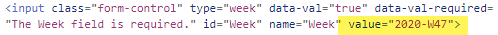

<input type="week" value="2020-W47">

However, the default DateTimeModelBinder is unable to bind that value back to a DateTime. You have a number of options. The most crude option is to access the value directly from the Request.Form collection, parse it as a string and generate a DateTime yourself:

```csharp
public void OnPost()
{
    var week = Request.Form["Week"].First().Split("-W");
    week = ISOWeek.ToDateTime(Convert.ToInt32(week[0]),Convert.ToInt32(week[1]),DayOfWeek.Monday);
}
```

This example uses the ISOWeek  utility class that was added in .NET Core 3.0. If you are working on a .NET Core 2 project, you can use the Calendar.GetWeekOfYear() method, but be aware that in some edge cases, it doesn't return the ISO 8601 week of the year.

You could also bind to a string instead of a DateTime. You would have to generate a property formatted value, as well as parse the result:

```csharp
public string StringWeek{get;set;}
public void OnGet()
{
    StringWeek = $"{DateTime.Now.Year}-W{ISOWeek.GetWeekOfYear(DateTime.Now)}";
}
```

Alternatively, you can implement a custom model binder.

##### Working With Radio Buttons in ASP.NET Razor Pages

The radio button control is designed to support the selection of only one of a mutually exclusive set of predefined options.

##### Radio Basics

The radio control is rendered in HTML by setting the type attribute in an input element to radio:

```html
<input type="radio" />
```

This appears in most browsers as a small disc or circle: :white_circle:. When it is selected, the disc acquires a dot: :radio_button:. This state is indicated in HTML by the presence of a checked attribute on the element:

```html
<input type="radio" checked>
```

You can also provide a value to the checked attribute. Any of the following are considered valid values according to the HTML 5 spec:

```html
<input type="radio" checked="">
<input type="radio" checked="checked">
<input type="radio" checked="CHECKED">
```

Most browsers will set the state of the radio to selected based solely on the presence of the checked attribute, regardless of the value passed to it, so even the following will result in the radio being selected:

```html
<input type="radio" checked="false">
```

However, this will fail HTML 5 validation testing.

> :information_source: Note that if you pass a Razor expression to the checked attribute that evaluates to anything other that true, the checked attribute will not be rendered at all.

Radio button options are grouped together and become mutually exclusive when the same value is assigned to the name attribute to multiple controls:

```html
<input type="radio" name="gender" value="Male" />
<input type="radio" name="gender" value="Female" />
<input type="radio" name="gender" value="Unspecified" />
```

Only one can be selected at any one time:

<input type="radio" name="gender" value="Male" />Male
<input type="radio" name="gender" value="Female" />Female
<input type="radio" name="gender" value="Unspecified" />Unspecified

The only way to deselect a particular value is to select an alternative value within the same group.

##### Razor Radio Buttons

Razor offers two ways to generate radio buttons. The recommended approach is to use the input tag helper. When creating a radio button, you must provide the value of one the predefined options to the value attribute.

```csharp
public class IndexModel : PageModel
{
    [BindProperty]
    public string Gender {get;set;}

    public string[] Genders = new[] {"Male","Female","Unspecified"};
}
```

```html
<form method="post">
    @foreach(var gender in Model.Genders)
    {
        <input type="radio" asp-for="Gender" value="@gender" />@gender<br />
    }
    <input type="submit" />
</form>
```

The property name passed to the asp-for attribute is used for the values of both the id and name attributes. Using the pattern above will result in multiple elements with the same id property value:

```html
<input type="radio" value="Make" id="Gender" name="Gender" />Male <br />
<input type="radio" value="Female" id="Gender" name="Gender" />Female <br />
<input type="radio" value="Unspecified" id="Gender" name="Gender" />Unspecified<br />
```

You can override this behaviour by supplying your own unique id value for each element:

```html
@foreach(var gender in Model.Genders)
{
    <input type="radio" asp-for="Gender" value="@gender" id="Gender@(gender)" />@gender<br />
}
```

These methods are primarily added to enable easier migration from traditional MVC to ASP.NET Core.

##### Default Values And Required Fields

You can specify that the property that the selected value should be bound to is Required:

```csharp
[BindProperty,Required]
public string Gender {get;set;}
```

This will prevent the from being submitted if you are using unobstrusive validation. You can also force a value to be selected by setting a default value for the property:

```csharp
[BindProperty]
public string Gender {get;set;}="Unspecified";
```

###### Request verification

Request Verification in ASP.NET Razor Pages is a mechanism designed to prevent possible Cross Site Request Forgery attacks, also referred to by the acronyms XSRF and CSRF.

During a CSRF attack, a malicious user will use the credentials of an authenticated user to perform some action on a web site to their benefit. The canonical example used to illustrate this type of attack involves online banking.

When you log into your bank account online, your browser receives an authentication cookies which is then passed back to the banking site each time you make a request, keeping you logged in. The authentication cookies will have a predetermined life. It may be session-based, which means it could be valid for a period of time after you have closed the online banking's browser tab without using the banking application's log out feature and not having closed your browser.

While this cookies is still valid, you find yourself on another site that initiates a form post to your banking site that makes a transfer from your account to another. This form post is authenticated by your cookies and the banking site honours the transaction because it failed to verify where the request came from.

The prevention mechanism provided by the ASP.NET framework for this type of attack involves verifying that any POST request made to a Razor page originates from a form on the same site.

The form tag helper injects a hidden form field named _RequestVerificationToken at the end of every form with an encrypted value representing the token.This value is also sent to the browser in a samesite cookie. The presence of both of these items and their values are validated when ASP.NET Core processes a POST request. If verification fails, the framework returns an HTTP status code of 400,signifying a Bad Request.

##### Opting Out

This behaviour is baked into the Razor Pages framework. However, it is possible to turn off anti-forgery token verification. This can be done globally in Program.cs (.NET 6 onwards) or the ConfigureServices method in Startup:

```csharp
builder.Services.AddRazorPages().AddRazorPagesOptions(o=>{
    o.Conventions.ConfigureFilter(new IgnoreAntiforgeryTokenAttribute());
});
```

Or you can bypass the checks by adding the IgnoreAntiforgeryTokenAttribute to the relevant PageModel class (not a handler method):

```csharp
[IgnoreAntiforgeryToken(Order=1001)]
public class IndexModel:PageModel
{
    public void OnPost()
    {

    }
}
```

The ValidateAntiForgeryToken attribute which is applied by default has an order of 1000, therefore the IgnoreAntiforgeryToken attribute needs a higher order number to be activated.

Alternatively, you can turn off token validation globally as above, and then selectively apply token validation on a case by case basic by decorating the appropriate PageModel class with the ValidateAntiForgeryToken attribute (applying the same logic to the Order value as previously):

```csharp
public class IndexModel : PageModel
{
    public void OnPost()
    {

    }
}
```

The ValidateAntiForgeryToken attribute has an upper case "F" in its name, whereas the IgnoreAntiforgeryToken has a lower case "f". This is by design.

Choosing to opt out of Antiforgery validation using these methods does not prevent the generation of the hidden field or the cookie. All it does is to skip the verification process.

If, in addition to disabling request verification, you want to prevent the hidden form field being rendered, pass false to the antiforgery attribute in the form tag helper:

```csharp
<form asp-antiforgery="false" method="post">
```

Note: this action on its own does not disable request verification.

Generally, there is no good reason to disable request verification. If you want your site to accept POST requests from external domains, the recommended solution is to use a web API controller instead.

##### Configuration

Various options relating to the AntiForgery feature are configurable via the AntiforgeryOptions class:

|Option|Description|Default Value|
|---|---|---|
|Cookie|Provides access to configuring aspects of the cookie|If a value for the cookie name is not specified, a unique value will be generated prefixed with .AspNetCore.Antiforgery.|
|FormFieldName|The name used for the hidden form field|_RequestVerificationToken|
|HeaderName|The name used for the request header|RequestVerificationToken|
|SuppressXFrameOptionsHeader|If set to true, the X-Frame-Options header will not be set.By default, it is set with the value SAMERIGIN|'false'|

You can configure these options in Program.cs(.NET 6) or the ConfigureServices method in Startup.The following example changes the header name from RequestVerificationToken to XSRF-TOKEN:

```csharp
builder.Services.AddAntiforgery(o=>o.HeaderName="XSRF-TOKEN");
```

##### AJAX Post Requests And JSON

It is easy to forget about the anti-forgery token when crafting a POST request made with AJAX. If you omit the value from the request, the server will return a 400 Bad Request result.

For most requests, you have a choice whether to include the value as a form field or a request header, but if you want to post your data as JSON via AJAX, you have to send the token as part of the headers because ASP.NET Core does not parse JSON looking for the verification token.Here's how you might achieve that using JQuery's $.ajax method:

```javascript
var postSubmit = $.ajax({
    type:"post",
    headers:{
        "RequestVerificationToken":$('input[name="__RequestVerificationToken"]').val()},
        url:"/yourformhandler",
        data:JSON.stringify({...}),
        contentType:"application/json"
    }).done(function(response){});
```

A form is not necessarily needed for an AJAX POST request.However, you need to generate an antiforgery token so that you can pass its value with the request. You can do by either including an empty form element with the method set to post:

```html
<form method="post"></form>
```

or you can use the AntiForgeryToken HTML helper:

```html
@Html.AntiForgeryToken()
```

Both of these approaches will result in the __RequestVerificationToken hidden field being added to the page. If you prefer not to have a form or even a hidden field, you can inject the IAntiforgery interface into the page itself, and use its GetAndStoreTokens method to generate the token:

```csharp
@page
@model LearnRazorPages.Pages.IndexModel
@inject IAntiforgery antiforgery
@{
    var token = antiforgery.GetAndStoreTokens(HttpContext).RequestToken;   
}
//...
<script>
$(function(){
    $post("/yourformhandler", {name1: param1, __RequestVerificationToken: '@token'});
});
</script>

```

Note that you will need to add a using directive to bring the Microsoft.AspNetCore.Antiforgery namespace into scope so that the IAntiforgery type is resolved:

```csharp
@using Microsoft.AspNetCore.Antiforgery
```
You can do this in the page itself, or you can add it to the ViewImports file to make the namespace available to all pages that it affects.

#### Validation

##### Validating User Input in Razor Pages

When you allow users to provide values that you then process, you need to ensure that the incoming values are of the expected data type, that they are within the permitted range and that required values are present. This process is known as input validation.

The term "user input" covers any value that the user has control over.Values provided via forms constitute the bulk of user input,but user input also comes in the form of values provided in URLs and cookies.The default position should be that all user input is to be considered untrusted.

You can validate user input in two places in a web application: in the browser using client-side script or the browser's in-built data type validation; and on the server. However, you should only ever view client-side validation as a courtesy to the user because it is easily circumnavigated.

The MVC framework,on which Razor Pages is built, includes a robust validation framework that works against inbound model properties on the client-side and on the server.

The key players in the input validation framework are:

- DataAnotation Attributes
- Tag helpers
- JQuery Unobtrusive Validation
- ModelState
- Route Constraints

##### DataAnnotation Attributes

The primary building block of the validation framework is a set of attributes that inherit from ValidationAttribute. Most of these attributes reside in the System.ComponentModel.DataAnnotations namespace.

|Attribute|Description|
|---|---|
|Compare^1^|Used to specify another form field that the value should be compared to for equality|
|MaxLength|Sets the maximum number of characters/bytes/items that can be accepted|
|MinLength|Sets the minimun number of characters/bytes/items that can be accepted|
|PageRemote^2^|Enables client-side validation against a server-side resource,such as a database check to see if a username is already in use|
|Range|Sets the minimum and maximum values of a range|
|RegularExpression|Checks the value against the specified regular expression|
|Remote^2^|Enables client-side validation against a server-side resource, such as a database check to see if a username is already in use|
|Required|Specifies that a value must be provided for this property. Note that non-nullable value types such as DateTime and numeric values are treated as required by default and do not need this attribute applied to them|
|StringLength|Sets the maximum, and optionally, the minimum number of string characters allowed|

**Note**

1. The Compare attribute does not work as expected when applied to properties of a PageModel in Razor Pages 3.x and earlier.The workaround is to either manually compare the property values in code, or to create a create a "wrapper" object for the bound properties (like an InputModel). The compare attribute is supported when it is applied to the properties of such an object.For further discussion,From .NET 5 onwards, the Compare attribute works without any additional steps being necessary.

2. The Remote attribute works within the context of an MVC controller.The PageRemote attribute is designed for use in remote validation of PageModel properties in Razor Pages.


Apart from the Remote attribute, all the other attribute cause validation to occur on both the client and the server.The Remote attribute also differs from the others in that it doesn't belong to the DataAnnoations namespace.It is found in the Microsoft.AspNetCore.Mvc namespace.

Attribute are applied to properties on the inbound model-typically a PageModel or ViewModel:

```csharp
public class userModel:PageModel
{
    [BindProperty]
    [Required]
    [Minlength(6)]
    public string UserName{get;set;}
    [BindProperty]
    [Required,MinLength(6)]
    public string Password{get;set;}
    [BindProperty,Required,Comare(nameof(Password))]
    public string Password2{get;set;}
}
```

Each attribute can be declared separately, or as a comma separated list, or mixture of both.

##### Client side validation

> **Important**
>
> Client-side validation should only ever be viewed as a courtesy to users, in that it provides immediate feedback to the user in the event taht they have not provided satisfactory input. Your application must not rely solely on client-side validation because it is very easy to circumvent by anyone who has a small amount of HTML/Javascript knowledge.

Client-side validation support is provided by the jQuery Unobtrusive Validation library, developed by Microsoft. You must include jQuery Unobtrusive Validation within the page containing the form for client side validation to work.This is most easily accomplished by the inclusion of the _ValidationScriptsPartial.cshtml file (located in the Shared folder) within the page:

```csharp
@section scripts{
    <partial name="_ValidationScriptsPartial" />
}
```

Obviously, you should also ensure that jQuery is available to the page too.

Client side validation works with special HTML 5 data-* attributes emitted by tag helpers.To see how that works,here is a simple tag helper-based form featuring the properties above:

```html
<form method="post">
    <div>
        <input asp-for="UserName" />
        <span asp-validation-for="UserName"></span>
    </div>
    <div>
        <input asp-for="Password" />
        <span asp-validation-for="Password"></span>
    </div>
    <div>
        <input asp-for="Password2" />
        <span asp-validation-for="Password2"></span>
    </div>

    <div>
        <input type="submit" />
    </div>
</form>
```

This form uses the validation message tag helper to output validation error messages. This is how the form renders as HTML:

```HTML
<div>
    <input type="text" data-val="true" data-val-minlength="The field UserName must be a string or array type with a minimum length of &#x27;6&#x27;." data-val-minlength-min="6" data-val-required="The UserName field is required." id="UserName" name="UserName" value="" />
    <span class="field-validation-valid" data-valmsg-for="UserName" data-valmsg-replace="true"></span>
<div>
    <input type="text" data-val="true" data-val-minlength="The field Password must be a string or array type with a minimum length of &#x27;6&#x27;." data-val-minlength-min="6" data-val-required="The Password field is required." id="Password" name="Password" value="" />
    <span class="field-validation-valid" data-valmsg-for="Password" data-valmsg-replace="true"></span>
</div>
<div>
    <input type="text" data-val="true" data-val-equalto="&#x27;Password2&#x27; and &#x27;Password&#x27; do not match." data-val-equalto-other="*.Password" data-val-required="The Password2 field is required." id="Password2" name="Password2" value="" />
    <span class="field-validation-valid" data-valmsg-for="Password2" data-valmsg-replace="true"></span>
</div>
<div>
    <input type="submit" />
</div>
```

Validation is activated by the inclusion of the data-val attribute with a value of true which has been applied to the span elements targeted by the validation message tag helper.Various other data-val-* attributes are added as part of the tag helper rendering to specify the type of validation required and the error message, which can be customised as part of the attribute declaration:

```csharp
[Compare(nameof(Password)),ErrorMessage="Make sure both passwords are the same"]
public string Password2{get;set;}
```

```html
<input type="text" data-val="true"
    data-val-equalto="Make sure both passwords are the same"
    data-val-equalto-other="*.Password"
    data-val-required="The Password2 field is required." 
    id="Password2" name="Password2" value="" />
```

Validation message or summary tag helpers are required to provide somewhere for the error message to be displayed. Without these, any attempt to submit a form that fails client-side validation will not succeed, but without any visual clues as to why, potentially leaving the user confused.

##### Server side validation

Client side validation will not take place unless you include _ValidationScriptsPartial.cshtml in your form, or if you don't use tag helpers to generate the HTML for your form controls.

There are a number of other ways to circumvent client-side validation:

- Use the browser's developer tools to change data-val="true" to data-val="false"
- Save a copy of the form to your desktop and remove the validation scripts
- Use Postman, Fiddler or Curl to post the form values directly
- etc...

Because it is so easy to circumvent client-side validation, server-side validation is included as part of the ASP.NET Core validation framework.Once property values have been bound,the framework looks for all validation attributes on those properties and executes them.Any failures result in an entry being added to a ModelStateDictionary - a dictionary-like structure where validation errors are stored. This is made available in the PageModel class via ModelState, which has a property named IsValid that returns false if any of the validation tests fail:

```csharp
public IActionResult OnPost()
{
    if(ModelState.IsValid)
    {
        //do something
        return RedirectToPage("Contact");
    }
    else
    {
        return Page();
    }
}
```

The snippet above illustrates the most common pattern for dealing with validation in an OnPost handler - query ModelState's IsValid property, and if it returns true, process the form otherwise redisplay the form, and let the framework take care of extracting error messages from ModelState and passing them to the validation message and/or summary tag helpers.If you use this approach, the values submitted by the user will be retained in the form for the user to modify accordingly.

If the form post passes validation, the PRG(Post-Redirect-Get) pattern is used to minimise the possibility of duplicate submission of form values.

##### Route Contraints

Input validation has so far focused on form submissions, but input can also be provided by the user in URLs as route values.In fact, URLs are the most common attack vector for those whose intent is malicious.Therefore,validating route parameter values for presence, data type and range is not to be overlooked.

Constraints provide a way to disambiguate routes but they also act as means of specifying a white list of acceptable values. There is a wide range of constraints available, and they can be combined to form very restrictive rules that must be satisfied by the incoming value.If the constraints aren't satisfied, the framework returns a 404 Not Found instead of raising an exception.

You can read more about applying constraints in the routing topic.

##### Remote Validation in Razor Pages

Remote Validation is a technique that uses client side script to validate user input on the server without posting the entire form. It is typically used to compare the user input with a dynamic list of values.One example of its use would be to prevent duplicate user names being submitted.You can craft your own solution for managing remote validation,but there are also components provided as part of ASP.NET for managing remote validation in Razor Pages applications.

Razor Pages remote validation requires four things:

- The jQuery Unobstrusive Validation library
- Application of the Remote or PageRemote attribute to the model property being validated
- The property to be validated must be a direct descendent of the PageModel class (i.e. not a property of a child property of the PageModel, also referred to as a "nested property")
- A remote resource (page handler method or MVC controller action) to perform the validation

##### Remote or PageRemote?

The RemoteValidation attribute has been around a long time in one form or another. It was introduced into MVC in the pre .NET Core days, and was the only way to perform remote validation in ASP.NET Core 1.x or 2.x.Being part of MVC, the RemoteValidation attribute depends on an MVC controller action to do its work.The PageRemoteValidation attribute was introduced in ASP.NET Core 3.0, and is designed specifically to work with a Razor Pages handler method.

So, if you working with ASP.NET Core 2.x, or your validation end point is an MVC controller, you must use the RemoteValidation attribute.If you are working with ASP.NET Core 3.x or newer, AND your validation service is a Razor Pages handler method, you must use the PageRemoteValidation attribute.

##### example

The following example features a Razor PageModel that only has one property,Email.This is bound to a text input in a form, which has Unobtrusive Validation and Unobtrusive AJAX enabled. The Unobtrusive Validation library is included as part of the standard Razor Pages project template, and included in a page via a partial. The Unobtrusive Ajax library needs to be installed, which you can do by editing the libman.json file in your project to include the following entry:

```json
"libraries":[
    {
        "provider":"jsdelivr",
        "library":"jquery-ajax-unobtrusive@3.2.6",
        "destination":"wwwroot/lib/jquery-ajax-unobtrusive/"
    }
]
```
The next block of code shows the PageModel:

```csharp
public class RemoteValidationDemoModel:PageModel
{
    [BindProperty]
    public string Email{get;set;}
}
```

Followed by the form and the scripts section in the content page:

```html
<form method="post">
    <input asp-for="Email" />
    <span asp-validation-for="Email"></span><br>
    <input type="submit">
</form>

@section scripts{
    <script src="~/lib/jquery/dist/jquery.min.js"></script>
    <partial name="_ValidationScriptsPartial" />
    <script src="~/lib/jquery-ajax-unobtrusive/dist/jquery.unobtrusive-ajax.min.js"></script>
}
```

The form has its method set to post, which will result in a request verification token being included in the rendered HTML.It also includes a validation tag helper for outputting any validation messages relating to the Email property.

##### PageRemote Attribute Approach

The following handler method is declared in the same Razor page:

```csharp
public JsonResult OnPostCheckEmail()
{
    var existingEmails = new[]{
        "jane@test.com","claire@test.com","dave@test.com"
    };
    var valid = !existingEmails.Contains(Email);
    return new JsonResult(valid);
}

```

Remote validation attributes require that the validation end point returns a JSON response to indicate whether the submitted value is valid or not. Valid values are:

- true
- false
- undefined
- null
- any other string

The last four values indicate that validation has failed. If a string value other than the first four is returned, it is used as the error message.

This example returns true if the submitted email is not one that already exists.

The PageRemote attribute has the following properties:

|Property|Description|
|---|---|
|AdditionalFields|A comma separated list of additional fields that should be included in the validation request|
|ErrorMessage|The custom error message to be displayed in the event of validation failure|
|ErrorMessageResourceName|The name of the resource where the error message is stored, if one is used|
|ErrorMessageResourceType|The type of the resource used to store the error message|
|HttpMethod|The HTTP verb to be used for the request (GET or POST).Default is GET|
|PageHandler|The name of the handler method containing the validation, If omitted, the default handler for the HTTP verb will be used|
|PageName|The name of the page.If omitted, the current page is used|


Taking into account that there is a named page handler method in the current page, the PageRemote attribute is applied to the Email property as shown below:

```csharp
[PageRemote(ErrorMessage="Email Address already exists",
        AdditionalFields="__RequestVerificationToken",
        HttpMethod="post",
        PageHandler="CheckEmail"
)]
[BindProperty]
public string Email{get;set;}
```

The AdditionalFields property must include the request verification token because request verification takes place by default in Razor Pages.If this field is not included in a POST request, the request will fail with a 400 Bad Request status code.

> 400 error codes are also returned if the property that you are trying to validate is a "nested property", e.g. the EmailAddress property of a Contact class, which is then assigned as as property of the PageModel. If you use an input tag helper to generate the form field, the name of the field that is generated is Contact.EmailAddress.The Contact prefix is also applied to ALL
> Field listed in the AdditionalFields property, including the field containing the request verification token.As a result, the request verification token itself is not found, and request verification fails.

Once this configuration has been completed, the AJAX request is made when the value of the Email input is changed:

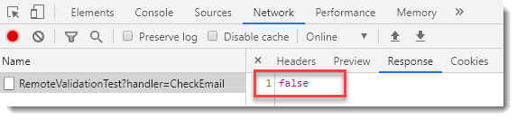

##### Remote Attribute Approach

The following action method is declared in an MVC controller:

```csharp
public class ValidationController:Controller
{
    [HttpPost]
    [ValidateAntiForgeryToken]
    public JsonResult CheckEmail(string Email)
    {
        var existingEmails = new[]{
            "jane@test.com",
            "claire@test.com",
            "dave@test.com"
        };
        var valid = !existingEmails.Contains(Email);
        return new JsonResult(valid);
    }
}
```

The body of the method and the return type is identical to the Razor Pages handler method example. The ValidateAntiForgeryToken attribute is optional in MVC,but recommended.

The Remote attribute shares the following properties with the PageRemote attribute:

- AdditionalFields
- ErrorMessage
- ErrorMessageResourceName
- ErrorMessageResourceType
- HttpMethod

It has three overloads. The first takes the name of a route, the second takes the name of an action method and controller, and the third takes an area name in addition to the action and controller names.

Using the second overload, this is how the Remote attribute is configured on the Email property based on the controller action above:

```csharp
[Remote(
    "checkemail",
    "validation",
    ErrorMessage="Email Address already exists",
    AddtionalFields = "__RequestVerficationToken",
    HttpMethod="post"
)]

[BindProperty]
public string Email{get;set;}
```

In either case, Remote or PageRemote, if no error message is provided either via the ErrorMessage or ErrorMessageResourceName properties, or in the JSON response, the default error message is "'name of property' is invalid"

##### Using Resource Files For Error Messages

Resource(.resx) files enable you to centralise data, making it easier to maintain. Resource files are particularly useful when used as part of a localisation strategy.Both the PageRemote and the Remote attributes provide support for error messages stored in resource files.

When adding a resource file, you must change the access modifier (highlighted below) to public. Otherwise the resource will not be accessible to the Razor Pages application.


This example shows a file named ErrorMessages.resx, which has been added to a folder named Resources. It has one entry with a key of "DuplicateEmail".The name of the folder becomes the namespace for the resource, so when you configure the PageRemote attribute, you can either include the namespace as part of the type:

```csharp
[PageRemote(
    ErrorMessageResourceType = typeof(Resources.ErrorMessages),
    ErrorMessageResourceName = nameof(Resources.ErrorMessages.DuplicateEmail), 
    AdditionalFields = "__RequestVerificationToken", 
    HttpMethod ="post",  
    PageHandler ="CheckEmail"
)]
[BindProperty]
public string Email{get;set;}
```

Or you can add a using directive to reference the namespace and omit it from the attribute configuration:

```csharp
using MyApp.Resources;
...
[PageRemote(
    ErrorMessageResourceType = typeof(ErrorMessages),
    ErrorMessageResourceName = nameof(ErrorMessages.DuplicateEmail), 
    AdditionalFields = "__RequestVerificationToken", 
    HttpMethod ="post",  
    PageHandler ="CheckEmail"
)]
[BindProperty]
public string Email { get; set; }
```

#### Model Binding

Model Binding in Razor Pages is the process that takes values from HTTP requests and maps them to handler method parameters or PageModel properties.Model binding reduces the need for the developer to manually extract values from the request and then assign them, one by one, to variables or properties for later processing. This work is repetitive,tedious and error prone, mainly because request values are usually only exposed via string-based indexes.


##### The Problem

To illustrate the role that model binding plays, create a new Razor page with a PageModel and name it ModelBinding.cshtml. Change the code in the content page to the following:

```csharp
@page
@model ModelBindingModel
@{

}

<h3>@ViewData["confirmation"]</h3>

<form class="form-horizontal" method="post">
    <div class="form-group">
        <label for="Name" class="col-sm-2 control-label">Name</label>
        <div class="col-sm-10">
            <input type="text" class="form-control" name="Name">
        </div>
    </div>

     <div class="form-group">
        <label for="Email" class="col-sm-2 control-label">Email</label>
        <div class="col-sm-10">
            <input type="text" class="form-control" name="Email">
        </div>
    </div>
    <div class="form-group">
        <div class="col-sm-offset-2 col-sm-10">
            <button type="submit" class="btn btn-default">Register</button>
        </div>
    </div>
</form>


```

It represents a standard HTML form accepting a name and a email address (such as might be used to capture requests for information, for example), with a confirmation message at the top of the page.When the form is completed and submitted,the values are sent in the request body in name/value pairs, where the "name" represents the name attribute of the input, and the value is what was supplied by the user.You can see this in the Network tab of your preferred browser if it supports developer tools:


Add the following handler method code to the PageModel class in ModelBinding.cshtml.cs:

```csharp
public void OnPost()
{
    var name = Request.Form["Name"];
    var email = Request.Form["email"];
    ViewData["confirmation"] = $"{name}, information will be sent to {email}";
}
```

This represents the traditional way that values in server-side code are processed in many web frameworks. The appropriate Request collection is accessed by string-based index and then values from the collection are assigned to local variables for further processing.

Launch the page in a browser and enter some values into the form.Then submit it and you should see those values included in the confirmation message:

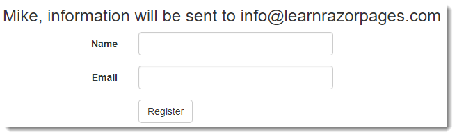

This approach is sustainable for small forms, but if you are dealing with large forms, such as one representing an order for multiple items complete with shipping details, for example, the assignment code can become very tedious. And, because development tools provide no code-completion or Intellisense support for string indices, it is fairly easy to mistype Request.Form["Email"] as Request.Form["Emial"],thereby introducing a subtle but damaging bug that may be difficult to track down among 30 or 40 other form fields.

##### Binding Posting Form Values To Handler Method Parameters

Razor Pages provides two approaches to leveraging model binding. The first approach involves adding parameters to the handler method.The parameters are named after the form fields, and given an appropriate type for the expected data.To see this approach in action, remove the assignment code in the OnPost handler method and add two parameters to the method:

```csharp
public void OnPost(string name,string email)
{
    ViewData["confirmation"] = $"{name}, information will be sent to {email}";
}
```

When the form is posted, the Razor Pages framework calls the OnPost method and sees that it has two parameters. It extracts posted form values that match the names of the parameters and automatically assigned the values from the form to the parameters if the value can be converted to the type represented by the parameter.There is no need for any assignment code.

##### Binding Posted Form Values to PageModel Properties

The previous approach is suitable when the values are not needed outside of the handler method to which the parameters belong.The second approach is more suitable if you need to access the values outside of the handler method (for display on the page or binding to tag helpers, for example), or if you prefer to work in a strongly typed manner within the Razor content page.This approach involves adding public properties to the PageModel (or to a @functions block if you don't want to use the PageModel approach) and then decorating them with the BindProperty attribute.To try this out, alter the PageModel code as follows:

```csharp
public class ModelBindingModel : PageModel
{
    [BindProperty]
    public string Name {get;set;}
    [BindProperty]
    public string Email {get;set;}

    public void OnGet()
    {

    }

    public void OnPost()
    {
        ViewData["confirmation"]= $"{Name}, information will be sent to {Email}";
    }
}
```

From version 2.1 of ASP.NET Core, you can add the new [BindProperties] attribute to the PageModel class rather than applying [BindProperty] to individual properties, which results in all the public properties in the PageModel taking part in model binding:

```csharp
[BindProperties]
public class ModelBindingModel : PageModel
{
    public string Name {get;set;}
    public string Email {get;set;}

    public void OnGet()
    {

    }

    public void OnPost()
    {
        ViewData["confirmation"] = $"{Name},information will be sent to {Email}";
    }
}
```

When doing this, take care to note the advice about preventing over-posting attacks below.

Note that the case of the variables in the format string has altered to refer to the public property names. Model binding itself is not case sensitive. It performs case-insensitive matches between the names of incoming values and the names or parameters or properties that it attempts to bind the values to.Now when you run the page, the result is exactly the same as before:


##### Binding Data From GET Requests

The same options apply if you want to bind data from GET requests (which is appended to the URL as a query string). Binding to handler method parameters is automatic and requires no additional confirmation. However, by default, only values that form part of a POST request are considered for modeling binding when you use the BindProperty attribute.The BindProperty attribute has a property called SupportsGet, which is false by default.You have to set this to true to opt in to model binding to PageModel properties on GET requests:

```csharp
public class ModelBindingModel:PageModel
{
    [BindProperty(SupportsGet=true)]
    public string Email{get;set;}
    [BindProperty(SupportsGet=true)]
    public string Password{get;set;}


    public void OnGet()
    {
        ViewData["welcome"] = $"Welcome {Email}";
    }
}
```

> **Note**
> Obviously it is not a good idea to create a login form that supports GET. Form values will appear in the URL, which could well be a security breach.


##### Binding Route Data

So far the examples have featured how model binding works with form values.It also works with Route Data, which is part of the routing system that Razor Pages uses.To test this, alter the code in ModelBinding.cshtml as follows:

```csharp
@page "{id}"
@model ModelBindingModel
@{

}

<h3>Id = @ViewData["id"]</h3>
```

A route parameter named id has been added and the content of the h3 heading has been altered to print the value of a ViewData entry named id.

Next,remove the public properties from the PageModel and add a parameter named id of type int to the OnGet handler method, and in the body of the method, assign its value to ViewData:

```csharp
public clalss ModelBindingModel : PageModel
{
    public void OnGet(int id)
    {
        ViewData["id"] = id;
    }
}
```

Once again, model binding takes care of assigning the value in the route to the handler method parameter.This also works for public properties on the PageModel in exactly the same way as for form values:

```csharp
public class ModelBindingModel : PageModel
{
    [BindProperty(SupportsGet=true)]
    public int Id {get;set;}
    public  void OnGet()
    {
        ViewData["id"] = Id;
    }
}
```

##### Binding Complex Objects

Up to this point, you have seen how to use model binding to populate simple properties. As the number of form fields grows, the PageModel class will start to creak with either a long list of properties, all decorated with the BindProperty attribute, or a large number of parameters applied to a handler method. Fortunately, model binding also works with complex objects.So the properties to bound can be wrapped in an object that can be exposed as a property of the PageModel or a parameter for the handler method.Here's a class named Login that represents the form fields from the previous examples:

```csharp
public class Login
{
    public string Email {get;set;}
    public string Password {get;set;}

    public void OnGet()
    {

    }

    public void OnPost()
    {
        ViewData["welcome"] = $"Welcome {Login.Email}";
    }
}
```

Or it can be applied as a parameter to the OnPost method depending on your usage needs:

```csharp
public class ModelBindingModel : PageModel
{
    public void OnGet()
    {

    }

    public void OnPost(Login login)
    {
        ViewData["welcome"] = $"Welcome {login.Email}";
    }
}
```

The form field names have to be altered to reflect the fact that the property has changed:

```html
<input type="text" class="form-control" name="Login.Email">
```

##### Binding Complex Objects In A Get Request

Model binding in GET requests works with complex objects decorated with the BindProperty attribute as long as the SupportsGet parameter is set to true, just as with simple types.Or you can add the type as a handler method parameter:

```csharp
public class ModelBindingModel:PageModel
{
    public void OnGet(Login login)
    {
        ViewData["welcome"] = $"Welcome {login.Email}";
    }
}
```

##### Binding Simple Collections

The next code example shows a form where the user is allowed to select more than one option. In this case, the user is invited to specify which film categories they like:

```html
<form class="form-horizontal" method="post">
    <div class="form-group">
        <label for="CategoryId" class="col-sm-2 control-label">Which types of film do you like? (Tick all that apply)</label>
        <div class="col-sm-10">
            <input type="checkbox" name="CategoryId" value="1">Factual<br />
            <input type="checkbox" name="CategoryId" value="2">Horror<br />
            <input type="checkbox" name="CategoryId" value="3">Historical <br />
            <input type="checkbox" name="CategoryId" value="4"> SciFi<br />
            <input type="checkbox" name="CategoryId" value="5"> Comedy<br />
            <input type="checkbox" name="CategoryId" value="6"> Fantasy<br />
        </div>
    </div>
    <div class="form-group">
        <div class="col-sm-offset-2 col-sm-10">
            <button type="submit" class="btn btn-default">Submit</button>
        </div>
    </div>

</form>
```


The form includes multiple checkboxes, each with the same name attribute value:CategoryId. When the form is submitted, the posted values look something like this (depending on the selection made):

```
CategoryId=1&CategoryId=3&CategoryId=6
```

ASP.NET Core will take those values and transform them into a StringValues type, which represents zero/null, one, or many strings. This can be converted by the model binder to an array of any type that the values can be converted to - strings or integers will work in this example.The code for binding to a handler method parameter and passing the posted values to ViewData looks like this:

```csharp
public void OnPost(int[] categoryId)
{
    ViewData["categoryId"] = categoryId;
}
```
If there are no values posted, categoryId will be null as will ViewData["categoryId"]. Therefore you must test for null (as well as casting to the relevant type):

```html
@if (ViewData["categoryId"]!=null)
{
    <h3>You selected the following categories: @string.Json(",",(int[])ViewData["categoryId"])</h3>
}
```

If you choose to bind to a PageModel property, you can initiate the collection as part of its declaration:

```csharp
public class ModelBindingModel : PageModel
{
    public int[] CategoryId {get;set;} = new int[0];
    public void OnPost()
    {

    }
}
```

Then you can use Any() to check whether the collection has been populated:

```csharp
@if(Model.CategoryId.Any())
{
    <h3>You selected the following categories: @string.Json(",",Model.CategoryId)</h3>
}
```

##### Binding Complex Collections

The model binder also supports binding to collections of complex objects.The following class represents a contact:

```csharp
public class Contact
{
    public int ContactId{get;set;}
    public string FirstName{get;set;}
    public string LastName{get;set;}
    public string Email{get;set;}
}
```

Here is a form that enables a user to submit multiple contracts in one go:

```html
<form class="form-horizontal" method="post">
    <table class="table table-striped">
        <tr>
            <th>First Name</th>
            <th>Last Name</th>
            <th>Email</th>
        </tr>
        @for(var i=0;i<5;i++)
        {
            <tr>
                <td><input type="text" name="[@i].FirstName" /></td>
                <td><input type="text" name="[@i].LastName" /></td>
                <td><input type="text" name="[@i].Email" /></td>
            </tr>
        }
    </table>
    <div>
        <div class="form-group">
            <div class="col-sm-offset-2 col-sm-10">
                <button type="submit" class="btn btn-default">Submit</button>
            </div>
        </div>
    </div>
</form>
```

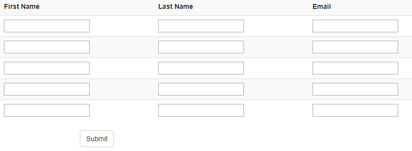

The model binder will bind the posted values to a collection of Contact objects, which is usually represented by a List<T>.This can be a property of the PageModel:

```csharp
[BindProperty]
public List<Contact> Contacts{get;set;}
```

Or it can be a handler method parameter:

```csharp
public void OnPost(List<Contract> contacts)
{

}
```

This approach to complex object binding makes use of a sequential index.The index must start at 0, and it must be sequential, as its name suggests.There must be no gaps.The index is placed in square brackets and added to the form field's name attribute e.g [0].FirstName. The code below shows the generated HTML for the first 2 rows in the form:

```html
<tr>
    <td>
        <input type="text" name="[0].FirstName" />
    </td>
    <td>
        <input type="text" name="[0].LastName" />
    </td>
    <td>
        <input type="text" name="[0].Email" />
    </td>
</tr>
<tr>
    <td>
        <input type="text" name="[1].FirstName" />
    </td>
    <td>
        <input type="text" name="[1].LastName" />
    </td>
    <td>
        <input type="text" name="[1].Email" />
    </td>
</tr>
```

In this example, for format that is used for the form field names is [index].propertyname.The process also works with parametername[index].propertyname if you prefex e.g.:

```html
@for(var i=0;i < 5; i++)
{
    <tr>
        <td>
            <input type="text" name="Contacts[@i].FirstName" />
        </td>
        <td>
            <input type="text" name="Contacts[@i].LastName" />
        </td>
        <td>
            <input type="text" name="Contacts[@i].Email" />
        </td>
    </tr>
}
```

When the form is submitted, a collection of five (in this example) Contact objects is instantiated and populated with the posted values.If the user only provides values for the first three contacts,the final two will have have their properties set to the default for the type - null for strings.

The same approach works when you bind to a PageModel property.However,you can also use the asp-for attribute of an input tag helper:

```html
@for (var i = 0; i < 5; i++)
{
    <tr>
        <td>
            <input type="text" asp-for="Contacts[i].FirstName" />
        </td>
        <td>
            <input type="text" asp-for="Contacts[i].LastName" />
        </td>
        <td>
            <input type="text" asp-for="Contacts[i].Email" />
        </td>
    </tr>
}
```

```csharp
public class ModelBindingModel : PageModel
{
    [BindProperty]
    public List<Contact> Contacts{get;set;}

    public void OnPost()
    {

    }
}
```

You can also use an explicit index.This approach requires an additional hidden field for each item, named [property].Index (the explicit index).The index can be any value that uniquely identifies a data item.This approach is more suited to forms designed for editing existing values, where the primary key of each item is often used as the index value.

In this example, ContactId - the key value for the Contact entity - is used as the index value:

```html
<form method="post">
    <table class="table">
        @foreach (var contact in Model.Contacts)
        {
            <tr>
                <td>
                    <input type="hidden" name="Contacts.Index" value="@contact.ContactId" />
                    <input type="hidden" name="Contacts[@contact.ContactId].ContactId" value="@contact.ContactId" />
                    @contact.ContactId
                </td>
                <td><input name="Contacts[@contact.ContactId].FirstName" value="@contact.FirstName" /></td>
                <td><input name="Contacts[@contact.ContactId].LastName" value="@contact.LastName" /></td>
                <td><input name="Contacts[@contact.ContactId].Email" value="@contact.Email" /></td>
            </tr>
        }
    </table>
    <button>Update</button>
</form>

```

This is how one row of data might render,given some actual values:

```html
<tr>
    <td>
        <input type="hidden" name="Contacts.Index" value="43907" />
        <input type="hidden" name="Contacts[43907].ContactId" value="43907" />
        43907
    </td>
    <td><input name="Contacts[43907].FirstName" value="Penny" /></td>
    <td><input name="Contacts[43907].LastName" value="Farthing" /></td>
    <td><input name="Contacts[43907].Email" value="penny@gmail.com" /></td>
</tr>
```

The model binders uses the Contacts.Index field value to group other values.

##### Binding Related Collections to a Complex Object

Sometimes you may want to create a form that enables the creation of a parent object along with one or more items belonging to a collection property of the parent.One of the easier examples of this to understand is an order and its items.The following simple model illustrates this relationship:

```csharp
public class Order
{
    public int OrderId{get;set;}
    public string Customer{get;set;}
    public List<OrderItem> OrderItems {get;set;}
}

public class OrderItem
{
    public int OrderItemId{get;set;}
    public string Item {get;set;}
    public decimal Price{get;set;}
}
```

Here's the PageModel for a Create Page:

```html
@page
@model CreateModel
@{

}

<form method="post">
    <input asp-for="Order.Customer" /><br />
    <input asp-for="Order.OrderItems[0].Item" /><br>
    <input asp-for="Order.OrderItems[0].Price" /><br>
    <input type="submit"/>
</form>
```

Finally, the PageModel with an Order property decorated with the [BindProperty] attribute:

```csharp
public class CreateModel : PageModel
{
    [BindProperty]
    public Order Order{get;set;}

    public void OnPost()
    {

    }
}
```

The indexer is applied to the OrderItems property of the Order. When the form is posted back, the model binder will create an Order object, and an OrderItem object, which will be assigned to the OrderItems collection of the Order:

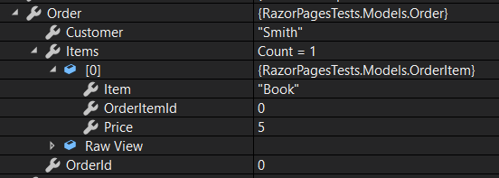

##### Binding to Arbitrary Keys

When binding posted values, ASP.NET Core matches the names of the form or query string keys in the request to parameter names or the names of public properties decorated with the BindProperty attribute. A form field with a name attribute of person.firstname will be bound to Person.FirstName.Sometimes, you might want to override the default matching.This is possible by specifying a value for the Name property of the BindProperty attribute as in the following code example:

```csharp
public class Person
{
    [BindProperty(Name="first-name")]
    public string FirstName{get;set;}
    public string LastName{get;set;}
}
```

In a PageModel, the BindProperty attribute is applied to an instance of the Person class:

```csharp
[BindProperty]
public Person Person{get;set;}
```

And in the form, the name attributes on the inputs are as follows:

```html
<form method="post">
    Fist Name: <input name="first-name" /><br>
    Last Name: <input name="person.lastname" /><br>
    <button>Submit</button>
</form>
```

##### Preventing Overposting or Mass Assigment Attacks

When you add the BindProperty attribute to a class, all properties in that class are automatically included in model binding. That may not be what is needed, particularly when working with Entity Framework model classes.

For example, you might choose to have an IsDeleted property on you entities to allow "soft deletes" (i.e. a flag that specifies the status of a record rather than the permanent - and irrevocable - removal of the record from the database). Only admins are allowed to set this property so you don't include an IsDeleted field in the edit form for normal users:

```html
<form class="form-horizontal" method="post">
    <input type="hidden" asp-for="ContactId">
    <div class="form-group">
        <label asp-for="Name" class="col-sm-2 control-label"></label>
        <div class="col-sm-10">
            <input type="text" class="form-control" asp-for="Name">
        </div>
    </div>
    <div class="form-group">
        <label asp-for="Email" class="col-sm-2 control-label"></label>
        <div class="col-sm-10">
            <input type="text" class="form-control" asp-for="Email">
        </div>
    </div>
    <div class="form-group">
        <div class="col-sm-offset-2 col-sm-10">
            <button type="submit" class="btn btn-default">Edit</button>
        </div>
    </div>
</form>
```

However, it is trivial for a reasonably competent HTML -savvy user to manipulate the form (using the standard browser developer tools, for example) to include an IsDeleted property and to submit that to the server.The value will be processed as part of a legitimate edit operation.This is known as a mass assignment or an over posting attack.

For this reason, you are advised to be careful when using model binding with complex types.If they include properties that should not be set by an unauthorised user, you should only include the properties that can be set, either as individual properties on the PageMoel, or wrapped in a ViewModel class.


##### Implementing a Custom Model Binder In Razor Pages

The default model binder in Razor Pages is sufficient for most use cases,but sometimes you might need to implement your own model binding solution.The following example demonstrates how to devise and register a model binder to bind values from an week input to a DateTime value.

The week input enables the user to select a week of the year in browsers where it is supported:

<input type="week" />

The format of the values that the week input works with are defined in ISO 8601 and take the form yyyy-Www, where yyyy represents the year, -W is literal and ww represents the week of the year. The existing DateTime model binder is unable to bind a string in this format to a DateTime.You could manually parse the value that comes from the week input and assign it to a DateTime within the OnPost handler. However, Creating a custom model binder is a better solution.

##### Model Binder Basics

Model  binders implement the IModelBinder interface, which contains one member:

```csharp
Task BindModelAsync(ModelBindingContext bindingContext)
```

It is within this method that you attempt to process incoming values and assign them to model properties or parameters. Once you have created your custom model binder, you either apply it to a specific property through the ModelBinder attribute, or you can register it globally using a ModelBinderProvider.

##### The WeekOfYear ModelBinder

To resolve the issue with binding the week input type value to a DateTime type, the approach using the ModelBinder attribute is simplest.The following code for a custom WeekOfYearModelBinder is based on the source ode for the existing DateTimeModelBinder:

```csharp
public class WeekOfYearModelBinder : IModelBinder
{
    public Task BindModelAsync(ModelBindingContext bindingContext)
    {
        if (bindingContext == null)
        {
            throw new ArgumentNullException(nameof(bindingContext));
        }
 
        var modelName = bindingContext.ModelName;
        var valueProviderResult = bindingContext.ValueProvider.GetValue(modelName);
        if (valueProviderResult == ValueProviderResult.None)
        {
            return Task.CompletedTask;
        }
 
        var modelState = bindingContext.ModelState;
        modelState.SetModelValue(modelName, valueProviderResult);
 
        var metadata = bindingContext.ModelMetadata;
        var type = metadata.UnderlyingOrModelType;
        try
        {
            var value = valueProviderResult.FirstValue;
 
            object model;
            if (string.IsNullOrWhiteSpace(value))
            {
                model = null;
            }
            else if (type == typeof(DateTime))
            {
                var week = value.Split("-W");
                model = ISOWeek.ToDateTime(Convert.ToInt32(week[0]), Convert.ToInt32(week[1]), DayOfWeek.Monday);
            }
            else
            {
                throw new NotSupportedException();
            }
 
            if (model == null && !metadata.IsReferenceOrNullableType)
            {
                modelState.TryAddModelError(
                    modelName,
                    metadata.ModelBindingMessageProvider.ValueMustNotBeNullAccessor(
                        valueProviderResult.ToString()));
            }
            else
            {
                bindingContext.Result = ModelBindingResult.Success(model);
            }
        }
        catch (Exception exception)
        {
            // Conversion failed.
            modelState.TryAddModelError(modelName, exception, metadata);
        }
        return Task.CompletedTask;
    }
}
```

The code might at first glance seem daunting, but the majority of it is fairly boilerplate.The only real differences between this model binder and the original code that it is based on are the omission of logging, and the way that the value is parsed in order to create a valid DateTime value:

```csharp
var week = value.Split("-W");
model = ISOWeek.ToDateTime(Convert.ToInt32(week[0]),Convert.ToInt32(week[1]),DayOfWeek.Monday);
```

The code that gets the DateTime from a week number uses the ISOWeek utility class to generate a DateTime.from the year and the week number which is obtained by using the string.Split function on the incoming value.

If model binding is successful -a suitable value was obtained and assigned to the model and the ModelBindingContext.Result is set to a value returned from ModelBindingResult.Success. Otherwise, an entry is added to the Errors collection of ModelState.There is also a check,in the event that the incoming value is null,to see if the model property is required,and if so, an error is logged with ModelState.

The ModelBinder attribute is ussed to register the custom model binder against the specific property that it should be used for:

```csharp

[BindProperty,DateType("week"),ModelBinder(BinderType=typeof(WeekOfYearModelBinder))]
public DateTime Week{get;set;}

```

Now, when the application runs, this model binder will be used for the Week property in this instance.If you want to use the custom binder on properties elsewhere in the application,you need to apply the attribute there too.Alternatively,you can register the model binder using a ModelBinderProvider in Startup where it is available to every request.

##### Model Binder Providers

Model Binder providers are used to register model binders globally.They are responsible for creating correctly configured model binders.All of the built in model binders have a related binder provider.But first, you need a binder:

```csharp
public class WeekOfYearAwareDateTimeModelBinder : IModelBinder
{
    private readonly DateTimeStyles _supportedStyles;
    private readonly ILogger _logger;
 
    public WeekOfYearAwareDateTimeModelBinder(DateTimeStyles supportedStyles, ILoggerFactory loggerFactory)
    {
        if (loggerFactory == null)
        {
            throw new ArgumentNullException(nameof(loggerFactory));
        }
 
        _supportedStyles = supportedStyles;
        _logger = loggerFactory.CreateLogger<WeekOfYearAwareDateTimeModelBinder>();
    }
 
    public Task BindModelAsync(ModelBindingContext bindingContext)
    {
        if (bindingContext == null)
        {
            throw new ArgumentNullException(nameof(bindingContext));
        }
 
        var modelName = bindingContext.ModelName;
        var valueProviderResult = bindingContext.ValueProvider.GetValue(modelName);
        if (valueProviderResult == ValueProviderResult.None)
        {
            // no entry
            return Task.CompletedTask;
        }
 
        var modelState = bindingContext.ModelState;
        modelState.SetModelValue(modelName, valueProviderResult);
 
        var metadata = bindingContext.ModelMetadata;
        var type = metadata.UnderlyingOrModelType;
 
        var value = valueProviderResult.FirstValue;
        var culture = valueProviderResult.Culture;
 
        object model;
        if (string.IsNullOrWhiteSpace(value))
        {
            model = null;
        }
        else if (type == typeof(DateTime))
        {
            if (value.Contains("W"))
            {
                var week = value.Split("-W");
                model = ISOWeek.ToDateTime(Convert.ToInt32(week[0]), Convert.ToInt32(week[1]), DayOfWeek.Monday);
            }
            else
            {
                model = DateTime.Parse(value, culture, _supportedStyles);
            }
        }
        else
        {
            // unreachable
            throw new NotSupportedException();
        }
 
        // When converting value, a null model may indicate a failed conversion for an otherwise required
        // model (can't set a ValueType to null). This detects if a null model value is acceptable given the
        // current bindingContext. If not, an error is logged.
        if (model == null && !metadata.IsReferenceOrNullableType)
        {
            modelState.TryAddModelError(
                modelName,
                metadata.ModelBindingMessageProvider.ValueMustNotBeNullAccessor(
                    valueProviderResult.ToString()));
        }
        else
        {
            bindingContext.Result = ModelBindingResult.Success(model);
        }
 
        return Task.CompletedTask;
    }
}
```

This is another modified version of the actual DateTimeModelBinder.The difference this time is the addition of the condition that checks if -W exists in the value being processed.If it does,this value comes from a week input and it is processed using the code from the previous example.Otherwise the value is parsed using the original DateTime model binding algorithm(basically DateTime.Parse).This version retains the logging and DateTimeStyles from the original source that need to be injected into the constructor so that the original behaviour for model binding DateTime types is preserved.Configuration of the constructor parameters is taken care of by the model binder provider:


```csharp

public class WeekOfYearModelBinderProvider : IModelBinderProvider
{
    internal static readonly DateTimeStyles SupportedStyles = DateTimeStyles.AdjustToUniversal | DateTimeStyles.AllowWhiteSpaces;
    public IModelBinder GetBinder(ModelBinderProviderContext context)
    {
        if (context == null)
        {
            throw new ArgumentNullException(nameof(context));
        }
 
        var modelType = context.Metadata.UnderlyingOrModelType;
        if (modelType == typeof(DateTime))
        {
            var loggerFactory = context.Services.GetRequiredService<ILoggerFactory>();
            return new WeekOfYearAwareDateTimeModelBinder(SupportedStyles, loggerFactory);
        }
 
        return null;
    }
}
```

This code is again, essentially the same as the built in DateTime model binder provider.The only difference is in the type that the binder returns.

Razor Pages is a layer that sits on top of the MVC framework. Much of what makes Razor Pages "just work" is in the MVC layer.Model binding is one of those features.So the access point to configuring model binders is via MvcOptions in ConfigureServices:

```csharp
public void ConfigureServices(IServiceCollection services)
{
    services.AddRazorPages().AddMvcOptions(options=>{
        options.ModelBinderProviders.Insert(0,new WeekOfYearModelBinderProvider());
    });
}
```

Model binder providers are evaluated in order until one that matches the input model's data type is located. Then that is used to attempt to bind the incoming value to the model.If binding is unsuccessful,one of two things happens - the model value is set to its default value,or a validation error is added to ModelState.Any other model binder providers are ignored.So this new model binder provider is inserted at the beginning of the collection to ensure that it is used for DateTime types instead of the default model binder.

#### State Management

##### State Management In Razor Pages

Managing state in Razor Pages is the process of retaining user or application-related data over the duration of a number of requests.

HTTP is a stateless protocol.Being stateless,there is no requirement placed on HTTP(Web) Servers to retain information about each request or user.By default,multiple requests from the same user are treated as a series of independent and isolated transactions.In fact,the server has no concept of a "user" as such.If you want to retain user or application-related data over a number of requests,you have to implement strategies for managing that yourself.

Razor Pages,along with its underlying MVC framework provides a number of mechanisms for retaining information (or state) across requests,each with its benefits  and drawbacks:

- Hidden Form Fields
- Query Strings
- Route Data
- Cookies
- TempData
- Session Variables
- Application Variables
- Caching

##### Hidden Form Fields

A hidden form field is a form field that is not visible to the user.However,its value is included in the collection passed back to the server when the form is submitted.You use the input  type="hidden" HTML element or input tag helper to add a hidden field to a form,or you can use the Html.Hidden() or Html.HiddenFor() helper methods.

Hidden field values are typically set form client-side or server-side code.While a hidden field is not visible to the user,that does not make it secure.Values are stored and transmitted in plain text and are accessible in the HTTP request as well as the HTML source that your browser makes available to you.You should not use hidden fields to store sensitive data.Since they form part of the DOM,hidden fields are not tamper-proof,and their values should really be validated just like any other user input. As with any form field,if the POST method is used,there is no limit to the number of characters that can be stored in a hidden field.


Query Strings

A query string is a collection of name/value pairs which are appended to a URL.They are separated from the location of the resource by a question mark ?.An example might look like this:

http://www.mydomain.com?name1=value1&name2=value2&name3=value3

Each name/value pair is separated from the others by the & sign.The values are obtained from the Query property of the HttpRequest object,which is exposed in a Razor page via the request property.For example,Request.Query["name1"] will yield value1.

Values are passed from one page to another as query string values automatically if you have a form that uses the GET method.The Razor Pages framework will pass values as query strings if you add route values that aren't included in the template for the route.

The following route template defines a route parameter named name1 in a page called Query.cshtml:

```csharp
@page "{name1}"
@model QueryModel
```

In the next snippet,the user is redirected to the Query page with two route values provided:

```csharp
public IActionResult OnGet()
{
    return RedirectToPage("Query",new {name1="value1",name="value2"});
}

```

The resulting URL shows how name2 and its associated value is appended as a query string name/value pair,while the route value that's catered for in the template is passed as a segment:http://localhost:xxx/Query/value1?name2=value2

Like hidden fields, query strings should not be used for sensitive data and it is even easier for a user to manipulate query string values so input validation is really important.Just because you generated the query string from your code, that doesn't mean that a malicious user can't generate their own or alter yours in their browser address bar.Unvalidated query string values are the primary route to attacks on web sites.Most browsers limit query strings to around 2000 characters so they are not suitable for managing large amounts of data.However,search engines can follow links with query string values and index their location.

##### Route Data

Route Data is also passed from one page to another via the URL.

##### Cookies

Cookies are small pieces of text that are passed between browser and web server with every request and are commonly used to store relatively small amounts of data.

##### TempData

TempData is a container for short-life data that is only intended to be used or read once.

##### Session Variables

Session State provides a mechanism that enables you to tie together requests from the same user for a limited period - the duration of a session.As such,you can store user-related values and retrieve them at any stage during a session.

##### Applciation Variables

Previous versions of ASP.NET provided APIs for storing and retrieving values globally, which revolved around usage of a dictionary-like structure represented by the System.Web.HttpApplicationState object.ASP.NET Core doesn't offer anything equivalent to this.Instead,you are encouraged to implement your own solutions for managing data globally.

##### Caching

Caching is primarily used to improve performance in applications,but can also be used in web applications as a state management strategy.

#### Cache

##### Cachine in Razor Pages

Server-side caching is primarily used to improve performance in applications,but can also be used in web applications as a state management strategy. This type of caching involves the storage of data or content on the server, particularly data or content that incurs a processing overhead, so that it can be reused without incurring the cost of generation every time.The best candidate for caching is data that doesn't change very often.Look-up data, tag clouds,menu-driven navigation are all classic examples that can benefit from caching.

In-memory storage is most likely to be used in applications hosted on a single server.Applications deployed to the cloud or on web farms are recommended to use a distributed cache system - one which is separate to the application so that each instance of the application can access the same data.

Razor Pages offers two main ways in which you can manage the caching of pieces of content.One is to use the Cache tag helper.The other is to use the a cache provider's API such as that offered by the IMemoryCache.

##### In-Memory Caching

In-memory caching is enabled as a service.It can be injected into PageModel and other classes via their constructor as an instance of IMemoryCache:

```csharp
public class IndexModel:PageModel
{
    private readonly IMemoryCache _cache;
    public IndexModel(IMemoryCache cache)
    {
        _cache = cache;
    }
}
```

##### Managing Cache Entries

The MemoryCache holds items as Key/Value pairs. You would normally use strings as key values because they are easy to compare when performing look-ups.Comparison is case-sensitive when using strings.The recommendation is to use constants for key values to prevent typographical errors.

The IMemoryCache interface defines three methods for managing cache entries:

- CreateEntry
- Remove
- TryGetValue

The implementation of the CreateEntry method offered by the MemoryCache class is not particulary intuitive to use.It takes the key name as a parameter and returns an ICacheEntry instance that can then have its properties set.ICacheEntry implements IDisposable.The entry is only added to the cache when its Dispose method is called.This can be done in a using block:

```csharp
using(var cacheEntry = _cache.CreateEntry("myKey"))
{
    //set properties
} //Dispose called at end of block,committing item to the cache
```

Or you can call the Dispose explicitly:

```csharp
var cacheEntry = _cache.CreateEntry("myKey");
// set properties
cacheEntry.Dispose();  //adds item to cache
```

A number of extension methods on the MemoryCache class are made available to simplify setting and getting memory cache values:

|Method|Return Type|Notes|
|---|---|---|
|Get|object|Gets the item with the specified key|
|Get\<TItem\>|TItem|Gets the item with the specified key and attempts to cast it to the specified type|
|GetOrCreate\<TItem\>|TItem|If the item doesn't exist in the cache,this method will add it|
|Task\<TItem\> GetOrCreateAsync|Task<TItem>|Async version of above|
|Set\<TItem\>|TItem|Also has 4 overloads that allow various options to be set|
|TryGetValue\<TItem\>|bool|Generic version of the interface method|

##### Setting values

The simplest way to add an entry to the cache is to use the Set<TItem> method:

```csharp
var dt = DateTime.Now;
_cache.Set<DateTime>("Time",dt);
```

More commonly, you will omit the type parameter because it can be inferred from the type that's passed into the Set method:

```csharp
var dt=DateTime.Now;
_cache.Set("Time",dt);
```

Overloads of the Set<TItem> method enable you to specify the expiration rules of an item, or a collection of properties wrapped as a MemoryCacheEntryOptions object.These will be examined further when looking at the CacheEntry object's properties.

##### Getting values

Both the Get and Get<Item> methods attempt to retrieve a cache entry by the specified key:

```csharp
var myEntry = _cache.Get("myKey");
var myEntry = _cache.Get<DateTime>("myKey");
```

The first option returns an item of type object or its default value (null) if no entry with the specified key exists.The second option returns an item of the type specified in the TItem parameter(DateTime in this example) or the default value of TItem if the key doesn't exist.If the cache entry cannot be converted to the type specified by the TItem parameter,an InvalidCastException will be generated.

The TryGetValue method returns a bool to indicate whether retrieval from the cache is successful.The method takes an out  parameter for capturing the retrieved value in the event of success:

```csharp
DateTime dt;
if(_cache.TryGetValue("myKey",out dt))
{
    // the cache entry has been retrieved
}
```

This method will also generate an InvalidCastException if the item cannot be cast to the specified type.The type parameter can be omitted because the type is inferred from the out parameter.

Finally, the GetOrCreate method will add an entry if one doesn't exist for the specified key:

```csharp
var o = _cache.GetOrCreate("myKey",entry=>{
    return DateTime.Now;
});
```

In this case o will either contain the value of the cached item with a key of myKey,or if one doesn't exist,the value of o will be DateTime.Now which will be added to the cache with the specified key.

##### Removing items

Items are explicitly removed from the cache by the Remove method which takes the key as a parameter:

```csharp
_cache.Remove("myKey");
```

##### CacheEntry Properties

The following table details the properties of the CacheEntry class which represents an item stored in the cache:

|Property|Data Type|Description|
|AbsoluteExpiration|DateTimeOffset|Gets or sets an absolute expiration date for the cache entry|
|AbsoluteExpirationRelativeToNow|TimeSpan|Gets or sets an absolute expiration time,relative to now|
|SlidingExpiration|TimeSpan|Gets or sets how long a cache entry can be inactive(e.g. not accessed) before it will be removed.This will not extend the entry lifetime beyond the absolute expiration (if set)|
|Key|object|Readonly - gets the key of the item|
|Value|object|Gets or sets the value of the item|
|ExpirationTokens|IList<IChangeToken>|Gets the IChangeToken instances which cause the cache entry to expire.|
|Priority|CacheItemPriority|Gets or sets the priority for keeping the cache entry in the cache during a memory pressure triggered cleanup.Defaults to CacheItemPriority.Normal.Other options are High,Low and NeverRemove|
|Size|long||
|PostEvictionCallBack|IList\<PostEvictionCallbackRegistration\>|Gets or sets the callbacks that will be fired after the cache entry is evicted from the cache.|


##### Managing Expiration of Cache Entries

Several properties relate to the expiry time of a cache entry.If no value is set for these,the entry will only be removed from the cache if a cleanup takes place that is triggered by memory pressure,or if the process that the application is running within is stoped from some reason (App pool recycle,server shutdown).You should therefore code defensively when use the memory cache.You cannot safely assume that an entry exists,even though you wrote code to add it and tested that the code gets called.

The AbsoluteExpiration property enables you to set the actual time that an item should expire The following example sets the entry to expire just before midnight on News Year's Eve,2018 regardless when it was added:

```csharp
using var cacheEntry = _cache.CreateEntry("MyKey");

cacheItem.AbsoluteExpiration = new DateTimeOffset(new DateTime(2018,12,31,23,59,59));
```

Rather than specifying that an entry expires at a particular point in time,you may want to specify a duration,such as 20 minutes from the time that the item is added to the cache.You do this by setting a value for the AbsoluteExpirationRelativeToNow property:

```csharp
using var cacheEntry = _cache.CreateEntry("MyKey");
cacheItem.AbsoluteExpirationRelativeToNow = TimeSpan.FromMinutes(20);
```

If both of these properties are set,the item's expiry will be determined by whichever occurs first.

The SlidingExpiration properties provides a means to expire infrequently accessed items after a specified period of inactivity:

```csharp
using var cacheEntry = _cache.CreateEntry("MyKey");
cacheItem.SlidingExpiration = TimeSpan.FromMinutes(20);
```

This particular item will expire from the cache if it has not been accessed within 20 minutes of it being set or last accessed.Each time it is accessed,the 20 minute time limit will be reset.This will continue to happen until the item is explicitly removed by the Remove method,evicted as a result of memory pressure, or the item has an absolute expiry time set and that time is reached.

You can also set these options via extension methods on an instance of the MemoryCacheEntryOptions class:

```csharp
var dt = DateTime.Now;
var options = new MemoryCacheEntryOptions().SetSlidingExpiration(TimeSpan.FromMinutes(20));
_cache.Set("Time",dt,options);
```

The extension methods include:

- AddExpirationToken
- RegisterPostEvictionCallback
- SetAbsoluteExpiration
- SetPriority
- SetSize
- SetSlidingExpiration

##### Change Tokens and Dependencies

The expiration of items does not need to be set to a specific time.Items can also be expired from the cache as a result of a dependency,such as a database entry,file contents or other source changing - even another cache entry.Dependencies are registered using objects that implement the IChangeToken interface.For more information on using Change Tokens, see Detect changes with change tokens in ASP.NET Core.Tokens are added to the item's ExpirationTokens property.In the next code block,the FileProvider's Watch method returns an IChangeToken,which is used to manage the eviction the cache item in the event of changes to the watched file:

```csharp
var fileInfo = new FileInfo(@"d:\content\example.txt");
var fileProvider = new PhysicalFileProvider(fileInfo.DirectoryName);
var changeToken = fileProvider.Watch(fileInfo.Name);
cacheItem.ExpirationTokens.Add(changeToken);
```
#### Managing Security With ASP.NET Identity

##### Introduction to Identity in Razor Pages

Razor Pages uses ASP.NET Identity as its default membership and authentication system.In this section you will explore the various parts of ASP.NET Identity as it relates to Razor Pages, starting with an overview of this files generated as part of the project templates.

If you are using Visual Studio,you can specify that your Razor Pages project uses an authentication system at the point where you specify the type of project to create.

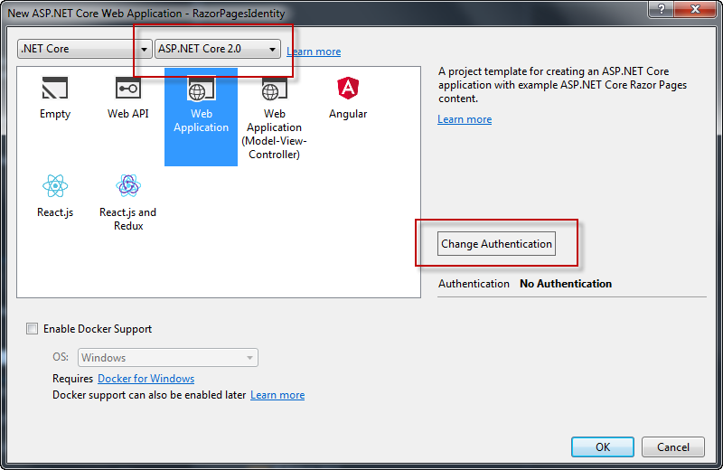

Click the Change Authentication button and then specify that you wish to use Individual user accounts and that you wish to store the user data in your own database;

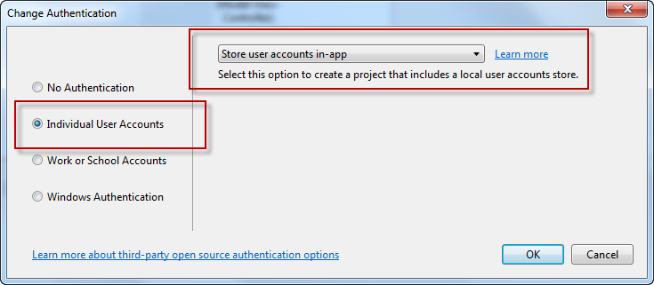

Having created the project,build it to ensure that all required packages are restored.

If you prefer to use the command line tools to generate the template files,navigate to the folder that you want to use for the project and use the following command:

`dotnet new razor --auth individaul`

The main difference between the two approaches to project creation is that the Visual Studio template results in an application that uses Sql Server localdb as a datastore,whereas the command line option uses the cross-platform SQLite database.

ASP.NET Identity uses Entity Framework Core for data access.EF Core uses migrations to keep the database in sync with the model.The first migration is already scripted and generates the schema for ASP.NET Identity.The SQLite version has the first migration already applied,so you will find a file named app.db in the project root.You need to run the update-database command to execute the first migration if you are using the Visual Studio template.In both cases the schema of the database is the same:

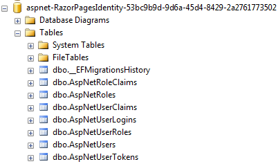

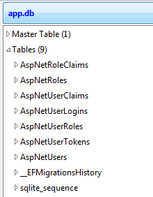

##### Project Overview

The project includes a number of folders and files over and above those found in a standard template:

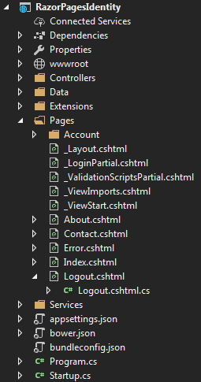

The Data folder contains the files required by Entity Framework Core,including the migrations and DbContext class.

The Services folder contains and interface for an EmailSender class,and an implementation that has one non-operational method,SendEmailAsync.You need to provide your own implementation if you plan to use this class.

The Extensions folder contains a couple of useful extension methods that are used for creating confirmation links in emails and for determining the correct URL to redirect to where necessary.

The Account folder within the Pages folder contains a number of Razor Page files designed for managing the most common authentication-related tasks and serve as a reasonable starting point.

Finally，the Controllers folder contains code for an MVC controller-AccountController,which has been included to cater for logging out.It has one action method - Logout,which signs the user out,logs the action and then redirects to the home page.Use of an MVC controller for this process is deliberate - since the logging out process has no associated UI,it was considered unnecessary to use a Razor Page,whose purpose afterall is to generate a UI.

##### Changing the Logout contrller to a Razor page

If you prefer not to have MVC controllers in your application for any reason,you can change the logging out process to use a Razor Page instead.

1. Add a new Razor page called Logout.cshtml to the Pages folder.
2. Add layout=null, to the code block in the .cshtml file 
3. Change the code in the LogoutModel file to the following:

```csharp
using Microsoft.AspNetCore.Identity;
using Microsoft.AspNetCore.Mvc;
using Microsoft.AspNetCore.Mvc.RazorPages;
using Microsoft.Extensions.Logging;
using RazorPagesIdentity.Data;
using System.Threading.Tasks;
namespace RazorPagesIdentity.Pages
{
    public class LogoutModel : PageModel
    {
        private readonly SignInManager<ApplicationUser> _signInManager;
        private readonly ILogger _logger;
        public LogoutModel(SignInManager<ApplicationUser> signInManager, ILogger<LogoutModel> logger)
        {
            _signInManager = signInManager;
            _logger = logger;
        }
        public async Task<IActionResult> OnPost()
        {
            await _signInManager.SignOutAsync();
            _logger.LogInformation("User logged out.");
            return RedirectToPage("/Index");
        }
    }
}
```
4. Open the LoginPartial.cshtml file.Remove the following attributes from the form tag helper:

```html
asp-controller="Accout" asp-action="Logout" method="post"
```

5. Replace them with an asp-page attribute as follows:
```html
asp-page="Logout"
```
The opening tag should now look like this:
```html
<form asp-page="Logout" id="logoutForm" class="navbar-right">
```
It is now safe to delete the Controllers folder and all of its contents,but before you do,it is worth taking a look at the content of the AccountController and comparing it with the LogoutModel class file content. They are almost identical.

##### Customising Identity In Razor Pages

The code for managing authentication in a Razor Pages application that is provided by the standard project template is a good starting point.However,changes are that you want to customise it to fit your own application needs.This article looks at the most common customisation requirements.

##### Customising the Registration

A user in ASP.NET Identity is represented by the ApplicationUser class.It has very few properties by default - UserName and Email.The registration form in the template takes the value provided in the Email input and applies it to both the UserName and Email properties.The following steps illustrate how to enable a user to provide a different value for their username:

1. Add a new property to the InputModel class in the Register.cshtml.cs file for the user name:

```csharp
public class InputModel
{
    [Required]
    [Display(Name="User Name")]
    public string UserName{get;set;}
}
```

2. Change the code in the OnPostAsync method so that the value for the user name is assigned from the new property:

```csharp
if(ModelState.IsValid)
{
    var user = new ApplicationUser{UserName=Input.UserName,Email = Input.Email};
}
```

3. Change the  registration form in the Register.cshtml file to accommodate the new property:

```html
<form asp-route-returnUrl="@Model.ReturnUrl" method="post">
    <h4>Create a new account.</h4>
    <hr />
    <div asp-validation-summary="All" class="text-danger"></div>
    <div class="form-group">
        <label asp-for="Input.UserName"></label>
        <input asp-for="Input.UserName" class="form-control" />
        <span asp-validation-for="Input.UserName" class="text-danger"></span>
    </div>
</form>
```

##### Adding properties to the ApplicationUser

You property want to capture more information from the user at the point of registration that just their email address and username.You do this by adding  properties to the ApplicationUser class for storing the additional values,and then use Entity Framework Core Migrations to apply the changes to the database so that the additional information can be stored.The following steps show how to add a first name,last name and date of birth fields:

1. Add two string properties and a DateTime property to the ApplicationUser class:

```csharp
public class ApplicationUser:IdentityUser
{
    public string FirstName{get;set;}
    public string LastName{get;set;}
    public DateTime BirthDate{get;set;}
}
```

2. Open the Package Manager Console and type the following command

`PM> add-migration AddedFirstNameLastNameBirthDate`

This will create a migration that, when applied, will modify the schema of the AspNetUsers table in the database to accommodate the additional data related to the properties that have been added.

3. Apply the migration by typing the following command in the Package Manager Console:

`PM> update-database`

4. Add Corresponding properties to the InputModel class (Register.cshtml.cs) together with appropiate annotations for display:

```csharp
[Display(Name="First Name")]
public string FirstName {get;set;}
[Display(Name="Last Name")]
public string LastName {get;set;}
[Display(Name="Date of birth")]
public DateTime BirthDate{get;set;}
```

5. Change the code in the OnPostAsync handler method in the Register.cshtml.cs file to assign values from the input class to the new ApplicationUser properties:

```csharp
if(ModelState.IsValid)
{
    var user = new ApplicationUser{
        UserName = Input.UserName,
        Email = Input.Email,
        FirstName = Input.FirstName,
        LastName = Input.LastName,
        BirthDate = Input.BirthDate
    };
}
```

6. Finally, add appropriate additional fields to the form in Register.cshtml

```html
<div class="form-group">

    <label asp-for="Input.FirstName"></label>
    <input asp-for="Input.FirstName" class="form-control" />
    <span asp-validation-for="Input.FirstName" class="text-danger">
</div>
<div class="form-group">
    <label asp-for="Input.LastName"></label>
    <input asp-for="Input.LastName" class="form-control" />
    <span asp-validation-for="Input.LastName" class="text-danger" ></span>
</div>
<div class="form-group">
    <label asp-for="Input.BirthDate"></label>
    <input asp-for="Input.BirthDate" class="form-control" />
    <span asp-validation-for="Input.BirthDate" class="text-danger"></span>
</div>
```

##### Customising the Password Options

The following default password requirements may not suit your purposes:

- The Password must be at least 6 and at max 100 characters long.
- Passwords must have at least one non alphanumeric character.
- Passwords must have at least one lowercase('a'-'z').
- Passwords must have at least one uppercase('A'-'Z').

You can change these defaults via the Razor Pages options in the ConfigureServices method of the Startup class.Most of the options are booleans,requiring a true or false value.You can also specify a minimum length and a miunimum number of unique characters.The option names are self-explanatory:

```csharp
services.AddIdentity<ApplicationUser,IdentityRole>(options=>
{
    options.Password.RequireDigit = true;
    options.Password.RequireLowercase = true;
    options.Password.RequireUppercase = true;
    options.Password.RequiredLength = 6;
    options.Password.RequireNonAlphanumeric = false;
    options.Password.RequiredUniqueChars = 6;
}).AddEntityFrameworkStores<ApplicationDbContext>()
.AddDefaultTokenProviders();
```

##### Customising the resources that require authentication

Finally,I look at how to protect resources from non-authenticated users.The default template prevents users from accessing the contents of the Pages/Account/Manage folder,and the Logout action on the AccountController,These are protected by conventions established in the ConfigureServices method of the Startup class:


```csharp
services.AddMvc().AddRazorPagesOptions(Options=>
{
    options.Conventions.AuthorizeFolder("/Account/Manage");
    options.Conventions.AuthorizePage("/Account/Logout");
});
```

You can protect other resources by adding additional conventions using the AuthorizeFolder method to restrict access to a folder and all of its contents,or the AuthorizePage method to restrict access on a page-by-page basic.Alternatively,you can use the AuthorizeAttribute to protect a specific page.You do this by decorating the page model class for the page with [Authorize]:

```csharp
[Authorize]
public class AboutModel:PageModel
{

}
```

Customising the Login page

The path for default login page is /Account/Login.This is controlled by one of the ApplicationCookie options,which can be changed in ConfigureServices as follows:

```csharp
services.ConfigureApplicationCookies(options=>{
    options.LoginPath = "/Admin/Login";
});
```


#### Using Ajax


##### Working with AJAX in Razor Pages 

###### Introduction

AJAX is a technique used for marking requests from the browser to the server for various purposes such as the retrieval of assorted content including data,HTML,XML,posting form values and so on.Requests are initiated from client script (usually JavaScript) once the page has already been loaded in the browser.Traditionally,the browsers' built in XMLHttpRequest object is used to make the request,but newer browsers also support the Fetch API.Requests are by default asynchronous and do not block the browser - allowing the user to continue to work on the web page while awaiting the response from the server.

The main effect achieved by using AJAX to manage workflow in a web page is to produce a smoother, more user-friendly experience for the user.Previous to the widespread adoption of AJAX-based techniques,pages were rendered entirely on the web server.If you wanted to update parts of the page as a result of choices that the user made,those choices would have to be sent to the server as a form post and the page would be regenerated on the web server in its entirety.The user would have to wait for the new page to be generated on the server and rendered in the browser before they could continue their task.The use of AJAX in a web page eliminates this stop-start approach to working in a web page.

> **Note**
>
> The examples below feature the use of Arrow Functions, a feature of ES 6 (also confusingly known as ECMAScript 2015).They are not supported in Internet Explorer 11 or lower.If you want to try examples out in IE, you will need to revert to the older method of defining function expressions in Javascript:
>
> Arrow Function:
> ```csharp
> ()=>{
>   // code to execute
>}
> ```
> Old way:
> 
> function(){
>   //code to execute  
> }
>
>

##### AJAX Tools

###### XMLHttpRequest

The primary tool for makeing AJAX requests is the XMLHttpRequest object which is included in every browser.The following code shows how to use it from a Razor page to update part of the page:

```html
@page
@model AjaxModel

<h2>Ajax Partial Example</h2>
<p><button class="btn btn-primary" id="load">Load</button></p>

@section scripts{
    <script>
        document.getElementById('load')
            .addEventListener('click',()=>{
                var xhr = new XMLHttpRequest();
                xhr.onreadystatechange = function(){
                    if(this.readyState==4&&this.status==200){
                        document.getElementById('grid').innerHTML = this.responseText;
                    }
                };
                xhr.open('get','/ajaxdemo');
                xhr.send();
            })
    </script>
}
```

The client-side code is placed in a section named scripts which is defined in the layout page.The button with the id of load has a click event handler applied to it that creates and uses an XMLHttpRequest object(xhr) to obtain the resource located at the '/ajaxdemo' URL.The xhr component uses a 'get' request,and has a listener attached to its onreadyStatechange property.The readyState property value indicates the current state of the component.It changes as the request is made.The value 4 indicates that the request has completed.The status property contains the HTTP status code of the response.HTTP status code 200 is defined as ok, or that the request has succeeded.If both of these are the case,the responseText from the request is placed in the element with an id of grid.

##### jQuery

The jQuery library was introduced to simplify working in JavasScript across different browsers.It unified the varying APIs offered by different browser vendors behind easy-to-use wrapper methods and provides a much terser syntax for accomplishing the most common tasks.AJAX is one of many areas where that advantage of using jQuery is really obvious.Here is the same functionality from the previous section implemented using jQuery:

```csharp
@page
@model AjaxModel
<h2>Ajax Partial</h2>
<p><button class="btn btn-primary" id="load"></button></p>
<div id="grid"></div>

@section scripts{
    <script>
        $(function(){
            $('#load').on('click',function(){
                $('#grid').load('/ajaxdemo');
            });
        });
    </script>
}
```

##### Fetch API

The Fetch API is relatively new,and as such is unsupported in IE 11 or earlier.The main benefit of using the Fetch API is that it utilise Promises,which are intended to make working with asynchronous code easier.Here is the Fetch version of the previous examples:

```html
@page
@model AjaxModel
<h2>Ajax Partial Example</h2>
<p><button class="btn btn-primary" id="load">Load</button></p>
<div id="grid"></div>

@section scripts{
    <script>
        document.getElementById('load').addEventListener('click',()=>{
            fetch('/ajax')
            .then((response)=>{
                return response.text();
            })
            .then((result)=>{
                document.getElementById('grid').innerHTML = result;
            });
        });
    </script>
}
```

##### jQuery Unobtrusive AJAX 

The jQuery Unobtrusive Ajax library was introduced by Microsoft along with ASP.NET MVC 3.0 back in 2010.It is designed to minimise the amount of client side you need to write to perform some AJAX-related tasks and in many cases eliminate it altogether.Unobtrusive Ajax depends on jQuery,but behaviours are attached to elements declaratively via custom data-* attributes rather than programmatically in client side script.

The previous examples,rewritten to use this library require nothing in the scripts section apart from a reference to the library file:

```html
@page
@model AjaxModel

<h2>Ajax Partial Example</h2>

<p><a class="btn btn-primary" data-ajax="true" data-ajax-update="#grid" data-ajax-url="/ajax">Load</a></p>
<div id="grid"></div>
@section scripts{
    <script src="~/lib/jquery-ajax-unobtrusive/jquery.unobtrusive-ajax.min.js"></script>
}

```
This time the button has been changed to an anchor element,because Unobtrusive AJAX only targets anchors and forms.The URL for the AJAX request is specified via the data-ajax-url attribute.The element to update is specified via the data-ajax-update attribute,and data-ajax is set to true to enable unobtrusive behaviour on this element.

These are not the only tools for making AJAX calls.There are other libraries such as Axios,SuperAgent and so on.In addition,some front-end frameworks like Angular incorporate their own components for making HTTP calls.

###### Examples

The Collection of examples below show how to accomplish the most common AJAX-based tasks in a Razor Pages environment.They all feature the use of jQuery and some of them also use Fetch.

- Partial Page Update
- Cascading Dropdowns
- Form Post
- File Upload
- Working with Json

##### Posting Forms with AJAX in Razor Pages

AJAX is a technique used for making asynchronous requests from the browser to the server for various purpose including posting form values.This section covers asynchronous from submission from a Razor Page using both the jQuery AJAX capability and the Fetch API.

##### The Razor Page

The PageModel for this example includes a property called InputModel,which encapsulates the values to be bound when the form is posted:

```csharp
public class IndexModel:PageModel
{
    [BindProperty]
    public InputModel Input{get;set;}
    public void OnPost()
    {

    }
}

public class InputModel
{
    [Display(Name="First Name")]
    public string FirstName{get;set;}
    [Display(Name="Last Name")]
    public string LastName{get;set;}
    [EmailAddress]
    public string Email{get;set;}
    [Display(Name="Date of Birth"),DateType(DateType.Date)]
    public DateTime DateOfBirth{get;set;}
}
```

The InputModel properties make use of attributes to control the output of tag helpers,specifically the label and input tag helpers.

Here is the content page,styled using BootStrap 4:

```html
<form method="post" class="col-sm-6">

    <div class="form-group row">
        <label asp-for="Input.FirstName" class="col-sm-3 col-form-label"></label>
        <div class="col-sm-7">
            <input asp-for="Input.FirstName" class="form-control">
        </div>
    </div>
    <div class="form-group row">
        <label asp-for="Input.LastName" class="col-sm-3 col-form-label"></label>
        <div class="col-sm-7">
            <input asp-for="Input.LastName" class="form-control">
        </div>
    </div>

    <div class="form-group row">
        <label asp-for="Input.DateOfBirth" class="col-sm-3 col-form-label"></label>
        <div class="col-sm-7">
            <input asp-for="Input.DateOfBirth" class="form-control">
        </div>
    </div>

    <div class="form-group row">
        <label asp-for="Input.Email" class="col-sm-3 col-form-label"></label>
        <div class="col-sm-7">
            <input asp-for="Input.Email" class="form-control">
        </div>
    </div>

    <div class="form-group row">
        <div class="col-sm-7 offset-sm-3">
            <button class="btn btn-primary" id="submit">Submit</button>
        </div>
    </div>

</form>

```
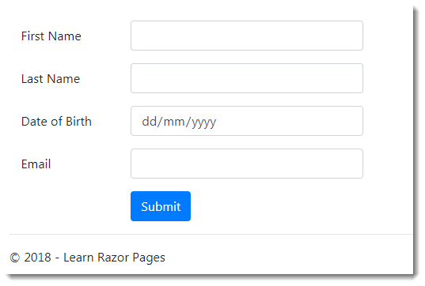

##### Using jQuery

The first example looks at using jQuery to post the form content asynchronously.The actual script is included using a Razor section,but can just as easily be included in a separate file:

```html
@section scripts{
    <script>
        $(function(){
            $('#submit').on('click',function(evt){
                evt.preventDefault();
                $.post('',$('form').serialize(),function(){
                    alert('Posted using jQuery');
                });
            });
        });
    </script>
}
```

The jQuery library includes a number of wrapper functions that result in a minimal amount of code required to make an AJAX request.The post function takes care of initialising the XMLHttpRequest object and setting the correct method for the request.This example will post to the current URL because the url parameter is left empty.The data to be posted is constructed using the serialize method,which takes care of retrieving all form values - including the request verification token - and encoding them correctly.

##### Unobtrusive AJAX 

This example uses the Unobtrusive AJAX library which is part of ASP.NET Core and is an add-on to jQuery.It is designed to minimise the amount of script you need to write to handle AJAX requests.Unobtrusive AJAX relies on custom HTML 5 data- attributes being applied to the form.So the HTML for the opening form tag is altered as follows:

```html
<form method="post" class="col-sm-6" data-ajax="true" data-ajax-method="post" data-ajax-complete="completed">
```

The data-ajax-completed attribute references a callback function named completed defined in the scripts section:

```html
@section scripts{
    <script>
        completed = () => {
            alert("Posted using Unobtrusive AJAX");
        };
    </script>
}
```

Using Fetch

The Fetch API is supported by all modern browsers except Internet Explorer.It is supported by the new Edge browser from Microsoft,which is available on Windows 10.This example makes no use of the jQuery library at all,relying on pure Javascript:

```html
@section scripts{
    <script>
        document.forms[0].onsubmit = () => {
            let formData = new FormData(document.forms[0]);
            fetch('',{
                method:'post',
                body:new URLSearchParams(formData)
            })
            .then(()=>{
                alert('Posted using Fetch');
            });
            return false;
        };
    </script>
}
```

This example uses the FormData API to construct a set of key/value pairs representing the form fields and their values.The FormData constructor will accepts an HTML form element and then use the name property of each element in the form for the keys and their submitted value for the values.

The FormData object is passed to an instance of URLSearchParams,an object that changes the content-type of the request from multipart/formdata (the default for FormData) to application/x-www-form-urlencoded,which is the correct type for posting simple text/ASCII data.It should be pointed out that you can leave the content-type as multipart/form-data.Simple text inputs will still be bound to PageModel properties by the model binder.

XMLHttpRequest

For completeness,here is the script for a version that uses the XMLHttpRequest object without any third party libraries:

```html
@section scripts{
    <script>
        document.forms[0].onsubmit = ()=>{
            let formData = new FormData(document.forms[0]);
            var xhr = new XMLHttpRequest();
            xhr.onreadstatechange = function(){
                if(this.readState ==4 && this.status==200)
                {
                    alert('Posted using XMLHttpRequest');
                }
            };

            xhr.open('post','',true);
            xhr.send(new URLSearchParams(formData));
            return false;
        };
    </script>
}
```

##### Partial Page Update with AJAX in Razor Pages

Partial Pages consist of fragments of HTML and server-side code to be included in any number of pages or layouts.Partial pages can be used to break up complex pages into smaller units,thereby reducing the complexity and allowing teams to work on different units concurrently.They can also be used to provide content for updating part of the rendered web page via AJAX in client side script.

A partial page is a single .cshtml file.It has no PageModel and it doesn't have an @page directive at the top.A partial can be strongly typed-have an @model directive,or it can work purely with ViewData.The following examples are based on strongly typed partials which is considered best practice.

The example features the same ICarService used in Working with Json in Razor Pages.A collection of Car objects will be passed to the partial for display,which will be invoked via client-side script:

First,the Car entity:

```csharp
public class Car
{
    public int Id {get;set;}
    public string Make {get;set;}
    public string Model { get; set; }
    public int Year { get; set; }
    public int Doors { get; set; }
    public string Colour { get; set; }
    public decimal Price { get; set; }
}
```

The service has one method that conforms to an interface,generating and returning a list of cars:

```csharp
public interface ICarService
{
    List<Car> GetAll();
}

public class CarService:ICarService
{
    public List<Car> GetAll()
    {
        List<Car> cars = new List<Car>{
            new Car{Id=1,Make="Audi",Model="R8",Year=2014,Doors=2,Colour="Red",Price=79995},
            new Car{Id=2,Make="Aston Martin",Model="Rapide",Year=2010,Doors=2,Colour="Black",Price=54995},
            new Car{Id = 3, Make="Porsche",Model=" 911 991",Year=2016,Doors=2,Colour="White",Price=155000},
            new Car{Id = 4, Make="Mercedes-Benz",Model="GLE 63S",Year=2017,Doors=5,Colour="Blue",Price=83995},
            new Car{Id = 5, Make="BMW",Model="X6 M",Year=2016,Doors=5,Colour="Silver",Price=62995},
        };

        return cars;
    }
}
```

This service is registered with the ASP.NET Core Dependency Injection system so that it can be made available throughout the application:

```csharp
public void ConfigureServices(IServiceCollection services)
{
    services.AddMvc();
    services.AddTransient<ICarService,CarService>();
}
```

The partial itself contains an HTML table styled using Bootstrap.It is named _CarPartial.cshtml and is placed in the Pages/Shared Folder - that being one of the default search locations for partials in Razor Pages.The model that the partial expects is a List<Car>:

```html
@model List<Car>

<table class="table table-striped">
    @foreach(var car in Model)
    {
        <tr>
            <td>@car.Model</td>
            <td>@car.Make</td>
            <td>@car.Year</td>
            <td>@car.Price</td>
        </tr>   
    }
</table>
```

Most often,the handler method that serves up partials will not be the primary handler method in a specific page.Instead,a named handler will be used.The following code shows a basic PageModel that includes a named handler (OnGetCarPartial) returning a PartialViewResult:

```csharp
public class AjaxPartialModel:PageModel
{
    private readonly ICarService _carService;
    public AjaxPartialModel(ICarService carService)
    {
        _carService = carService;
    }

    public List<Car> Cars {get;set;}

    public void OnGet()
    {

    }

    public PartialViewResult OnGetCarPartial()
    {
        Cars = _carService.GetAll();
        return Partial("_CarPartial",Cars);
    }
}
```

> **Note**
>
> The Partial helper method was added to the PageModel class in ASP.NET Core 2.2. In Razor Pages versions up to and including 2.1,you must explicitly create an instance of PartialViewResult and return that from the handler,passing in the current ViewData dictionary and,optionally,a model for the partial (if it expects one):
>
> ```csharp
> public PartialViewResult OnGetCarPartial()
> {
>       Cars = _carService.GetAll();
>       return new PartialViewResult{
>           ViewName = "_CarPartial",
>           ViewData = new ViewDataDictionary<List<Car>>(ViewData,Cars)
>       };
> }
>```

Here is the content page where jQuery is used to make the AJAX request when the button is clicked:

```html
@page
@model RazorPagesTests.Pages.AjaxPartialModel

<h2>Ajax</h2>
<p><button class="btn btn-primary" id="load">Load</button></p>
<div id="grid"></div>

@section scripts{
    <script>
        $(function(){
            $('#load').on('click',function(){
                $('#grid').load('/ajaxpartial?handler=CarPartial');
            });
        });
    </script>
}
```

Notice particularly the URL that is passed to the load method - the name of the named handler method (without the OnGet part) is passed to a query string value called handler.If you prefer not to have a query string, you can create a route template in the Razor Page that adds an optional item named handler to the route values:

`@page "{handler}"`

This enables you to can pass the name of the handler as a segment of the URL:

`$('#grid').load('/ajaxpartial/carpartial');`

Here is an alternative version that uses the Fetch API instead of the XMLHttpRequest object via jQuery:

```html
@page
@model RazorPagesTests.Pages.AjaxPartialModel

<h2>Ajax</h2>
<p><button class="btn btn-primary" id="load">Load</button></p>
<div id="grid"></div>

@section scripts{
    <script>
        document.getElementById('load').addEventListener('click',()=>{
            fetch('/ajaxpartial?handler=CarPartial'
            .then((response)=>{
                return response.text();
            })
            .then((result)=>{
                document.getElementById('grid').innerHTML = result;
            });
        });
    </script>
}

```

##### Cascading Dropdowns With AJAX in Razor Pages

The cascading dropdown pattern is typically used to help users to filter data.The first dropdown is populated with the broadest options, and subsequent dropdowns are populated with options that relate to the the selected value of the preceding dropdown.This requirement does not need AJAX,but using an approach that incorporates AJAX requests provides a much smoother experience for the user.

In the example that follows,the user will be presented with a set of Category options.Depending on the selected CategoryId value,SubCategories will be obtained via AJAX and used to populate the second dropdown.This example features a very simple service that provides collections of Category and SubCategory entities and its interface:

```csharp
public interface ICategoryService
{
    IEnumerable<Category> GetCategories();
    IEnumerable<SubCategory> GetSubCategories(int categoryId);
}

public class CategoryService : ICategoryService
{
    public IEnumerable<Category> GetCategories()
    {
        return new List<Category>{
            new Category {CategoryId=1,CategoryName="Category 1"},
            new Category {CategoryId=2,CategoryName="Category 2"},
            new Category {CategoryId=3,CategoryName="Category 3"}
        };
    }

    public IEnumerable<SubCategory> GetSubCategories(int categoryId)
    {
        var subCategories = new List<SubCategory> {
            new SubCategory { SubCategoryId = 1, CategoryId = 1, SubCategoryName="SubCategory 1" },
            new SubCategory { SubCategoryId = 2, CategoryId = 2, SubCategoryName="SubCategory 2" },
            new SubCategory { SubCategoryId = 3, CategoryId = 3, SubCategoryName="SubCategory 3" },
            new SubCategory { SubCategoryId = 4, CategoryId = 1, SubCategoryName="SubCategory 4" },
            new SubCategory { SubCategoryId = 5, CategoryId = 2, SubCategoryName="SubCategory 5" },
            new SubCategory { SubCategoryId = 6, CategoryId = 3, SubCategoryName="SubCategory 6" },
            new SubCategory { SubCategoryId = 7, CategoryId = 1, SubCategoryName="SubCategory 7" },
            new SubCategory { SubCategoryId = 8, CategoryId = 2, SubCategoryName="SubCategory 8" },
            new SubCategory { SubCategoryId = 9, CategoryId = 3, SubCategoryName="SubCategory 9" }
        };
        return subCategories.Where(s => s.CategoryId == categoryId);
    }
}
```

The GetCategories method returns all Category instances.The GetSubCategories method returns a collection of SubCategory entities,filtered by the categoryId value passed in.The interface and its implementation need to be registered with the dependency injection system in Startup:

```csharp
public void ConfigureServices(IServiceCollection services)
{
    services.AddTransient<ICategoryService,CategoryService>();
}
```

The PageModel class for the Razor page where the dropdowns will appear is as follows:

```csharp
public class CascadingDropdownsModel : PageModel
{
    private ICategoryService _categoryService;
    public CascadingDropdownsModel(ICategoryService categoryService)=>this._categoryService = categoryService;

    [BindProperty(SupportsGet=true)]
    public int CategoryId{get;set;}
    public int SubCategoryId{get;set;}
    
    public SelectList Categories{get;set;}

    public void OnGet()
    {
        Categories = new SelectList(_categoryService.GetCategories(),nameof(Category.CategoryId),nameof(Category.CategoryName));
    }

    public JsonResult OnGetSubCategories()
    {
        return new JsonResult(_categoryService.GetSubCategories(CategoryId));
    }
}

```

The CategoryService is injected into the constructor and assigned to a private field for later use. Three public properties have been added to the PageModel.The first is an int representing the selected CategoryId value.The AJAX request will use the GET verb,so the SupportsGet=true option has been applied to the BindProperty attribute that decorates the property.The second property represents the selected SubCategory.Its only use in this example is to render a select tag helper,but if you want to capture the selected value using model binding,you would need to decorate be property with the BindProperty attribute accordingly.

The final public property is a SelectList type,and will represent the options for the initial Category dropdown list.The property is instantiated in the OnGet handler method.

Another handler method OnGetSubCategories, this one being a named handler method,is added.It returns the filtered SubCategory collection as JASON.

The content page contains two select tag helpers:

```html
<h4>Categories</h4>
<select asp-for="CategoryId" asp-items="Model.Categories">
    <option value="">Select Category</option>
</select>
<h4>SubCategories</h4>
<select asp-for="SubCategoryId"></select>
```

The first is populated with the categories while the second is initially empty:

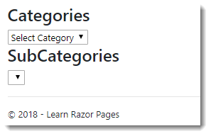

The content page also contains a script block that utilises jQuery to add an event listener to the first drop down and make the AJAX call to the named handler:


```html
@section scripts{
    <script>
        $(function () {
        $("#CategoryId").on("change", function() {
            var categoryId = $(this).val();
            $("#SubCategoryId").empty();
            $("#SubCategoryId").append("<option value=''>Select SubCategory</option>");
            $.getJSON(`?handler=SubCategories&categoryId=${categoryId}`, (data) => {
                $.each(data, function (i, item) {
                    $("#SubCategoryId").append(`<option value="${item.subCategoryId}">${item.subCategoryName}</option>`);
                });
            });
        });
    }); 
    </script>
}
```

Each time the selection in the first dropdown is changed,the second one is cleared,and then populated with the SubCategories returned from the getJSON call.

##### Fetch

The following code block is the equivalent to the previous one exccpt that it uses the Fetch API and no jQuery at all:


```html

@section scripts{
<script>
    document.getElementById('CategoryId').addEventListener('change', (e) => {
        document.getElementById('SubCategoryId').innerHTML = "<option value=''>Select SubCategory</option>";
        fetch(`?handler=SubCategories&categoryId=${e.target.value}`)
            .then((response) => {
                return response.json();
            })
            .then((data) => {
                Array.prototype.forEach.call(data, function (item, i) {
                    document.getElementById('SubCategoryId').innerHTML += `<option value="${item.subCategoryId}">${item.subCategoryName}</option>`
                });
            });
    });
</script>
}
```

##### Uploading Files via AJAX in Razor Pages

AJAX is a technique used for making asynchronous requests from the browser to the server for various purposes including posting form values.This section covers asynchronous form submission from a Razor Page using both the jQuery AJAX capability and the Fetch API.

##### The Razor Page

The PageModel for this example includes a property called UploadedFile which represents the file that gets uploaded when the form is posted.The IFormFile type is located in the Microsoft.AspNetCore.Http namespace:

```csharp
public class IndexModel : PageModel
{
    [BindProperty,Display(Name="File")]
    public IFormFile UploadedFile { get;set;}
    public void OnPost()
    {

    }
}
```

The UploadedFile property make use of attributes to control the output of tag helpers,specifically the label and input tag helpers.

Here is the content page,styled using BootStrap 4:

```html

<form method="post" class="col-sm-6">

    <div class="form-group row">
        <label asp-for="UploadedFile" class="col-sm-3 col-form-label"></label>
        <div class="col-sm-7">
            <input asp-for="UploadedFile" class="form-control">
        </div>
    </div>

    <div class="form-group row">
        <div class="col-sm-7 offset-sm-3">
            <button class="btn btn-primary" id="submit">Submit</button>
        </div>
    </div>

</form>

```

The input tag helper automatically ensures that the type property on the input is rendered as file, based on the data type of the property passed to the asp-for attribute.

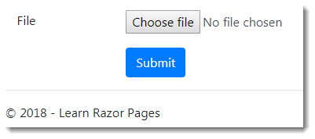

##### Using jQuery

The first example looks at using jQuery to post the form content asynchronously.The actual scripts is included using a Razor section,but can just as easily be included in a separate file:

```html
@section scritps{
    <script>
        $(function(){
            $('#submit').on('click',function(evt){
                evt.preventDefault();
                $.ajax({
                    url:'',
                    data:new FormData(document.forms[0]),
                    contentType:false,
                    processData:false,
                    type:'post',
                    success:function(){
                        alert('Uploaded by jQuery');
                    }
                });
            });
        });
    </script>
}
```
The jQuery library includes a number of wrapper functions that result in a minimal amount of code required to make an AJAX request e.g. $.post,$.get.However,for uploading files,the full $.ajax version is needed because some settings need to be changed.The contenttype needs to be set to false along with the processData option.Otherwise jQuery will not see this as a file upload,and will set the encoding of the request body to application/x-www-form-urlencode,which is fine for simple text,but not for files.

When the form is posted,the file is automatically bound to the IFormFile property on the PageModel:

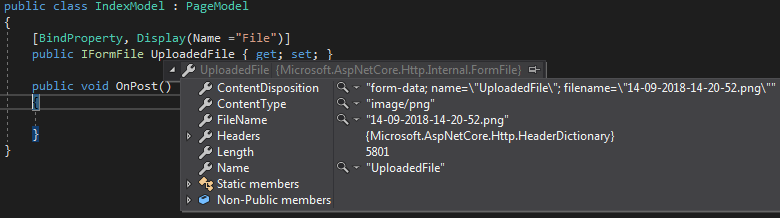

##### Using Fetch

The Fetch API is supported by all modern browsers except Internet Explorer.It is supported by the new Edge browser from Microsoft,which is available on Windows 10.This example makes no use of the jQuery library at all,relying on pure Javascript:

```html
@section scripts{
    <script>
        document.getElementById('submit').addEventListener('click',(evt)={
            evt.preventDefault();
            let data = new FormData(document.forms[0]);
            fetch('',{
                method:'post',
                body:data
            })
            .then(()=>{
                alert('Posted using Fetch');
            });
        });
    </script>
}
```

This example uses the FormData API to construct a set of key/value pairs representing the form fields and their values.The FormData constructor will accepts and HTML form element and then use the name property of each element in the form for the keys and their submitted value for the values.

When using FormData,the encoding type of the request body defaults to multipart/form-data,which is the correct encoding for posting binary data.

##### Using XMLHttpResult

Finally,this is how it is achieved using the XMLHttpRequest object:

```html
section scripts{
    document.forms[0].onsubmit=()=>{
        let formData = new FormData(document.forms[0]);
        var xhr = new XMLHttpRequest();
        xhr.onreadystatechange = function(){
            if(this.readState === 4 && this.status === 200){
                alert('Posted using XMLHttpRequest');
            }
        };
        xhr.open('post','',true);
        xhr.send(formData);
        return false;
    };
}
```


##### Using jQuery Unobtrusive AJAX in ASP.NET Core Razor Pages

The jQuery Unobtrusive AJAX library has been around for almost 10 years,and was first introduced in ASP.NET MVC 3.0,just as adoption of HTML5 custom data-* attributes was becoming commonplace and supported widely across browsers.It is a small library,4kb when minified,that makes use of jQuery's AJAX capabilities.It is now part of ASP.NET Core and is hosted at GitHub.

Unobtrusive AJAX,like other unobtrusive libraries,works by examining selected HTML elements for the presence of specific custom data- attributes,and then attaching jQuery's AJAX functions to those elements when they are clicked.In essence,it saves much,if not all of the boilerplate code that you would otherwise have to write to fire an AJAX request and process the response.

You can obtain Unobtrusive AJAX from npm (npm i jquery-ajax-unobtrusive from the Package Manager Console in Visual Studio),or you can use one of the many ways that Visual Studio provides to install it from NuGet.Once you have it,you can create a new folder for it in wwwroot/lib and copy the file(s) there:

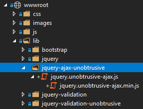

Then you can reference it in the page that you want to use it in directly or as a fallback to a CDN-hosted version:

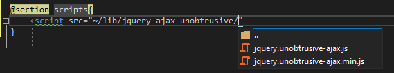

##### Custom Attributes

The following table details the custom attribute control the behaviour of jQuery Unobtrusive AJAX:

|Attribute|Description|
|---|---|
|data-ajax|Must be set to true to activate unobtrusive Ajax on the target element.|
|data-ajax-confirm|Gets or sets the message to display in a confirmation window before a request is submitted.|
|data-ajax-method|Gets or sets the HTTP request method("Get" or "Post").|
|data-ajax-mode|Gets or sets the mode that specifies how to insert the response into the target DOM element.Valid values are before,after and replace.Default is replace|
|data-ajax-loading-duration|Gets or sets a value,in milliseconds,that controls the duration of the animation when showing or hiding the loading element.|
|data-ajax-loading|Gets or sets the id attribute of an HTML element that is displayed while the Ajax function is loading.|
|data-ajax-begin|Gets or sets the name of the Javascript function to call immediately before the page is updated.|
|data-ajax-complete|Gets or sets the Javascript function to call when response data has been instantiated but before the page is updated.|
|data-ajax-failure|Gets or sets the javacript function to call if the page update fails.|
|data-ajax-success|Gets or sets the javascript function to call after the page is successfully updated|
|data-ajax-update|Gets or sets the ID of the DOM element to update by using the response from the server.|
|data-ajax-url|Gets or sets the URL to make the request to.|

The following example shows a form with the minimum attributes required to convert to an AJAX submission:

```html
@page
@model IndexModel

<form method="post" data-ajax="true" data-ajax-method="post">
    Name:<input type="text" name="name" /><br>
    <input type="submit" />

</form>
```

There is no action specified,so the form values will be posted to the URL of the page where they can be processed in an OnPost handler.Note that the form's method attribute is specified as post,along with the custom data-ajax-method attribute.In the absendce of an action attribute being applied this is necessary to ensure that the request verification token hidden field is generated and included in the form.Without this,form posts will result in a 400 Bad Request status code because they will fail the request verification test:

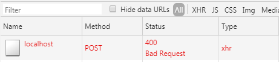

The data-ajax-confirm attribute takes a string representing the message to display in a comfirm prompt to users before the form i s posted:

```html
<form method="post" data-ajax="true" data-ajax-method="post" data-ajax-confirm="Are you sure?">
    Name:<input type="text" name="name" /><br>
    <input type="submit" />
</form>
```

##### Callback functions

When an AJAX request is made using jQuery, a jqXHR object is returned.This is made available to callback functions that you specify via the data-ajax-complete,data-ajax-success and data-ajax-failure attributes.

The next example shows how to access the jqXHR object via a parameter to the callback function:

```html
@page
@model IndexModel

<form method="post" data-ajax="true" data-ajax-method="post" data-ajax-comlete="completed">
    Name:<input type="text" name="name" /><br>
    <input type="submit" />
</form>

@section scripts{
    <script src="~/lib/jquery-ajax-unobtrusive/jquery.unobtrusive-ajax.min.js"></script>
    <script>
        completed = function(xhr){
            alert('Hi ${xhr.responseText}!');
        }
    </script>
}
```

The PageModel includes a bound property representing the name that is posted and returns it back as a response:

```csharp
public class IndexModel : PageModel
{
    [BindProperty]
    public string Name {get;set;}
    public IActionResult OnPost()
    {
        return Content(Name);
    }
}
```

When the AJAX post completes (successfully or otherwise), the completed function is called with the jqHR object as a parameter.The response body is available in the responseText property.

The next example shows how to catch errors using the data-ajax-failure attribute:

```html
@page
@model IndexModel

<form method="post" data-ajax="true" data-ajax-url="/notfound" data-ajax-method="post" data-ajax-failure="failed">
    Name:<input type="text" name="name" /><br>
    <input type="submit" />
</form>

@section scripts{
    <script src="~/lib/jquery-ajax-unobtrusive/jquery.unobtrusive-ajax.min.js"></script>
    <script>
        failed = function (xhr) {
            alert(`Status: {xhr.status}, Status Text: {xhr.statusText}`);
        };
    </script>
}
```

In this case,the post results in a 404 not found error,details of which are displayer in a browser alert:

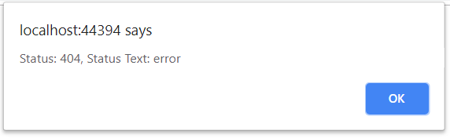

##### Partial Updates

The data-ajax-update attribute is used to specify the DOM element that should be updated with the response.The value passed to it is a standard CSS selector.If multiple elements match the selector,the first matching element will be updated.

In this example,the attribute is attached to an anchor element.The click will be intercepted by jQuery and managed asychronously:

```html
@page
@model IndexModel

<a href="" data-ajax="true" data-ajax-url="/index/partial" data-ajax-update="#panel">Click here</a>
<div id="panel"></div>
```

The URL is a named handler method in the Index PageModel:

```csharp
public class IndexModel:PageModel
{
    public IActionResult OnGetPartial()
    {
        return new PartialViewResult{
            ViewName = "_HelloWorldPartial",
            ViewData = this.ViewData
        };
    }
}
```

The content of _HelloWorldPartial.cshtml is just one line:

`<p>@ViewData["Message"] from the Hello World partial at @DateTime.Now</p>`

When the link is clicked,the content is placed in the div with the id of panel:

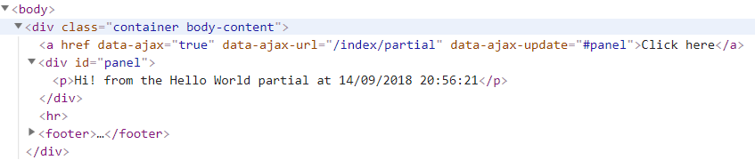

If you click the link again,the existing content will be replaced with the new response.That is the default behaviour when the data-ajax-mode is not specified.If you want to insert the new content so that it appears before the existing content,set the data-ajax-mode value to before:

```html
<a href="" data-ajax="true" data-ajax-url="/index/partial" data-ajax-update="#panel" data-ajax-mode="before">Click here</a>
```

Now the response generated from subsequent clicks appears above the existing content:


Setting the data-ajax-mode attribute to after will result in the response being appended to any existing content.

##### Displaying a Loading GIF

Sometimes, as a courtesy to users to let them know that something is happening when an asynchronous operation takes a while to complete,an indication of progress is displayed.This usually takes the form of an animated gif image,or an animated font.The data-ajax-loading attribute specifies the element that should be displayed while the AJAX operation is taking place.The data-ajax-loading-duration attribute takes a value in milliseconds.This is used to determine how long it takes to make the loading element visible and then to hide it.The loading element slides down and to the right when becoming visible.If no value is specified,the default is 400.

In this example, a spinner from the FontAwesome font collection(<i class="fa-solid fa-spinner"></i>) is used to show progress. It has its display property set to none initially. jQuery will remove that setting before the request is sent,and then reapply it once it has completed (regardless of success).

```html
<a href="" data-ajax="true" data-ajax-url="/index/partial" data-ajax-update="#panel" data-ajax-loading="#spinner">Click here</a>

<span id="spinner" style="display:none;"><i class="fas fa-spinner fa-spin"></i></span>

<div id="panel"></div>
```

In order to simulate a long running operation, the handler method is altered to include a call to Thread.Sleep:

```csharp
public iActionResult OnGetPartial()
{
    Thread.Sleep(2000);
    return new PartialViewResult
    {
        ViewName = "_HelloWorldPartial",
        ViewData = this.ViewData
    }
}
```

This ensures that the animation will be visible for at least 2 seconds:


#### Working with jsonn

##### Working with JSON in Razor Pages

UI generation and processing within web applications is moving increasingly to the client. Data processing and storage is undertaken on the server, with JSON being the preferred format for exchanging data between the server and the client. The recommended approach to providing data services that work with JSON in ASP.NET Core is to use the Web API framework.

##### Web API

Web API is a framework for building HTTP-based services. Typically, that means making data available as a service via the HTTP procotol. Services built using Web API conform to the REpresentational State Transfer (REST) architectural pattern. An important element of this is that the service should respond appropriately based on the HTTP verb that was used to make the request (GET,POST,PUT,DELETE etc.). Different verbs are used by the client making the request to express the intent behind the operation. They map to CURD operations as follows:

|HTTP Verb|CURD Operation|
|---|---|
|POST|Create|
|GET|Read|
|PUT|Update|
|DELETE|Delete|

Web API controllers are available to a Razor Pages application without any additional configuration, and the default data format that they work with is JSON.

##### An example application

The following walkthrough illustrates how to integrate Web API into a Razor Pages application to provide CURD services. The application itself is a single page CURD application. The subject matter is cars. The application uses jQuery on the client for managing the UI, and an in-memory cache to store the cars. Both choices were made with simplicity in mind for demonstration purposes.

1. Create a new Razor Pages application using CLI commands (dotnet new razor) or using Visual Studio New Project dialog. Name the project RazorAPI if you plan to copy and paste code from here and don't want issues with conflicting namespaces occuring.

2. Add a folder named Models and add a new C# class file to it named Car.cs. Replace any existing content with the following:

```csharp
namespace RazorAPI.Models
{
    public class Car
    {
        public int Id { get; set; }
        public string Make { get; set; }
        public string Model { get; set; }
        public int Year { get; set; }
        public int Doors { get; set; }
        public string Colour { get; set; }
        public decimal Price { get; set; }
    }
}

```
3. Add a new folder named Services and add a new C# class file to it named CarService.cs. Replace any existing content with the following:

```csharp
using Microsoft.Extensions.Caching.Memory;
using RazorAPI.Models;
using System.Collections.Generic;
using System.Linq;
namespace RazorAPI.Services
{
    public interface ICarService
    {
        List<Car> ReadAll();
        void Create(Car car);
        Car Read(int id);
        void Update(Car modofiedCar);
        void Delete(int id);
    }
    public class CarService : ICarService
    {
        private readonly IMemoryCache _cache;
        public CarService(IMemoryCache cache)
        {
            _cache = cache;
        }
        public List<Car> ReadAll()
        {
            if (_cache.Get("CarList") == null)
            {
                List<Car> cars = new List<Car>{
                new Car{Id = 1, Make="Audi",Model="R8",Year=2014,Doors=2,Colour="Red",Price=79995},
                new Car{Id = 2, Make="Aston Martin",Model="Rapide",Year=2010,Doors=2,Colour="Black",Price=54995},
                new Car{Id = 3, Make="Porsche",Model=" 911 991",Year=2016,Doors=2,Colour="White",Price=155000},
                new Car{Id = 4, Make="Mercedes-Benz",Model="GLE 63S",Year=2017,Doors=5,Colour="Blue",Price=83995},
                new Car{Id = 5, Make="BMW",Model="X6 M",Year=2016,Doors=5,Colour="Silver",Price=62995},
            };
                _cache.Set("CarList", cars);
            }
            return _cache.Get<List<Car>>("CarList");
        }
        public void Create(Car car)
        {
            var cars = ReadAll();
            car.Id = cars.Max(c => c.Id) + 1;
            cars.Add(car);
            _cache.Set("CarList", cars);
        }
        public Car Read(int id)
        {
            return ReadAll().Single(c => c.Id == id);
        }
        public void Update(Car modifiedCar)
        {
            var cars = ReadAll();
            var car = cars.Single(c => c.Id == modifiedCar.Id);
            car.Make = modifiedCar.Make;
            car.Model = modifiedCar.Model;
            car.Doors = modifiedCar.Doors;
            car.Colour = modifiedCar.Colour;
            car.Year = modifiedCar.Year;
            _cache.Set("CarList", cars);
        }
        public void Delete(int id)
        {
            var cars = ReadAll();
            var deletedCar = cars.Single(c => c.Id == id);
            cars.Remove(deletedCar);
            _cache.Set("CarList", cars);
        }
    }
}
```

This represents a simple CURD service for the Car entity defined in the Model. All it does is to store a list of Car entities in memory, and provide some methods for accessing one or all of the entries, and for adding, editing and deleting Car entities. It also exposes an interface that needs to be registered with the dependency injection system.

4. Open Startup.cs and amend the ConfigureServices method so that it looks like following:

```csharp
public void ConfigureServices(IServiceCollection services)
{
    services.AddMvc();
    services.AddMemoryCache();
    services.AddTransient<ICarService, CarService>();
}

```
You will also need to add using RazorAPI.Services to the using directives at the top of the file to bring the CarService into scope.

The CarService is registered with the DI system along with the default memory cache component.

5. Change the existing Pages.Index.cshtml.cs file content to the following:

```csharp
using Microsoft.AspNetCore.Mvc.RazorPages;
namespace RazorAPI.Pages
{
    public class IndexModel : PageModel
    {
        public int Id { get; set; }
        public string Make { get; set; }
        public string Model { get; set; }
        public int Year { get; set; }
        public string Colour { get; set; }
        public int Doors { get; set; }
        public int Price { get; set; }
    }
}
```

These properties have been added so that tag helpers can be used for form fields in the UI. Usually, you would decorate properties that are used for form fields with the [BindProperty] attribute, but the form in question will not be posted normally and Razor Pages model binding is not required.

6. Adjust the _Layout.cshtml file to remove the navigation:

```csharp
<nav class="navbar navbar-inverse navbar-fixed-top">
    <div class="container">
        <div class="navbar-header">
            <a asp-page="/Index" class="navbar-brand">RazorAPI</a>
        </div>
    </div>
</nav>
<div class="container body-content">
    @RenderBody()
    <hr />
    <footer>
        <p>&copy; 2017 - RazorAPI</p>
    </footer>
</div>
```

You can also take this opportunity to delete the Contact and About pages and their PageModel class files.

7. Add the following to the content of the Index.cshtml file:

```csharp
<div class="row" id="content">
    <div class="col-lg-6">
        <h3>All Cars</h3>
        <ul id="car-list"></ul>
        <button class="btn btn-sm btn-default" id="new">Add New</button>
    </div>
    <div class="col-lg-6">
        <div id="details"></div>
        <div id="form">
            <form class="form-horizontal">
                <input type="hidden" asp-for="Id" />
                <div class="form-group">
                    <label for="Model">Make</label>
                    <input type="text" asp-for="Make" class="form-control input-sm" />
                </div>
                <div class="form-group">
                    <label for="Model">Model</label>
                    <input type="text" asp-for="Model" class="form-control input-sm" />
                </div>
                <div class="form-group">
                    <label for="Colour">Colour</label>
                    <input type="text" asp-for="Colour" class="form-control input-sm" />
                </div>
                <div class="form-group">
                    <label for="Year">Year</label>
                    <input type="number" asp-for="Year" class="form-control input-sm" />
                </div>
                <div class="form-group">
                    <label for="Doors">Doors</label>
                    <input type="number" asp-for="Doors" class="form-control input-sm" />
                </div>
                <div class="form-group">
                    <label for="Price">Price</label>
                    <input type="number" asp-for="Price" class="form-control input-sm" />
                </div>
                <div class="form-group">
                    <button class="btn btn-primary btn-sm" id="save">Submit</button>
                </div>
            </form>
        </div>
    </div>
</div>
```

The markup includes an area where a list of cars will be displayed, another where details of a selected car are shown, and a form for adding and editing cars. The method (POST, GET, PUT etc) of the form is not specified. This will be determined at runtime by client side code.

8. Add the following declarations to the site.css file:

```css
input{
    max-width:280px;
}
.entry {
    min-width: 250px;
    display: inline-block;
}
.details, .edit, .delete {
    cursor: pointer;
    color: #337ab7;
    text-decoration: underline;
}
ul{
    padding-left:0;
    list-style-type: none;
}
#content{
    min-height:500px;
}

```

9. Add a new folder called Controllers and then use the Add context menu option in Visual Studio to add a Web API controller with Read/Write actions and name it CarController.cs:

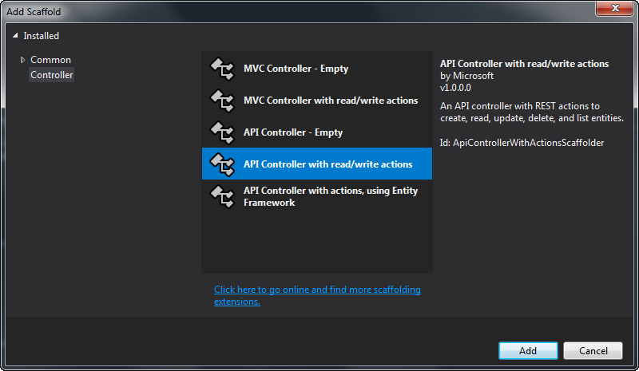

This will auto-generate a class with the following attributes:

```csharp
[Produces("application/json")]
[Route("api/Car")]
public class CarController : Controller
{
}
```

The Produces attribute specifies the content type of the data that the controller actions generate. The default is JSON. The Route attribute specifies the route for the controller. Individual actions are selected using a combination of the HTTP verb used for the request and any parameters.

The next step is to replace the default actions that return strings to ones that call methods in the CarService.

10. Replace the existing controller code with the following:

```csharp
using Microsoft.AspNetCore.Mvc;
using RazorAPI.Models;
using RazorAPI.Services;
using System.Collections.Generic;
namespace RazorAPI.Controllers
{
    [Produces("application/json")]
    [Route("api/Car")]
    public class CarController : Controller
    {
        private readonly ICarService _carService;
        public CarController(ICarService carService)
        {
            _carService = carService;
        }
        // GET: api/Car
        [HttpGet]
        public IEnumerable<Car> Get()
        {
            return _carService.ReadAll();
        }
        // GET: api/Car/5
        [HttpGet("{id}", Name = "Get")]
        public Car Get(int id)
        {
            return _carService.Read(id);
        }
        // POST: api/Car
        [HttpPost]
        public void Post([FromBody]Car car)
        {
            _carService.Create(car);
        }
        // PUT: api/Car/5
        [HttpPut("{id}")]
        public void Put(int id, [FromBody]Car car)
        {
            _carService.Update(car);
        }
        // DELETE: api/ApiWithActions/5
        [HttpDelete("{id}")]
        public void Delete(int id)
        {
            _carService.Delete(id);
        }
    }
}
```
The controller exposes 5 methods: Get with no parameters, returning all cars; Get with an integer as a parameter, returning the car with an Id value matching the one passed as a parameter; Post taking values from the body of the request to construct a new Car entity; Put which is used to modify the car identified by the id parameter with the values passed in the request body; and Delete which deletes the car having the Id passed as a parameter.

The CarService that actually manages these operations is passed in to the controller via constructor injection.

11. Finally, the client side code. Add the following to the end of the Index.cshtml file:

```html
@section scripts{
<script type="text/javascript">
    $(function () {
        var loadCars = function () {
            $('#car-list').empty();
            $.get('/api/car').done(function (cars) {
                $.each(cars, function (i, car) {
                    var item = `<li>
                            <span class="entry">
                                <strong>${car.make} ${car.model}</strong>
                                (£${car.price})
                                </span>
                                <span class ="details" data-id="${car.id}">Details</span> |
                                <span class ="edit"  data-id="${car.id}">Edit</span> |
                                <span class ="delete"  data-id="${car.id}">Delete</span>
                            </li>`;
                    $('#car-list').append(item);
                });
            });
        }
        var showForm = function () {
            $(':input').val('');
            $('#details').empty();
            $('#form').show();
        }
        var clearForm = function () {
            $('#details').empty();
            $(':input').val('');
            $('#form').hide();
        }
        $('#new').on('click', showForm);
        clearForm();
        loadCars();
        $('#car-list').on('click', '.edit, .details', function () {
            var cmd = $(this);
            $.get(`/api/car/${cmd.data('id')}`).done(function (car) {
                if (cmd.hasClass('details')) {
                    clearForm()
                    $('#details').empty().append(
                        `<h3>Details</h3>
                    <strong>${car.make} ${car.model}</strong><br>
                    £${car.price}<br>
                    Doors: ${car.doors}<br>
                    Year: ${car.year}<br>
                    Colour: ${car.colour}`
                    );
                } else {
                    showForm();
                    $('#Id').val(car.id);
                    $('#Make').val(car.make);
                    $('#Model').val(car.model);
                    $('#Colour').val(car.colour);
                    $('#Year').val(car.year);
                    $('#Doors').val(car.doors);
                    $('#Price').val(car.price);
                }
            });
        });
        $('#save').on('click', function (e) {
            e.preventDefault();
            var url = '/api/car/';
            var method = 'post';
            if ($('#Id').val() !== '') {
                url += $('#Id').val();
                method = 'put';
            }
            var car = {};
            $.each($(this).closest('form').serializeArray(), function () {
                if (this.name !== 'Id' || (this.name === 'Id' && this.value !== '')) {
                    car[this.name] = this.value || '';
                }
            });
            $.ajax({
                type: method,
                url: url,
                data: JSON.stringify(car),
                contentType: 'application/json'
            }).done(function () {
                clearForm();
                loadCars();
            });
        });
        $('#car-list').on('click', '.delete', function () {
            $.ajax({
                type: 'delete',
                url: '/api/car/' + $(this).data('id'),
            }).done(function () {
                clearForm();
                loadCars();
            });
        });
    });
</script>
}
```

The first section of the code declares a function called loadCars. This function clears the ul that has an id of car-list of any content and then calls the API using the GET verb with no parameters which maps to the method that returns a list of all cars. The HTML for the list items is built up using the jQuery each function to iterate the collection of cars returned by the API.

Notice that the JSON version of the property names on the car object use camel casing (start with lower case). This is the default behaviour when serialising to JSON in .NET Core. In previous versions of ASP.NET, the default was Pascal casing. You can restore this option through configuration:

```csharp
public void ConfigureServices(IServiceCollection services)
{
    services.AddMvc()
        .AddJsonOptions(options => options.SerializerSettings.ContractResolver = new DefaultContractResolver());
}
```

The resulting HTML consists of a series of list items that include links to show details of the entry, edit it or delete it.

Next, two convenience functions are defined that show and hide the form so that it is ready for use and doesn't retain information from previous operations. The Add New button is wired up to show the form when it is clicked. Then the functions to clear the form and hide it, and to populate the list are called, resulting in the following content in the page:

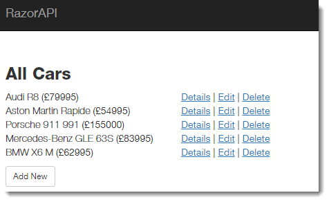

The Edit and Details links have click handlers attached to them that fire a GET request appended with the Id of the car that they apply to which returns the specified car entity. If the link that was clicked is a details link (determined by the CSS class applied to it), the details of the car are displayed, otherwise they are presented in the form for editing.

When the form is submitted, the hidden Id field is inspected. If it was populated as a result of the Edit link being clicked, the HTTP method is set to PUT and the Id of the car to be modified is appended to the URL, mapping this request to the [HttpPut("{id}")] Web API route. If it is empty, this is a new car and the method is set to POST.

In both cases, the content of the form fields is serialised into a Javascript object:

```csharp
var car = {};
$.each($(this).closest('form').serializeArray(), function () {
    if (this.name !== 'Id' || (this.name === 'Id' && this.value !== '')) {
        car[this.name] = this.value || '';
    }
});
```

The Id property is only included in the serialised object if it has a value.

The content type is specified for the request as application/json. Failure to do this will result in an HTTP 415 - Unsupported Media Type error code because the content type of the request will default to application/x-www-form-urlencoded:


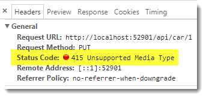

If you actually want to support application/x-www-form-urlencoded, you need to change the Web API method to use the [FromForm] attribute instead of the [FromBody] attribute. When the FromBody option is specified, the framework uses a JSON Input Formatter which expects to find a JSON string in the body of the request:


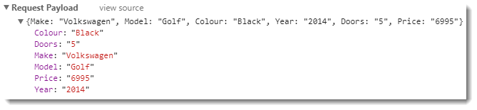

The final block of code takes care of deleting car objects. It adds the Id of the car to be deleted to the URL and then uses the DELETE method:

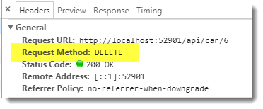

#### Scaffolding

##### Scaffolding Razor Pages with the ASP.NET Core Code Generator tool

Scaffolding in ASP.NET Core is a technique used to generate code at design time to support a number of common application scenarios when working with Entity Framework Core.The code generation tool is available as a NuGet package.

The package is installed automatically in Visual Studio when you use the context menu to add new scaffolded items for the first time:

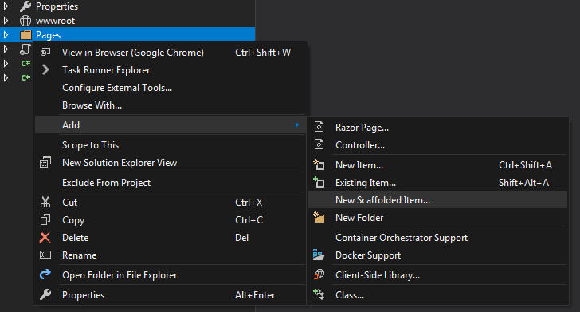

If you are using Visual Studio Code,or another development tool that doesn't provide scaffolding integration,you can invoke the tool and execute commands from a command prompt or terminal.First,you need to install the scaffolding tool,which you do as a global tool with the following command:

`dotnet tool install --global dotnet-aspnet-codegenerator`

Then execute the following command from the directory that contains your project's .csproj file:

`dotnet add package Microsoft.VisualStudio.Web.CodeGeneration.Design`

This adds the following reference (version number may be different):

`<PackageReference Include="Microsoft.VisualStudio.Web.CodeGeneration.Design" Version="5.0.2" />`

The scaffolding tool is invoked by using its command,which is dotnet aspnet-codegenerator.The tool features a number of generators including ones for producing MVC areas,controllers and views, and Razor Pages. A number of templates exist for Razor Pages:

##### Template Options

|Template|Description|
|Empty|Generates a Razor Page with no markup in the HTML body element, and an empty OnGet handler in the PageModel class|
|Create|Generates a Razor Page with a form for creating the specified model class,and PageModel handlers complete with code for saving to a database|
|Edit|Generates a Razor Page with a form for editing the specified model class, and PageModel handlers complete with code for retrieving the specified entity and saving changes to a database|
|Detele|Produces a page that displays details of the selected entity,and a form with a hidden field that|
|Details|Produces a page that displays details of the selected entity|
|List|Produces a page that displays details of all instances of the selected entity in a table|

The generator for Razor Pages is invoked using the razorpage argument with the following options:

##### Generator Options

|Option|Abbreviation|Description|
|--model|-m|Model class to use.This is required for all templates except the Empty template|
|--dataContext|-dc|DbContext class to use for any template except the Empty template|
|--referenceScriptLibraries|-scripts|Switch to specify whether to reference validation script libraries in the generated pages|
|--layout|-l|Custom Layout page to use|
|--useDefaultLayout|-udl|Switch to specify that default layout should be used for the pages.If this is not specified,the layout is set to null in the generated page unless the --layout switch is used|
|--force|-f|Use this option to re-scaffold by overwriting existing files|
|--relativeFolderPath|-outDir|Specify the relative output folder path from project where the file needs to be generated.If not specified,file will be generated in the project folder|
|--namespaceName|-namespace|Specify the name of the namespace to use for the generated PageModel.|
|--partialView|-partial|Generate a partial page,other layout options (-l and -udl) are ignored if this is specified|
|--noPageModel|-npm|Switch to not generate a PageModel class for Empty template|

##### Examples

##### Generating CRUD pages for an entity

If you don't specify a template or page name,the scaffolder will generate pages from the Create,Edit,Delete,Details and List templates for the specified entity.The following will generate these pages in the Pages/Product folder,creating the Product folder if it doesn't already exist:

`dotnet apsnet-codegenerator razorpage -m Product -dc MyContext -outDir Pages\Product -udl -scripts`

The pages will use the layout specified in any _ViewStart file that applies to that directory.They will also include a partial tag helper that references the _ValidationScriptsPartial file for managing unobtrusive client-side form validation:

```html
@section Scripts{
    <partial name="_ValidationScriptsPartial" />
}
```

##### Generating a Create page for an entity

The next examples shows how to generate a Create page for an entity that includes validation scripts but uses a custom layout file:

`dotnet aspnet-codegenerator razorpage Create Create -m Product -dc BakeryContext -outDir Pages\Product -l Pages\Shared\_CustomLayout.cshtml -scripts`

##### Generating a page using the Empty template

`dotnet aspnet-codegenerator razorpage Empty Empty -outDir Pages\Product`


#### Publishing To IIS

##### Publishing and deploying a Razor Pages application to IIS on Windows

One you have built your Razor Pages application,it needs to be published and deployed to a hosting platform.This tutorial will examine the steps required to deploy a Razor Pages application to a Windows Server running Microsoft's Internet Information Services (IIS) web server software.

##### Publishing

Publishing is the process that prepares your application for deployment.The publishing process compiles the source code files into assemblies with a.dll extension.Typically,the process will generate two  assemblies - one for the project (MyProject.dll) and one for the views (MyProject.Views.dll - was MyProject.PrecompiledViews.dll prior to ASP.NET Core 2.1).If you have source code in other projects, .dll files will be generated for each one of them.

Publishing also results in various configuration files being generated.You will examine those shortly.

Publishing can be done via the Command Line Interface (CLI) using dotnet commands, or you can use the built in publishing tools provided by Visual Studio, if you have access to it. The CLI approach provides one publishing option - to a folder. Visual Studio offers a variety of additional options including one-step publish and deploy to various Azure services,publish and deploy via FTP and Web Deploy, and creating a Web Deploy package. Here, we will only look at publishing to a folder. The resulting artefacts can be deployed to the hosting server using FTP or some other file copying method.

Prior to publishing, you need to ensure that the target server has the NET Core Windows Server Hosting bundle installed.It can be downloaded from here. It installs the .NET Core runtime, .NET Core library and the ASP.NET Core Module - an IIS module that enables IIS to be used as a reverse proxy for your Razor application.

> What is a reverse proxy?
>
> :information_source: A reverse proxy in the context of a web application is a server that handles requests and retrieves resources from other servers on behalf of a client. IIS performs this role mainly because it is capable of handling requests for multiple domains on the same port number (typically port 80 for HTTP requests and 443 for HTTPS requests), wherease Kestrel, the .Net Core HTTP server that is bundled with your ASP.NET Core application is not capable of doing this.Therefore HTTP requests coming into the Windows server are primarily handled by IIS,then passed on to the specific ASP.NET Core application,where its instance of Kestrel will take care of processing the request and generating the response. This is then passed back to IIS before being passed on to the requesting client.
> 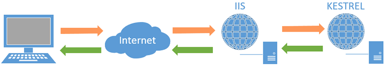

##### Publish using the CLI

The CLI command for publishing is dotnet publish. All of the options are detailed in the table below:

|Option|Description|
|---|---|
|-h,--help|Show help information.|
|-o,--output<br>\<OUTPUT_DIR\>|Output directory in which to place the published artifacts.|
|-f,--framework<br>\<FRAMEWORK\>|Target framework to publish for.The target framework has to be specified in the project file.|
|-r,--runtime \<RUNTIME_IDENTIFIER\>|Publish the project for a given runtime.This is used when creating self-contained deployment.Default is to publish a framework-dependent app.|
|-c, --configuration <br>\<CONFIGURATION\>|Configuration to use for building the project.Default for most projects is "Debug".|
|--version-suffix <br> \<VERSION_SUFFIX\>|Defines the value for the $(VersionSuffix) property in the project.|
|--manifest <br>\<manifest.xml\>|The path to a target manifest file that contains the list of packages to be excluded from the publish step.|
|--self-contained|Publish the .NET Core runtime with your application so the runtime doesn't need to be installed on the target machine.Defaults to 'true' if a runtime identifier is specified.|
|--no-restore|Does not do an implicit restore when executing the command.|
|-v,--verbosity|Set the verbosity level of the command.Allowed values are q[uiet],m[inimal],n[ormal],d[etailed],and diag[nostic].|
|-no-dependencies|Set this flag to ignore project to project references and only restore the root project.|
|--force|Set this flag to force all dependencies to be resolved even if the last restore was successful.This is equivalent to deleting project.assets.json.|

The main options are --output (or -o) and --configuration (or -c).You need to specify a location for the files generated by the publish operation and you should specify that the published application is compiled or built in Release mode.The following example results in the application being published to a local folder in release mode:

`dotnet publish -o c:\\publish\\myApp -c release`

Publishing to a local folder is the only option provided by the CLI commands.Most often,you will use FTP or a similar tool to transfer the published output to the hosting location.

##### Publish using Visual Studio

Visual Studio provides more options for publishing than the CLI commands.As well as publishing to a local folder,you can choose to publish to an FTP loation,create a Web Deploy package,publish diretory using Web Deploy,and publish to Microsoft's hosting platform,Azure.This section will only look at publishing to a local folder.

To publish to a folder,you will start by creating a profile - a collection of stored,reusable settings.Click the **Build** menu and locate the **Publish** option:

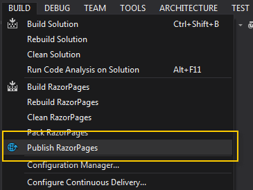

When you select this option for the first time,you will be invited to specify the publishing settings.You can change the settings for an existing profile at any time.Choose the folder option and specify a location for the folder:

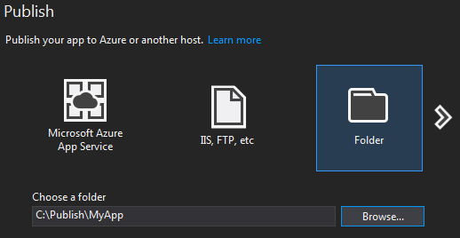

Visual Studio will generate a name for your profile.If you prefer to change that,click the **Rename Profile** link and provide your own name:

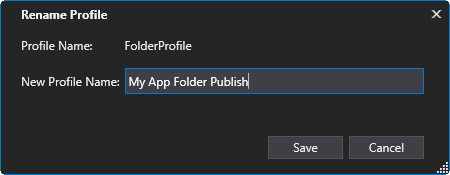

If you prefer to have all files in the publish directory deleted prior to each publishing operation,click the **Settings** link

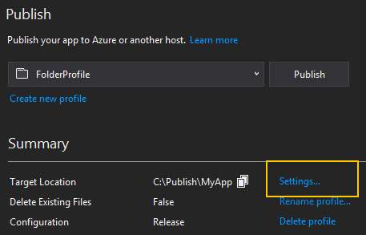

Then check the Delete all existing files prior to publish option in the modal that appears:

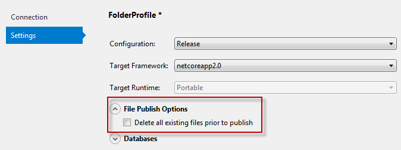

Once you have chosen all of your setting,click the **Publish** button to execute the publish operation based on the specified profile.

Whether you use the CLI or Visual Studio,it is always a good idea to test the published output by opening a command prompt and navigating to the publish folder,then executing `dotnet yourapp.dll` to ensure that the published application launches without error.

##### Published Output

The next image shows the files that are generated from publishing a site based purely on the basic (no authentication) template:

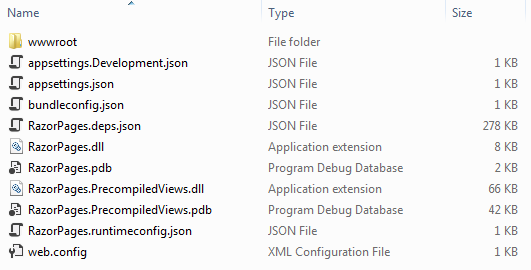

The contents of the wwwroot folder are copied directly from the original application:

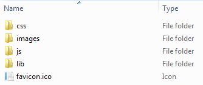

A reasonably large json file is generated,named after the project with the suffix: .deps.json. This file specifies various configuration options such as the version of the runtime that the application targets and the dependencies that it relies on.

The published output includes a .dll file (assembly) with the same name as your project.This is the compiled version of the application,built during the publishing operation.If your application consist of multiple projects,each one will result in its own .dll file.

Up to and including .NET 5,another .dll file is generated with PrecompiledViews as part of its name (just Views from version 2.1).This assembly results from the .cshtml files in the Pages folder being compiled prior to deployment.Having views or pages compiled at this stage saves the first time compilation process happening on the web server,where the first visitor to each page will experience a delay before the page is executed and the response sent.The default behaviour from .NET 6 is to create one assembly so this file is no longer produced.


> :information_source: Precompilation of pages is the default behaviour.It is possible to skip this step and to publish the raw.cshtml files,resulting in pages that are updateable in a similar way to PHP,classic ASP or the ASP.NET Web Pages frameworks.In other words,you can make changes to the .cshtml files and then copy them to the web server while the application is running,and the new content will take effect immediately.
>
> If you would like to adopt this approach,add an MvcCompileOnPublish node to your .csproj file,with the value set to false:
>
> ```xml
> <PropertyGroup>
>   <TargetFramework>.netcoreapp2.0</TargetFramework>
>   <MvcRazorCompileOnPublish>false</MvcRazorComileOnPublish>      
> </PropertyGroup>
>
> ```
> This will result in a Pages folder containing the content pages and a refs folder containing the libraries required for the application:
> 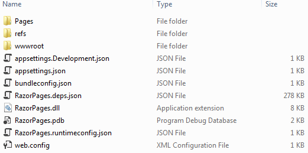
> This option was inadvertently removed from .NET 3 due to a bug.

##### Locked Assemblies and App_Offline Files

When the site is running on the web server,the application's .dll file is loaded by the IIS process and is locked,as is the precompiled views assembly.If you use FTP to upload the published content,you will need to stop the process in order release the .dll files so that they can be overwritten.

There are a number of ways to accomplish this.If you have access to the web server,you can stop the site's application pool and then restart it once the new files have been uploaded.However,this won't provide the visitor with a particularly good experience.A cleaner alternative is to use an App_Offline.htm file. When placed in the root folder of the site (i.e. the location returned by the IHostingEnvironment.ContentRootPath property),the presence of a file name App_Offline.htm results in any further request to the application being served with the content of the file.Therefore this file is most commonly used to display a message explaining the site is currently undergoing maintenance.

The name of the file is important,although case-insensitive.The easiest way to switch this feature on and off is to use an FTP client to rename the file to something else when the site should be live,and then alter it back when the site should be offline.

Since requests for other files will be ignored,you should not link to local resources such as style sheets,javascript,images etc in your App_Offline.htm file.You should embed these in the file itself.Images can be embedded as Base64 encoded strings.There are a number of online services for converting image files to a Base64 encoded string.Or you can do this yourself:

```csharp
var imagePath = <full path to iamge file>;
var bytes = File.ReadAllBytes(imagePath);
var base64Image = Convert.ToBase64String(bytes,0,bytes.Length);
```

Once you have the value of base64Image,set it as the src of an  element using a data URI:

```HTML
 
```
Note that the media type is set to image/png in the example above.That should be altered to reflect the media (or mime) type of the original image you want to embed.

##### Including Static Content in the Root Folder

Static content added to the root of a Razor Pages application is not automatically included in the published output.You might create folders to contain MarkDown or data files, for example, that you don't want your visitors to be able to browse directly,or you might add an app_offline.htm file to the root of your application.If you want to ensure that such contents are included in the published output,you must add specific entries to the application's .csproj file.

The following entry ensures that a folder named MyFolder is included in the published output:

```xml
<ItemGroup>
    <Content Include="MyFolder\**\*" CopyToPublishDirectory="PreserveNewest" />
</ItemGroup>
```

If you want to include only certain items,you can use file matching patterns.This example uses the recursive wildcard file matching pattern to specify that all contents of the given directory and its subdirectories should be included.The next example specifies that only MarkDown files in the specified directory hierarchy should be included:

```xml
<ItemGroup>
    <Content Include="MyFolder\**\*.md" CopyToPublishDirectory="PreserveNewest" />
</ItemGroup>
```

You can also choose to exclude items.This example results in all items in the MyFolder structure except .txt files being published:

```xml
<ItemGroup>
    <Content Include="MyFolder\**\*" CopyToPublishDirectory="PreserveNewest" />
    <Content Remove="MyFolder\**\*.txt" />
</ItemGroup>
```

You can include multiple items by either creating a separate entry for each,or by providing a comma-separated list:

```xml
<ItemGroup>
    <Content Include="MyFolder\**\*;MySecondFolder\**\*;MyThirdFolder\**\*.db" CopyToPublishDirectory="PreserveNewest" />
</ItemGroup>
```

Finally, this example includes a file named app_offline.html in the published output:

```xml
<ItemGroup>
    <Content Include="app_offline.html" CopyToPublishDirectory="PreserveNewest" />
</ItemGroup>
```

Note that the file extension has an additional l appended.This has the effect of ensuring that the app_offline file doesn't actually take the application offline when it is uploaded as part of the application files (or indeed when you try to run the site locally against IIS [Express]).

##### Troubleshooting

###### Non-supported framework versions

One of the USPs offered by .NET Core is the fact that you do not have to rely on your hosting company installing the latest version of the framework on the hosting server in order to take advantage of it.This means that you can target any version of the framework you like.So when a newer version is released that contains features or bug fixes that you need,you can simply target it.However,if you deploy an application that targets a runtime version that isn't supported by the hosting server,you will get errors along the lines of:

> Error: An assembly specified in the application dependencies manifest (xxx.deps.json) was not found:package:'Microsoft.ApplicationInsight.AspNetCore',version'xxx'...This assembly was expected to be in the local runtime store as the application was published using the following target manifest files:...


By default,the publish operation employs a process known as Runtime Store Trimming,whereby dependencies that form part of the .NET Core runtime are not included in the published output.The error therefore arises because items specified in the MyApp.deps.json file are not present on the hosting server.

There are four possible solutions to this problem:

1. Install the relevant version of SDK on the server (which also installs the runtime store package)
2. Install just the Runtime Store Package on the target server (you can get that by locating the correct version of .NET Core here)
3. Amend the .csproj file to include the following entry which disables runtime store trimming:

```xml
<PropertyGroup>
    <PublishWithAspNetCoreTargetManifest>false</PublishWithAspNetCoreTargetManifest>
</PropertyGroup>
```

1. Use the following (undocumented) property option when publishing via the CLI:

`dotnet publish -o c:\publish\myApp -c release /property:PublishWithAspNetCoreTargetManifest=false`

The third and fourth options will result in the entire contents of the runtime store being included with the published output - about 200 files and folders at around 40MB.All of this will need to be included in the files uploaded to the hosting server.

##### HTTP Error 502.5 Process Failure

Having deployed the application to IIS and tried to run it,you may receive an HTTP 502.5 error code, which tells you that the application failed to start.However,the browser message fails to provide any further clues as to the reason.The server's event log might provide further information:

> Application 'MACHINE/WEBROOT/APPHOST/[AppName]' with physical root '[path_to_application]' failed to start process with commandline 'dotnet .[AppName].dll', ErrorCode='0x80004005:80008083'

This still doesn't tell you much,except that 0x80004005 is a general error code indicating missing files or those that can't be accessed currently.Subcode 80008083 indicates a version conflict.So it looks like there is a problem with the version of the .NET Core runtime that the application targets,and those available on the hosting server in the folder where the application's dll resides, and attempting to start the application:

`dotnet AppName.dll`

If the problem is caused by version conflict,the new error message will look like this

> It was not possible to find any compatible framework version The specified framework 'Microsoft.AspNetCore.App', version 'x.x.x' was not found.
> - Check application dependencies and target a framework version installed at:\
> Alternatively,install the framework version 'x.x.x'.

The solution is to either re-target the appliction to a version of the framework that exists on the hosting server (which can be checked by the dotnet --version command) or to ensure that the correct version of the framework is installed.

##### Enable stdout Logging

If you haven't already incorporated logging within the application,enabling basic logging provides an easy way to get full details of startup errors within the deployed application.A web.config file is generated as part of the published output:

```xml
<?xml version="1.0" encoding="utf-8" ?>
<configuration>
    <location path="." inheritInChildApplications="false">
        <system.webServer>
            <handlers>
                <add name="aspNetCore" path="*" verb="*" modules="AspNetCoreModuleV2" resourceType="Unspecified" />
            </handlers>
            <aspNetCore processPath=".\MyApp.exe" stdoutLogEnabled="false" stdoutLogFile=".\logs\stdout" hostingModel="InProcess" />
        </system.webServer>
    </location>
</configuration>
```

By simply changing stdoutLogEnabled to true, text-based log files will be generated to a folder named logs in the root of the application.The folder will be created if one doesn't exist already.

> :warning: You should disable stdout logging once any errors have been resolved.It should not be used for routine logging.You should use a third party library that incorporates log file management.

##### Fixing the SDK version Used For Publishing 

The <TargetFramework> node in your application's .csproj file specifies the version of the .NET framework that your application targets.However,this does not prevent your application being built or published against a newer version of the framework.Generally,dotnet commands such as build,publish etc will be executed by the latest version of the .NET Core SDK that is installed on the machine.This can result in a published application referencing dependencies that don't exist on a hosting server.

To prevent accidentally building and publishing your application against a newer version of the .NET Core SDK that is supported by your host,you can fix the version that your application targets.You do this by adding a global.json file to the directory structure of the project.This can either be placed in the folder containing the .csproj file,or any of its parent folders.

The global.json file has an sdk node which is used to specify the version of the .NET Core SDK to use when executing commands against the project (including publishing). The following example fixes the version at 2.1.402:

```json
{
    "sdk":{
        "version":"2.1.402"
    }
}
```

You can use the dotnet CLI to generate a global.json file.Navigate to the folder in which you want to create the file,and type the following command:

`dotnet new globaljson --sdk-version 2.1.402`

Alternatively,you can specify the location for the file using the --output (or -o) switch:

`dotnew new globaljson --sdk-version 2.1.402 -o c:\MyApp`

You can obtain the versions of the SDK that are available on a specific machine by executing the following dotnet command:

`dotnet --list-sdks`

The following command produces a list of the available runtimes on a specific machine:

`dotnet --list-runtimes`

#### Advanced


##### TempData In Razor Pages

TempData is a storage container for data that needs to be available to a separate HTTP request.The cannonical example for illustrating how TempData works involves providing feedback to the user after a form submission that results in the user being redirected to another page (Post-Redirect-Get).

Here is a very simple form:

```html
<form method="post">
    <input type="text" asp-for="EmailAddress" />
    <span asp-validation-for="EmailAddress"></span><br />

    <button>Submit</button>

</form>
```

In the following code snippet,a PageModel property called FormResult has been decorated with the TempData attribute,which enables both automatic storing of values in,and loading values from the TempData dictionary.

```csharp
public class IndexModel:PageModel
{
    [TempData]
    public string FormResult {get;set;}
    [BindProperty]
    public string EmailAddress {get;set;}
}
```

The property has a value assigned to it when the form is posted.

```csharp
public IActionResult OnPost()
{
    try{
        var email = new MailAddress(EmailAddress);
        FormResult = "You have provided a valid email address";
        return RedirectToPage("/success");
    }
    catch(FormatException)
    {
        ModelState.AddModelError("EmailAddress","Invalid email address");
        return Page();
    }
}
```

If the validation test passes, the user is redirected to another page (success.cshtml).There,the TempData value is accessed using a string indexer:

```html
<h4>@TempData["FormResult"]</h4>
```
Alternatively,you can add a property to the SuccessPageModel,decorated with the TempData attribute:

```csharp
public class SuccessPageModel : PageModel
{
    [TempData]
    public string FormResult {get;set;}
}
```

Then you can more simply reference the model property in the page itself:

`<h4>@Model.FormResult</h4>`

> **Note**
>
> In ASP.NET Core 2.0 (and earlier versions if you are using MVC), the index value is prefixed with "TempDataProperty-",so you would have to use the following code to access the value:
>
> `<h4>@TempData["TempDataProperty-FormResult"]</h4>`
> If you want to change this behaviour in ASP.NET Core 2.0, you can use the MvcOptions to change the default behaviour:
>
> ```csharp
> services.AddMvc().AddViewOptions(options=>{
>   options.SuppressTempDataAttributePrefix = true;
> });
> ```

Once the value has been read,it is marked for deletion and is therefore not available for subsequent requests.

##### Retaining TempData Values

If you want to access a TempData value and then retain it for a further request,you have two options.The first is the Peek method,which allows you to read a value without it being marked for deletion:

```csharp
var temp = TempData.Peek("FormResult");
```

The second option is to use the Keep method after you have accessed the value.This has the effect of marking the value for retention.The Keep method provides two options.You can either specify that the whole dictionary is retained:

```csharp
var result = TempData["FormResult"];
TempData.Keep();
```

Or you can just mark individual values for retention:

```csharp
var result = TempData["FormResult"];
TempData.Keep("FormResult");
```

##### Storage Mechanisms

The default storage mechanism for TempData is cookies,which is enabled by default in a typical Razor Pages application.

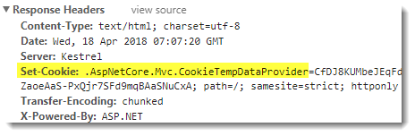

Alternatively,you can use Session State.

##### Cookie Configuration

You can configure various options related to the TempData cookie in the ConfigureServices method.The following example changes the name of the cookie:

```csharp

services.Configure<CookieTempDataProviderOptions>(options=>
{
    options.Cookie.Name = "MyTempDataCookie";
});
```

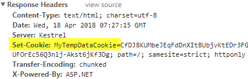

##### Session State

Most browsers limit the size of cookies and therefore the data that can be stored in them.If you exceed this limit,you will get a 400 HTTP Error code:The size of the request headers is too long.If you need to store large amounts of data in TempData,you can use the session provider instead.The three steps to implement this are:

1. Call the AddSessionStateTempDataProvider method in ConfigureServices (chained to AddMvc below)
2. Call AddSession in ConfigureServices
3. Call app.UseSession in the Configure method

```csharp
public void ConfigureServices(IServiceCollection services)
{
    services.AddMvc().AddSessionStateTempDataProvider();
    services.AddSession();
}

public void Configure(IApplicationBuilder app,IHostingEnvironment env)
{
    app.UseStaticFiles();
    app.UseSession();
    app.UseMvc(routes=>{
        routes.MapRoute(
            name:"default",
            template:"{controller}/{action=Index}/{id?}"
        );
    });
}
```

##### Limitations

You can store simple values in TempData - strings,booleans and numeric types,but if you try to store complex types,you will encounter an InvalidOperationException:

> The '[name of the property]' property with TempDataAttribute is invalid.The 'Microsoft.AspNetCore.Mvc.ViewFeatures.Internal.TempDataSerializer' cannot serialize an object of type '[name of the property]'.

If you want to use TempData to store complex types,you must serialize it to a string-based format yourself.JSON is the recommended format to use because it is relatively compact (compared to XML) and JSON.NET is included as part of the default project template.

The following class contains two extension methods: one for serialising data to JSON and the other for deserialising it:

```csharp
public static class TempDataExtensions
{
    public static void Set<T>(this ITempDataDictionary tempData,string key, T value) where T : class
    {
        tempData[key] = JsonConvert.SerializeObject(value);
    }

    public static T Get<T>(this ITempDataDictionary tempData,string key) where T : class
    {
        tempData.TryGetValue(key,out object o);
        return o == null ? null : JsonConvert.DeserializeObject<T>((string)o);
    }    
}
```

Usage is straightforward.The second line sets a  TempData entry, and the third retrieves it:

```csharp
var contact = new Contact {FirstName="Mike",Domain="learnrazorpages.com"};
TempData.Set("Mike",contact);
var mike = TempData.Get<Contact>("Mike");
```

##### TempData And Model Binding 

Model Binding  and TempData conflict  with each other in the sense that they both provide a mechanism to populate page properties with values from an HTTP request.One must execute after the other,and the default behaviour is that TempData population takes place after model binding.There is nothing to stop you decorating a page property with both the BindProperty and TempData attributes:

```csharp
[BindProperty,TempData]
public string Foo{get;set;}

```
However,any posted form value that is bound to the property will be overwritten by whatever is in TempData,which is usually nothing,or null.If you need to assign a model bound value to TempData,you should make the assignment manually:

```csharp
[BindProperty]
public string Foo{get;set;}
public void OnPost()
{
    TempData["Foo"] = Foo;
}
```

##### Session State in Razor Pages

Session state is a mechanism that enables you to store and retrieve user specific values temporarily.These values can be stored for the duration of the visitor's session on your site.In most cases,they are stored in server memory,although options exist for using persistent and/or distributed storage mechanisms if,for example,you are using multiple web servers for your application (web farm etc).

##### Enabling Session State 

Session management in ASP.NET Core is included in the Microsoft.AspNetCore.All metapackage,but is not enable by default.You enable Session State in the Startup file:

```csharp
public void ConfigureServices(IServiceCollection  services)
{
    services.AddSession();
    services.AddMemoryCache();
    services.AddMvc();
}

public void Configure(IApplicationBuilder app, IHostingEnvironment env)
{
    app.UseStaticFiles();
    app.UseSession();
    app.UseMvc(routes=>{
        routes.MapRoute(
            name:"default",
            template:"{controller}/{action=Index}/{id?}"
        );
    });
}
```

> :information_source: Note the use of the AddMemoryCache method in ConfigureServices.Session data needs a store.AddMemoryCache activates a local memory-based store,which is fine for most applications deployed to a single server.They are volatile,and can be cleared out by processes external to your site (server restarts,application pool recycling etc) so you should always test for the presence of your expected values.If your site is to be deployed to multiple servers,you should use a distributed cache implementation instead.Distributed caches use a centralised data store to ensure that the same values are available to all application servers.The SQL Server Distributed cache system uses a SQL Server database.Other systems may use memory,like the open source Redis and Memcached solutions.

##### Configuring Sessions

Once enabled,a session begins when the user first visits the site,and lasts for 20 minutes after the last activity from the user at which point the contents of the session are abandoned.The duration is controlled by the IdleTimeout option,which can be configured in ConfigureServices:

```csharp
services.AddSession(options=>{
    options.IdleTimeout = TimeSpan.FromMinutes(30);
});
```
Every time the session is accessed,the timeout is reset.

Another option related to timeouts is the IOTimeout option.This controls the maximum amount of time to allow for the successful getting or setting of a session asynchronously,and is therefore applicable mainly to the use of distributed caches.The default value is 1 minute.

##### Using Session Variables

The Session API offers three methods for setting session values: SetInt32,SetString and Set,which takes a byte array as an argument.The session framework stores items as byte arrays to ensure that session values are serialisable,primarily for storage on remote servers.Internally,the SetInt and SetString methods convert the supplied values to a byte array.Here is the actual implementation of the SetString method:

```csharp
public static void SetString(this ISession session,string key,string value)
{
    session.Set(key,Encoding.UTF8.GetBytes(value));
}
```

You need to add a reference to Microsoft.AspNetCore.Http to be able to work with session.The following examples illustrate various ways to set session values:

```csharp
public void OnGet()
{
    HttpContext.Session.SetString("Test String","1");
    HttpContext.Session.SetInt32("Test Int",1);
    HttpContext.Session.Set("Test Byte Array",BitConverter.GetBytes(true)); //boolean as byte array
}

```

And here's how you might retrieve those values to be passed to a View:

```csharp
public void OnPost()
{
    ViewData["Test String"] = HttpContext.Session.GetString("Test String");
    ViewData["Test Int"] = HttpContext.Session.GetInt32("Test Int");
    ViewData["Test Byte Array"],BitConverter.ToBoolean(HttpContext.Session.Get("Test Byte Array"),0);
}
```

All of the Get method along with the GetString and GetInt32 methods return null if no value has been set for the referenced key, or if the value has been cleared for any reason.If that happens to the Test Byte Array value,the BitConverter.ToBoolean method call will result in an ArgumentNullException.You should test for this before attempting any further operations:

```csharp
public void OnPost()
{
    if(HttpContext.Session.Get("Test Byte Array") != null)
    {
        ViewData["Test Byte Array"],BitConverter.ToBoolean(HttpContext.Session.Get("Test Byte Array"),0);
    }
}
```

You can also use the TryGetValue method to achieve the same result in a cleaner way:

```csharp
public void OnPost()
{
    if(HttpContext.Session.TryGetValue("Test Byte Array",out byte[] result))
    {
        ViewData["Test Byte Array"] = BitConverter.ToBoolean(result,0);
    }
}
```

##### Working with other types

As has been shown,when setting non-string or int values as session variables,you need to take care of serialisation to byte arrays yourself.You could do this at the point of setting values as illustrated earlier,but a more reusable approach can be achieved by creating your own extension methods on ISession.The following example shows how you might implement methods for getting and setting boolean values as session variables:

```csharp
public static class SessionExtensions
{
    public static bool? GetBoolean(this ISession session, string key)
    {
        var data = session.Get(key);
        if(data==null)
        {
            return null;
        }
        return BitConverter.ToBoolean(data,0);
    }

    public static void SetBoolean(this ISession session,string key,bool value)
    {
        session.Set(key,BitConverter.GetBytes(value));
    }
}
```

Now you can use thee methods to set and get boolean values:

```csharp
public void OnGet()
{
    HttpContext.Session.SetString("Test String","1");
    HttpContext.Session.SetInt32("Test Int",1);
    HttpContext.Session.SetBoolean("Test Bool",true);
}

public void OnPost()
{
    ViewData["Test String"] = Name = HttpContext.Session.GetString("Test String");
    ViewData["Test Int"] = HttpContext.Session.GetInt32("Test Int");
    ViewData["Test Bool"] = HttpContext.Session.GetIntBoolean("Test Bool");
}
```

There are two methods of interest if you want to delete session values.One is the Remove method which allows you to delete individual values from the session collection by key:

`HttpContext.Session.Remove("Name");`

The other is the Clear method.This removes all keys and values associated with the session:

`HttpContext.Session.Clear();`

##### Session Cookies

ASP.NET Core uses cookies to tie multiple request together in a session.The cookie options are managed using the Options pattern when configuring sessions:

```csharp
public void ConfigureServices(IServiceCollection services)
{
    services.AddSession(options=>{
        options.Cookie.Name = "MySessionCookie";
    });
}
```

The full list of properties is as follows:

|Property|DataType|Description|
|-----|-----|------|
|Domain|string|The domain(s) that the cookie is accessible to.If it is not specified,the cookie is only sent to the domain of the current document.If provided,all sub-domains are also included.|
|Expiration|TimeSpan|The expiry time.While it is (currently possible) [https://github.com/aspnet/Security/issues/1293] to set an expiry time for the session cookie,you are advised not to.Session cookies should only last for the duration of the session as governed by the IdleTimeout setting covered at the top of this article.|
|HttpOnly|bool|Specifies whether the cookie is available to client-side code.false (the default) means that the cookie is accessible to JavaScript, which may present a security risk.If set to true,the cookie is only available to code executing on the server|
|Name|string|The name of the cookie.The default value is .AspNetCore.Session|
|Path|string|The relative path that the cookie should be accessible to.If not specified,the cookie is available to all pages in the domain(s).Subdirectories are also included.For example,/account will match/accout,/account/client etc.|
|SameSite|SameSiteMode enum|Possible values are Lax (default),None,Strict.The SameSite option is intended to help in the prevention of CSRF or cookie hijacking attacks,but it is not supported by all browsers.It therefore should not be relied on.|
|SecurePolicy|CookieSecurePolicy enum|Specifies the security policy of the cookie.Possible values are Always (Secure is always marked true), None (Secure is not marked true) and SameAsRequest (The default: the cookie will be sent using the protocol of the request).|


