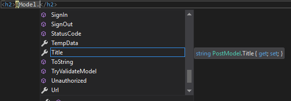
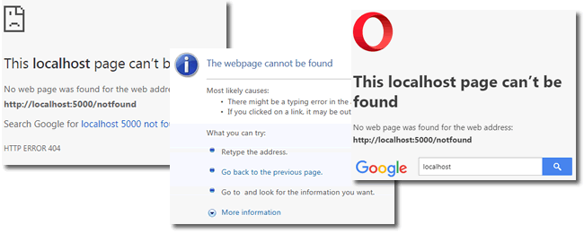

### Learn Razor Pages——Your guide to using ASP.NET Core Razor Pages

#### Home
##### A First Look
###### Welcome To Learn Razor Pages

This site is dedicated to helping developers who want to use the ASP.NET Razor Pages web development framework to build web applications.

这个站点专门帮助开发者学习使用ASP.NET Razor Pages Web开发框架去构建Web应用。

###### What is Razor Pages?

Introduced as part of ASP.NET Core, and now included in .net 5，ASP.NET Razor Pages is a server-side, page-focused framework that enables building dynamic, data-driven web sites with clean separation of concerns. Part of the ASP.NET Core web development framework from Microsoft, Razor Pages supports cross platform development and can be deployed to Windows, Unix and Mac operating systems.

The Razor Pages framework is lightweight and very flexible. It provides the developer with full control over rendered HTML. Razor Pages is the recommended framework for cross-platform server-side HTML generation.

Razor Pages makes use of the popular C# programming language for server-side programming, and the easy-to-learn Razor templating syntax for embedding C# in HTML mark-up to generate content for browsers dynamically.

Architecturally, Razor Pages is an implementation of the MVC pattern and encourages separation of concerns.

###### Who should use Razor Pages?

Razor Pages is suitable for all kinds of developers from beginners to enterprise level. It is based on a page-centric development model, offering a familiarity to web developers with experience of other page-centric frameworks such as php, Classic ASP, Java Server Pages，ASP.NET Web Pages and ASP.NET Web Forms. It is also relatively easy for the beginner to learn，and it includes all of the advanced features of ASP.NET Core(such as dependency injection) making it just as suitable for large, scalable, team-based projects.

###### How to get Razor Pages

Razor Pages is included within .NET Core from version 2.0 onwards, which is available as a free download as either an SDK (Software Development Kit) or Runtime. The SDK includes the runtime and command line tools for creating .NET Core applications. The SDK is installed for you when you install Visual studio 2017 update 3 or later. The runtime is used to run .NET Core applications. The Runtime-only installation is intended for use on machines where no development takes place.

###### Why should you use Razor Pages?

if you want a dynamic web site, that is one where the content is regularly being added to, you have a number of options available to you. You can use a Content Management System(CMS), of which there are many to choose from including WordPress, Umbraco, Joomla!, Drupal, Orchard CMS and so on. Or you can hire someone to build a suitable site for you. Or you can build your own if you have an interest in, and and aptitude for programming.

If you choose to build your own, you can choose from a wide range of programming languages and frameworks. If you are a beginner, you will probably want to start with a framework and language that is easy to learn, well supported and robust. If you are considering making a career as a programmer, you probably want to know that the skills you acquire while learning your new framework will enhance your value to potential employers. In both cases, learning C# as a language and ASP.NET Core as a framework will tick those boxes. If you are a seasoned developer, the Razor Pages framework is likely to add to your skillset with the minimum amount of effort.

###### What about the MVC Framework?

You can still choose to use ASP.NET Core MVC to build your ASP.NET Core web applications. If you are porting an existing .NET Framework MVC application(MVC5 or earlier) to .NET Core, it may well be quicker or easier to keep with the MVC framework. However, Razor Pages removes a lot of the unnecessary ceremony that comes with the ASP.NET implementation of MVC and is a simpler, and therefore more maintainable development experience.

The key difference between Razor Pages implementation of the MVC pattern and ASP.NET Core MVC is that Razor Pages uses the Page Controller pattern instead of the Front Controller pattern.

Razor Pages is the default for building server-side web applications in ASP.NET Core. Components within the underlying MVC framework still have their uses such as using controllers for building RESTful APIs.

#### ASP.NET CORE

##### What is ASP.NET Core?

ASP.NET Core is the first cross-platform version of Microsoft's framework for building web-based applications. It sits on top of .NET Core，which is an open source development platform, consisting of a set of framework libraries, a software development kit(sdk) and a runtime.

> 
> :warning:ASP.NET Core is now included within .NET and feature cross-platform desktop application development frameworks as well as cross-platform web development frameworks.

##### Why should you choose ASP.NET Core?

Web development is changing. There is demand for more modular frameworks, where you decide the features to include in your application. Applications should be cloud-ready-designed to run on any platform and to scale up quickly. They should also embrace client-side frameworks and make developing RESTful APIs easy. And the frameworks themselves need to be nimble. They need to iterate quickly to deliver new features in response to new innovations in the web development sphere. And developers want to be able to choose the tools they use to author sites.

Some frameworks already address these concerns, such as Express that runs on Node.js. The old version (.NET Framework) of ASP.NET doesn't. It is wedded to Internet Information Services, a Windows-only web server. New features took ages to come to market because of the way that the framework is tied to the full .NET framework. And it's very dependent on Visual Studio - a monster of and IDE that only runs on Windows.

>
> :warning: Note that the product known as Visual Studio for Mac is not actually a version of IDE that most .NET developers are familiar with. It is a version of Xamarin Studio that supports .NET Core development.

ASP.NET Core is designed to be modular. The HTTP pipeline is composed of separate components that can be plugged in as needed. The benefits that this approach delivers include:

- your application is more lightweight as it only incorporates the components it needs
- you can choose pipeline components from multiple sources
- you can even create your own version of the pipeline components and use those instead
- you can choose which platform to host your application on
- new features are added much more quickly than in previous version of ASP.NET

ASP.NET Core provides a web development framework based on the Model-View-Controller(MVC) pattern. On top of that sits the Razor Pages framework for  developers who are more familiar with or prefer a page-centric development approach to building web applications. In addition, ASP.NET Core includes Blazor, a Single Page Application framework that enables you to use C# as the client-side programming language. ASP.NET Core also includes a framework for developing REST-based web services(Web API) and a Web Sockets-based framework(SignalR) which enables real-time updating of page content initiated by the server.


#### Turoials

##### Razor Pages Bakery Tutorial Introduction

This step-by-step tutorial demonstrates how to create a Razor Pages application from scratch, and how to add common functionality to it including communicating with a database, working with cookies, forms and sending email.

The application you will build is inspired by the ASP.NET Web Pages Bakery template site. The ASP.NET Web Pages framework was a page-based web development from Microsoft, which has effectively been replaced by the Razor Pages framework. The template site itself represents an online ordering system that enables users to place orders for a variety of baked goods. From a technical perspective, the original site demonstrated

- the use of a file-based database for storing product information
- basic data access
- creating and processing forms
- sending email


#### Razor Pages Files
#### Razor Syntax
#### Page Models
#### Tag Helpers
#### View Components
#### Routing and URLs

##### Razor Pages Routing

Routing is the system that matches URLs to Razor pages. Like most page-centric frameworks, the primary routing system in ASP.NET Razor Pages is based on matching URLs to file paths, starting from the root Razor Pages folder, which is named Pages by default.

路由是匹配URLs到Razor Pages的系统。如大部分集中式页面框架一样，ASP.NET Razor Pages中的路由系统是基于URLs到文件路径匹配，起点为root页文件夹，默认命名为Pages。

##### How URLs are matched

When a Razor Pages application starts up, a collection of Attribute Routes(familiar to anyone who has used them in ASP.NET MVC 5 or MVC Core) is constructed, using the file and folder paths rooted in the Pages folder as the basis for each route's template.

当一个Razor Pages应用启动时，一个属性路由集合已经被建构，

The standard Razor Pages site template includes three pages in the root folder:

```
Error.cshtml
Index.cshtml
Privacy.cshtml
```
A collection of four routes are defined with the following route templates:

```
""
"Error"
"Index"
"Privacy"
```

By default, the route templates are generated by taking the virtual path of each content page and then removing the root folder name from the start and the file extension from the end.

缺省情况下，路由模板通过每个content页的虚拟目录移除开始部分的文件夹名称和文件的后缀名来生成。


Index.cshtml is considered the default document in any folder, so it has two routes defined - one for the file name without the extendsion, and one with an empty string representing the file. Therefore, you can access Index.cshtml by browsing to both http://yourdomain.com/ and http://yourdomain.com/index.

If you create a folder named Test and add a file named Index.cshtml to it, a further two routes will be defined with the following templates:

如果你创建一个文件夹，命名为Test，之后添加一个名为Index.cshtml的文件在该文件夹内，下面模板的路由将被定义：

```
"Test"
"Test/Index"
```

Both of these routes will be mapped to the same virtual path: /<root>/Test/Index.cshtml.

However, if you now add a file called Test.cshtml to the root pages folder and attempt to browse to it, an exception will be raised:

>
> AmbiguousActionException:Multiple actions matched. The following actions matched route data and had all constraints satisfied:
>
> Page: /Test/Index
> Page：/Test

As the exception message says, it is an error to have a single URL mapped to multiple actions or routes. The framework has no way of knowing which page to call. You can disambiguate between routes by adding route parameters and/or constraints to the template.

##### Areas

Areas were introduced to Razor Pages in ASP.NET Core 2.1. Routes to resources in areas have the name of the area as the first segment of the URL. In the following example, the area is named Administration.

```
Areas
    Administration
        Pages
            Index.cshtml
            Reports.cshtml
    Production
        Pages
            Index.cshtml
Pages
    Error.cshtml
    Index.cshtml
    Privacy.cshtml
```

The additional routes created for the content in the areas is as follows:

```
"Administration"
"Administration/Index"
"Administration/Reports"
"Production"
"Production/Index"
```

The names of the Areas folder and the Pages folder do not feature as part of the route template.

##### Changing the default Razor Pages root folder

you can use configuration to change the root folder for Razor pages. The following example changes the root folder from the default Pages to Content:

```csharp
builder.Services.AddRazorPages().AddRazorPagesOptions(options=>{
    options.RootDirectory = "/Content";
}   
);
```

or you can use the WithRazorPagesRoot extendsion method:

```csharp
builder.Services.AddRazorPages().WithRazorPagesRoot("/Content")`;
```

Note that you cannot change the root folder for pages located in areas.

##### Route Data

Let's say you have created a blog. You may have a page called Post.cshtml in your root pages folder in which you display the content of specific posts. You provide a series of links on your home page to individual posts, and each one includes a value in the URL to identify the specific post to retrieve from the database. You could supply this value as a query string value (www.myblog.com/post?title-my-latest-post), or you could add it as Route Data - a segment in the URL that plays no part in matching files on disk e.g. /my-latest-post in www.myblog.com/post/my-latest-post. The last segment, or parameter is an arbitrary piece of data passed in the URL. The Route Data approach is preferred for a number of reasons, among which it is more readable - especially if you have a number of parameter values - and it is more search engine - friendly.

##### Route Templates

Route Data parameters are defined in a Route Tempalte as part of the @page directive in the .cshtml file. To cator for the title value in the exmaple above, the declaration at the top of the Post.cshtml file will look like this:

```
@page "{title}"
```

The template created for this route is "Post/{title}". The {title} part of template is a placeholder that represents any value added to the URL after post/. The template definition must appear in double quotes, and the parameter must be enclosed in curly brackets or braces.

In this example, the value is required, so you cannot just browse to /post. You must provide a value in the URL to match the "title" segment, otherwise you will get a status code of 404 - Not Found. However, you can make the parameter optional by adding a ? after it:

```
@page "{title?}"
```

Or you can provide a default value for the parameter:

```
@page "{title=first post}"
```

There is no limit to the number of parameters you can add to a route, although there is a limit to the data types that you can use as route parameters. Only simple types, such as string,datetime,boolean and numeric types are supported. It is common to see blog post urls include the year, month and day of publication as well the title. A route definition that accomplishes this might appear as follows:

```
@page "{year}/{month/{day}/{title}}"
```

> :warning: **Warning**
>
> The following words are reserved for ASP.NET Core routing and should not be used as names for route or handler parameters or query string keys as they are unlikely to be bound correctly:
>
> - action
> - area
> - controller
> - handler
> - page

##### Accessing route parameter values

Route parameter values are stored in a RouteValueDictionary accessible via the RouteData.Values property. You reference values by their string-based key:

```
@RouteData.Values["title"]
```

The potential problem with this approach is that it relies on referencing values by strings, which are prone to typographical errors, resulting in runtime errors. The recommended alternative is to bind the values to properties on a PageModel. To do this, you can add a public property of a suitable data type to the page model class and a parameter to the OnGet() method with the same name and data type as the route parameter:

```csharp
public class PostModel:PageModel
{
    public string? Title{get;set;}
    public void OnGet(string title)
    {
        Title = title;
    }
}
```

You assign the parameter value to the public property, which makes it available on the Model property in the content page:

```razor
@page "{title?}"
@model PostModel
@{
}
<h2>@Model.Title</h2>
```

The key reason for recommending this approach is that you benefit from strong typing and therefore IntelliSense support in IDE's that support it:



Alternatively, you can use the [BindProperty] attribute on the PageModel property with SupportsGet set to true:

```csharp
public class PostModel:PageModel
{
    [BindProperty(SupportsGet=true)]
    public string Title {get;set;} 

    public void OnGet()
    {
        //the Title property is automatically  bound
    }
}
```

##### Adding Constraints

Constraints are an additional means of disambiguating between routes. So far, the only constraint placed on a route parameter value is its presence. You can also constraint route parameters values by data type and range. The following exmaple shows how to constrain a parameter value to an integer data type:

```razor
@page "{id:int}"
```

The `id` value is both required, and must be an integer. The next example illustrates an optional parameter, which must be a double if a value is provided:

```razor
@page "{latitude:double?}"
```

The next example shows use of the min constraint, that ensures that the value supplied is an int and that it meets a minimum value of 10000. The minimum value is supplied in parenttheses:

```razor
@page "{id:min(10000)}"

```
The final exmaple shows how to specify multiple constraints using colons:

```razor
@page "{username:alpha:minlength(5):maxlength(8)}"
```
This template specifies that the username values is required (i.e. is not optional), must be composed of a mixture of upper case and lowercase letters (no numbers or others symbols), has a minimum length of 5 characters and a maximum length of 8 characters.

The range of constraints available are extensive, but you can also create your own custom route constraints.

##### Override Routes

From ASP.NET Core 2.1 onward, you can use the template to specify an alternative route for a page that has no relationship with the file name. The override route template should start with / or ~/. For example, you may have a page located deep in the folder structure somewhere e.g. Pages/Projects/Building/SOP/Schools/Intro.cshtml that you want to surface at an much easier to remember URL: schools/sop. You do this by specifying the URL pattern in the template:

```razor
@page "/schools/sop"
```

This replaces the file-path-based URL.

You can use a similar approach to add segments to a route. This is achieved by omitting the / or ~/ from the start of the template. The following template will require the user to add /schools to the default route that is generated for the page:

```razor
@page "schools"
```

##### Register Additional Routes

The final plece in the Razor Pages routing jigsaw is based on the "Friendly URLs" feature found in ASP.NET Web Forms(another page-centric development model) which enables you to bypass the tight relationship between URL and the file path and name of the page that's being requested and create additional routes to those pages.

Additional route mappings to pages can be configured by adding options to the `RazorPageOptions.PageConventions` collection in the `ConfigureServices` method in Startup via the `AddPageRoutes` method. In this example, a physical file named Post exists in /Pages/Archive/. You want to enable users to reach it without prepending Archive to the URL, and you want to specify some route parameters. You do that as follows:

```csharp
builder.Services.AddRazorPages()
        .AddRazorPagesOptions(options=>{
            options.Conventions.AddPageRoute("/Archive/Post", "Post/{year}/{month}/{day}/{title}");
        });
```

The `AddPageRoute` method takes two parameters. The first is the relative path to the Razor page file without the extension and the second is the route template that maps to it.

Unlike Absolute Routes, friendly routes are additive, that is they do not replace existing routes. They act in a similar way to method overloads in programming. It will still be possible to reach the resource above by navigating to `/archive/post`. Consequently it is possible to add a "catchcall" friendly route without affecting routes generated from physical files. The following exmaple illustrates a route that catches any URL that doesn't map to a physical file and gets the Index.cshtml file to process the request:

```csharp
builder.Services.AddRazorPages()
    .AddRazorPagesOptions(options=>
    {
        options.Conventions.AddPageRoute("/index","{*url}");
    });
```

You might  do this, for exmaple, if your Index.cshtml file is responsible for locating and processing Markdown files based on the URL, as is the case with this site.

There is also a method for overloading routes to pages in areas: `AddAreaPageRoute`. This takes the name of the area, the name of the page, and the route template e.g.

```csharp
builder.Services.AddRazorPages()
    .AddRazorPagesOptions(
        options=>
        {
            options.Conventions.AddAreaPageRoute("Administration", "/index", "admin");
        }
    );
```

##### other Routing Options

The routing system provides some additional configuration options via properties of the `RouteOptions` object which can be accessed in the ConfigureServices method. The properties are as follows:

|Property|Type|Description|
|---|---|---|
|AppendTrailingSlash|bool|Appends a trailing slash to URLs generated by the anchor tag helper or UrlHelper. Default is false|
|ConsraintMap|IDictionary<string,Type>|Enables the registration of custom constraints via the Add method|
|LowercaseUrls|bool|URLs are generated all in lower case. The default is false|
|LowercaseQueryStrings|bool|Query strings are generated all in lower case. The default is false. Will only take effect if lowercaseUrls is also true|

Examples:

```csharp
builder.Services.Configure<RouteOptions>(
    options=>{
        options.LowercaseUrls = true;
        options.LowercaseQueryStrings = true;
        options.AppendTrailingSlash = true;
        options.ConstraintMap.Add("Custom",typeof(CustomConstraint));
    }
)；
```

##### Generating Urls

Razor Pages provides two main mechanisms for generating URLs to pages within the application, depending on where they are needed.

##### Anchor Tag Helper

The anchor tag helper is designed to be used to render anchor elements within content pages:

`<a asp-page="/Supplier" asp-route-id="2">Click</a>`

You can read more about the anchor tag helper here.

##### The LinkGenerator

The `LinkGenerator` service is available in Razor Pages 3 onwards. Registered by default with the dependency injection system, you can use the `LinkGenerator` within classes (such as PageModels) to generate URLs based on the route information provided.

There are two Razor Pages specific methods for generating URLs: `GetPathByPage` and `GetUriByPage`. The `GetPathByPage` method generates a relative URL, and the `GetUriByPage` method generates an absolute URL:

```csharp
public class LinkGeneratorDemoModel : PageModel
{
    private LinkGenerator linnkGenerator;
    public LinkGeneratorDemoModel(LinkGenerator linkGenerator)=>this.linkGenerator = linkGenerator;
    public string PathByPage{get;set;}
    public string UriByPage{get;set;}

    public void OnGet()
    {
        PathByPage = linkGenerator.GetPathByPage("/Supplier", null, new {id=2});
        UriByPage = linkGenerator.GetUriByPage(this.HttpContext, "/Supplier", null, new{id=2});
    }
}
```

##### Output

Path By Page: /supplier/2
Uri By Page : https://localhost:5001/supplier/2

**Note**: this output assumes that the option to use lower case URLS is set to true.

The `LinkGenerator` service also provides a number of methods for working with URLs related to MVC controllers.

##### Customising Route Conventions in Razor Pages

When a Razor Pages application starts up, the framework exmaples the files located in the Pages folder and generates a set of route templates based on the file path of each file, treating Index.cshtml as the default file for a folder. If  a template has been added to the `@page` directive, that is also traken into consideration and the generated template is modified accordingly.

In this way, it is possible to specify that route data values can or should be part of the URL that matches the file, or to specify that the file is located using a URL that has no relationship at all with its file path. You also have recourse to the `AddPageRoute` method in Razor Pages Options, but all of these approaches to custominsation only affect the routing to one file at a time.

##### PageRouteModel

The route tempalte information for each page is in a PageModel class. One `PageRouteModel` class is created for each navigable Razor Page at application startup. The routing information includes the file name and relative path of the Razor Page, and a collection of `SelectorModel` objects, each on containing details of the attribute route that can be used to reach a page. This information is held in an `AttributeRouteModel` object, which is where the route template is stored.

when the default routing conventions are used, one `SelectorModel` is generated for most pages. The default page (Index.cshtml) has two `SelectorModel` built - one for the "index" template and on for the empty string (""). When you use the AddPageRoute method, an  additional `SelectorModel` is added to the `PageRouteModel` containing details of the template specified in the method call.

The following diagram depicks a simplified view of the `PageRouteModel` instance that is typically built for Index.cshmtl:


##### IPageRouteModelConvention

The `IPageRouteModelConvention` interface is designed to allow customisation of the PageRouteModel to override the default conventions. The interface has one member that needs to be implemented - the `Apply()` method. It is in this method that you can access metadata about the current routing set up and modify or add to it as required.

To summaries, there are three steps to customising Razor Pages routing:

1. Create a class that implments IPageRouteModelConvention
2. Implement its Apply method
3. Register the class with Razor Page Options

Here are two examples that show how to do this. This first  example illustrates how to replace the generated route templates with new ones, so that pages are found using a different algorithm, rather than a simple match of file path to URL. The second shows how to add more route templates on top of the generated one so that users can find a page using URLs in their own language.

##### Creating A New Convention

As your Line Of Business(LOB) application grows, you are likely to have many feature - related folders in the application, each containing files named after the action that are responsible for: an Index.cshtml, and an Edit.cshtml, a Details.cshtml and so on. After a while, having multiple Index.cshtml files open in your IDE becomes confusing:


So you decide instead to create files named after the feature and the action: the Index.cshtml file in the Orders folder becomes OrdersIndex.cshtml, Edit.cshtml become OrdersEdit.cshtml and so on. However, you still want the OrdersIndex.cshtml page to act as a default page, and you want users to be able to navigate to /orders/edit, /orders/detail and so on.

the following class shows the first two steps required to implement a new routing convention:

```csharp
public class CustomPageRouteModelConvention:IPageRouteModelConvention
{
    public void Apply(PageRouteModel model)
    {
        foreach(var selector in model.Selectors.ToList())
        {
            var template = selector.AttributeRouteModel.Template;
            if(template.Contains("/"))
            {
                var segments = template.Split(new[]{'/'},StringSplitOptions.None);
                if(segments.Count() == 2)
                {
                    selector.AttributeRouteModel.Template = $"{segments[0]}/{segments[1].Replace(segments[0],string.Empty).Replace("Index",string.Empty)}".TrimEnd('/');
                }
                else
                {
                    throw new ApplicationException("Nested folders are not permitted");
                }
            }
        }
    }
}
```
The class implements the `IPageRouteConventionModel` interface and provides an implementation of the `Apply` method. This is executed for every page found by the Razor Pages framework. The method iterates the collection of `SelectModel` objects that belong to the current `PageRouteModel`, and acquires a reference to the template. If the template includes a forward slash, it belongs to a page in a sub  folder, that is, not the Pages root folder. If  that is the case, the folder name is removed from the template, so for Orders/OrdersEdit.cshtml, the template changes from "orders/ordersedit" to "orders/edit". "Index" is replace with an empty string.

In addition, if there are more than two segments in the template, an Exception is raised. We don't want any sub folders being added to the features folders.

The final step involves registering the new convention with `RazorPagesOptions`:

```csharp
public void ConfigureServices(IServiceCollection services)
{
    ...
    services.AddRazorPage().AddRazorPagesOptions(options=>{
        options.Conventions.Add(new CustomPageRouteModelConvention());
    });
}
```

##### Catering For Multiple Languages

If you are providing a web site for a global audience, you might want to provide them with couresy of friendly URLs in their language. Or you might want to do this for SEO purposes. Italians would be able to reach the contact page at domain.com/contatto. Germans could reach it at domain.com/kontact etc. You could add calls to the `MapPageRoute` method in `Startup` (see Friendly Routes). But this approach won't scale very well if you have hundreds of pages and cater for an increasing number of languages. The method calls will grow exponentially.

What you can do instead is to use the `IPageRouteConventionModel` interface to add additional patterns based  on a the contents of a database or similar. To illustrate this, here is the definition of a simple service that emulates obtaining the translations of the page names:

```csharp
public interface ILocalizationService
{
    List<LocalRoute> LocalRoutes();
}

public class LocalizationService:ILocalizationService
{
    public List<LocalRoute> LocalRoutes()
    {
        var routes = new List<localRoute>{
            new LocalRoute{
                Page = "/Pages/Contact.cshtml",
                Versions = new List<string>{"kontakt","contacto","contatto","kontakta"}
            }
        };
        return routes;
    }
}

public class LocalRoute
{
    public string Page { get; set;}
    public List<string> Versions {get;set;}   
}
```

And here is how that service is consumed within a `PageRouteModelConvention` class:

```csharp
public class LocalizedPageRouteModelConvention: IPageRouteModelConvention
{
    private ILocalizationService _localizationService;

    public LocalizedPageRouteModelConvention(ILocalizationService localizationService)
    {
        _localizationService = localizationService;
    }

    public void Apply(PageRouteModel model)
    {
        var route = _localizationService.LocalRoutes().FirstOrDefault(p => p.Page == model.RelativePath);
        if (route != null)
        {
            foreach (var option in route.Versions)
            {
                model.Selectors.Add(new SelectorModel()
                {
                    AttributeRouteModel = new AttributeRouteModel
                    {
                        Template = option
                    }
                });
            }
        }
    }
}
```

This convention also needs to be registered in `Startup`, along with the service:

public void CoinfigureServices(IServiceCollection services)
{
    ...
    services.AddRazorPages().AddRazorPagesOptions(options=>{
      options.Conventions.Add(new LocalizedPageRouteModelConvention());  
    });
    services.AddTransient<ILocalizationService,LocalizationService>();
}

Now an individual page can be reached by any number of registered languages:


#### Application Startup

##### Configuring a Razor Pages application

> :warning: This section applies to configuring Razor Pages applications from .NET 6 onwards. If you are interested in app configuration in earlier versions of .NET, please refer to the section on Startup.

Configuring a Razor Pages application involves managing three aspects of the application:

- Services
- Routing
- Request Pipeline

The code within the Program.cs file is responsible for configuring, or bootstrapping an ASP.NET Core web application and starting it. In .NET 5 and earlier, this code was split across two separate files. Much of the application configuration was delegated to a separate class named Startup.cs. With the release of .NET 6, the developers behind ASP.NET have tried to reduce the amount of complexity that used to exist in basic application configuration. Rather than have code across two files, they have consolidated it into one file, taken advantage of some new C# features to further reduce the boilerplate, and then introduced what they refer to as a minimal hosting API to reduce to a minimum the code required to bootstrap and run a Razor Pages application.

The result is thirteen actual lines of code in a single file. It was nearer eighty in previous versions of Razor Pages, spread across the two files.

Program.cs provides the entry point to a .NET console application. By convention, it houses a static Main method that contains logic for executing the application. The Program.cs file in Razor Pages from .NET 6 onward is no different, except that there is no Main method visible. The project template utilizes some newer C# language features introduced in C# 10, one of which is top-level statements. This feature enables the omission of the class declaration and Main method in Program.cs. The compiler will generate the class and Main method and call any executable code you add to the file within the Main method.

The first line of code in Program.cs creates a WebApplicationBuilder:

```csharp
var builder = WebApplicationBuilder.CreateBuilder(args);
```

Remember that this code will be executed within the compiler-generated Main method, so the args passed into the CreateBuilder method are the standard args passed into the Main method of any C# console application by whatever process invokes tha application and are optional.

The WebApplicationBuilder is new in .NET 6 and forms part of the mininal hosting API together with another new type - the WebApplication. The WebApplicationBuilder has several properties, each on enabling configuration of various aspects of the application:

- Environment = provides information about the web hosting environment the application is running in.
- Services - represents the application's service container
- Configuration - enabling logging configuration via the ILoggingBuilder
- Host - supports configuration of application host specific services including third party DI containers
- WebHost - enables web server configuration

The application host is responsible for bootstrapping the application, starting it up and shutting it down. The term bootstrapping refers to the initial configuration of the application itself. This configuration includes:

- Setting the content root path, which is the absolute path to the directory that contains the application content files
- Loading configuration information from any values passed in to the args parameter, appsettings files and environment variables
- Configuring logging providers

All .NET applications are configured in this way, whether they are web applications, services or console applications. On top of that, a web server is configured for web applciations. The web server is configured through the WebHost property which represents and implementation of the IWebHostBuilder type. The default web server is a lightweight and extremely fast web server named Kestrel. The Kestrel server is incorporated within the application. The IWebHostBuilder also configures host filtering and integration with Internet Information Services (IIS)，the Windows web server.

The IWebHostBuilder object exposes several extension methods that enable further configuration of the application. For example, you can configure an alternative to the wwwroot folder as the web root path, if you really had a good reason to. Here, the content folder is configured as a replacement for wwwroot.

```csharp
builder.WebHost.UseWebRoot("content");
```

The Services property provides the entry point to the dependency injection container, which is a centrallized  place for application services. The default template includes the following line of code, which makes the essential services that the Razor Pages infrastructure relies upon available to the application:

```csharp
builder.Services.AddRazorPages();
```

Those services include the Razor view engine, model binding, request verification, tag helpers, memory cache and ViewData.

Sometimes these services will be parts of the framework that you choose to enable (like the Razor Pages example), and sometimes they represent services that you install as separate packages. Often, they will be services that you write yourself that hold the application logic, like getting and saving data.

The build method returns the configured application as an instance of the WebApplication type.

```csharp
var app = builder.Build();
```

The WebApplication type represents a merger of three other types:

- IApplicationBuilder - through which you configure the application's request, or middleware pipeline.
- IEndpointRouteBuilder - enables you to configure how incoming requests are mapped to specific pages
- IHost - provides the means to start and stop the application

The WebApplication enables you to register middleware components to build and configure the application's request pipeline. Here is the default request pipeline:

```csharp
if(!app.Environment.IsDevelopment())
{
    app.UseExceptionHandler("/Error");
    app.UseHsts();
}

app.UseHttpRedirection();
app.UseStaticFiles();
app.UseRouting();
app.UseAuthorization();
app.MapRazorPages();
app.Run();
```

Each middleware is added to the pipeline via an extension method on the IApplicationBuilder type which is implemented by WebApplication. An IWebHostEnvironment is accessible via the Environment property, which holds information about the current environment. This property is used to determine whether the application is currently running in Devlopment mode, and if so, the UseExceptionHandler method is called that adds middleware for catching errors and displaying details of them in the browser. Otherwise, the error page in the Pages folder is used to display a bland message that conceals any in sensitive information about the specifics of the error to the user, such as database connectyion strings containing user credentials, or information about file paths on the server. Middleware that adds an HTTP Strict Transport Security header is also registered(app.UseHsts()), but only if the application is not running in Development mode. This header tells the browser to only use HTTPS when accessing the website.

The UseHttpsRedirection method adds middleware that ensures that any HTTP requests are redirected to HTTPS. Following this, the static middleware is registered. By default, an ASP.NET Core application doesn't support serving static files such as images, stylesheets, and script files. you have to opt in to this feature, and you do so by adding the static files middleware. This middleware configures the wwwroot folder to allow static files to be requested directly and serves them to the client.

Routing middleware is responsible for selecting which endpoint should be executed, based on information included in the request. Then authorization middleware is registered, which is responsible for determining if the current user is authorized to access the resource that is being requested.

Finally, the MapRazorPages method adds middleware to the pipeline that initially configures Razor Pages as endpoints. This middleware is also responsible thereafter for executing the request.

#### Configuration

##### Configuration in Razor Pages

ASP.NET Core includes an API for managing configuration settings needed by the application which includes a number of providers for retrieving data in a variety of different formats.

Configuration is set up as part of the WebHost.CreateDefaultBuilder method called in Program.cs, the entry point to the application. Various key/value stores are added to configuration by default:

- appsettings.json (and another version named after the current environment e.g. appsettings.Development.json)
- User Secrets (if the environment is Development)
- Environment variables
- Command line arguments

You can add other stores such as XML files, .ini files and so on if required. Configuration is added to the Dependency Injection system and is accessible throughout the application via an IConfiguration object.

###### AppSettings.json

The vast majority of applications are likely to only ever use an appsettings.json file for their configuration needs. Each configuration setting is stored in its own section. The default appsettings.json file includes a section that configures logging for the application:

```json
{
    "Logging":{
        "IncludeScopes": false,
        "Loglevel": {
            "Default": "Warning"
        }
    }
}
```

The next exmaple configures logging and a connection string to a SQLite database:

```json
{
    "ConnectionStrings":{
        "DefaultConnection":"Data Source=app.db"
    },
    "Logging":{
        "IncludeScopes":false,
        "Loglevel":{
            "Default":"Warning"
        }
    }
}
```

###### Working with Custom Settings

Custom settings provide the easiest way to extend the application configuration. The use of JSON as a storage format enables you to store complex information easily.

You can provide any name you like to custom sections of the appsettings.json file. In the example below, some values are stored in a section which has been creatively named AppSettings:

```json
"AppSettings":{
    "First":"value 1",
    "Second":"value 2",
    "Car":{
        "NumberOfDoors":5,
        "RegistrationDate":"2017-01-01T00:00:00.000Z",
        "Color":"Black"
    }
}
```

###### Accessing Configuration Settings Programmatically

The IConfiguration object enables you to access configuration settings in a variety of ways once it has been injected into your PageModel's constructor. You need to add a using directive for Microsoft.Extensions.Configuration to the PageModel class file.The first example illustrates how to reference a value using a string-based approach. The section is specified and subsequent properties are referenced by separating them with colons(:)

```csharp
private readonly IConfiguration _configuration;

public IndexModel(IConfiguration configuration)
{
    _configuration = configuration;
}

public void OnGet()
{
    ViewData["config"] = _configuration["AppSettings:First"];
}
```

This approach, as with all APIs that rely on strings is error-prone. You are a typing mistake away from a NullReferenceException at runtime.

###### Connection Strings

The Configuration class includes a convenience method for retrieving connection strings: GetConnectionString. You pass it the name of the connection that you want to retrieve:

```csharp
var connString = Configuration.GetConnectionStrings("DefaultConnection");
```

###### Strongly Typed AppSettings

A more robust approach can be achieved by using the Configuration system's built-in capability to bind settings to a C# object. The following code is a C# representation of the object represented in the JSON above:

```csharp
public class AppSettings
{
    public string First {get;set;}
    public string Second { get;set;}
    public Car Car {get;set;}
}

public class Car
{
    public int NumberOfDoors {get;set;}
    public DateTime  RegistrationDate { get;set;}
    public string Color {get;set;}
}
```

And this is how you can use the IConfiguration.GetSection method to bind the content of appsettings.json to and instance of AppSettings:

```csharp
private readonly IConfiguration _configuration;
public IndexModel(IConfiguration configuration)
{
    _configuration = configuration;
}

public void OnGet()
{
    var Settings = _configuration.GetSection("AppSettings").Get<AppSettings>();
    ViewData["RegistrationDate"] = settings.Car.RegistrationDate;
}
```

###### Using The Options Pattern

The Options pattern works in a similar way to the previous approach in that it enables working with strongly typed configuration values and relies on the Configuration system's built-in capability to bind settings to C# objects. The Options pattern is intended to be used to group related configuration values together in individual classes.

The following example shows a simple appsettings.json file：

```csharp
{
    "Logging":{
        "LogLevel":{
            "Default":"Warning"
        }
    },
    "AllowedHosts":"*",
    "Title":"My Great Site",
    "Author":{
        "FirstName":"Mike",
        "LastName":"Brind"
    },
    "EmailFrom":"comments@mygreatesite.com",
    "EmaildisplayName":"Site Comments",
    "EmailSmtp":"localhost"
}
```

One set of related configuration settings are the Title and the Author. These are represented in the MetaOptions class (along with the definition of the Author class):

```csharp
public class MetaOptions
{
    public string Title{get;set;}
    public Author Author{get;set;}
}

public class Author
{
    public string FirstName{get;set;}
    public string LastName{get;set;}
}
```

The second group of related configuration values concern email settings for the site and are represented by the EmailOptions class:

```csharp
public class EmailOptions
{
    public string EmailFrom {get;set;}
    public string EmailDisplayName {get;set;}
    public string EmailSmtp{get;set;}
}
```
The following lines of code are all that is needed to bind values from appsettings.json to both of the configuration classes and to make them available as a service:

```csharp
public void ConfigureServices(IServiceCollection services)
{
    services.Configure<MetaOptions>(Configuration);
    services.Configure<EmailOptions>(Configuration);
}
```

Now the configuration can be injected into PageModel constructors using the IOptions<TOptions> interface.You will need to add a using directive for Microsoft.Extensions.Options at the top of the PageModel class file:

```csharp
using Microsoft.Extensions.Options;

public class IndexModel:PageModel
{
    private readonly MetaOptions _options;

    public IndexModel(IOptions<MetaOptions> options)
    {
        _options = options.Value;
    }

    public string Title {get;set;}
    public Author Author {get;set;}

    public void OnGet()
    {
        Title = _options.Title;
        Author = _options.Author;
    }
}
```

Note that the value property of IOptions<TOptions> is accessed in the constructor to get at the actual configuration values.

Alternatively, if for example you wanted to use the configuration values in a layout file, you can use the @inject directive:

```csharp
@inject Microsoft.Extensions.Options.IOptions<MetaOptions> metaOptions
@{
    var options = metaOptions.Value;
}

<!DOCTYPE html>
<html>
<head>
    <meta charset="utf-8" />
    <meta name="viewport" content="width=device-width,initial-scale=1.0" />
      <meta name="author" content="@options.Author.FirstName @options.Author.LastName"/>
    <title>@options.Title</title>
```

The resulting HTML renders as follows:

```html
<!DOCTYPE html>
<html>
    <head>
        <meta charset="utf-8" />
        <meta name="viewport" content="width=device-width, initial-scale=1.0" />
        <meta name="author" content="Mike Brind"/>
        <title>My Great Site</title>
```
###### Global Error Handing And Logging In Razor Pages

Exceptions in .NET represent an error condition in an executing program. Error conditions can come about as a result of a large number of causes, each represented by its own exeception type. Most execptions arise from logical errors in code, such as an attempt to work with an object that has not been instantiated(NullReferenceException), or to divide by zero(DivideByZeroException). Other types of exceptions result from technical issues, which may or may not be temporary. Other types of exceptions result from technical issues, which may or may not be temporary. Examples of such issues might include a database or mail server being unavailable, or insufficient file system permissions.

The recommendation is that you should try to minimise the impact of exceptions(otherwise known as handling them) by coding defensively rather than allowing them to crash your application.Options include wrapping code that might raise exceptions in try-catch blocks, and validating user input instead of assuming that it conforms to expectations.Despite your best efforts, however, chances are that even in a moderarately complex application, there will be something that you overlooked that will go wrong.

###### Default Exception Handling

The standard project template for a Razor Page site includes code that configures global exception handling middleware which is responsible for capturing any unhandled exception and dealing with it:

```csharp
public void Configure(IApplicationBuilder app, IHostingEnvironment env)
{
    if(env.IsDevelopment())
    {
        app.UseDeveloperExceptionPage();
    }
    else
    {
        app.UseExceptionHandler("/Error");
    }
}
```

This strategy offers three benefits:

1. It provides one  central place to configure exception handling.
2. It reduces the amount of try-catch blocks that you need to sprinkle throughout the application.
3. It enables you to handle exceptions in a different way, depending on the environment.

When you are running the site in development, the application is configured to use the Developer Exception Page, which is designed  to output as much detail about the exception as possible to make it easier to diagnose the root cause:


The middleware captures unhandled exceptions within the processing pipeline and ensures that the correct HTTP status code is returned along with the HTML output above.

This information is very usefull during the development phase of a web site, but it should not be displayed once the site has gone live. Apart from the fact that it is pretty unfriendly from a user's point of view, the details revealed here might prove helpful to someone whose intentions are not honourable.

So the default site is configured to use ExceptionHandlerMiddleware in all other environments. This is registered in Startup by the UseExceptionHandler method, which takes the relative path to a page that should be executed in the event that an unhandled exception occurs while the application is running:


This page (Error.cshtml) forms part of the standard template and is fully customisable.

###### Logging Error Details

Now that the applicaiton reacts appropriately when an exception occurs, you need to be able to review the details of any exception so that you can implement strategies to prevent it happening in future, or to handle it more gracefully where possible. So you need to be able to log as much information about the exception as possible.

Logging is included as part of the ASP.NET Core framework with a number of built-in logging providers. The simplest way to collect and store logs is in a file, but, none of the built-in providers enable this (at the moment). Therefore you will need to rely on a third party logging componment. There are several good, free and open source ones that work with .NET Core，With NLog probably being one of the best known.

###### Installing and Configuring NLog

NLog is available as a Nuget package and can be installed via the Package Manager Console in Visual Studio using the following commands:

```shell
install-package NLog
install-package NLog.Web.AspNetCore
```

Alternatively, if you are using Visual Studio Code, you can use the `dotnet` CLI to install the required packages:

```shell
dotnet add package NLog
dotnet add Package NLog.Web.AspNetCore
```
Once installed, you need to configure options for NLog. You can do this in two ways: you can provide configuration in an xml-based file, or you can use the configuration API to set the configuration programmatically.

###### Using A Config File

First, create a file named nlog.config in the root folder of your application. Then add the following to it:

```xml
<?xml version="1.0" encoding="utf-8" ?>
<nlog xmlns="http://www.nlog-project.org/schemas/NLog.xsd"
      xmlns:xsi="http://www.w3.org/2001/XMLSchema-instance"
      autoReload="true">
  <extensions>
    <add assembly="NLog.Web.AspNetCore"/>
  </extensions>
  <targets>
    <target xsi:type="File" name="myLogFile" fileName="c:\logs\mylog-${shortdate}.log"
            layout="${longdate}|${event-properties:item=EventId_Id}|${uppercase:${level}}|${logger}|${message} ${exception:format=tostring}" />
  </targets>
  <rules>
    <logger name="*" minlevel="Warn" writeTo="myLogFile" />
  </rules>
</nlog>
```

NLog works with targets and rules. A target is the destination for logging output. NLog supports a huge number of targets, but the one that we are using is File. The file name and the layout of the log are specified using templates composed from layout renderers.

Rule affect loggers. The simple one added above specifies that all loggers in the application should write to the target named myLogFile, but only if the log level is WARN or above. Log levels are (in ascending order of severity):

- TRACE
- DEBUG
- INFO
- WARN
- ERROR
- FATAL

Finally, the logging configuration is registered in the Main method, and logging is configured as part of the CreateWebHostBuilder method call:

```csharp
using System;
using System.Collections.Generic;
using System.IO;
using System.Linq;
using System.Threading.Tasks;
using Microsoft.AspNetCore;
using Microsoft.AspNetCore.Hosting;
using Microsoft.Extensions.Configuration;
using Microsoft.Extensions.Logging;
using NLog.Web;

namespace  ErrorHandling
{
    public class Program
    {
        public static void Main(string[] args)
        {
            var logger = NLog.Web.NLogBuilder.ConfigureNLog("nlog.config").GetCurrentClassLogger();
            CreateWebHostBuilder(args).Build().Run();
        }

        public static IWebHostBuilder CreateWebHostBuilder(string[] args)=>{
            WebHost.CreateDefaultBuilder(args)
            .UseStartup<Startup>()
            .ConfigureLogging(logging=>{
                logging.ClearProviders();
                logging.SetMinimumlevel(Microsoft.Extensions.Logging.LogLevel.Trace);
            })
            .UseNLog();   
        }
    }
}
```

If you prefer to use the configuration API, the equivalent configuration is created using the following code within  the Main method:

```csharp
public static void Main(string[] args)
{
    var config = new LoggingConfiguration();

    //targets

    var fileTarget = new FileTarget("fileTarget")
    {
        FileName = @"c:\logs\mylog-${shortdate}.log",
        Layout = "${longdate}|${event-properties:item=EventId_Id}|${uppercase:${level}}|${logger}|${message} ${exception:format=tostring}"
    };

    config.AddTarget(fileTarget);

    //rules
    config.AddRuleForOneLevel(NLog.LogLevel.Warn, fileTarget);
    config.AddRuleForOneLevel(NLog.LogLevel.Error, fileTarget);
    config.AddRuleForOneLevel(NLog.LogLevel.Fatal, fileTarget);
    LogManager.Configuration = config;
    CreateWebHostBuilder(args).Build().Run();
}
```

Now when you encounter an exception, details will be written to the specified log file. The file name template includes the ${shortdate} renderer, which ensures that a new log file will be created each day.


##### Configuring a custom error page

When a visitor tries to request a page on your site that doesn't exist, or an unhandled exception occurs while executing server-side code the web server returns an HTTP status code to the browser indicating that an error occurred. As a site developer, you have two choices when this happens: you can either let the browser show its default notification page;




or you can take control and choose to display your own message.

##### Status Code Pages Middleware

The ASP.NET team have included middleware for managing HTTP errors in the 400 and 500 ranges. It is called StatusCodePagesMiddleware, and is found in the Microsoft.AspNetCore.Diagnostics package.

There are a number of extension methods for registering StatusCodePagesMiddleware as part of the pipeline in the Configure method of the Startup class. The most basic usage is as follows;

```csharp
app.UseStatusCodePages();
```

When an error occurs within the specified range, this usage results in a plain text response with a default message;


Overloads of the UseStatusCodePages method are available to provide some more control over how your application responds to errors, including one that enables you to set the content type and body of the response;

```csharp
app.UseStatusCodePages("text/html","<h1>Error! Status code {0}</h1>");
```


However, there are a couple of other extension methods that simplify things a lot more. These are UseStatusCodePagesWithRedirects and UseStatusCodePagesWithReExecute. Both of these make use of a page that you create to generate the response, so you have full control over its content. The following example is a simple Razor page designed to let the visitor know that the page they requested does not exist:

```csharp
@page
@{
    ViewData["Title"] = "No such page";
}

<h1> 404 Not found</h1>
<p> No such page exists at this location.</p>
```

This code is in a file named 404.cshtml and is placed in a folder within the Pages folder named Errors.

The UseStatusCodePagesWithRedirects method takes a string representing the location of the custom error page, which can also include a placeholder {0} which will be filled by the status code:

```csharp
app.UseStatusCodePagesWithRedirects("/errors/{0}");
```
When an error occurs, the user is redirected to the specified location, in this case - once the placeholder is populated by the middleware- /errors/404.

The UseStatusCodePagesWithReExecute method re-executes the request pipeline using an alternate path (page), and also takes a string with a placeholder:

```csharp
app.UseStatusCodePagesWithReExecute("/errors/{0}");
```

##### To Redirect or Re-execute?

From a user's point of view, it makes little difference which method you use. Both will result in the page that you specify being displayed. The only visible difference will be the URL displayed in the browser. The WithRedirects method results in a different URL appearing in the browser address bar than the one that was requested.

This is the Network output in Chrome for a request to a nonexistent page;


The initial request to /nonexistent-page resulted in a 302 status code and a location header with the value /errors/404, causing the browser to issue a new request. This request was successful, signified by the 200 status code. Now the browser features the address of the error page instead of the one that was initially requested:


With the WithReExecute option, the original HTTP status code is preserved as is the URL in the browser address bar.


but the response comes from the alternative location that  you specify:


The WithReExecute option wins based on the fact that the visitor can check the browser address bar to see if there are any obvious mistakes in the URL that they provided or followed.

##### SEO Considerations

The WithReExecute option really wins if Search Engine Optimisation is immportant to you. The best way to let a search engine know that the incorrent URL it is trying to index does not exist is to respond with a 404 Not Found status code. If you provide a 302 Found followed by a index, potentially serving it up within a search result.

##### Configuring your Razor Pages site to run under HTTPS

Running a site under HTTPS used to be something that only big online merchants worried about. Google are leading a push to have all web sites operate in a secure manner and now include HTTPS encryption as a ranking signal.

Once you have configured your web server to serve your site over HTTPS successfully, you need to ensure that your visitors can only access the site securely. ASP.NET Core provides a couple of ways to achieve this.

##### The RequireHttpsAttribute

The RequireHttps attribute is an authorization filter whose role is to confirm that requests are received over HTTPS. If the request was not make over HTTPS, the client will be redirected to the HTTPS version of the request URI if the GET method was used. Non-HTTPS requests made using any other verb(e.g. POST) will receive a 403 Forbidden result.

The attribute can be applied to a PageModel class:

```csharp
[RequestHttps]
public class IndexＭodel:PageModel
{
    //.....
}
```

However, this approach is not recommended unless all traffic is redirected to single Razor Page(as happens to be the case with this site). It is too easy to forget to apply the attribute to new pages added to the site in the future. A slightly less risky approach would be to apply the attribute to a class that implements PageModel, and then have all other PageModel classes inherit from that:

```csharp
[RequireHttps]
public class BasePageModel: PageMOdel
{
    //...
}

public class IndexModel : PageModel
{
    //...
}
```

You can then write a unit test to ensure that all the PageModel classes in the application inherit from  BasePageModel. But it is still possible to add Razor Pages that don't have an associated PageModel.The recommended approach to using the RequireHttps attribute is to apply it as global filter in the ConfigureServices method:

```csharp
services.Configure<MvcOptions>(options=>{
    options.Filters.Add(new RequireHttpsAttribute());
});
```

This configuration results in the browser (or other user agent) being issued with a 302 (Found) status code, which indicates that the item has been moved temporarily to a different URL to the one originally used in the request. If the move from the HTTP version to the HTTPS version is permanent (which is most often the case), you should set the Permanent property of the RequireHttpsAttribute to true:

```csharp
services.Configure<MvcOptions>(options=>{
    options.Filters.Add(new RequireHttpsAttribute(Permanent=true));
});
```

Now the application will return a 301 Permanently Moved result, which should ensure that search engines update their indexes to point to the HTTPS version of the resource.

##### URL Rewriting

An alternative to the RequireHttpsAttribute is to use URL Rewriting. This is made available to the application as part the standard configuration. You activate Rewriting within the Configure method:

```csharp
public void Configure(IApplicationBuilder app, IHostingEnvironment env)
{
    if(env.IsDevelopment())
    {
        app.UseDeveloperExceptionPage();
    }
    else
    {
        app.UseExceptionHandler("/Error");
        var options = new RewriteOptions().AddRedirectToHttps();
        app.UseRewriter(options);
    }

    app.UseStaticFiles();
    app.UseMvc();
}
```

This example shows Rewriting being added to the pipeline conditionally - only when the environment is not Development. This allows you to develop the application using standard HTTP, and makes use of the Rewrite options more flexble than the RequireHttps filter.

Just as with the RequireHttps filter, the Rewrite approach also provides an option to issue 301 Moved Permanently status codes instead of 302:

```csharp
var options = new RewriteOptions().AddRedirectToHttpsPermanent();
app.UseRewriter(options);
```

You can chain this with other extension methods. The AddRedirectToWwwPermanent() method is another that is provided by the framework:

```csharp
var options = new RewriteOptions().AddRedirectToHttpsPermanent().AddRedirectToWwwPermanent();
app.UseRewriter(options);
```

Now the application will redirect non-www traffic to wwww, and ensure that it is served under HTTPS.


#### Middleware

##### Middleware in Razor Pages 

###### The Request Pipeline

When requests are make to a web application, they need to be processed in some way. A number of considerations need to be taken into account. Where should the request be directed or routed to? Should details of the request be logged? Should the application simply return the content of a file? Should it compress the response? What should happen if an exception is encountered while the request is being processed? Is the person making the request actually allowed to access the resource they have requested? How should cookies or other request-related data be handled?

Each of these processing actions are performed by separate components.The term used to describe these components is Middleware.Together, they form the request pipeline.

###### Middleware in ASP.NET Core

In previous versions of ASP.NET, the components that affect the request pipeline (HttpModules and HttpHandlers) were all bundled into one library, System.Web.dll, along with everything else you might or might not need to make your web application run.

In ASP.NET Core, you can choose which middleware to register in Program.cs or the Configure method of the Startup class for older versions of ASP.NET Core.The standard template includes the following code:

```csharp
var app = builder.Build();
if(!app.Environment.IsDevelopment())
{
    app.UseExceptionHandler("/Error");
    app.UseHsts();
}

app.UseHttpsRedirection();
app.UseStaticFiles();
app.UseRouting();
app.UseAuthorization();
app.MapRazorPages();
app.Run();
```

Various components are registered including error handling middleware, middleware for processing requests for static files (images, style sheets, script file, PDFs etc), authentication management middleware (if you enable authentication when creating your project), and the MVC framework. Each component is registered using an extension method on the IApplicationBuilder type.

The order in which the components are registered determines the order in which they are executed. Error handling middleware is registered first so that it is available to all code further along the pipeline where exceptions may be raised.

Middleware can either terminate the pipeline execution and return a response or it can pass control on to the next component. The Static File middleware terminates execution of the pipeline and sends the content of the requested static file in the response. Routing, Authentication and EndPoint Middleware are not invoked when static files are requested. Other components pass execution on to the next registered component.

###### Creating Middleware

Middleware is implemented as a RequestDelegate, a delegate that takes an HttpContext as a parameter and returns a Task:

```csharp
public delegate Task RequestDelegate(HttpContext context);
```

Here are two examples of middleware. The first is defined as an inline lambda and simply returns a response. It is passed as a parameter to the IApplicationBuilder.Run() method in Program.cs (the Startup's Configure method in earlier versions):

```csharp
app.Run(async (context)=>{
    await context.Response.WriteAsync("All done");
});
```

This example terminates the pipeline. No other middleware components are executed. The Run method is used specifically for registering middleware that behaves like this.

The next example terminates the response only when a particular query string value is present. Otherwise is passes control on to the next middleware in the pipeline, represented by the next parameter

```csharp
app.Use(async (context, next)=>
{
    if(context.Request.Query.ContainsKey("stop"))
    {
        await context.Response.WriteAsync("All done");
    }
    await next();
});
```

Middleware that passes control on to the next middleware is registered with the IApplicationBuilder Use method.

Middleware Classes

The recommended pattern for creating middleware is to create a separate class for it, and then to create an extension method on the IApplicationBuilder type to register it. There are two ways to author middleware classes. You can use the convention-based approach or you can implement IMiddleware.

######  Convention-based Middleware

The following code shows a middleware class built on conventions. The is the appraoch you are most likely to see because it was the only way to write middleware classes before ASP.NET Core 2.0, and most of the framework middleware is written like this.

ElapsedTimeMiddleware.cs

```csharp
public class ElapsedTimeMiddleware
{
    public ElapsedTimeMiddleware(RequestDelegate next)=>_next = next;
    public async Task Invoke(HttpContext context, ILogger<ElapsedTimeMiddleware> logger)
    {
        var sw = new Stopwatch();
        sw.Start();
        await _next(context);
        var isHtml = context.Response.ContentType?.ToLower().Contains("text/html");
        if(context.Response.StatusCode == 200 && isHtml.GetValueOrDefault())
        {
            logger.LogInforamtion($"{context.Request.Path} executed in {sw.ElapsedMilliseconds}ms");
        }
    }
}
```

This middleware measures the time taken to process a request and then logs that information.

The class takes a RequestDelegate as a parameter to its constructor. The RequestDelegate represents the next middleware in the pipeline.Convention-based middleware is expected to implement a method named Invoke or InvokeAsync that takes an HttpContext as the first parameter and returns a Task.This method should include the code for processing the request, optionally short-circuiting the pipeline and returning a response, or passing control on to the next middleware. In this example, the Invoke method takes an HttpContext as a parameter and an ILogger.

Within the middleware, a Stopwatch instance is started. Then the request delegate is invoked, resulting in the rest of the pipeline being executed. The code after this line is executed once all subsequent middleware has executed. If the current request returns HTML, the elapsed time is logged:


The logger is injected via the Invoke method instead of the constructor because convention-based middleware is instantiated once at startup and acts as a singleton. Consequently, any dependencies are also created as singletons. Dependencies injected via the Invoke method are only instantiated whenever the method is called and assume the lifetime that they are registered with.

The extension method used to register the middleware is as follows:

```csharp
public static class BuilderExtensions
{
    public static IApplicationBuilder UseElapsedTimeMiddleware(this IApplicationBuilder app)
    {
        return app.UseMiddleware<ElapsedTimeMiddleware>();
    }
}
```

This method is called in the Configure method in Startup:


```csharp
public void Configure(IApplicationBuilder app, IWebHostEnvironment env)
{
    if(env.IsDevelopment())
    {
        app.UseDeveloperExceptionPage();
    }
    else
    {
        app.UseExceptionHandler("/Error");
        app.UseHsts();
    }

    app.UseHttpsRedirection();
    app.UseStaticFiles();
    app.UseElapsedTimeMiddleware();
    app.UseRouting();
    app.UseAuthorization();
    app.UseEndpoints(endpoints=>{
        endpoints.MapRazorPages();
    });
}
```

The ElapsedTime middleware is registered after the StaticFiles middleware, ensuring that requests for static files do not start the stop watch.

###### IMiddleware

The IMiddleware interface was introduced in ASP.NET Core 2.0. IMiddleware is instantiated by a factory for each request that requires it, which means it is instantiated with a scoped lifetime. This means that it is safe to inject scoped and transient services into its constructor. The other benefit of IMiddleware classes is that they do not rely on conventions to work. They rely on implementing the interface, making them strongly typed. IMiddleware is registered in exactly the same way as a convention-based component. The main differences are the class design, and the fact that the class must also be registered with the service container so that the factory can locate it.

Here  is the same ElapsedTime middleware based on IMiddleware:

```csharp
public class ElapsedTimeMiddleware : IMiddleware
{
    private readonly ILogger _logger;

    public ElapsedTimeMiddleware(ILogger<ElapsedTimeMiddleware> logger)=>_logger = logger;

    public async Task InvokeAsync(HttpContext context, RequestDelegate next)
    {
        var sw = new Stopwatch();
        sw.Start();
        await _next(context);
        var isHtml = context.Response.ContentType?.ToLower().Contains("text/html");
        if(context.Response.StatusCode==200&&isHtml.GetValueOrDefault())
        {
            _logger.LogInformation($"{context.Request.Path} executed in {sw.ElapsedMilliseconds}ms");
        }
    }
}
```

The IMiddleware interface requires the implementation of one method:

```csharp
Task InvokAsync(HttpContext context, RequestDelegate next)
```

It is a very similar pattern to the convention-based middleware, except that dependencies are injected via the constructor. The extension method for registering this middleware is identical to the previous version, but you must also register this middleware with the DI system:

```csharp
public void ConfigureServices(IServiceCollection services)
{
    services.AddRazorPages();
    services.AddScoped<ElapsedTimeMiddleware>();
}
```


#### Dependency Injection

##### Dependency Injection in Razor Pages

Dependency Injection (ID) is a technique that promotes loose coupling of software through separation of concerns. In the context of a Razor Pages application, DI encourages you to develop discrete components for specific tasks, which are then injected into classes that need to use their functionality. This results in an application that is easier to maintain and test.

##### The Problem

Many people think that the real problem with DI is the terminology that surrounds it. This section seeks to address that by providing an illustration of the problem that DI is designed to solve.

The following sample of code features the page model class for a contact form:

```csharp
public class ContactModel : PageModel
{
    [BindProperty] public string From {get;set;}
    [BindProperty] public string Email{get;set;}
    [BindProperty] public string Subject {get;set;}
    [BindProperty] public string Comments{get;set;}

    public async Task<IActionResult> OnPost()
    {
        using(var smtp = new SmtpClient())
        {
            var credential = new NetworkCredential
            {
                UserName = "user@outlook.com", //replace with valid value
                Password = "password" //replace with valid value
            };

            smtp.Credentials = Credential;
            smtp.Host = "smtp-mail.outlook.com";
            smtp.Port = 587;
            smtp.EnableSsl = true;

            var message = new MailMessage
            {
                Body = $"From: {From} at {Email}<p>{Comments}</p>",
                Subject = Subject,
                IsBodyHtml = true
            };

            message.To.Add("contact@domain.com");
            await  smtp.SendMailAsync(message);
            return RedirectToPage("Thanks");
        }
    }
}
```

And, for completeness, here is the contact form:

```html
<form method="post">
    <label asp-for="From"></label>
    <input type="text" asp-for="From" /><br>
    <label asp-for="Email"></label>
    <input type="text" asp-for="Email" /><br>
    <label asp-for="Subject"></label>
    <input type="text" asp-for="Subject" />
    <br>
    <label asp-for="Comments"></label>
    <textarea asp-for="Comments"></textarea>
    <br>
    <input type="submit" />

</form>
```

When the form is posted, the email is constructed in the OnPost handler method and sent, and the user is redirected to a page named "Thanks".

This is an extremely simple example for the purposes of explanation. The code is brief and looks similar to countless other examples of sending email using ASP.NET. But there are issues with the code - if you want to change the way that the comments are handled, you have to change the ContactModel class, which increases the changes of introducing bugs into the ContactModel. Also, you cannot possibly unit test the code in the ContactMode's OnPost method without causing an email to be sent which means that the unit test is not a unit test. It's an integration test. Finally, if you have other pages on the site that use the same code (e.g. a support form), you have multiple places to update if you want to change from Outlook to Gmail, for example.

Developers are advised to implement the SOLID principals of software design to ensure that their applications are robust and easier to maintain and extend. Another important guiding principal for developers is Don't Repeat Yourself (DRY), which states that you should aim to reduce code repetition wherever possible.

The ContactModel contravenes the S in SOLID - the Single Responsibility Principal (SRP) which states that a class should only have one responsibility. Page model classes have a responsibility - to determine the response based on the request. Any other tasks that need to be performed as part of processing the request should be handled by different classes, designed solely for those responsibilities.

The ContactModel class also contravenes the D in SOLID - the Dependency Inversion Principal (DIP) which states that high level modules (the ContactModel class) should not rely (depend) on low level modules (in this case, System.Net.Mail).They should rely on abstractions (typically interfaces, but also abstract classes) instead.Dependency Injection is the most common way to achieve DIP.

##### Single Responsibility Principal and DRY

The first part of the solution to reducing the issues outlined above is to implement SRP, and at the same time, adhere to DRY. This is achieved by creating a separate class for handling the comments.

```csharp
using System.Net;
using System.Net.Mail;
using System.Threading.Tasks;
namespace RazorPages.Services
{
    public class CommentService
    {
        public async Task Send(string from, string subject, string email, string comments)
        {
            using (var smtp = new SmtpClient())
            {
                var credential = new NetworkCredential
                {
                    UserName = "user@outlook.com",  // replace with valid value
                    Password = "password"  // replace with valid value
                };
                smtp.Credentials = credential;
                smtp.Host = "smtp-mail.outlook.com";
                smtp.Port = 587;
                smtp.EnableSsl = true;
                var message = new MailMessage
                {
                    Body = $"From: {from} at {email}<p>{comments}</p>",
                    Subject = subject,
                    IsBodyHtml = true
                };
                message.To.Add("contact@domain.com");
                await smtp.SendMailAsync(message);
            }
        }
    }
}
```

Now the OnPost method can be refactored:

```csharp
public class ContactModel:PageModel
{
    [BindProperty]
    public string From {get;set;}
    [BindProperty]
    public string Email {get;set;}
    [BindProperty]
    public string Subject {get;set;}
    [BindProperty]
    public string Comments { get;set;}

    public async Task<IActionResult> OnPost()
    {
        var service = new CommentService();
        await service.Send(From,Subject,Email,Comments);
        return RedirectToPage("Thanks");
    }
}
```
The code for sending emails is located in one place - the CommentService class. Its Send method contains the code that previously occupied the majority of the ContactModel's OnPost method. The service class can be called anywhere in the application where its functionality is required. This satisfies DRY. The ContactModel is no longer responsible for creating and sending the email. It uses the CommentService to do that. Both classes satisfy SRP.

##### Dependency Inversion Principal

The ContactModel is still dependent on a specific comment handling component - the CommentService class. It is "tightly coupled" to this dependency. It instantiates and instance of CommentService in the OnPost method. There is currently no getting away from it. If you want to change the way that comments are handled, you still have to make changes to the body of the ContactModel to change the component that provides the service, and/or the method that is called.

DIP states that the CommentService should be represented as an abstraction - an interface or abstract class. The most common approach is to use interfaces to provide the abstraction. Here is an interface that represents sending a message:

```csharp
using System.Threading.Tasks;

namespace RazorPages.Services
{
    public interface ICommentService
    {
        Task Send(string from, string subject, string email, string comments);
    }
}
```

Next, the existing CommentService has to implement the interface:

```csharp
namespace RazorPages.Services
{
    public class CommentService:ICommentService
    {
        public async Task Send(string from, string subject, string email, string comments)
        {
            //...do something
        }
    }
}
```

Now the ContactModel can depend on an interface:

```csharp
using Microsoft.AspNetCore.Mvc;
using Microsfot.AspNetCore.Mvc.RazorPages;
using RazorPages.Services;
using System.Threading.Tasks;

namespace RazorPages.Pages
{
    public class ContactModel : PageModel
    {
        private readonly ICommentService _commentService;

        public ContactModel(ICommentService commentService)
        {
            _commentService = commentService;
        }

        [BindProperty]
        public string From {get;set;}
        [BindProperty]
        public string Email {get;set;}
        [BindProperty]
        public string Subject {get;set;}
        [BindProperty]
        public string Comments {get;set;}

        public async Task<IActionResult> OnPost()
        {
            await _commentService.Send(From, Subject, Email, Comments);
            return RedirectToPage("Thanks");
        }
    }
}
```

The change sees a private field called _commentService added to the ContactModel. The ContactModel also has a constructor added that takes a parameter of type ICommentService. This is assigned to the private field in the constructor, and then it is used in the OnPost method. 

Now you can provide any component to the ContactModel, so long as it implements the ICommentService interface i.e. it has a send method that takes four strings. It doesn't matter whether the Send method uses SMTP to send an email, stores the comments in a text file, Tweets them or posts them to Facebook. The ContactModel doesn't need to know, nor will it need to be modified if the Send action changes. Concerns are separated into different classes which are now loosely coupled. They are not dependent on each other.

At the moment,the code above will compile,but it will generate an InvalidOperationException at runtime whenever the ASP.NET framework attempts to create an instance of ContractModel. The reason for this is that currently, the framework is unable to resolve an implementation of ICommentService to pass to the constructor of the ContactModel when an instance is instantiated.

So how does the CommentService class used by the ContactModel class get resolved?

##### Inversion of Control Containers

At their most basic, Inversion of Control (IoC) Containers, also know as Dependency Injection Containers, are Components that

- maintain a registry of interfaces and concrete implementations
- resolve and provide the registered concrete implementation when they are requested
- manage the lifetime of the component.

ASP.NET Core's built in DI system supports constructor injection, so it resolves implementations of dependencies passed in as parameters to the constructor method of objects. Before it can do that, the implementations must be registered with the container. Typically, implementations (or "services") are registered in Program.cs from .NET 6 onwards, or the ConfigureServices method in the Startup class in earlier versions of .NET. The following code shows the CommentService being registered:

```csharp
builder.Services.AddRazorPages();
builder.Services.AddTransient<ICommentService,CommentService>();
```

##### Service Lifetime

In this example, the CommnetService is registered with the AddTransient method which, which is one of three options that determine the lifetime of the service:

|method|description|
|AddTransient|This method ensures that a new instance of the service is created each time it is needed, where "needed" means injected into the constructor of a dependent class (e.g. a PageModel).|
|AddScoped|Scoped services are ones that remain valid for the duration of a web request.You would favour scoped services where the cost of instantiation is high and the service is likely to be reused across operations during the same request, or if you want to maintain state across operations during the same request. A typical example of this is an Entity Framework context where you will want to reuse the connection, and may want to access tracked object across operations.You would also use this option for services that depend on other services that have a scoped lifetime|
|AddSingleton|The service will be instantiated as a Singleton, and will be reused across all requests for the lifetime of the application.|

##### Registering a Service with Constructor Parameters

Sometimes the service implementation that you register requires one or more constructor parameters to be passed to it. For example, you might decide to use a data access technology that requires an explicit connection string to be passed to it(e.g. Dapper). Rather that refer to the same connection string throughout the application, you  create a Factory class to create the connection that the application can use, and pass the connection string as a parameter in one place - in the Startup class.

Here is an example Factory class that returns a connection object, preceded by an interface that it implements:

```csharp
public interface IConnectionFactory
{
    IDbConecttion CreateConnection();
}

public class SqlConnectionFactory: IConnectionFactory
{
    private readonly string _connectionString;

    public SqlConnectionFactory(string connectionString)
    {
        _connectionString = connectionString;
    }

    public IDbConnection CreateConnection()
    {
        return new SqlConnection(_connectionString);
    }
}
```

The constructor of the Factory class requires a parameter representing the connection string to be passed to the connection. The following example illustrates how to use an overload of the AddSingleton method to register the IConnectionFactory as a service, resolving it to the SqlConnectionFactory, while satisfying the requirement to provide a connection string:

```csharp
var connString = Configuration.GetConnectionString("DefaultConnection");
if(connString == null)
{
    throw new ArgumentNullException("Connection string cannot be null");
}

builder.Services.AddSingleton<IConnectionFactory>(s=> new SqlConnectionFactory(connString));
```

Similar overloads exist for the AddTransient and AddScoped methods.

##### IServiceCollection Extension Methods

The AddMvc method is an extension method on IServiceCollection that wraps the registration of all the dependencies related to the MVC framework, such as model binding, action and page invokers and so on in one tidy method call. Similar wrapper methods exist for registering other commonly used services within a Razor Pages application such as AddDbContext to register an Entity Framework DbContext.

You can create your own extension methods easily enough. Here's an example for the CommentService:

```csharp
using Microsoft.Extensions.DependencyInjection;
using RazorPages.Services;

namespace RazorPages
{
    public static class ServiceExtensions
    {
        public static IServiceCollection RegisterCommentService(this IServiceCollection services)
        {
            return services.AddTransient<ICommentService,CommentService>();
        }
    }
}
```

This can be used in the ConfigureServices method as follow:

```csharp
builder.Services.AddRazorPages();
builder.Services.RegisterCommentService();
```

This approach helps to keep application configuration a lot less cluttered,especially as you can chain calls to the various AddTransient, AddScoped etc.method, which means your extension method could look like this:

```csharp
public static IServiceCollection RegisterMyServices(this IServiceCollection service)
{
    return services.AddTransient<ICommentService,CommentService>()
                    .AddTransient<ISecondService,SecondService>()
                    .AddTransient<IThirdService,ThirdService>()
                    .AddTransient<IFourthService,FourthService>();
}
```

And then only one line is required in the ConfigureServices method to register numberious service:

```csharp
builder.Services.AddRazorPages();
builder.Services.RegisterMyServices();
```

##### Injecting Into Content Pages Or Views

The examples so far all feature the use of constructor injection to make services available to a class that needs them, such as the PageModel class.However, there might be occasions when you want to use a service within a Razor page itself. For example, you might have chosen to use an @functions block to house your application logic. Or you might simply want to avail yourself of a utility within the UI, such as the IAntigorgery interface for generating a request verification token for an AJAX post. In these cases, services can be injected in to the page via the @inject directive:

```csharp
@page
@model LearnRazorPages.Pages.Index
@inject IAntiforgery antiforgery
@{
    var token = antiforgery.GetAndStoreTokens(HttpContext).RequestToken;
}
```

In the example above, the @inject directive is followed by the type that you want to make available to the page, and then the name for an instance of that type that you can use further down the page.

In this particular case,the IAntiforgery interface belongs to a namespace (Microsoft.AspNetCore.Antiforgery) that is not made available to Razor pages by default, so you either need to reference it by its fully qualified name:

```csharp
@inject Microsoft.AspNetCore.Antiforgery.IAntiforgery antiforgery
```

Or you can add a using directive the the _ViewImports file that affects the Razor page in question:

```csharp
@using Microsoft.AspNetCore.Antiforgery
```


#### Working With Forms

##### Using Forms in Razor Pages

Forms are used for transferring data from the browser to the web server for further processing,such as saving it to a database, constructing an email, or simply subjecting the data to some kind of algorithm and then displaying the result.

##### The HTML form element

The HTML <form> element is used to create a form on a web page. The form element has a number of attributes, the most commonly used of which are method and action. The method attribute determines the HTTP verb to use when the form is submitted. By default, the GET verb is used and the form values are appended to the receiving page's URL as query string values, If the action attribute is omitted, the form will be submitted to the current URL i.e. the page that the form is in.

Usually, you submit forms using the post verb which remvoes the form values from the URL and allows more data to be sent in the request as query strings are limited by most browsers. Therefore you should provide a method attribute with the value post:

```html
<form method="post">
</form>
```

##### Capturing user input

The primary role of the form is to capture input provided by the user for transfer to the web server. A collection of form controls, represented by the input, select and textarea elements are designed to accept user input for submission.

The input element's display and behaviour is controlled by its type parameter. If ommited, the type defaults to text and the control renders as a single line textbox:

<input />

There are a range of other input types whose behaviour and appearance differs based on the type value, and the browser:

|Type|Example|Description|
|---|---|---|
|checkbox|<input type="checkbox" />|Renders as a check box|
|color|<input type="color" />|Renders a color picker|
|date|<input type="date" />|Renders a date control|
|datetime|<input type="datetime" />|Obsolete, replaced by datetime-local. Was never implemented by browser vendors.|
|datetime-local|<input type="datetime-local" />|Creates a control that accepts the date and time and displays it in the browser's local format|
|email|<input type="email" />|A text box that accepts valid email addresses only.Validation is performed by the browser|
|file|<input type="file" />|Renders a file selector|
|hidden|<input type="hidden" />|Nothing is rendered.Used to pass form values that do not need to be displayed|
|image|<input type="image" />|Renders a submit button using the specified image|
|month^1^|<input type="month" />|Renders a control designed to accept a month and year|
|number|<input type="number" />|Some browsers render a spinner control and refuse to accept non-numeric values|
|password|<input type="password" />|Values entered by the user are obscured for security purposes|
|radio|<input type=radio />|Renders as a radio button|
|range|<input type="range" />|Browsers render a slider control|
|search|<input type="search" />|A text box designed to accept search terms.Some browsers may provide addtional features such as a content reset icon|
|submit|<input type="submit" />|Renders a standard submit button with the text "Submit"|
|tel|<input type="tel" />|A textbox designed to accept telephone numbers. Browsers do not validate for any specific format|
|time^1^|<input type="time" />|A control that accepts a time value in HH:mm format|
|url|<input type="url" />|A text input that validates for a URL|
|week^1^|<input type="week" />|An input that accepts a week number and a year|


> 1. These input types only enjoy partial support across the latest browsers. None of them are supported by IE 11.

The two other most commonly used elements for capturing user input are the textarea, rendering a multi-line textbox, and the select element, which is used to encapsulate multiple option elements, providing the user with a mechanism for choosing one or more of fixed list of options.

##### Accessing User Input

User input is only available to server-side code if the form control has a value applied to the name attribute. There are several ways to reference posted form values:

- Accessing the Request.Form collection via a string-based index, using the name attribute of the form control as the index value.
- Leveraging Model Binding to map form fields to handler method parameter.
- leveraging Model Binding to map form fields to public properties on a PageModel class.

Request.Form

> :warning: This approach is not recommended, although it offers a level of familiarity to developers who are migrating from other frameworks (such as php, classic ASP or ASP.NET Web Pages) where Request.Form is the only native way to access posted form values.

Items in the Request.Form collection are accessible via their string-based index. The value of the string maps to the name attribute given to the relevant form field. The form below has one input that accepts values named emailaddress:

```html
<form method="post">
    <input type="email"  name="emailaddress">
    <input type="submit">
</form>
```

You can access the value in the OnPost handler method as follows:

```csharp
public void OnPost()
{
    var emailAddress = Request.Form["emailaddress"];
}
```

The string index is case-insensitive, but it must match the name of the input. The value returned form the Request.Form collection is always a string.

##### Leveraging Model Binding

The recommended method for working with form values is to use model binding. Model binding is a process that maps form values to server-side code automatically, and converts the strings coming in from the Request.Form collection to the type represented by the server-side target.Targets can be handler method parameters or public properties on a PageModel.

The following example shows how to revise the OnPost handler method so that the emailAddress input value is bound to a handler method parameter:

```csharp
public void OnPost(string emailaddress)
{
    //do something with emailAddress
}
```

And here is how the handler code would be modified to work with a public property:

```csharp
[BindProperty]
public string EmailAddress {get;set;}

public void OnPost()
{
    //do something with EmailAddress
}
```

The property to be included in model binding must be decorated with the BindProperty attribute.

##### Tag Helpers

The form, input, select and textarea elements are all targets of Tag helpers, components that extend the HTML element to provide custom attributes which are used to control the HTML generation.

The most important attribute is the asp-for attribute that takes the name of a PageModel property. This results in the corrent name attribute being generated so that form values are bound corrently to the model when the form is posted back to the server.

In the previous example, the EmailAddress property is passed to the input tag helper as follows:

<intpu asp-for="EmailAddress">

The resulting HTML is as follows:

<input type="text" id="EmailAddress" name="EmailAddress" value="" />

##### Request Verification

The Razor Pages framework includes security as a feature. When you add a <form> element with a method attribute set to post, an additional hidden form field is generated for the purposes of validating that the form post originated from the same site. This process is known as Request Verification. Although not advisable, you can turn this feature off.You can read more about why this safety check is included and how to manage it here.

##### Uploading Files in Razor Pages

For the most part, you will use forms to capture data from the user as simple string, numeric, datetime or boolean values. Forms can also be used to upload files. Successful file uploading has three basic requirements:

1. The form must use the post method
2. The form must have an enctype attribute set to multipart/form-data
3. The uploaded file must map to an IFormFile data type

##### Upload and save to folder

The following code features a very simple page called UploadFile.cshtml with a form for uploading a file:

```csharp
@page
@model UploadFileModel
@{

}

<form method="post" enctype="multipart/form-data">
    <input type="file" asp-for="Upload" />
    <input type="submit" />
</form>
```

The form has the corect enctype and the action is post, satisfying the first two requirements. The third requirement is satisfied in the page model class for the page:

```csharp
using Microsoft.AspNetCore.Hosting;
using Microsoft.AspNetCore.Http;
using Microsoft.AspNetCore.Mvc;
using Microsoft.AspNetCore.Mvc.RazorPages;
using System.IO;
using System.Threading.Tasks;

namespace RazorPagesForms.Pages
{
    public class UploadFileModel : PageModel
    {
        private IHostEnvironment _environment;

        public UploadFileModel(IHostEnvironment environment)
        {
            _environment = environment;
        }

        [BindProperty]
        public IFormFile Upload{get;set;}

        public async Task OnPostAsync()
        {
            var file = Path.Combine(_environment.ContentRootPath,"Uploads", Upload.FileName);

            using (var fs = new FileStream(fiel, FileMode.Create))
            {
                await Upload.CopyToAsync(fs);
            }
        }
    }
}
```

An IFormFile is added as a public property to the to the page model. It is decorated with the BindProperty attribute, to ensure that it participates in model binding. The property is given the same name as the name attribute on the file input in the form - "Upload" which ensures that model binding will copy the contents of the upload to the public property.

IHostingEnvironment is injected into the constructor of the page model class via dependency injection. It provides access to information about the current hosting environment, including the root folder for the site via its ContentRootPath property, which is used to construct a file path location for the uploaded file to be saved to in the asynchronous OnPost handler method.

##### Checkboxes in a Razor Pages Form

Checkboxes are used in a Razor Pages form to enable users to select zero or more predefined options. Checkboxes are a type of input element, and some aspects of their behaviour is unique and needs to be understood when deciding whether, and how to use them.

##### Checkbox Basic 

checkboxes are rendered in HTML by setting the type attribute in an input element to checkbox:

```html
<input type="checkbox">
```

This appears in most browsers as a small box: <input type="checkbox">. When it is selected, the box acquires a tick:<input type="checkbox" checked>.This state is indicated in HTML by the presence of a checked attribute on the element:

```html
<input type="checkbox" checked>
```

You can also provide a value to the checked attribute. Any of the following are considered valid values according to the HTML 5 spec:

```html
<input type="checkbox" checked="">
<input type="checkbox" ehecked="checked">
<input type="checkbox" checked="CHECKED">
```

Most browers will interpret any as indicating true, so even the following will result in the checkbox being checked:

```html
<input type="checkbox" checked="false">

```

> :information_source: Note that if you pass a Razor expression to the checked attribute that evaluates to anything other than true, the checked attribute will not be rendered at all. So the following will result in the checked attribute being omitted from the generated HTML:
>
> \<input type="checkbox" checked="@(1==0)" \>

As with any form field, the checkbox needs a name attribute specified so that its a value can be submitted.

```html
<input type="checkbox" name="myCheckbox">
```

The value will only be submitted if the checkbox is checked. If nothing is specified for the value attribute, on will be submitted for a checkbox value:


##### Razor Checkboxes

Razor offers two ways to generate checkboxes.The recommended approach is to use the input tag helper. Any boolean property of the PageModel will render a checkbox if it passed to the asp-for attribute, so long as the property is not nullable:

```csharp
public class IndexModel : PageModel
{
    public bool IsChecked {get;set;}
    //...
}
```

```html
<input asp-for="IsChecked">
```

You can also use a string property, so long as the value of the string can be parsed as a boolean value (true of false).

The property name passed to the asp-for attribute is used for the values of both the id and name attributes. The rendered HTML will also include two fields for the IsChecked property:

```html
<input type="checkbox" data-val="true" data-val-required="The IsChecked field is required." id="IsChecked" name="IsChecked" value="true">
<input name="IsChecked" type="hidden" value="false">
```

The second field is a hidden field. It will be submitted regardless whether the checkbox is checked or not. If the checkbox is checked, the posted value will be true,false. The model binder will corrently extract true from the value. Otherwise it will be false. This behaviour is really a feature of MVC, where selection of which particular action to execute on a controller can come down to the parameters that the action method takes. The hidden field will ensure that the checkbox will correspond to a bool parameter of an action method, or a Razor Pages handler method.

If you don't want a hidden field to be rendered, the workaround is to NOT use the tag helper to render your checkbox.

The second mechanism for generating checkboxes is the CheckBox (and CheckBoxFor) Html helper method, which again are features of MVC.Nevertheless, it is worth understanding how these work since they are available from within a PageModel.

The Html.CheckBox helper takes a string that is used to render the name and id attributes of the input element:

```csharp
@Html.CheckBox("IsChecked")
```

There are overloads that enable you to set the checkbox as checked, and to provide additional arbitrary attributes:

```csharp
@Html.CheckBoxFor("IsChecked", new {@class="form-control"})
```

There Html.CheckBoxFor helper is similar to the tag helper in that it takes an expression to be evaluated against the current model:

```csharp
@Html.CheckBoxFor(model=>model.IsChecked)
```

Consequently, it supports working in a strongly typed manner where only properties of the current model will be made available by IntelliSense.

Both of the Html helper methods result in a hidden field being generated along with the checkbox.

##### Binding to Collections 

All of the examples above illustrae rendering a single checkbox to capture a single choice. Checkboxes can also be used to manage multiple selections. Checkboxes can be used with simple collections, such as those that permit the user to select one or more options from a prepared list, or they can be used in conjunction with a collection of complex objects.

##### Simple Collections

The following Razor code illustrates generating 10 checkboxes, all with the same value for the name attribute, but each with a different value attribute:

```html
<form method="post">
    @for (var i=1;i<=10;i++>)
    {
        <input name="AreChecked" type="checkbox" value="@i" />@i<br/>
    }
    <button>click</button>
</form>
```

This is how the  resulting HTML renders:


When you select multiple boxes and submit the form, the values are included in the request like this:

```
AreChecked=1&AreChecked=2&AreChecked=4&AreChecked=6&AreChecked=10
```

ASP.NET Core processes that into StringValues type, which represents null/zero, one or more strings:


The model binder will bind those  values to a collection whose property name matches the value of the name attribute of the elements and whose type supports conversion of the submitted values. In this case, a collection of type int will work, as well as a collection of string types:


The key to this scenario is to ensure that the name attribute is the same for each input. Also, you should note that if you specify a non-boolean property in the asp-for attribute of an input tag helper, Razor renders an input whose type is set to text, so you must use plain HTML, to render checkboxes that enable binding to a simple collection.

##### Collections of Complex Objects

In the next example, the checkbox is used to represent a boolean property of a complex type - the Dispatched property of an Order entity. You have a list of orders made this week. You have added a property to the PageModel to represent the data and ensured that posted values will be bound to it:

```csharp
[BindProperty]
public List<Order> OrdersThisWeek{get;set;}=new List<Order>();
```

You want to display the orders on screen together with an updatable checkbox to indicate whether the order has been dispatched.Therefore the task is to get the model binder to associate each checkbox with a specific order. The following code shows how that is achieved:

```csharp
<form method="post">
    <table class="table">
        <tr>
            <th>Id</th>
            <th>Customer</th>
            <th>Date</th>
            <th>Dispatched</th>
        </tr>
        @for (var i = 0; i < Model.OrdersThisWeek.Count(); i++)
        {
            <tr>
                <td>
                    <input type="hidden" asp-for="OrdersThisWeek[i].OrderId" />
                    @Model.OrdersThisWeek[i].OrderId
                </td>
                <td>@Model.OrdersThisWeek[i].Customer</td>
                <td>@Model.OrdersThisWeek[i].OrderDate.ToShortDateString()</td>
                <td><input asp-for="OrdersThisWeek[i].Dispatched" /></td>
            </tr>
        }
    </table>
    <button>Update</button>
</form>
```

Here is how the HTML renders:


The key to associating related properties of items in a collection is to use an indexer. In the example above, a sequential index has been used. Sequential indices must start at zero, and there can be no gaps in the sequence.

Although the example above features an edit scenario, sequential indices are more likely to be used when  adding collections of new items. When editing collections,you are more likely to use the other type of index supported by the model binder - an explicit index.

An explicit index supports any value that uniquely identifies an item of data. Usually, this is the key value for an item, typically an int, but you can just as validly use GUIDs, strings, date and time values etc.When using this indexing system, you must include a hidden field that explicitly states the index value for an item. The hidden field must be named in the form boundpropertyname.Index, and the value must be the index. Here is the previous form modified to use the order's orderId values as an explict index:

```csharp
<form method="post">
    <table class="table">
        <tr>
            <th>Id</th>
            <th>Customer</th>
            <th>Date</th>
            <th>Dispatched</th>
        </tr>
        @foreach (var order in Model.OrdersThisWeek)
        {
            <tr>
                <td>
                    <input type="hidden" name="OrdersThisWeek.Index" value="@order.OrderId" />
                    <input type="hidden" name="OrdersThisWeek[@order.OrderId].OrderId" value="@order.OrderId" />
                    @order.OrderId
                </td>
                <td>@order.Customer</td>
                <td>@order.OrderDate.ToShortDateString()</td>
                <td><input name="OrdersThisWeek[@order.OrderId].Dispatched" value="true" /></td>
            </tr>
        }
    </table>
    <button>Update</button>
</form>
```

This time, it is not possible to use tag helpers to  generate the checkbox. Therefore you must set the name and value attributes yourself.

##### Select Lists in a Razor Pages Form

Select lists or DropDown lists are used in a Razor Pages form to enable users to select zero or more predefined options. They are rendered in HTML as a select element, which acts as a container for a number of option elements, each representing an availiable choice.

##### Select List Basics

The following example is used to illustrate the main features of these two HTML elements:

```html
<select name="number">
    <option value="">Select a number</option>
    <option value="1">One</option>
    <option value="2">Two</option>
    <option value="3">Three</option>
</select>
```

This renders as <select name="number">
    <option value="">Select a number</option>
    <option value="1">One</option>
    <option value="2">Two</option>
    <option value="3">Three</option>
    </select>

The select element has a name attribute. This is used as the key for any selected value(s) when a form is submitted. You can access the value by passing the key as an indexer to the Request.Form collection:

```csharp
var number = Request.Form["number"];
```

The recommended approach, however is to add a suitable property to the PageModel and to allow model binding to apply the posted value to the property:

```csharp
public IndexModel : PageModel
{
    [BindProperty]
    public int Number {get;set;}

    public void OnPost()
    {
        // posted value is assigned to the Number property automatically
    }
}
```

##### Razor Select Lists

Razor offers two ways to generate select lists: the select tag helper and the DropDownList (and DropDownListFor) Html Helpers, which are artefacts inherited from pre-ASP.NET Core versions of the MVC framework. This guide will only focus on the tag helper. If you are interested in learning how to use the HTML helpers, check the "Further Reading" section at the end.

The select tag helper has two attributes: for and items. The for attribute takes the name of the PageModel property that represents the selected value, or values. If the PageModel property passed to the for attribute is some kind of collection, the tag helper assumes that you want to allow the user to make multiple selections and will add the multiple attribute to the rendered select element.

The items attribute expects a collection of SelectListItem objects, a SelectList object or an enumeration that provide the options for the select list. It will generate option elements for each item.

##### Creating Options

There are many ways to shape data for consumption as options in a select tag helper. The following examples will cover the most common of those.

##### Map Data To Collection of SelectListItem

The SelectListItem class has Text, Value and Selected properties. The first two of these are strings, and the Selected property is a boolean. You can project data from an Entity Framework context to a collection of SelectListItem like this:

```csharp
public List<SelectListItem> options {get;set;}

public void OnGet()
{
    options = context.Authors.Select(a=>new SelectListItem{
        value = a.AuthorId.ToString(),
        Text = a.Name
    }).ToList();
}
```

This property is then available to be assigned to the items attribute in the select tag helper:

```html
<select name="authorId" asp-item="Model.Options"></select>
```

##### Creating A SelectList

You can create a SelectList from any collection but you need to specify the DataTextField and DataValueField values for the select tag helper to bind the options correctly:

```csharp
public SelectList Options{get;set;}
public void OnGet()
{
    Options = new SelectList(context.Authors, nameof(Author.AuthorId),nameof(Author.Name));
}
```

Here's a version that takes a Dictionary:

```csharp
public SelectList Options {get;set;}
public void OnGet()
{
    var dictionary = context.Authors.ToDictionary<int, string>(k=>k.AuthorId, v=>v.Name);
    Options = new SelectList(dictionary, "Key", "Value");
}
```

##### Using An Enumeration

The Html.GetEnumSelectList method makes it easy to use an enumeration as the data source for a select list. This next example shows how to use the System.DayOfWeek enumeration to present the days of the week as option values, and assumes that the PageModel has a property of the correct type called DayOfWeek:

```csharp
public DayOfWeek DayOfWeek{get;set;}
```

```html
<select asp-for="DayOfWeek" asp-items="Html.GetEnumSelectList<DayOfWeek>()">
    <option value="">Choose a day</option>
</select>
```

The resulting HTML looks like this:

```html
<select data-val="true" data-val-required="The DayOfWeek field is required." id="DayOfWeek" name="DayOfWeek">
    <option value="">Pick one</option>
    <option value="0" selected="selected">Sunday</option>
    <option value="1">Monday</option>
    <option value="2">Tuesday</option>
    <option value="3">Wednesday</option>
    <option value="4">Thursday</option>
    <option value="5">Friday</option>
    <option value="6">Saturday</option>
</select>
```

In this example, the first options is selected. This is because it matches the default value of DayOfWeek. If you do not want the default value to be pre-selected, you can make your model property nullable:

```csharp
public DayOfWeek? DayOfWeek{get;set;}
```

If you own the enumeration, it may be that the member names (being restricted to what is permitted by C#) are not particularly user friendly. The select tag helper is responsive to data annotation hints when generating options. You can use the DisplayAttribute to configure better names for enumeration members:

```csharp
public enum Rating
{
    Unrated,
    [Display(Name="1 star")]
    OneStar,
    [Display(Name="2 star")]
    TwoStar,
    [Display(Name="3 star")]
    ThreeStar,
    [Display(Name="4 star")]
    FourStar,
    [Display(Name="5 star")]
    FiveStar
}
```

> :warning: **Note:** This makes use of the DisplayAttribute, not the DescriptionAttribute, which is the attribute you normally use to apply an alternative name for enumeration options. The select tag helper will not respond to values applied via a DescriptionAttribute.

##### Model Binding

Selected values will automatically be bound to the property passed in to the asp-for attribute, so long as the property is a suitable type for capturing the selected value(s) - an int, string or enum. Or, if you permit multiple selections, a collection of any of these. The property must be declared as public and be decorated with the BindProperty attribute.

The name of the property is used to generate the values for the name and id attributes in the rendered HTML, although it is important to remember that only the name attribute is used in model binding.

#### Enabling Multiple Selections

To enable multiple selections, you can either add the multiple attribute to the select element, or you can pass a collection type to the asp-for attribute, which will result in the multiple attribute being rendered.Suitable types for capturing multiple values are collections of int, string, or enumerations, if that is what was used to construct the options.

In the following example, two properties are added to the PageModel. the first is a simple array of integers, which will be used to capture the selected values. The second proerty, TagOptions, is instantiated within the OnGet handler:

```csharp
public int[] SelectedTags{get;set;}
public SelectList TagOptions{get;set;}

public void OnGet()
{
    TagOptions=new SelectList(_tagService.GetTags(), nameof(Tag.TagId),nameof(Tag.TagName));
}
```
The SelectedTags array is assigned to the asp-for attribute in the select tag helper:

```html
<select asp-for="selectedTags" asp-items="Model.TagOptions"></select>
```

This results in a "list box" being rendered rather than a drop down selector:


The generated HTML includes the multiple attribute, which is what triggers this change in a appearance:

```html
<select id="SelectedTags" multiple="multiple" name="SelectedTag">
    <option value="1">Tech</option>
    <option value="2">Books</option>
    <option value="3">Business</option>
    <option value="4">Home</option>
    <option value="5">Living</option>
    <option value="6">Social</option>
    <option value="7">Work</option>
    <option value="8">Pets</option>
    <option value="9">Family</option>
</select>
```
The multiple attribute has the value "multiple" assigned to it, but any value (or none at all) will achieve the same effect. All of the following are valid ways to enable multiple selection in non-XHTML doctypes:

```
multiple
multiple=""
multiple="true"
multiple="false"
multiple="London"
```

The mere presence of the multiple attribute is the important thing.

> :information_source: You can also render a list box by using the size attribute. However, users might find that confusing if multiple selection is not enabled too.

##### Setting Selected Items

The simplest way to set a particular value (or values) as selected is to assign that value to the property passed in to the asp-for attribute. In the next example, the tags that featured in the previous demonstration will be used again, but this time the property passed in to the asp-for attribute will be singular, and will have a value assigned:

```csharp
public int SelectedTag {get;set;}
public SelectList TagOptions {get;set;}

public void OnGet()
{
    TagOptions = new SelectList(_tagService.GetTags(), nameof(Tag.TagId), nameof(Tag.TagName));
    SelectedTag = 5;
}
```

Here's the tag helper again:

```html
<select asp-for="SelectedTags" asp-items="Model.TagOptions"></select>
```

Now the generated HTML shows that the item with a value of "5" has been selected:

```html
<select data-val="true" data-val-required="The SelectedTag field is required." id="SelectedTag" name="SelectedTag">
<option value="1">Tech</option>
<option value="2">Books</option>
<option value="3">Business</option>
<option value="4">Home</option>
<option selected="selected" value="5">Living</option>
<option value="6">Social</option>
<option value="7">Work</option>
<option value="8">Pets</option>
<option value="9">Family</option>
</select>
```

> :warning: The SelectedTag property is not nullable. When the page is executed, it will acquire the default value for its type, in this case 0. Therefore if you have an item in the list of options with this value, it will be selected by default.That might not be what you intended.If there is a possibility of an item existing in the options with that value,you may want to consider making the property nullable instead.You will certainly want to make it nullable if the value is not required.


##### Option Labels

If you are showing a form to the user for the first time, you often want to display a default empty item, also known as an option label. The simplest way to do this with the select tag helper is to include an empty option element:

```html
<select asp-for="SelectedTags" asp-items="Model.TagOptions">
    <option value="">Choose a tag</option>
</select>
```

The options represented by Model.TagOptions will be appended to any options already provided in this way.

##### Option Groups

The SelectListGroup class represents an HTML optgroup element.If you want to use optgroups, you can create SelectListGroup instances as required, and then apply them to individual SelectListItem:

```csharp
public int Employee{get;set;}
public List<SelectListItem> Staff{get;set;}

public void OnGet()
{
    var Sales = new SelectListGroup{Name="Sales"};
    var Admin = new SelectListGroup{Name="Admin"};
    var IT = new SelectListGroup{Name="IT"};
    Staff = new List<SelectListItem>{
        new SelectListItem{ Value = "1", Text = "Mike", Group = IT},
        new SelectListItem{ Value = "2", Text = "Pete", Group = Sales},
        new SelectListItem{ Value = "3", Text = "Katy", Group = Admin},
        new SelectListItem{ Value = "4", Text = "Dean", Group = Sales}
    };
}
```

The following shows the rendered HTML (indented for clarity):

```html
<select data-val="true" data-val-required="The Employee field is required." id="Employee" name="Employee">
    <option value=""></option>
    <optgroup label="IT">
        <option value="1">Mike</option>
    </optgroup>
    <optgroup label="Sales">
        <option value="2">Pete</option>
        <option value="4">Dean</option>
    </optgroup>
    <optgroup label="Admin">
        <option value="3">Katy</option>
    </optgroup>
</select>
```


If you are using a SelectList, you can specify the property to be used for grouping in the the constructor:

```csharp
public SelectList Staff{get;set;}
public int SelectedStaffId {get;set;}

public void OnGet()
{
    var staff = new List<Person>{
        new Person{ Id = 1, Name = "Mike", Department = "IT"},
        new Person{ Id = 2, Name = "Pete", Department = "Sales"},
        new Person{ Id = 3, Name = "Katy", Department = "Admin"},
        new Person{ Id = 4, Name = "Dean", Department = "Sales"}
    };
    Staff = new SelectList(staff, nameof(Person.Id), nameof(Person.Name), null, nameof(Person.Department));
}
```

```html
<select asp-for="SelectedStaffId" asp-items="Model.Staff">
    <option value=""></option>
</select>
```

#### Dates And Times in a Razor Pages Form

When working with dates and times in a Razor Pages form, you need to render a suitable control based in the task requirement. A variety of native browser options exist, although they enjoy varied support across modern browsers.There include options for managing the date and time, just the date or time, and for working with the month or week of the year.

##### DateTime Inputs

In Razor Pages, the input tag helper renders an appropriate value for the type attribute based on the data type of the model property specified via the asp-for attribute.

```csharp
[BindProerty]
public DateTime DateTime {get;set;}
```

```html
DateTime: <input class="form-control" asp-for="DateTime" />
```

The default input type generated in Razor Pages for DateTime properties is datetime-local. In Chrome, Edge and Opera，datetime-local renders a control that enables the user to select a date and time.The formatting of the appearance of the date and time in the control is decided by the locate settings of the underlying operating system,and the value itself is assumed to represent a local date and time as opposed to a universal time:

<input type="DateTime-local" />

If you are using another browser (IE 11, Firefox, Safari), the control renders a plain input that behaves like a text input.

When examining the rendered mark up, you see that the value has been formatted by the input tag helper to a representation based on the ISO 8601 standard:

```csharp
<input class="form-control" type="datetime-local" data-val="true" data-value-required="The DateTime field is required." id="DateTime" value="2020-10-29T06:42:55.806">
```

This is the format that the HTML5 control requires according to RFC3339.This format also binds correctly to a C# DateTime type, without you having to worry about cultural settings on the client.You should bear this in mind if you try to apply the value to the control yourself,e.g. via script.If you need to generate a suitably formatted value using .NET, you can use the "O" (or "o") format string, although you will need to set the Kind to Unspecified to ensure that the time zone offset is not included in the output because the datetime-local control doesn't support it:

By default,the formatted string includes the time down to the millisecond, so the time picker part of the UI provides options to set hours,minutes,seconds and milliseconds:

DateTime:


More often, you will only want to enable the user to specify the time to the minute.You control this through the formatting of the time portion of the value passed to the control. You can do this in one of two ways.You can use the DisplayFormat data annotation attribute on the model property to specify the format and ensure that the format also applies when the value is in "edit mode" (a form control):

```csharp
[BindProperty,DisplayFormat(DataFormatString="{0:yyyy-MM-ddTHH:mm}",ApplyFormatInEditMode=true)]
public DateTime DateTime {get;set;}
```

Alternatively, you can use the asp-format attribute on the input tag helper itself:

```html
DateTime:<input class="form-control" asp-for="DateTime" asp-format="{0:yyyy-MM-ddTHH:mm}" />
```

DateTime:


The default value for a DateTime in .NET is DateTime.MinValue,represented as 0001-01-01T00:00:00 in the control. If you don't want any value to appear initially, you can make the bound property nullable:

```csharp
[BindProperty]
public DateTime? DateTime{get;set;}
```

Then the control will display its default settings:

DateTime:

<input type="datetime-local">

##### Date And Time Inputs

To support a wider range of browsers using native controls as opposed to third party libraries, you can use separate date and time controls. A little more configuration is required in order to get the input tag helper to render the correct controls:

```csharp
[BindProperty，DataType(DataType.Date)]
public DateTime Date{get;set;}
[BindProperty, DataType(DataType.Time)]
public DateTime Time{get;set;}
```

Both properties are DateTime types, but the DataType attribute is applied to them to set the correct type in the rendered input.The input tag helper supports both the DataType.Date and DataType.Time options and will render accordingly:


Once again, you can format the time by applying a format string to either a DisplayFormat attribute on the model property or via the asp-format attribute on the tag helper. When the values are posted, the model binder successfully constructs DateTime types with the time portion set to midnight in the case of the date input's value, and the date protion set to today in the case of the time input's value. You can combine the values to construct a new DateTime:

```csharp
DateTime dt = Date.Add(Time.TimeOfDay);
```

##### Coordinated Universal Time

Coordinated Universal Time (or UTC) is recommended for use in applications that require dates and times to be stored or represented in a time zone agnostic fashion. None of the date or time controls support the ISO 8601 representation of a UTC time value e.g. yyyy-MM-ddTHH:mm:ssZ (where Z is the time zone information, representing zero time zone offset, and therefore identifies this value as a UTC time). However, you may have to work with applications where this standard format is used to exchange time information.

In .NET Core 3.0 applications or earlier, the model binder will successfully create a DateTime value from a valid ISO 8601 UTC time string, but it will generate a local time based on the settings of the server on which the application executes.

For example, take a value representing 02:15 on the morning of Octobe 30th, 2020, UTC: 2020-10-30T02:15:00Z. The following image shows how the model binder parses this value when the server is set  to Pacific Time Zone:


The default DateTimeModeBinder is able to recognise and process date and time strings that include time zone information. If the time zone is missing, the binder sets the Kind property of the resulting DateTime value to DateTimeKind.Unspecified. Other DateTimeKind values are local (representing a local time) and Utc (a UTC time).Notice that the Kind in the image above is set to Local instead of Utc, despite the fact that this is clearly a UTC time, given the presence of the z at the end of the string. The binder has converted the UTC time to a local time, based on the server settings. On 30th October 2020, Pacific Daylight Time applies which is 7 hours prior to the UTC value i.e. last night. On 1st November 2020, daylight saving ends on the west coast of the US, and the generated value is 8 hours prior to UTC,so the parsed value will represent a different time again. In order to get the UTC value within a Razor Pages 2.x or 3.x application, you need to either use the ToUniersalTime() method on the parsed result:


Or you can implement your own model binder to process UTC time strings globally within the application.

From .NET 5, this has been resolved so that UTC times are handled correctly by the model binder without requiring any additional processing on the bound value:


None of the values have been adjusted, and the Kind is set to Utc automatically.

##### Month And Week Inputs

Month and week input types are implemented currently by Edge, Chrome and Opera. Where is it supported, the month type provides a means for the user to selected a specific month and year:

<input type="month" class="form-control" value="2000-06">


#### Validation
#### Model Binding
#### State Management
#### Cache
#### Managing Security With ASP.NET Identity
#### Using Ajax
#### Working with json
#### Scaffolding
#### Publishing To IIS
#### Advanced